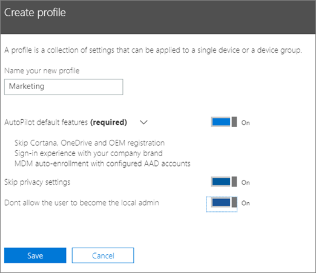

# Erstellen und Bearbeiten von AutoPilot-Profilen

## Erstellen eines Profils

Ein Profil gilt für ein Gerät oder eine Gerätegruppe.
  
1. Wählen Sie im Microsoft 365 Admin Center **Geräte** \> **AutoPilot aus.**
  
2. Wählen Sie **auf der Seite AutoPilot** die **Registerkarte** Profile profil \> **erstellen aus.**
    
3. Geben Sie **auf der** Seite Profil erstellen einen Namen für das Profil ein, mit dem Sie es identifizieren können, z. B. Marketing. Aktivieren Sie die einstellung, die Sie möchten, und wählen Sie dann **Speichern aus.** Weitere Informationen zu AutoPilot-Profileinstellungen finden Sie unter [Informationen zu AutoPilot-Profileinstellungen](autopilot-profile-settings.md).
    
    
  
### Zuweisen eines Profils zu einem Gerät

Nachdem Sie ein Profil erstellt haben, können Sie es auf ein Gerät oder eine Gruppe von Geräten anwenden. Sie können ein vorhandenes  Profil in der schrittweisen Anleitung auswählen und auf neue Geräte anwenden oder ein vorhandenes Profil für ein Gerät oder eine Gruppe von Geräten ersetzen. 
  
1. Wählen Sie auf der Seite **Windows vorbereiten** die Registerkarte **Geräte**. 
    
2. Aktivieren Sie das Kontrollkästchen neben einem  Gerätenamen, und wählen  Sie im Gerätebereich ein Profil aus der Dropdownliste Zugewiesenes Profil \> **speichern aus.**
    
    
  
## Bearbeiten, Löschen oder Entfernen eines Profils

Nachdem Sie einem Gerät ein Profil zugewiesen haben, können Sie es aktualisieren, auch wenn Sie das Gerät bereits einem Benutzer zugewiesen haben. Wenn sich das Gerät mit dem Internet verbindet, lädt es während des Setupvorgangs die neueste Version Ihres Profils herunter. Wenn der Benutzer das Gerät auf die werkseitigen Standardeinstellungen zurücksetzt, lädt das Gerät erneut die neuesten Updates in Ihr Profil herunter. 
  
### Bearbeiten eines Profils

1. Wählen Sie auf der Seite **Windows vorbereiten** die Registerkarte **Profile**. 
    
2. Aktivieren Sie das Kontrollkästchen neben einem Gerätenamen, und aktualisieren Sie im **Profilbereich** alle verfügbaren Einstellungen \> **Speichern**.
    
    Wenn Sie dies tun, bevor ein Benutzer das Gerät mit dem Internet verbindet, wird das Profil auf den Setupvorgang angewendet.
    
### Löschen eines Profils

1. Wählen Sie auf der Seite **Windows vorbereiten** die Registerkarte **Profile**. 
    
2. Aktivieren Sie das Kontrollkästchen neben einem Gerätenamen, und wählen Sie im **Profilbereich** Profil **speichern** \> **aus.**
    
    Wenn Sie ein Profil löschen, wird es von einem Gerät oder einer Gruppe von Geräten entfernt, denen es zugewiesen war.
    
### Entfernen eines Profils

1. Wählen Sie auf der Seite **Windows vorbereiten** die Registerkarte **Geräte**. 
    
2. Aktivieren Sie das Kontrollkästchen neben einem  Gerätenamen, und wählen  Sie im Gerätebereich in der Dropdownliste Zugewiesenes Profil Speichern die Option **Keine** \> **aus.**
    
