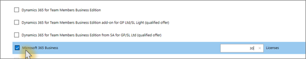

# Abrufen von Microsoft 365 Business

## Abrufen von Microsoft 365 Business bei Microsoft

Wenn Sie keinen Partner haben und Microsoft 365 Business erhalten möchten, können Sie [ihn hier kaufen](https://www.microsoft.com/en-US/microsoft-365/business).

Ausführliche Anweisungen finden Sie unter [registrieren für Microsoft 365 Business](sign-up.md) .

Sie können auch zu einem [Microsoft Store](https://www.microsoft.com/en-us/store/locations/find-a-store?icid=en_US_Store_UH_FAS) wechseln, um Microsoft 365 Business zu kaufen und Hilfe zum Einrichten zu erhalten.
  
## Abrufen von Microsoft 365 Business bei Microsoft über Microsoft Partner Center

1. Melden Sie sich bei [Microsoft Partner Center](https://go.microsoft.com/fwlink/p/?linkid=849910) unter Angabe der Anmeldeinformationen an, die Sie im Rahmen Ihrer Registrierung beim CSP-Programm (Cloud Service Provider, Microsoft Cloud-Lösungsanbieter) erstellt haben. 
    
2. Wählen Sie im Partner-Dashboard die Option "Kunden" aus, und wählen Sie dann den Kunden aus, oder fügen Sie einen neuen Kunden hinzu, bevor Sie Microsoft 365 Business abrufen.
    
    
  
3. Wählen Sie auf der Seite **Abonnement** des Kundenabonnement **Hinzufügen**aus, wählen Sie unter Katalog die Option Small Business aus, und wählen Sie dann **Microsoft 365 Business**aus.
    
    Wählen Sie die Anzahl der benötigten Lizenzen (max. 300) aus. Wenn Sie über mehr als 300 Benutzer verfügen, lesen Sie stattdessen [Microsoft 365 Enterprise](https://go.microsoft.com/fwlink/p/?linkid=862316) . 
    
    
  
    Führen Sie die restlichen Schritte zum Hinzufügen eines neuen Kunden, einschließlich des Unternehmensnamens, aus.
    

