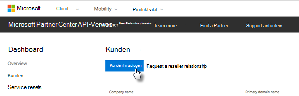

# Holen Sie sich Microsoft 365 Business Premium

## Microsoft 365 Business Premium von Microsoft erhalten

Wenn Sie keinen Partner haben und Microsoft 365 Business Premium erhalten möchten, können Sie es [hier kaufen.](https://www.microsoft.com/en-US/microsoft-365/business)

Ausführliche [Anweisungen finden Sie unter Registrieren für Microsoft 365 Business Premium.](sign-up.md)

Sie können auch in einen [Microsoft Store](https://www.microsoft.com/en-us/store/locations/find-a-store?icid=en_US_Store_UH_FAS) um, um Microsoft 365 Business Premium zu kaufen und Setuphilfe zu erhalten.
  
## Microsoft 365 Business Premium vom Microsoft Partner Center erhalten

1. Melden Sie sich bei [Microsoft Partner Center](https://go.microsoft.com/fwlink/p/?linkid=849910) unter Angabe der Anmeldeinformationen an, die Sie im Rahmen Ihrer Registrierung beim CSP-Programm (Cloud Service Provider, Microsoft Cloud-Lösungsanbieter) erstellt haben. 
    
2. Wählen Sie im Partnerdashboard **Kunden** aus, wählen Sie dann Ihren Kunden aus, oder fügen Sie einen neuen Kunden hinzu, bevor Sie Microsoft 365 Business Premium erhalten.
    
    
  
3. Wählen Sie auf der Seite **Abonnement** des Kunden Abonnement hinzufügen **aus,** wählen Sie unter Katalog die Option Kleinunternehmen aus, und wählen Sie dann **Microsoft 365 Business Premium aus.**
    
    Wählen Sie die Anzahl der benötigten Lizenzen (max. 300) aus. Wenn Sie mehr als 300 Benutzer haben, lesen Sie [stattdessen Microsoft 365 Enterprise.](../enterprise/index.yml) 
    
    
  
    Führen Sie die restlichen Schritte zum Hinzufügen eines neuen Kunden aus, einschließlich des Geschäftsnamens.
