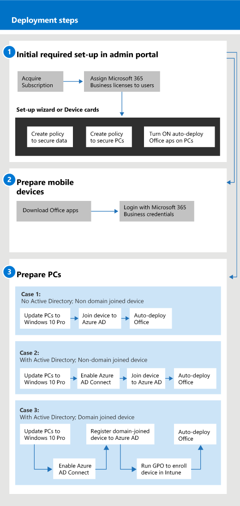

# Erste Schritte mit Microsoft 365 for Business

## Was ist Microsoft 365 for Business?

Microsoft 365 for Business ist eine umfassende Sammlung von Tools für die geschäftliche Produktivität und Zusammenarbeit, wie Outlook, Word, Excel und andere Office-Produkte, die immer auf dem neuesten Stand sind. Sie können Ihre Arbeitsdateien auf allen IOS-, Android-und Windows 10-Geräten mit unternehmensweitem Sicherheitsniveau schützen, das einfach zu verwalten ist.

Sehen Sie sich dieses Video an, um einen schnellen Überblick über Microsoft 365 for Business zu haben.  

> [!VIDEO https://www.microsoft.com/videoplayer/embed/RE2mhaA] 
  
Microsoft 365 for Business ist für bis zu 300 Lizenzen gedacht. Wenn Sie weitere Lizenzen benötigen, lesen Sie die Dokumentation zu [Microsoft 365 Enterprise](https://go.microsoft.com/fwlink/p/?linkid=860986), um weitere Informationen zu erhalten. 
  
## Holen Sie sich Microsoft 365 for Business

- Wenn Sie über einen Partner verfügen, erhalten Sie Microsoft 365 for Business: [erhalten Sie Microsoft 365 for Business aus dem Microsoft Partner Center](get-microsoft-365-business.md).
    
- Wenn Sie keinen Partner haben und Microsoft 365 for Business erhalten möchten, können Sie [ihn hier kaufen](https://www.microsoft.com/microsoft-365/business).
    
## Einrichten von Microsoft 365 für Unternehmen

 **Übersicht über die Einrichtung von Microsoft 365 for Business Suite**
  
Im folgenden Diagramm wird beschrieben, wie Microsoft 365 for Business von Administratoren eingerichtet wurde. Außerdem werden die Schritte zum Vorbereiten von Windows-PCs für Microsoft 365 for Business beschrieben. Sie können auch neue Geräte im Microsoft 365 Admin Center mit [Windows Autopilot](add-autopilot-devices-and-profile.md)hinzufügen. Sie können Autopilot zum Einrichten und vorkonfigurieren neuer Geräte verwenden, damit Sie für die produktive Verwendung bereit sind, sobald sich ein Benutzer mit seinen Anmeldeinformationen für Microsoft 365 for Business anmeldet.
  

Sehen Sie sich dieses Video an, um eine Übersicht über das Setup von Microsoft 365 for Business zu erfahren.  

> [!VIDEO https://www.microsoft.com/videoplayer/embed/RE1FYSM] 

Wenn Sie dieses Video hilfreich fanden, sehen Sie sich bitte die [komplette Schulungsserie für kleine Unternehmen und jene, die neu bei Microsoft 365 sind](https://support.microsoft.com/office/6ab4bbcd-79cf-4000-a0bd-d42ce4d12816), an.

  
### 1: Einrichten von Microsoft 365 for Business (Administrator)

Melden Sie sich bei [Microsoft 365 Admin Center](https://portal.office.com/adminportal/home) mit ihren globalen Administratoranmeldeinformationen an, und führen Sie die folgenden Schritte aus, um Microsoft 365 for Business einzurichten. 
  
1. [Voraussetzungen für den Schutz von Daten auf Geräten mit Microsoft 365 for Business](pre-requisites-for-data-protection.md)
    
    Lesen Sie zuerst die Voraussetzungen, um sicherzustellen, dass Ihre Geräte für Microsoft 365 for Business bereit sind.
    
2. [Einrichten von Microsoft 365 for Business mithilfe des Setup-Assistenten](set-up.md)
    
    Wenn Sie **dauerhaft von einem lokalen Active Directory in die Cloud**wechseln, können Sie zum Microsoft 365 Admin Center wechseln und den Setup-Assistenten verwenden, um Ihre Benutzer manuell hinzuzufügen, oder Sie können eine einmalige Synchronisierung mit Azure AD Connect durchführen. Sie können auf zwei Arten vorgehen: 
    
    - Wenn Sie auch über einen Exchange 2010-, Exchange 2013-oder Exchange 2016-Server verfügen, können Sie mit [minimaler Hybrid Bereitstellung schnell Exchange-Postfächer zu Office 365 migrieren](https://docs.microsoft.com/Exchange/mailbox-migration/use-minimal-hybrid-to-quickly-migrate). Die minimalen Hybriden Schritte umfassen eine einmalige Synchronisierung von Benutzern zu Azure AD und eine e-Mail-Migration von der lokalen zur Cloud. Nachdem die e-Mail-Migration abgeschlossen ist, wird die Verzeichnissynchronisierung automatisch deaktiviert, wenn Sie diese Methode verwenden.
    
    - Verwenden Sie den Verzeichnis Synchronisierungs-Assistenten, um Ihre Benutzer mit der Cloud zu synchronisieren. Führen Sie die Schritte unter [Einrichten der Verzeichnissynchronisierung für Microsoft 365](https://docs.microsoft.com/office365/enterprise/set-up-directory-synchronization) aus, um diesen Vorgang abzuschließen. Nachdem Sie Ihre Benutzer mit der Cloud synchronisiert haben, müssen Sie die [Verzeichnissynchronisierung für Office 365 deaktivieren](https://docs.microsoft.com/office365/enterprise/turn-off-directory-synchronization).
    
    Außerdem müssen Sie jedem Benutzer, der auf diese Weise hinzugefügt wurde, eine Lizenz für Microsoft 365 for Business geben. Sie können dies im Setup- [Assistenten](set-up.md) tun, oder Sie können [Benutzern in Microsoft 365 for Business Lizenzen zuweisen](https://docs.microsoft.com/microsoft-365/admin/add-users/add-users).
    
### 2: Vorbereiten von mobilen Geräten

Führen Sie die Schritte unter [Einrichten mobiler Geräte für Microsoft 365 for Business-Benutzer](set-up-mobile-devices.md) aus, um Office-Apps auf Geräten zu installieren und sicherzustellen, dass Sie von Microsoft 365 for Business geschützt sind. 
  
### 3: Vorbereiten von PCs

Administratoren können mithilfe von [Windows Autopilot](add-autopilot-devices-and-profile.md)Einstellungen für neue Windows 10-PCs vorab auswählen. Benutzer können Ihre vorhandenen oder neuen Windows 10-Geräte einrichten, indem Sie die Schritte in diesem Thema ausführen: Einrichten von [Windows-PCs für Microsoft 365 for Business-Benutzer](set-up-windows-devices.md). Für vorhandene Geräte können Benutzer **optional** [Dateien in OneDrive für Unternehmen umlegen](move-files-to-onedrive.md). Sie können auch Tools von Drittanbietern verwenden, um Dateien zu migrieren, die mit dem Windows-Profil in OneDrive verbunden sind.
  
Wenn Ihre Organisation Windows Server Active Directory lokal verwendet, können Sie Microsoft 365 for Business zum Schutz Ihrer Windows 10-Geräte einrichten und gleichzeitig den Zugriff auf lokale Ressourcen aufrecht erhalten, die eine lokale Authentifizierung erfordern. Führen Sie die Schritte unter [enable Domain-Joined Windows 10 Devices to manage by Microsoft 365 for Business](manage-windows-devices.md) aus, um diesen einzurichten. Diese Methode wird bevorzugt, und Geräte in diesem Zustand werden als **Hybrid Azure AD verbundene Geräte**bezeichnet. 
  
Wenn Sie ein lokales Active Directory beibehalten, das einige lokale Ressourcen (beispielsweise Dateifreigaben und Drucker) enthält, können Sie Ihren **Azure AD-verbundenen Geräten** Zugriff auf diese Ressourcen gewähren, indem Sie die folgenden Schritte ausführen: [zugreifen auf lokale Ressourcen von einem Azure AD verbundenen Gerät in Microsoft 365 for Business](access-resources.md).
  
  
## wenden Sie sich an den Support,

 **Wenn Sie den Support kontaktieren müssen:**
  
- Wenden Sie sich an Ihren Partner.
    
- Als Microsoft 365 for Business-Administrator haben Sie Zugriff auf unser Kundensupport Team: ** [kontaktieren des Supports für Business-Produkte-Administratorhilfe](https://docs.microsoft.com/microsoft-365/admin/contact-support-for-business-products)**
    
## Siehe auch

[Dokumentation und Ressourcen zu Microsoft 365 for Business](https://go.microsoft.com/fwlink/p/?linkid=853701)
  
[Verwalten von Microsoft 365 for Business](manage.md)[Migrieren zu Microsoft 365 for Business](migrate-to-microsoft-365-business.md)

[Microsoft 365 für Unternehmen-Schulungsvideos](https://support.microsoft.com/office/6ab4bbcd-79cf-4000-a0bd-d42ce4d12816) 
