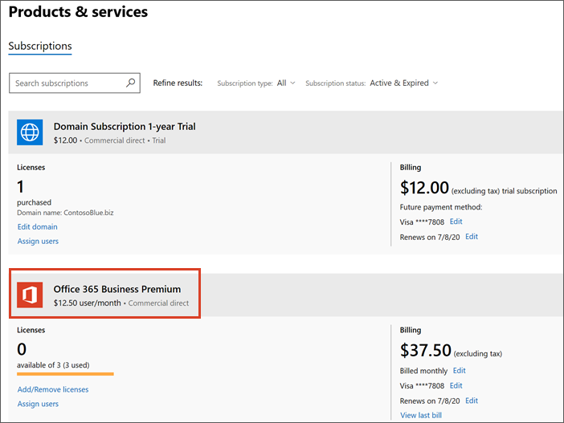

# Upgrade auf Microsoft 365 Business von Office 365 Business PremiumUpgrade to Microsoft 365 Business from Office 365 Business Premium

Wenn Sie über ein [Office 365 für Unternehmen-Abonnement](https://products.office.com/compare-all-microsoft-office-products-4-column?activetab=tab:primaryr2)verfügen, beispielsweise Office 365 Business Premium, können Sie auf einfache Weise ein Upgrade auf Microsoft 365 Business durchführen.If you have an [Office 365 for business subscription](https://products.office.com/compare-all-microsoft-office-products-4-column?activetab=tab:primaryr2), for example, Office 365 Business Premium, you can easily upgrade to Microsoft 365 Business. Führen Sie ein Upgrade auf Microsoft 365 Business durch, wenn Sie Folgendes hinzufügen möchten:Upgrade to Microsoft 365 Business if you want to add: 
- Windows 10 pro (auf PCs mit Windows 8 oder höher)Windows 10 Pro (to PCs running Windows 8 or later)
- Einfache Steuerelemente zum Verwalten von Geschäftsdaten auf GerätenSimple controls that manage business data on devices
- Erweiterte Sicherheitsfunktionen.Advanced security capabilities.
Weitere Informationen zu Microsoft 365 Business finden Sie unter [Microsoft.com](https://www.microsoft.com/microsoft-365/business)Find out more about Microsoft 365 Business at [Microsoft.com](https://www.microsoft.com/microsoft-365/business)

## Worin besteht der Unterschied zwischen Office 365 Business Premium und Microsoft 365 Business?What's the difference between Office 365 Business Premium and Microsoft 365 Business?
Wir haben einen nebeneinander Vergleich dieser beiden Pläne zur [Microsoft 365 Business-Dienstbeschreibung](https://docs.microsoft.com/office365/servicedescriptions/microsoft-365-service-descriptions/microsoft-365-business-service-description)hinzugefügt.We've added a side-by-side comparison of these two plans to the [Microsoft 365 Business service description](https://docs.microsoft.com/office365/servicedescriptions/microsoft-365-service-descriptions/microsoft-365-business-service-description). 

1. Nachdem Sie neue Lizenzen erworben haben, und dies ist das erste Mal, wird das Setup Banner für Microsoft 365 Business oben im Admin Center angezeigt.Once you have purchased new licenses, and this is the first time you did, the setup banner for Microsoft 365 Business will display on top of the admin center.
    
    > [!NOTE]
    > Das Setup Banner ist eine Möglichkeit zum Hinzufügen neuer Benutzer, einer neuen Domäne und zum Migrieren von e-Mails für neue Benutzer.The setup banner is an opportunity to add new users, a new domain, and migrate email for new users. Wenn Sie keine Vorgehensweise ausführen möchten, sollten Sie den Assistenten weiterhin durchlaufen und die Standardoptionen auswählen, damit er von der Administrator-Startseite ausgeblendet wird.If you don't plan to do any, you should still go through the wizard and choose default options to make it disappear from the admin home page. 
  
   
  
    Wählen Sie **Setup starten** aus.Choose **Start setup**.
    
2. Auf der Seite **Personalisieren Ihrer Anmeldung und e-Mail-Adresse** können Sie eine Domäne hinzufügen, indem Sie eine Domäne verbinden auswählen, die **Sie bereits besitzen** , wenn Sie diese Gelegenheit zum Hinzufügen einer weiteren Domäne zu Ihrem Abonnement verwenden möchten.On the **Personalize your sign-in and email** page, you can add a domain by choosing **Connect a domain you already own** if you want to use this opportunity to add another domain to your subscription. 
    
    Wenn Sie bereits eine Domäne eingerichtet haben, zeigt das zweite Feld an, dass Sie _Ihren Domänennamen_ \> **für e-Mails und die Anmeldung** **weiterhin verwenden** \<werden.  If you have already set up a domain, the second field will indicate that and will say **Continue using** \<  _your domain name_\> **for email and signing in**. Wenn Sie keine Domäne mit Ihrem Abonnement eingerichtet haben, wird Sie sagen, dass Sie **weiterhin** \< _Ihr Unternehmen Name.onmicrosoft.com_ \> **für e-Mail und Anmeldung**verwenden.  If you haven't set up a domain with you subscription, it will say **Continue using** \<  _your company name.onmicrosoft.com_\> **for email and signing in**.
    
    Wählen Sie **Weiter** aus.Choose **Next**.
    
    
  
3. Auf der Seite **neue Benutzer hinzufügen** können Sie neue Benutzer hinzufügen, wenn Sie neue Mitarbeiter haben, denen Sie die Microsoft 365 Business licenses zuweisen möchten.On the **Add new users** page, you can add new users, if you have new employees that you want to assign the Microsoft 365 Business licenses to. 
    
    Wenn Sie keine neuen Mitarbeiter hinzufügen möchten und den vorhandenen Benutzern Lizenzen zuweisen möchten, wählen Sie **weiter**aus.If you don't have new employees to add and want to assign licences to existing users, choose **Next**.
    
4. Auf der Seite **e-Mail-Nachrichten migrieren** können Sie auswählen, dass e-Mails für alle neuen Benutzer migriert werden sollen, die Sie in Schritt 3 hinzugefügt haben.On the **Migrate email messages** page you can choose to migrate email for any of the new users you added in step 3. Sie können diesen Schritt auch überspringen.You can skip this step also. Wählen Sie **Weiter** aus.Choose **Next**.
    
5. Wählen Sie auf der letzten Seite **zum Admin Center wechseln**aus, und setzen Sie das Setup dort fort.On the last page, choose **go to the admin center**, and continue setup there.
    
6. Wechseln Sie im Admin Center zu **Benutzer** \> **aktive Benutzer**.In the admin center, go to **Users** \> **Active users**.
    
7. Wählen Sie den Benutzer aus, dem Sie die **Microsoft 365 Business** License zuweisen möchten, und wählen Sie dann **Bearbeiten** neben **Produktlizenzen**aus.Select the user to whom you want to assign the **Microsoft 365 Business** license to, and then choose **Edit** next to **Product Licenses**.
    
    
  
## Bevor Sie loslegenBefore you get started

- **Wann sollte ich ein Upgrade auswählen?****When should I choose upgrade?** Das Upgrade ist die richtige Wahl, wenn Sie alle einem einzelnen Plan zugewiesenen **Benutzer** aktualisieren möchten.Upgrade is the right choice when you want to upgrade **all users** assigned to a single plan. Wenn Sie Upgrade auswählen, werden alle Plan Benutzer gleichzeitig zu einem anderen Plan gewechselt.When you choose upgrade, all plan users get switched to another plan at the same time. Wenn Sie nicht alle einem einzelnen Plan zugewiesenen Upgrades aktualisieren möchten, kaufen Sie Lizenzen für den neuen Plan (in diesem Fall Microsoft 365 Business), und [weisen Sie diese Lizenzen](https://docs.microsoft.com/office365/admin/manage/assign-licenses-to-users) jedem Benutzer einzeln zu, der aktualisiert werden soll.If you don't want to upgrade everyone assigned to a single plan, buy licenses for the new plan (in this case Microsoft 365 Business), and [assign those licenses individually](https://docs.microsoft.com/office365/admin/manage/assign-licenses-to-users) to each user that you want to upgrade. 
- **Einige Add-ons verhindern möglicherweise ein Upgrade** Wenn Sie versuchen, ein Upgrade zu starten, und Sie ein Add-on haben, das verhindert, dass Sie fortfahren, können Sie das Add-on zuerst entfernen und dann später wieder hinzufügen, wenn Sie es dennoch benötigen.**Some add-ons might prevent upgrade** If you try to start an upgrade and you have an add-on that prevents you from continuing, you can remove the add-on first, and then add it back later - if you still need it. 
- **Wenn Sie Ihren Plan voraus bezahlt haben** Es gibt keinen einfachen Upgrade-Pfad für Prepaid-Pläne.**If you prepaid your plan** There isn't a straightforward upgrade path for prepaid plans. Sie wissen, ob Sie über einen Prepaid-Plan verfügen, da Sie Ihren Plan mit einer Produkt-ID einrichten, die Sie möglicherweise in einem Store erworben haben.You'll know if you have a prepaid plan because you set up your plan using a product ID that you might have purchased in a store. Wenden Sie sich an einen Partner, wechseln Sie zum Microsoft Store, oder warten Sie, bis Ihr Prepaid-Plan abgelaufen ist, um zu einem neuen Plan zu wechseln.Contact a partner, go to the Microsoft store, or wait until your prepaid plan expires to switch to a new plan.

## Upgrade auf Microsoft 365 BusinessUpgrade to Microsoft 365 Business
Kaufen Sie Ihre Lizenzen, indem Sie die folgenden Schritte im [neuen Admin Center](https://docs.microsoft.com/office365/admin/microsoft-365-admin-center-preview)ausführen:Buy your licenses by following these steps in the [new admin center](https://docs.microsoft.com/office365/admin/microsoft-365-admin-center-preview):
1. Melden Sie sich beim Admin Center <a href="https://go.microsoft.com/fwlink/p/?linkid=837890" target="_blank">https://admin.microsoft.com</a>an.Sign into the admin center at <a href="https://go.microsoft.com/fwlink/p/?linkid=837890" target="_blank">https://admin.microsoft.com</a>.
2. Wechseln Sie zum Navigationsbereich, und wählen Sie **Abrechnungs** \> **Produkte #a0 Dienste**aus.Go to the navigation pane and select **Billing** \> **Products & Services**. Suchen Sie Ihr Office 365 Abonnement, und wählen Sie es aus, um die Details anzuzeigen.Find your Office 365 subscription and select it to view the details. 

    

3. Wählen Sie auf der nächsten Seite **Upgrade**aus.On the next page, select **Upgrade**. 

      

  > [!NOTE]
  > Wenn Sie eine Meldung mit dem Hinweis "Upgrade Ihres Abonnements wird von der gruppenbasierten Lizenzierung in Azure Active Directory nicht unterstützt" angezeigt wird, können Sie diese ignorieren, es sei denn, Sie verfügen über eine sehr große Organisation.If you see a message that says "Upgrading your subscription is not supported with group-based licensing in Azure Active Directory", you can safely ignore this unless you have a very large organization. Organisationen, die diese Option ausgewählt haben, sind sich bewusst, dass Sie die Gruppenbasierte Lizenzierung verwenden.Organizations who have selected this option will be aware that they're using group-based licensing.

4. Als nächstes können Sie eine Liste der Office-Pläne anzeigen, auf die Sie ein Upgrade ausführen können.Next, you can view a list of Office plans that you can upgrade to. Suchen Sie in diesem Fall den Microsoft 365 Business-Plan.In this case, find the Microsoft 365 Business plan. Sie können einen Bildlauf nach unten durchführen, wenn Sie alle Office-Apps und-Dienste anzeigen möchten, die in diesem Plan enthalten sind.You can scroll down if you want to see all the Office apps and services that are included with this plan. Wählen Sie unter **Microsoft 365 Business** **Upgrade** aus, um Microsoft 365 Business zu Ihrem Warenkorb hinzuzufügen.Under **Microsoft 365 Business**, select **Upgrade** to add Microsoft 365 Business to your cart.
5. Im Warenkorb:In the cart:
    1. Wir fügen automatisch Lizenzen für alle aktuellen Benutzer in den Warenkorb ein.We'll automatically include licenses for all your current users to the cart. Wenn Sie mehr oder weniger Lizenzen benötigen, müssen Sie [Diese Lizenzen einzeln erwerben und zuweisen](https://docs.microsoft.com/office365/admin/manage/assign-licenses-to-users).If you need more, or less licenses, you'll need to [buy and assign those licenses individually](https://docs.microsoft.com/office365/admin/manage/assign-licenses-to-users).  
    2. Sie können anpassen, wie Sie zahlen möchten-monatlich oder jährlich.You can adjust how you'd like to pay - monthly or yearly. Wählen Sie das Dropdownmenü aus, um Ihre Auswahl zu treffen.Select the drop-down menu to make your choice.
6. Wählen Sie **Gehe zu Kasse** aus, wo Sie eine Zusammenfassung Ihres Kaufs sehen, einschließlich der Zahlungsmethode für dieses Konto.Select **Go to Checkout** where you'll see a summary of your purchase, including the payment method for this account. Sie können auch einen Promo-Code hinzufügen, wenn Sie einen haben.You can also add a promo code here if you have one.
7. Wählen Sie **Bestellung platzieren** aus, um Ihren Einkauf abzuschließen.Select **Place order** to complete your purchase.
Es dauert ein paar Minuten, bis Microsoft die neuen Dienstpläne eingerichtet hat.It takes Microsoft a few minutes to set up your new service plans. Um den Status zu überprüfen, wählen Sie **Upgradestatus überprüfen**aus.To check on progress, select **Check upgrade status**. 
1. Sobald Ihr Plan fertig ist, müssen Sie möglicherweise einige zusätzliche Setupschritte im Admin Center ausführen.Once your plan is ready, you might need to complete some additional setup steps in the admin center. Wählen Sie im Navigationsbereich die Option **Home** aus, um alle weiteren Setupschritte abzuschließen.In the navigation pane, select **Home** to complete any additional setup steps.

> [!NOTE]
> Sie erhalten eine anteilige Erstattung für die Ofifce 365-Lizenzen, die Sie nicht mehr benötigen.You'll receive a prorated refund for the Ofifce 365 licenses that you no longer need. Ihr Bankkonto oder Ihre Kreditkarte wird etwa zwei Tage nach der Einrichtung des neuen Plans belastet.Your bank account or credit card will be charged about two days after you set up the new plan.
  
## Schützen von Benutzergeräten und-DateienProtect user devices and files

Nachdem Microsoft 365 Business-Lizenzen zugewiesen wurden, müssen Sie die Schritte zum Schutz von Geräten und Dateien ausführen.Now that Microsoft 365 Business licenses have been assigned, complete steps to start protecting devices and files. Sie verwenden einige neue Optionen, die im Navigationsbereich des Admin Centers enthalten sind.You'll be using some new options included in the admin center navigation pane.
  
1. Wechseln Sie im Admin Center im Navigationsbereich zu **Geräte** \> **Richtlinien**.In the admin center, in the navigation pane, go to **Devices** \> **Policies**.
    
2. Wählen Sie auf der Seite **Geräterichtlinien** die Option **Hinzufügen**aus.On the **Device policies** page, select **Add**.
    
3. Geben Sie im Bereich **Richtlinie hinzufügen** der Richtlinie einen Namen (beispielsweise Arbeitsdateien schützen), und wählen Sie dann einen **Richtlinientyp** aus der Dropdownliste aus.In the **Add policy** pane give the policy a name (for example, Protect work files), and then choose a **Policy type** from the drop-down. 
    
    Sie können Anwendungsrichtlinien zum Schützen von Dateien auf Android-und iPhone-Geräten sowie Windows 10 einrichten, und Sie können Geräte Konfigurationsrichtlinien für Windows 10-Geräte im Unternehmen einrichten.You can set up application policies for protecting files on Android and iPhone devices, as well as Windows 10, and you can set up device configuration policies for company owned Windows 10 devices. Weitere Informationen finden Sie unter den folgenden Links:See the following links for details:
    
  - [Festlegen von App-Schutzeinstellungen für Android-oder IOS-GeräteSet app protection settings for Android or iOS devices](app-protection-settings-for-android-and-ios.md)
    
  - [Festlegen von Anwendungsschutz Einstellungen für Windows 10-GeräteSet application protection settings for Windows 10 devices](protection-settings-for-windows-10-devices.md)
    
  - [Festlegen von Geräteschutz Einstellungen für Windows 10-PCsSet device protection settings for Windows 10 PCs](protection-settings-for-windows-10-pcs.md)
    
  
4. Nachdem Sie Richtlinien eingerichtet haben, können Sie und ihre mitarbeitergeräte einrichten:After you set up policies, you and your employees can set up devices:
    
  - Wenn Ihre Windows-Geräte nicht bereits das Windows pro Creator-Update verwenden, müssen Sie [diese auf Windows pro Creators Update](upgrade-to-windows-pro-creators-update.md)aktualisieren.If your Windows devices aren't already using the Windows Pro Creator update, you'll need to [upgrade them to Windows Pro Creators Update](upgrade-to-windows-pro-creators-update.md).
    
  - Weitere Informationen finden Sie unter [Einrichten von Windows-Geräten für Microsoft 365 Business Users](set-up-windows-devices.md) für Schritte für Windows-Geräte.See [Set up Windows devices for Microsoft 365 Business users](set-up-windows-devices.md) for steps for Windows devices. 
    
  - Weitere Informationen finden Sie unter [Einrichten von mobilen Geräten für Microsoft 365 Business-Benutzer](set-up-mobile-devices.md) für Schritte für Android-Telefone und iPhones.See [Set up mobile devices for Microsoft 365 Business users](set-up-mobile-devices.md) for steps for Android phones and iPhones. 

