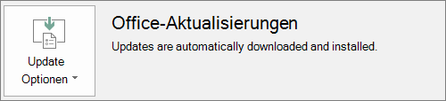

# Vorbereiten der Office-Clientbereitstellung von Microsoft 365 for Business

## Vorbereiten der automatischen Installation von Office-Apps auf Clientcomputern

Sie können Microsoft 365 for Business verwenden, um die 32-Bit-Office-Apps auf Windows 10-Computern automatisch zu installieren und diese mit Updates auf dem neuesten Stand zu halten.
  
Die automatische Installation funktioniert am besten, wenn sich der Computer des Endbenutzers in Windows 10 Business befindet und:
  
- Es sind keine Office-Desktop-Apps (Word, Excel, PowerPoint, Outlook, OneNote, Publisher, Access und OneDrive) vorhanden.
    
    oder
    
- Auf dem Computer ist eine Version von Office Klick-und-Los installiert.
    
Wenn Sie feststellen möchten, ob Sie über die Office Klick-und-Los-Version verfügen, wechseln Sie in einer beliebigen Office-App zu **Datei** \> **Konto** ( **Office-Konto** in Outlook). Wenn Office- **Updates** wie in der folgenden Abbildung dargestellt angezeigt werden, wurde die Installation mithilfe von Klick-und-Los ausgeführt. 
  

  
 **Wer profitiert von dieser Funktion**
  
Der Endbenutzer, für dessen PC Folgendes zutrifft:
  
- **Verfügt über** eine Windows 10-Geschäftsbenutzer Lizenz, eine aktive Microsoft 365 for Business-Lizenz, ein Windows 10 Creators-Update und ist mit Azure Active Directory verbunden. 
    
- Verfügt **nicht über** 64-Bit-Office-Apps (Beispiel: Word, Excel, PowerPoint). Wenn 64-Bit-Office-Apps erforderlich sind, ist dieses Feature nicht geeignet, da es keine Unterstützung für die Auslösung einer 64-Bit-2016-Klick-und-Los-Version von Office von der Microsoft 365 for Business-Verwaltungskonsole gibt. 
    
- Verfügt **nicht über** 2016 eigenständige Windows Installer (MSI)-Apps (beispielsweise Visio oder Project). Microsoft 365 for Business aktualisiert Office auf die Klick-und-Los-Version von Office 2016 und funktioniert nicht mit eigenständigen Office 2016 MSI-apps. 
    
Die folgende Tabelle zeigt, welche Aktion die Endbenutzer/Administratoren je nach Anfangsstatus möglicherweise ausführen müssen, um eine erfolgreiche 32-Bit-Klick-und-Los-Version der Office-Bereitstellung von der Microsoft 365 for Business-Verwaltungskonsole zu erhalten.
  
|**Status "Office-Installation starten"**|**Auszuführende Aktion vor der Installation von Microsoft 365 for Business Office**|**Endstatus**|
|:-----|:-----|:-----|
|Keine Office-Suite installiert    |Keine    |Office 2016 32-Bit wird mithilfe von Klick-und-Los installiert    |
|Vorhandene 32-Bit-Klick-und-Los-Version von Office (2016 oder früher) und keine eigenständigen Apps    |Keine    |Upgrade auf die neueste 32-Bit-Klick-und-Los-Version von Office 2016, je nach Bedarf **\***   |
|Vorhandene Klick-und-Los-32-Bit-Version von Office-und Klick-und-Los-32-Bit-oder 64-Bit-eigenständigen Office-Apps (beispielsweise Visio, Project)    |Keine    |Eigenständige apps sind davon nicht betroffen. Suite wird auf 32-Bit-Klick-und-Los-Version von Office 2016 aktualisiert.    |
|Vorhandene 32-Bit-Klick-und-Los-Version von Office und alle eigenständigen 32-Bit- oder 64-Bit-MSI-Office-Apps (mit Ausnahme von 2016)    |Keine    |Eigenständige apps sind davon nicht betroffen. Suite wird auf 32-Bit-Klick-und-Los-Version von Office 2016 aktualisiert.    ||||
|Beliebige vorhandene 64-Bit-Klick-und-Los-Version von Office    |Deinstallieren Sie die 64-Bit-Office-Apps, wenn es OK ist, um Sie durch 32-Bit-Office-Apps zu ersetzen.    |Wenn die 64-Bit-Office-Apps entfernt wurden, wird die 32-Bit-Klick-und-Los-Version von Office 2016 installiert    |
|Eine vorhandene MSI-Installation von Office 2016 mit oder ohne eigenständige Apps    |MSI-Office 2016 deinstallieren    |Die 32-Bit-Klick-und-Los-Version von Office 2016 wird installiert. Keine Änderung an eigenständigen Apps    |
|Vorhandene MSI-Installation von Office 2013 (oder früher) und/oder eigenständigen Office-Apps    |Keine    |32-Bit-Klick-und-Los-Version von Office 2016 mit der bereits vorhandenen MSI-Office-Installation (und eigenständigen Apps) existieren nebeneinander.    |
||||
   
 **(\*) Hinweis:** Führt aufgrund eines bekannten Fehlers kein Upgrade auf die 32-Bit-Klick-und-Los-Version von Office 2016 durch. Eine Korrektur wird ausgeführt. 
  
