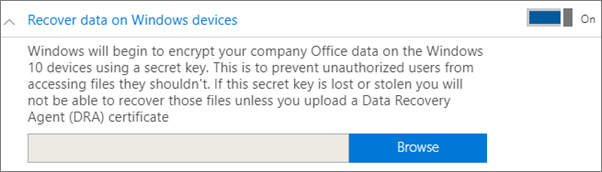

# Festlegen von Anwendungsschutzeinstellungen für Windows 10-GeräteSet application protection settings for Windows 10 devices

## Erstellen einer App-Verwaltungsrichtlinie für Windows 10Create an app management policy for Windows 10

Wenn Ihre Benutzer Arbeitsaufgaben auf ihren privaten Windows 10-Geräte ausführen, können Sie Ihre Daten auch auf diesen Geräten schützen.If your users have personal Windows 10 devices on which they perform work tasks, you can protect your data on those devices as well.
  
1. Wechseln Sie zum Admin Center unter <a href="https://go.microsoft.com/fwlink/p/?linkid=837890" target="_blank">https://admin.microsoft.com</a>.Go to the admin center at <a href="https://go.microsoft.com/fwlink/p/?linkid=837890" target="_blank">https://admin.microsoft.com</a>. 
    
2. Wählen Sie im linken Navigationsbereich **Geräte** \> **Richtlinien** \> **Hinzufügen**aus.On the left nav, choose **Devices** \> **Policies** \> **Add**.

3. Geben Sie im Bereich **Richtlinie hinzufügen** einen eindeutigen Namen für diese Richtlinie ein.On the **Add policy** pane, enter a unique name for this policy. 
    
4. Wählen Sie unter **Richtlinientyp** die Option **Anwendungsverwaltung für Windows 10** aus.Under **Policy type**, choose **Application Management for Windows 10**.
    
5. Wählen Sie unter **Gerätetyp**entweder **persönlich** oder **im Besitz des Unternehmens**aus.Under **Device type**, choose either **Personal** or **Company Owned**.
    
6. Die Option **Arbeitsdateien verschlüsseln** wird automatisch aktiviert.The **Encrypt work files** is turned on automatically. 
    
7. Aktivieren Sie die Optionen **Benutzer daran hindern, Unternehmensdaten in persönliche Dateien zu kopieren** und **Benutzer zum Speichern aller Arbeitsdateien auf OneDrive for Business zwingen**, wenn Sie nicht zulassen möchten, dass Benutzer Arbeitsdateien auf den eigenen PCs speichern.Set **Prevent users from copying company data to personal files and force them to save work files to OneDrive for Business** to **On** if you don't want the users to save work files on their PC. 
    
9. Erweitern Sie **Daten auf Windows-Geräten wiederherstellen**, und es wird empfohlen, die Option zu **aktivieren**.Expand **Recover data on Windows devices** and it is recommended that you turn it **On**.
    
    Bevor Sie zum Speicherort des Zertifikats des Datenwiederherstellungs-Agent navigieren können, müssen Sie zuerst ein Zertifikat erstellen. Anweisungen finden Sie unter [Erstellen und Überprüfen eines DRA-Zertifikats (Data Recovery Agent, Datenwiederherstellungs-Agent) des verschlüsselnden Dateisystems (Encrypting File System, EFS)](https://go.microsoft.com/fwlink/p/?linkid=853700).Before you can browse to the location of the Data Recovery Agent certificate, you have to first create one. For instructions see, [Create and verify an Encrypting File System (EFS) Data Recovery Agent (DRA) certificate](https://go.microsoft.com/fwlink/p/?linkid=853700).
    
    Standardmäßig werden Arbeitsdateien mithilfe eines geheimen Schlüssels verschlüsselt, der auf dem Gerät gespeichert und mit dem Profil des Benutzers verknüpft ist. Nur der Benutzer kann die Datei öffnen und entschlüsseln. Wenn ein Gerät jedoch verloren geht oder ein Benutzers entfernt wird, kann eine Datei im verschlüsselten Zustand zurückbleiben. Das Zertifikat des Datenwiederherstellungs-Agents (DRA) kann von einem Administrator verwendet werden, um die Datei zu entschlüsseln.By default, work files are encrypted using a secret key that is stored on the device and associated with the user's profile. Only the user can open and decrypt the file. However, if a device is lost or a user is removed, a file can be stuck in an encrypted state. The Data Recovery Agent (DRA) certificate can be used by an admin to decrypt the file.
    
    
  
10. Erweitern Sie **Zusätzliche Netzwerk- und Cloudspeicherorte schützen**, wenn Sie weitere Domänen oder SharePoint Online-Speicherorte hinzufügen möchten, um sicherzustellen, dass Dateien in allen aufgelisteten Apps geschützt werden. Wenn Sie für eines der Felder mehr als ein Element eingeben müssen, verwenden Sie ein Semikolon (;) zwischen den Elementen.Expand **Protect additional network and cloud locations** if you want to add additional domains or SharePoint Online locations to make sure that files in all the listed apps will be protected. If you need to enter more than one item for either field, use a semicolon (;) between the items.
    
    
  
11. Next decide **Who will get these settings?** If you don't want to use the default **All Users** security group, choose **Change**, choose the security groups who will get these settings \> **Select**.Next decide **Who will get these settings?** If you don't want to use the default **All Users** security group, choose **Change**, choose the security groups who will get these settings \> **Select**.
    
12. Wählen Sie schließlich **Hinzufügen** aus, um die Richtlinie zu speichern, und weisen Sie sie Geräten zu.Finally, choose **Add** to save the policy, and assign it to devices. 