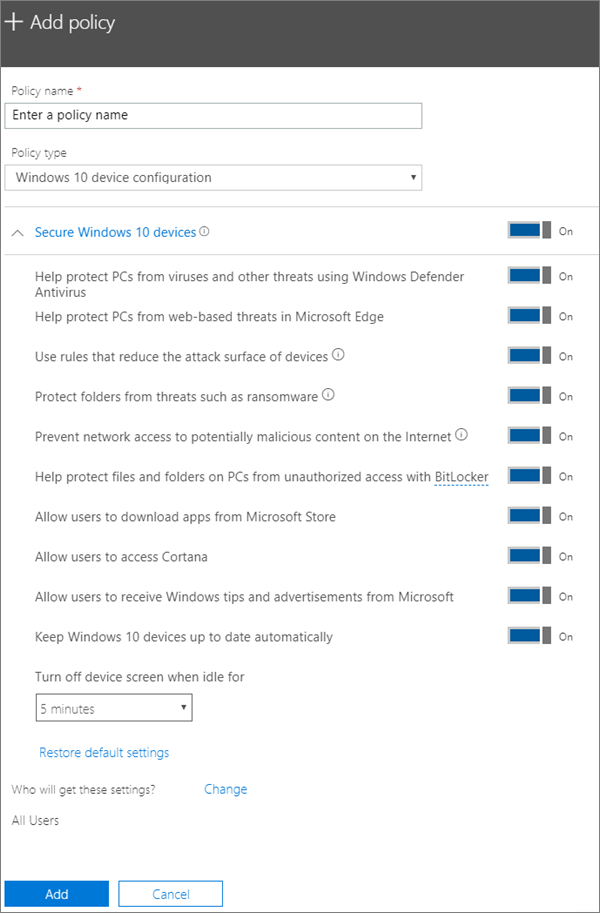

# Festlegen von Geräteschutzeinstellungen für Windows 10-PCsSet device protection settings for Windows 10 PCs

## Absichern von Windows 10-GerätenSecure Windows 10 devices

Schauen Sie sich ein Video mit Informationen zum Sichern von Windows 10-Geräten mit Microsoft 365 Business an:View a video on how to secure Windows 10 devices with Microsoft 365 Business:
  
> [!VIDEO https://www.microsoft.com/videoplayer/embed/a5734146-620a-4cec-8618-536b3ca37972?autoplay=false]
  
1. Melden Sie sich bei [Microsoft 365 Business](https://portal.office.com) mit globalen Administratoranmeldeinformationen an.Sign in to [Microsoft 365 Business](https://portal.office.com) with global admin credentials. 
    
2. Wählen Sie im Admin Center auf der Karte **Geräterichtlinien** die Option **Richtlinie hinzufügen** aus.in the admin center, on the **Device policies** card, choose **Add policy**.
    
    
  
3. Geben Sie im Bereich **Richtlinie hinzufügen** einen eindeutigen Namen für diese Richtlinie ein.On the **Add policy** pane, enter a unique name for this policy. 
    
4. Wählen Sie unter **Richtlinientyp** die Option **Windows 10-Gerätekonfiguration** aus.Under **Policy type**, choose **Windows 10 Device Configuration**.
    
5. Erweitern Sie **Windows-10-Geräten Secure** \> konfigurieren Sie die Einstellungen wie möchten Sie. Weitere Informationen finden Sie unter [Einstellungen verfügbar](protection-settings-for-windows-10-pcs.md#bkmk_availablesettings) .Expand **Secure Windows 10 Devices** \> configure the settings how you would like. See [Available settings](protection-settings-for-windows-10-pcs.md#bkmk_availablesettings) for more information. 
    
    Über den Link **Standardeinstellungen zurücksetzen** können Sie die Standardeinstellung jederzeit wiederherstellen.You can alway use the **Reset default settings** link to return to the default setting. 
    
    
  
6. Als Nächstes entscheiden **erhalten, die diese Einstellungen?** Wenn Sie nicht, verwenden Sie die Standardeinstellung **alle Benutzer** Sicherheitsgruppe auswählen **ändern möchten**, suchen Sie nach der Sicherheitsgruppe, die diese Einstellungen erhalten \> **auswählen**.Next decide **Who will get these settings?** If you don't want to use the default **All users** security group, Choose **Change**, search for the security group who will get these settings \> **Select**.
    
7. Wählen Sie schließlich **Fertig** aus, um die Richtlinie zu speichern, und weisen Sie sie Geräten zu.Finally, choose **Done** to save the policy, and assign it to devices. 
    
## Verfügbare EinstellungenAvailable settings

Standardmäßig sind alle Einstellungen auf **Ein** festgelegt. Die folgenden Einstellungen stehen zur Verfügung:By default all settings are **On**. The following settings are available.
  
Weitere Informationen finden Sie unter [Zuordnung von Microsoft 365 Business-Schutzfunktionen zu Intune-Einstellungen](map-protection-features-to-intune-settings.md).See [How do protection features in Microsoft 365 Business map to Intune settings](map-protection-features-to-intune-settings.md) for more information. 
  
|||
|:-----|:-----|
|EinstellungSetting    |BeschreibungDescription    |
|PCs vor Viren und anderen Bedrohungen mithilfe von Windows Defender Antivirus schützenHelp protect PCs from viruses and other threats using Windows Defender Antivirus    |Setzt voraus, dass Windows Defender Antivirus aktiviert ist, um PCs vor den Gefahren bei einer Verbindung mit dem Internet zu schützen.Requires that Windows Defender Antivirus is turned on to protect PCs from the dangers of being connected to the internet.    |
|PCs vor webbasierten Bedrohungen in Microsoft Edge schützenHelp protect PCs from web-based threats in Microsoft Edge    |Aktiviert Einstellungen in Edge, die Benutzer vor Websites und Downloads mit Schadsoftware schützen.Turns on settings in Edge that help protect users from malicious sites and downloads.    |
|Regeln verwenden, die die Angriffsfläche von Geräten verringernUse rules that reduce the attack surface of devices    |Wenn diese Option aktiviert ist, hilft die Reduzierung der Angriffsfläche, Aktionen und Apps zu blockieren, die häufig von Schadsoftware zum Infizieren von Geräten verwendet werden. Diese Einstellung ist nur verfügbar, wenn Windows Defender Antivirus aktiviert ist. Weitere Informationen finden Sie unter [Verringern der Angriffsfläche](https://go.microsoft.com/fwlink/?linkid=870417).  When turned On, attack surface reduction helps block actions and apps typically used by malware to infect devices. This setting is only available if Windows Defender Antivirus is set to On. See [Reduce attack surfaces](https://go.microsoft.com/fwlink/?linkid=870417) to learn more.    |
|Ordner vor Bedrohungen wie Ransomware schützenProtect folders from threats such as ransomware    |Diese Einstellung verwendet kontrollierten Ordnerzugriff zum Schutz von Unternehmensdaten vor Änderungen durch verdächtige oder böswillige apps, z. B. Ransomware. Diese Arten von Apps werden daran gehindert, Änderungen in geschützten Ordnern vorzunehmen. Diese Einstellung ist nur verfügbar, wenn Windows Defender Antivirus aktiviert ist. Weitere Informationen finden Sie unter [Schützen von Ordnern durch kontrollierten Ordnerzugriff](https://go.microsoft.com/fwlink/?linkid=870418).  This setting uses controlled folder access to protect company data from modification by suspicious or malicious apps, such as ransomware. These types of apps are blocked from making changes in protected folders. This setting is only available if Windows Defender Antivirus is set to On. See [Protect folders with COntrolled folder access](https://go.microsoft.com/fwlink/?linkid=870418) to learn more.    |
|Netzwerkzugriff auf potenziell schädliche Inhalte im Internet verhindernPrevent network access to potentially malicious content on the Internet    |Mithilfe dieser Einstellung können Sie ausgehende Benutzerverbindungen zu nicht vertrauenswürdigen Internetseiten blockieren, die Phishing-Betrügereien, Exploits oder andere schädliche Inhalte enthalten können. Diese Einstellung ist nur verfügbar, wenn Windows Defender Antivirus aktiviert ist. Weitere Informationen finden Sie unter [Schützen Sie Ihr Netzwerk](https://go.microsoft.com/fwlink/?linkid=870419).  Use this setting to block outbound user connections to low-reputation Internet locations that may host phishing scams, exploits or other malicious content. This setting is only available if Windows Defender Antivirus is set to On. See [Protect your network](https://go.microsoft.com/fwlink/?linkid=870419) for more information.    |
|Dateien und Ordner auf PCs mit BitLocker vor unbefugtem Zugriff schützenHelp protect files and folders on PCs from unauthorized access with BitLocker    |BitLocker schützt Daten durch Verschlüsselung der Computerfestplatten und bietet Schutz vor Datenverlusten, falls ein Computer verloren geht oder gestohlen wird. Weitere Informationen finden Sie unter [Häufig gestellte Fragen zu Bitlocker](https://go.microsoft.com/fwlink/?linkid=871000).  Bitlocker protects data by encrypting the computer hard drives and protect against data exposure if a computer is lost or stolen. See [Bitlocker FAQ](https://go.microsoft.com/fwlink/?linkid=871000) for more information.    |
|Benutzern den Download von Apps aus dem Microsoft Store erlaubenAllow users to download apps from Microsoft Store    |Ermöglicht es Benutzern, Apps aus dem Microsoft Store herunterzuladen und zu installieren. Weil Apps alles umfassen - von Spielen bis zu Produktivitätstools - behalten Sie für diese Einstellung **Ein** bei. Sie können sie aber auch deaktivieren, um die Sicherheit zu erhöhen.  Lets users download and install apps from the Microsoft Store. Apps include everything from games to productivity tools, so we leave this setting **On**, but you can turn it off for extra security.    |
|Benutzern den Zugriff auf Cortana erlaubenAllow users to access Cortana    |Cortana kann sehr hilfreich sein! Sie kann Einstellungen automatisch aktivieren oder deaktivieren, Wegbeschreibungen liefern und sicherstellen, dass Sie Ihre Termine einhalten. Deshalb ist diese Einstellung standardmäßig auf **Ein** festgelegt.  Cortana can be very helpful! She can turn settings on or off for you, give directions, and make sure you're on time for appointments, so we keep this **On** by default.    |
|Benutzern erlauben, Windows-Tipps und Werbung von Microsoft zu empfangenAllow users to receive Windows tips and advertisements from Microsoft    |Windows-Tipps können nützlich sein und Benutzern die Orientierung erleichtern, wenn neue Features veröffentlicht werden.Windows tips can be handy and help orient users when new features are released.    |
|Windows 10-Geräte automatisch auf dem neuesten Stand haltenKeep Windows 10 devices up to date automatically    |Stellt sicher, dass Windows 10-Geräte die neuesten Updates automatisch erhalten.Makes sure that Windows 10 devices automatically receive the latest updates.    |
|Bildschirm deaktivieren, wenn ein Gerät im Leerlauf ist seit dieser ZeitdauerTurn off device screen when idle for this amount of time    |Stellt sicher, dass die Unternehmensdaten bei Benutzerinaktivität geschützt sind. Vielleicht arbeitet ein Benutzer an einem Ort mit Publikumsverkehr, z. B. in einem Café, und entfernt sich von seinem Gerät oder ist nur einen Augenblick abgelenkt, wodurch das Gerät für zufällige Blicke anfällig ist. Mit dieser Einstellung können Sie steuern, wie lange der Benutzer inaktiv sein kann, bevor der Bildschirm abgeschaltet wird.Makes sure that company data is protected if a user is idle. A user may be working in a public location, like a coffee shop, and step away or be distracted for just a moment, leaving their device vulnerable to random glances. This setting lets you control how long the user can be idle before the screen shuts off.    |
   
  

