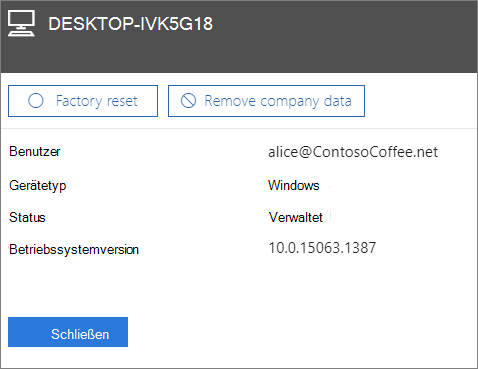

# Entfernen von Unternehmensdaten von GerätenRemove company data from devices

## Entfernen von UnternehmensdatenRemove company data

Sie können Microsoft 365 for Business verwenden, um Unternehmensdaten zu entfernen, die Ihre Benutzer auf Ihren [Geräten](app-protection-settings-for-android-and-ios.md) oder [Windows-PCs](protection-settings-for-windows-10-devices.md) haben, die von Microsoft 365 geschützt sind.You can use Microsoft 365 for business to remove company data that your users have on their [devices](app-protection-settings-for-android-and-ios.md) or [Windows PCs](protection-settings-for-windows-10-devices.md) that are protected by Microsoft 365. **Wenn Sie Unternehmensdaten von einem Gerät entfernen, können Sie sie später nicht wiederherstellen**.**If you remove company data from a device, you cannot restore it later**. 
  
1. Wechseln Sie zum Admin Center unter <a href="https://go.microsoft.com/fwlink/p/?linkid=837890" target="_blank">https://admin.microsoft.com</a>.Go to the admin center at <a href="https://go.microsoft.com/fwlink/p/?linkid=837890" target="_blank">https://admin.microsoft.com</a>.
    
2. Wählen Sie im linken Navigationsbereich **Geräte** \> **Verwalten**aus.  On the left nav, choose **Devices**  \> **Manage**.
  
3. Wählen Sie auf der Seite **Verwalten** die Option aus, oder suchen Sie nach einem Benutzer, der die zu entfernenden Daten hat, und wählen Sie den Namen aus.On the **Manage** page, choose or search for a user who's data you want to remove, and choose the name. 
    
4. Wählen Sie im nächsten Bereich das Gerät oder die Geräte aus der Liste **Geräte** aus.On the next pane, select the device or devices from the **Devices** list. Im daraufhin geöffneten Gerätebereich können Sie je nach Gerätetyp festlegen, ob das Gerät auf die Werkseinstellungen zurückgesetzt oder die Unternehmensdaten entfernt werden sollen.On the device pane that opens, you can choose to reset the device to factory settings or remove company data, depending on the device type. 
    
    
  
5. Klicken Sie im Bestätigungsbereich auf **Schließen** **bestätigen** \> .On the confirmation pane, choose **Confirm** \> **Close**.
    

