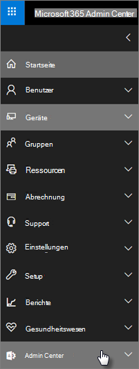

# Microsoft 365 Business Security and Compliance-Features

Microsoft 365 Business bietet vereinfachte Sicherheitsfunktionen zum Schutz Ihrer Daten auf PCs, Telefonen und Tablets.
    
## Microsoft 365 Business Admin Center-Sicherheitsfeatures

Sie können viele der Microsoft 365-Geschäfts Sicherheitsfeatures im Admin Center verwalten, wodurch Sie eine vereinfachte Möglichkeit zum Aktivieren oder Deaktivieren dieser Features erhalten. Im Admin Center können Sie folgendermaßen vorgehen:
  
- [Legen Sie Anwendungs Verwaltungseinstellungen für Android-oder IOS-Geräte fest](app-protection-settings-for-android-and-ios.md) . 
    
    Zu diesen Einstellungen gehören das Löschen von Dateien aus einem inaktiven Gerät nach einem festgelegten Zeitraum, das Verschlüsseln von Arbeitsdateien, die Anforderung, dass Benutzer eine PIN festlegen usw.
    
- [Legen Sie Anwendungsschutz Einstellungen für Windows 10-Geräte fest](protection-settings-for-windows-10-devices.md) . 
    
    Diese Einstellungen können auf Unternehmensdaten sowohl auf unternehmenseigenen als auch auf persönlichen eigenen Geräten angewendet werden.
    
- [Festlegen von Geräteschutz Einstellungen für Windows 10-Geräte](protection-settings-for-windows-10-pcs.md) . 
    
    Sie können die [BitLocker](https://go.microsoft.com/fwlink/p/?linkid=871405) -Verschlüsselung aktivieren, um Daten für den Fall zu schützen, dass ein Gerät verloren geht oder gestohlen wird, und [Windows Exploit Guard](https://docs.microsoft.com/windows/security/threat-protection/microsoft-defender-atp/enable-exploit-protection) für erweiterten Schutz gegen Ransomware bereitzustellen. 
    
- [Entfernen von Unternehmensdaten von Geräten](remove-company-data.md)
    
    Sie können Unternehmensdaten Remote löschen, wenn ein Gerät verloren geht, gestohlen wird oder ein Mitarbeiter Ihr Unternehmen verlässt.
    
- [Zurücksetzen von Windows 10-Geräten auf die Werkseinstellungen](reset-devices-to-factory-settings.md) . 
    
    Sie können alle Windows 10-Geräte zurücksetzen, auf die Geräteschutz Einstellungen angewendet wurden.
    
## Zusätzliche Sicherheitsfeatures 

Erweiterte Funktionen in Microsoft 365 Business stehen Ihnen zum Schutz Ihres Unternehmens vor Cyber-Bedrohungen und zum Schutz vertraulicher Informationen zur Verfügung.
  
- **[Office 365 Advanced Threat Protection](https://support.office.com/article/e100fe7c-f2a1-4b7d-9e08-622330b83653)**
    
    Advanced Threat Protection (ATP) schützt Ihr Unternehmen vor ausgeklügelten Phishing-und Ransomware-Angriffen, die dazu dienen, Mitarbeiter-oder Kundeninformationen zu kompromittieren. Zu den Features gehören:
    
  - Ausgeklügelte Anlagen Scans und AI-basierte Analyse zum erkennen und verwerfen gefährlicher Nachrichten.
    
  - Automatische Überprüfung von Links in e-Mails, um festzustellen, ob Sie Teil eines Phishing-Schemas sind. Dadurch können Sie sicher vor dem Zugriff auf unsichere Websites schützen.

- **[Die vollständigen Funktionen von InTune im Azure-Portal](https://go.microsoft.com/fwlink/p/?linkid=871403)**
    
    Wenn Sie auf das InTune-Verwaltungskonsole im Azure-Portal zugreifen, können Sie zusätzliche Sicherheitsfeatures wie die Verwaltung von MacOS-Geräten, iPhone und Android-Geräten sowie erweiterte Geräteverwaltung für Windows einrichten, die über Microsoft nicht verfügbar sind. 365 Business Admin Center.
- **Gleicher [bedingter Zugriff](https://docs.microsoft.com/azure/active-directory/conditional-access/overview) wie Azure AD P1-Plan**

    Bedingter Zugriff kann zum Schutz Ihrer Organisation vor Anmelde Risiken, zum Zugriff auf Versuche von einem unerwarteten Netzwerk oder Gebietsschema, zum Zugreifen auf Versuche von riskanten Gerätetypen usw. beitragen. Richtlinien für bedingten Zugriff werden nach Abschluss der ersten Authentifizierung erzwungen, und es werden Signale vom ersten Authentifizierungsereignis verwendet, um zu ermitteln, ob der versuchte Zugriff genehmigt, verweigert oder wenn mehr Beweis (beispielsweise eine zweite Form der Identifizierung) ist. erforderlich.

    Zu den bedingten Zugriffsfunktionen gehören:

    - Zugriff basierend auf Benutzername, Gruppe und Rolle
    - Zugriff [basierend auf einer APP](https://docs.microsoft.com/azure/active-directory/conditional-access/app-based-conditional-access) 
    - [Zugriff basierend auf dem Standort](https://docs.microsoft.com/azure/active-directory/authentication/howto-registration-mfa-sspr-combined#conditional-access-policies-for-combined-registration);  Zugriff nur aus vertrauenswürdigen IP-Bereichen oder bestimmten Ländern zulassen 
    - MFA für den Zugriff erforderlich
    - Blockieren des Zugriffs auf apps, die die [Legacy Authentifizierung](https://docs.microsoft.com/azure/active-directory/conditional-access/block-legacy-authentication) verwenden
    - Apps erfordern TP use [InTune-App-Schutz](https://docs.microsoft.com/azure/active-directory/conditional-access/app-protection-based-conditional-access)
    - Benutzerdefinierte Authentifizierung wie MFA mit Drittanbietern, beispielsweise Duo.
   
    Sonstige Features:
    - [Self-Service-Kennwortzurücksetzung](https://docs.microsoft.com/azure/active-directory/authentication/concept-sspr-customization) für Hybrid Azure AD
    
## Compliance-Features

Ihr Microsoft 365 Business-Abonnement enthält Features, mit denen Sie Compliance-und regulatorische Standards aufrecht erhalten können.

- **[Übersicht über die Richtlinien zur Verhinderung von Datenverlust](https://support.office.com/article/1966b2a7-d1e2-4d92-ab61-42efbb137f5e)** (DLP). 
    
    Sie können DLP so einrichten, dass vertrauliche Informationen wie Kreditkartennummern, Sozialversicherungsnummern usw. automatisch erkannt werden, um eine unbeabsichtigte Freigabe außerhalb Ihres Unternehmens zu verhindern.
    
- **[Exchange Online-Archivierung](https://products.office.com/exchange/microsoft-exchange-online-archiving-email)**
    
    Exchange Online Archivierungslizenz ermöglicht das einfache Archivieren von Nachrichten mit fortlaufender Datensicherung. Sie speichert alle e-Mail-Nachrichten eines Benutzers, einschließlich gelöschter Elemente, für den Fall, dass Sie später zur Ermittlung oder Wiederherstellung benötigt werden. Darüber hinaus können Sie unterschiedliche Aufbewahrungsrichtlinien verwenden, um e-Mail-Daten für Beweissicherungsverfahren, eDiscovery oder zur Erfüllung von Compliance-Anforderungen beizubehalten.
    
- **[Vertraulichkeitsbezeichnungen](https://docs.microsoft.com/microsoft-365/compliance/sensitivity-labels)**

   Microsoft 365 Business umfasst alle Funktionen von [Azure Information Protection Plan 1](https://go.microsoft.com/fwlink/p/?linkid=871407). Mit diesem Plan können Sie **Sensitivitäts Bezeichnungen** erstellen, mit denen Sie den Zugriff auf vertrauliche Informationen in e-Mails und Dokumenten steuern können, mit Steuerelementen wie "nicht weiterleiten" und "nicht kopieren". Sie können vertrauliche Informationen auch als "vertraulich" klassifizieren und angeben, wie klassifizierte Informationen außerhalb und innerhalb des Unternehmens freigegeben werden können. Die unternehmensweite Verschlüsselung lässt sich einfach auf e-Mails und Dokumente anwenden, um Ihre Informationen privat zu halten. Sie können auch das Azure Information Protection-Client-Add-in für Office-Apps installieren. Weitere Informationen finden Sie unter [Azure Information Protection Unified Labelling-Client](https://docs.microsoft.com/azure/information-protection/rms-client/unifiedlabelingclient-version-release-history). Für Sensitivitäts Bezeichnungen installieren Sie die **AzInfoProtection_UL. exe**.

Sie können diese Funktionen im Security &amp; Compliance Center und im InTune Admin Center verwalten. Im Laufe der Zeit werden die vereinfachten Steuerelemente dem Microsoft 365 Business Admin Center hinzugefügt.
  
    
## Häufig gestellte Fragen

 ### Sind diese Sicherheitsfeatures in allen Märkten verfügbar?
  
Ja, diese Features stehen in allen Märkten zur Verfügung, in denen Microsoft 365 Business verkauft wird.
  
### Wie finde ich das Security &amp; Compliance Center?
  
1. Melden Sie sich mit Ihren Administratoranmeldeinformationen bei [Microsoft 365 Business an](https://portal.microsoft.com/) . 
    
2. Suchen Sie im linken Navigationsbereich **Admin Center** , und erweitern Sie es. 
    
    
  
3. Wählen **Sie &amp; Security Compliance** , um zum &amp; Security Compliance Center zu gelangen.
