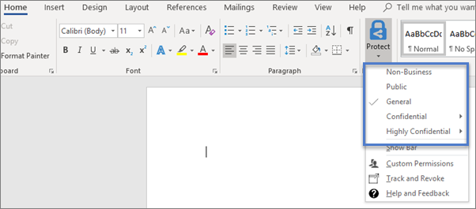

# Microsoft 365 Business SicherheitsfeaturesMicrosoft 365 Business security features

Microsoft 365 Business bietet vereinfachte Sicherheitsfeatures schützen die Daten von PCs, Telefonen und Tablets.Microsoft 365 Business offers simplified security features to help safeguard your data on PCs, phones, and tablets.
    
## Sicherheitsfeatures von Microsoft 365 Business Admin centerMicrosoft 365 Business admin center security features

Sie können viele der Microsoft 365 Business Security Features in der Verwaltungskonsole managen Sie eine vereinfachte Möglichkeit zum Aktivieren oder deaktivieren Sie diese Funktionen bietet. In der Verwaltungskonsole können Sie Folgendes ein:You can manage many of the Microsoft 365 Business security features in the admin center, which gives you a simplified way to turn these features on or off. In the admin center you can do the following:
  

  
- [Application Management-Einstellungen für Android oder iOS-Geräte](app-protection-settings-for-android-and-ios.md) .[Set application management settings for Android or iOS devices](app-protection-settings-for-android-and-ios.md) . 
    
    Dazu gehören Löschen von Dateien von einem Gerät inaktiv nach einem festgelegten Zeitraum, Verschlüsseln von Arbeitsdateien, festzulegen, dass Benutzer eine PIN usw. festlegen.These settings include deleting files from an inactive device after a set period, encrypting work files, requiring that users set a PIN, etc.
    
- [Protection-Anwendungseinstellungen für Windows 10 Geräte festgelegt](protection-settings-for-windows-10-devices.md) .[Set application protection settings for Windows 10 devices](protection-settings-for-windows-10-devices.md) . 
    
    Diese Einstellungen können auf Unternehmensdaten auf beide unternehmenseigene oder privat genutzte Geräte angewendet werden.These settings can be applied to company data on both company-owned, or personally-owned devices.
    
- [Schutz geräteeinstellungen für Windows 10 Geräte festgelegt](protection-settings-for-windows-10-pcs.md) .[Set device protection settings for Windows 10 devices](protection-settings-for-windows-10-pcs.md) . 
    
    Sie können [BitLocker](https://go.microsoft.com/fwlink/p/?linkid=871405) -Verschlüsselung zum Schützen der Daten Fall, dass ein Gerät Verlust oder Diebstahl aktivieren, und aktivieren [Windows ausnutzen Guard](https://go.microsoft.com/fwlink/p/?linkid=871404) erweiterten Schutz gegen Ransomware bereitstellen.You can enable [BitLocker](https://go.microsoft.com/fwlink/p/?linkid=871405) encryption to help protect data in case a device is lost or stolen, and enable [Windows Exploit Guard](https://go.microsoft.com/fwlink/p/?linkid=871404) to provide advanced protection against ransomware. 
    
- [Entfernen von Unternehmensdaten von GerätenRemove company data from devices](remove-company-data.md)
    
    Sie können Unternehmensdaten Remote löschen, wenn ein Gerät verloren geht, Diebstahl, oder ein Mitarbeiter Ihr Unternehmen verlässt.You can remotely wipe company data if a device is lost, stolen, or an employee leaves your company.
    
- [Zurücksetzen der Windows-10-Geräte ihrer Einstellungen für die Factory](reset-devices-to-factory-settings.md) .[Reset Windows 10 devices to their factory settings](reset-devices-to-factory-settings.md) . 
    
    Sie können alle Windows 10 Geräte zurücksetzen, für die geräteeinstellungen Protection angewendet werden.You can reset any Windows 10 devices that have device protection settings applied to them.
    
## Zusätzliche SicherheitsfeaturesAdditional security features 

Erweiterte Funktionen in Microsoft 365 Business sind zum Schutz Ihres Unternehmens vor einem Bedrohungen und schützen Sie sensiblen Informationen verfügbar.Advanced features in Microsoft 365 Business are available to help you protect your business against cyber-threats and safeguard sensitive information.
  
- **[Office 365 Advanced Threat Protection](https://support.office.com/article/e100fe7c-f2a1-4b7d-9e08-622330b83653)****[Office 365 Advanced Threat Protection](https://support.office.com/article/e100fe7c-f2a1-4b7d-9e08-622330b83653)**
    
    Erweiterte Threat Protection (ATP) schützen können Ihr Unternehmen gegen Phishing anspruchsvolle und Ransomware Angriffe, mit denen Mitarbeiter oder Kundeninformationen gefährden. Folgende Features:Advanced Threat Protection (ATP) helps guard your business against sophisticated phishing and ransomware attacks designed to compromise employee or customer information. Features include:
    
  - Anspruchsvolle Anlage Scannen und AI-basiertes Analysis erkennen und gefährliche Nachrichten verwerfen.Sophisticated attachment scanning and AI-powered analysis to detect and discard dangerous messages.
    
  - Automatische überprüft Weblinks in e-Mail bewerten, wenn sie Teil einer Phishing-Methode sind. Dies schützt Sie vor den Zugriff auf unsichere Websites.Automatic checks of web links in email to assess if they are part of a phishing scheme. This keeps you safe from accessing unsafe websites.
    
- **[Übersicht über Richtlinien zur Verhinderung von Datenverlust](https://support.office.com/article/1966b2a7-d1e2-4d92-ab61-42efbb137f5e)** (DLP).**[Overview of data loss prevention policies](https://support.office.com/article/1966b2a7-d1e2-4d92-ab61-42efbb137f5e)** (DLP). 
    
    Sie können DLP zum Erkennen von vertraulichen Informationen, wie Kreditkarte Zahlen, Sozialversicherungsnummern, usw., um zu verhindern, dass ihre unbeabsichtigten automatisch einrichten Freigabe außerhalb des Unternehmens.You can set up DLP to automatically detect sensitive information, like credit card numbers, social security numbers, etc. to prevent their inadvertent sharing outside your company.
    
- **[Exchange Online-Archivierung](https://products.office.com/exchange/microsoft-exchange-online-archiving-email)****[Exchange Online Archiving](https://products.office.com/exchange/microsoft-exchange-online-archiving-email)**
    
    Exchange Online-Archivierung Lizenz kann Nachrichten auf einfache Weise mit kontinuierlichen Sicherung archiviert werden. Es speichert alle ein Benutzer-e-Mails, einschließlich der gelöschten Elemente für den Fall, dass sie später für die Suche oder die Wiederherstellung benötigt werden. Darüber hinaus können Sie unterschiedliche Aufbewahrungsrichtlinien ein e-Mail-Daten für Rechtsstreitigkeiten, eDiscovery, beibehalten oder Compliance-Bestimmungen zu erfüllen.Exchange Online Archiving license enables messages to be easily archived with continuous data backup. It stores all of a user's emails, including deleted items, in case they are needed later for discovery or restoration. Additionally, you can use different retention policies to preserve email data for litigation holds, eDiscovery, or to meet compliance requirements.
    
- **[Azure Information Protection](https://go.microsoft.com/fwlink/p/?linkid=871406)****[Azure Information Protection](https://go.microsoft.com/fwlink/p/?linkid=871406)**
    
    Informationen Schutz hilft bei der Steuerung des Zugriffs auf vertrauliche Informationen in e-Mails und Dokumente mit Steuerelementen wie "Nicht weiterleiten" und "Nicht kopieren." Sie können auch klassifizieren vertraulichen Informationen als "Vertraulich" und geben Sie vertrauliche Informationen außerhalb gemeinsam genutzt werden kann und innerhalb des Unternehmens. Unternehmensweite Verschlüsselung ist einfach auf e-Mails und Dokumente auf Ihre Daten vertraulich bleiben sollen anwenden. Microsoft 365 Business enthält alle Features von [Azure Informationen Protection – Plan 1](https://go.microsoft.com/fwlink/p/?linkid=871407). Sie können auch Azure Information Protection-Client-add-in für Office-apps installieren. Weitere Informationen finden Sie unter [Azure Information Protection Client Administrator festgelegte Guide](https://docs.microsoft.com/azure/information-protection/rms-client/client-admin-guide).Information protection helps you control access to sensitive information in email and documents with controls like "Do not forward" and "Do not copy." You can also classify sensitive information as "Confidential" and specify how classified information can be shared outside and inside the business. Enterprise-grade encryption is easy to apply to email and documents to keep your information private. Microsoft 365 Business includes all the features of [Azure Information Protection Plan 1](https://go.microsoft.com/fwlink/p/?linkid=871407). You can also install the Azure Information Protection client add-in for Office apps. For more details, see [Azure Information Protection client admininstrator guide](https://docs.microsoft.com/azure/information-protection/rms-client/client-admin-guide).
    
- **[Der volle Funktionsumfang Intune im Azure-portal](https://go.microsoft.com/fwlink/p/?linkid=871403)****[The full capabilities of Intune in the Azure portal](https://go.microsoft.com/fwlink/p/?linkid=871403)**
    
    Zugreifen auf die Intune-Verwaltungskonsole im Azure-Portal Sie zusätzliche Sicherheitsfeatures zur Verfügung, wie etwa die Verwaltung von Geräten, iPhone und Android-Geräten sowie erweiterte geräteverwaltung für Windows, Mac OS einrichten können stehen, die nicht über Microsoft 365 Business-Verwaltungskonsole.Accessing the Intune admin center in the Azure portal allows you to set up additional security features, such as the management of MacOS devices, iPhone, and Android devices along with advanced device management for Windows, that are not available through Microsoft 365 Business admin center.
    
In den nächsten Abschnitten wird beschrieben, wie Sie diese Features in das Wertpapier verwalten können &amp; Compliance Center und der Intune-Verwaltungskonsole. Die vereinfachte Steuerelemente werden über einen Zeitraum im Microsoft 365 Business Administrationscenter hinzugefügt werden.The next sections describe how you can manage these features in the Security &amp; Compliance center and the Intune admin center. Over time the simplified controls will be added to the Microsoft 365 Business admin center.
  
## Einrichten von Schutz erweiterte featuresSet up Advanced Threat Protection features

- **Schutz vor unsicheren Anlagen:** ATP identifiziert schädlichem Inhalt von e-Mail-Anlagen in einer virtuellen Umgebung öffnen und Analyse von resultierendes Verhalten. Der Inhalt wird ausgewertet, um seine Absicht (ob normalen oder böswilligen) bestimmen, und ATP blockiert die Übermittlung von unsicheren Anlagen Schutz gegen Phishing-Methoden und Ransomware Infektionen. Zum Schutz der Anlage zu aktivieren, finden Sie unter [Einrichten von Richtlinien für Office 365 ATP sichere Anlagen](https://support.office.com/article/078eb946-819a-4e13-8673-fe0c0ad3a775).**Protect against unsafe attachments:** ATP identifies malicious content by opening email attachments in a virtual environment and performing analysis of the resulting behavior. The content is evaluated to determine its intent (whether normal or malicious), and ATP blocks delivery of unsafe attachments, helping protect you against phishing schemes and ransomware infections. To activate attachment protection, see [Set up Office 365 ATP Safe Attachments policies](https://support.office.com/article/078eb946-819a-4e13-8673-fe0c0ad3a775).
    
- Schützen Sie Ihre Umgebung aus, wenn Benutzer auf böswillige Links klicken: ATP untersucht auch Links in e-Mails zur Zeit, die ein Benutzer klickt auf diese. Wenn eine Verknüpfung nicht sicher ist, wird der Benutzer gewarnt, nicht auf die Website zugreifen oder darüber informiert, dass die Website blockiert wurde. Dies bietet Schutz vor Phishing-Methoden. Sie können [Einrichten von Richtlinien für sichere Links zu Office 365 ATP](https://support.office.com/article/bdd5372d-775e-4442-9c1b-609627b94b5d#reveddefaultscc) oder [Richten Sie sichere Links zu Office 365 ATP-Richtlinien](https://support.office.com/article/bdd5372d-775e-4442-9c1b-609627b94b5d#addemailpolscc).Protect your environment when users click malicious links: ATP also examines links in email at the time a user clicks them. If a link is unsafe, the user is warned not to visit the site or informed that the site has been blocked. This helps protect against phishing schemes. You can [Set up Office 365 ATP Safe Links policies](https://support.office.com/article/bdd5372d-775e-4442-9c1b-609627b94b5d#reveddefaultscc) or [Set up Office 365 ATP Safe Links policies](https://support.office.com/article/bdd5372d-775e-4442-9c1b-609627b94b5d#addemailpolscc).
    
## Einrichten von DLP-featuresSet up DLP features

Ein Beispiel dafür, wie Sie eine Richtlinie zum Schutz vor personenbezogene Informationen (PII) einrichten finden Sie unter [Erstellen einer DLP-Richtlinie aus einer Vorlage](https://support.office.com/article/59414438-99f5-488b-975c-5023f2254369) .See [Create a DLP policy from a template](https://support.office.com/article/59414438-99f5-488b-975c-5023f2254369) for an example on how to set up a policy to protect against personally identifiable information (PII). 
  
DLP verfügt über viele kann jetzt zu verwendende Richtlinienvorlagen für viele unterschiedliche Gebietsschemas. Australien Finanzdaten, Kanada persönliche Informationen Act, USA Finanzdaten, beispielsweise usw. Eine vollständige Liste finden Sie unter [Was die DLP-Richtlinienvorlagen enthalten](https://support.office.com/article/c2e588d3-8f4f-4937-a286-8c399f28953a) . Alle diese Vorlagen können ähnlich dem PII Vorlage Beispiel aktiviert werden.DLP comes with many ready-to-use policy templates for many different locales. For example, Australia Financial Data, Canada Personal Information Act, U.S. Financial Data, etc. See [What the DLP policy templates include](https://support.office.com/article/c2e588d3-8f4f-4937-a286-8c399f28953a) for a full list. All of these templates can be enabled similar to the PII template example. 
  
## Einrichten von e-Mail-Archivierung mit Exchange Online-ArchivierungSet up email retention with Exchange Online Archiving

 **Exchange Online-Archivierung** Lizenz Features bieten Sie die Möglichkeit zur Erhaltung der Einhaltung von Vorschriften und gesetzliche Vorschriften durch die Beibehaltung von e-Mail von der aus Gründen der eDiscovery. Außerdem verringert das Risiko im Fall von Rechtsstreitigkeiten und bietet eine Möglichkeit zum Wiederherstellen von Daten nach einer Sicherheitslücke oder wenn Sie gelöschte Elemente wiederherstellen müssen. Um diese Funktionen zu aktivieren, können Sie mit der Aufbewahrung für eventuelle Rechtsstreitigkeiten können Sie alle Inhalte des Benutzers erhalten, oder Aufbewahrungsrichtlinien für stärker angepasst werden.**Exchange Online Archiving** license features give you the ability to help maintain compliance and regulatory standards by preserving email content for the purposes of eDiscovery. It also helps reduce your risk in the event of litigation and provides a way to recover data after a security breach or when you need to recover deleted items. To activate these capabilities, you can use litigation hold to preserve all of a user's content, or use retention policies for greater customization. 
  
**Aufbewahrung für eventuelle Rechtsstreitigkeiten:** Sie können die gesamten Inhalt des Postfachs beibehalten, einschließlich gelöschte Elemente durch die Bereitstellung der gesamte Postfach eines Benutzers auf Rechtsstreitigkeiten zu halten.**Litigation hold:** You can preserve all mailbox content including deleted items by putting a user's entire mailbox on litigation hold. 
    
Um ein Postfach auf Aufbewahrung für eventuelle Rechtsstreitigkeiten im Administrationscenter zu platzieren:To place a mailbox on litigation hold, in the Admin center:
    
1. Wechseln Sie im linken Navigationsbereich, **Benutzern** \> **aktive Benutzer**.In the left nav, go to **Users** \> **Active users**.
    
2. Wählen Sie einen Benutzer, deren Postfach Sie beweissicherung für möchten halten, und erweitern Sie im Bereich Benutzer **E-Mail-Einstellungen** , und wählen Sie neben **Weitere Einstellungen** **Bearbeiten Exchange-Eigenschaften**.Select a user whose mailbox you want to place on litigation hold and in the user pane expand **Mail settings** and next to **More settings** choose **Edit Exchange properties**.
    
3. Wählen Sie auf der Seite Postfach für den Benutzer \*\* Postfachfeatures \*\* auf die linke Navigationsleiste, und klicken Sie dann auf den Link **Aktivieren** unter **Aufbewahrung für eventuelle Rechtsstreitigkeiten**.On the mailbox page for the user, choose \*\* mailbox features \*\* on the left nav, and then choose the **Enable** link under **Litigation hold**.
    
4. In der **Aufbewahrung für eventuelle Rechtsstreitigkeiten** Dialogfeld können Sie die Aufbewahrung für eventuelle angeben Dauer im Feld **Dauer des beweissicherungsverfahrens** halten, lassen Sie Feld leer, wenn Sie eine unendliche Aufbewahrung legen möchten. Sie können auch Notizen hinzufügen und leiten den Besitzer des e-Mail-Feld zu einer Website, die Ihnen erklären, halten Sie mehr über die Aufbewahrung für eventuelle \> **Speichern**.In the **litigation hold** dialog box you can specify the litigation hold duration in the **Litigation hold duration** field, leave field empty if you want to place an infinite hold. You can also add notes and direct the mail box owner to a website you might have to explain more about the litigation hold \> **Save**.
    
**Aufbewahrung:** Sie können benutzerdefinierte Aufbewahrungsrichtlinien, beispielsweise für eine bestimmte Zeitspanne beibehalten oder Löschen von Inhalt dauerhaft am Ende des Aufbewahrungszeitraums aktivieren. Finden Sie weitere Informationen finden Sie unter [Overview of Aufbewahrungsrichtlinien](https://support.office.com/article/5e377752-700d-4870-9b6d-12bfc12d2423).**Retention:** You can enable customized retention policies, for example, to preserve for a specific amount of time or delete content permanently at the end of the retention period. To learn more, see [Overview of retention policies](https://support.office.com/article/5e377752-700d-4870-9b6d-12bfc12d2423).
## Einrichten von Azure Information Protection-featuresSet up Azure Information Protection features

Azure Informationen Schutz (per) ist ein Cloud-basierten Lösung, die eine Organisation zum Klassifizieren und optional durch Anwenden Etiketten seine Dokumente und e-Mails zu schützen. Etiketten können von Administratoren, die Definieren von Regeln und Umständen manuell durch Benutzer oder eine Kombination aus, in dem Benutzer Recommendations zugeordnet sind, automatisch angewendet werden.Azure Information Protection (AIP) is a cloud-based solution that helps an organization to classify and optionally, protect its documents and emails by applying labels. Labels can be applied automatically by administrators who define rules and conditions, manually by users, or a combination where users are given recommendations.

Die Möglichkeit, die folgenden Einschränkungen gelten beim Senden von e-Mails in Outlook im Web wird automatisch für alle Benutzer aktiviert:The ability to apply the following restrictions when sending emails in Outlook on the web is automatically enabled for all users:
  
- **Nicht weiterleiten**: Empfänger die Nachricht lesen können, aber sie können nicht weiterleiten, drucken oder Kopieren von Inhalt**Do Not Forward**: Recipients can read the message, but they can't forward, print, or copy content
    
- **Verschlüsseln**: die gesamte Nachricht wird verschlüsselt. Empfänger müssen zusätzliche Schritte an ihre Identität zu bestätigen, bevor Sie den Zugriff auf verschlüsselte Inhalte und Entfernen der Verschlüsselung.**Encrypt**: The entire message is encrypted. Recipients must take extra steps to confirm their identity before accessing encrypted content and can't remove encryption.
    
- **Vertraulich**: Gibt die Mitarbeiter in Ihrer Organisation vollständige Berechtigungen für e-Mail-Inhalte und Anlagen, jedoch nicht für Personen außerhalb Ihrer Organisation. Datenbesitzer von können verfolgen und Inhalte zu einem beliebigen Zeitpunkt widerrufen.**Confidential**: Gives the employees in your organization full permissions to the email content and attachments, but not to people outside your organization. Data owners can track and revoke content at any point.
    
- **Streng vertraulich**: Diese Einschränkung auf sehr vertrauliche Daten, sodass Mitarbeiter anzeigen, bearbeiten, und Antworten, aber nicht weiterleiten, drucken oder kopieren Sie die Daten angewendet werden kann. Datenbesitzer von können verfolgen und Inhalte zu einem beliebigen Zeitpunkt widerrufen.**Highly Confidential**: This restriction can be applied to highly confidential data, allowing employees to view, edit, and reply, but not forward, print, or copy the data. Data owners can track and revoke content at any point.

### Stellen Sie sicher, dass die Azure Information Protection aktiviert istMake sure Azure Information Protection is activated

So überprüfen, dass per aktiviert ist:To verify that AIP is activated :

1. Melden Sie sich bei [Azure Active Directory-Verwaltungskonsole](https://portal.azure.com/).Sign into [Azure Active Directory admin center](https://portal.azure.com/).

    Sie können auch Optimierung, suchen **Admin zentriert** \> **Azure Active Directory** im linken Navigationsbereich in der Verwaltungskonsole.You can also sing in by locating **Admin centers** \> **Azure Active Directory** in the left nav in the admin center.

2. Wählen Sie **alle Dienste** und Tyoe in *Azure Information Protection* in das **Feld Suchen**ein.Select **All services** and tyoe in *Azure Information Protection* in the **Search Box**.

3. Nachdem die Ergebnisse anzeigen möchten, klicken Sie auf den Anfang weiter, um den **Schutz von Azure Informationen** zu vereinfachen Favoriten und später einfach zu finden.Once the results display, click the start next to **Azure Information Protection** to make it a favorite and easy to find later.

4. Wählen Sie **Azure Information Protection** \> **Protection Aktivierungs-** und stellen Sie sicher, dass der Status festgelegt zu aktivierte.Select **Azure Information Protection** \> **Protection activation** and make sure the status is set to activated. 

### Anzeigen der Azure Information Protection-Richtlinie und Standardwerte in der EtikettenView the Azure Information Protection policy and default labels 

Zum Anzeigen und ändern, Etiketten den vorhandenen:To view, and modify, the existing labels:

1. Wählen Sie auf das Dashboard Azure Information Protection **Klassifikationen** \> \*\* Beschriftungen.On the Azure Information Protection dashboard, select **Classifications** \> \*\*Labels.  

2. Sie können eine beliebige Beschriftung zum Anzeigen von Optionen auswählen, können Sie den Anzeigenamen, Farben usw. ändern.You can choose any label to view options, you can change the display name, colors, etc.
 
3. Finden Sie unter [ändern, und erstellen Sie neue Beschriftungen](https://docs.microsoft.com/azure/information-protection/infoprotect-tutorial-step2) Wenn Sie Ihre eigenen erstellen möchten.See  [Modify and create new labels](https://docs.microsoft.com/azure/information-protection/infoprotect-tutorial-step2) if you want to create your own. 

### Installieren Sie den Azure Information Protection-Client manuellInstall the Azure Information Protection client manually

So installieren den Client per manuell:To manually install the AIP client:

1. Laden Sie **AzInfoProtection.exe** aus [Microsoft download Center](https://www.microsoft.com/download/details.aspx?id=53018)herunter.Download **AzInfoProtection.exe** from [Microsoft download center](https://www.microsoft.com/download/details.aspx?id=53018).
 
2. Sie können überprüfen, ob die Installation erfolgreich war, dass ein Word-Dokument anzeigen und sicherstellen, dass die Option **Protect** auf der Registerkarte **Start** verfügbar ist.You can verify that the installation worked by viewing a Word document and making sure that the **Protect** option is available on the **Home** tab.  

Weitere Informationen finden Sie unter [Installieren des Clients](https://docs.microsoft.com/azure/information-protection/infoprotect-tutorial-step3)For more information see, [Install the client](https://docs.microsoft.com/azure/information-protection/infoprotect-tutorial-step3)
    
## Häufig gestellte Fragen (FAQ)FAQ

 ### Sind Sicherheitsfeatures in allen Märkten verfügbar?Are these security features available in all markets?
  
Ja, stehen diese Funktionen in allen Märkten, auf dem Microsoft 365 Business verkauft wird.Yes, these features are available in all markets where Microsoft 365 Business is sold.
  
### Wie finde ich heraus, die Sicherheit &amp; Compliance Center?How do I find the Security &amp; Compliance center?
  
1. [Melden Sie sich bei Microsoft 365 Business](https://portal.microsoft.com/) mit Ihren Administratoranmeldeinformationen.[Sign in to Microsoft 365 Business](https://portal.microsoft.com/) by using your admin credentials. 
    
2. Klicken Sie im linken Navigationsbereich **Admin zentriert** suchen und dieses erweitern.In the left nav, locate **Admin centers** and expand it. 
    
    
  
3. Wählen Sie **Sicherheit &amp; Compliance** So wechseln zur Sicherheit &amp; Compliance Center.Choose **Security &amp; Compliance** to go to Security &amp; compliance center. 
    
 ### Wie finde ich das Intune Administrationscenter?How do I find the Intune admin center?
  
  
1. [Melden Sie sich bei Microsoft 365 Business](https://portal.microsoft.com/) mit Ihren Administratoranmeldeinformationen.[Sign in to Microsoft 365 Business](https://portal.microsoft.com/) by using your admin credentials. 
    
2. Klicken Sie im linken Navigationsbereich **Admin zentriert** suchen und dieses erweitern.In the left nav, locate **Admin centers** and expand it. 
    
3. Wählen Sie **Intune** um Intune Admin Center zu wechseln.Choose **Intune** to go to Intune admin center. 
    

