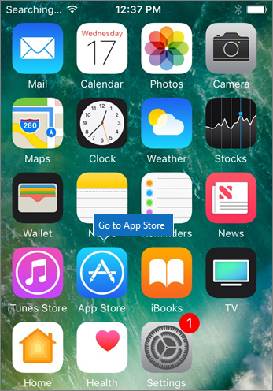

# Einrichten mobiler Geräte für Benutzer von Microsoft 365 Business

Folgen Sie den Anweisungen auf den Registerkarten, um Office auf einem iPhone oder einem Android-Smartphone zu installieren. Nachdem Sie diese Schritte ausgeführt haben, werden Ihre in Office-Apps erstellten Arbeitsdateien durch Microsoft 365 Business geschützt.

Das Beispiel ist für Outlook bestimmt, gilt aber auch für alle anderen Office-Apps, die Sie installieren möchten.
  
## Einrichten von mobilen Geräten

## [iPhone](#tab/iPhone)
  
Sehen Sie sich ein kurzes Video zum Einrichten von Office-Apps auf IOS-Geräten mit Microsoft 365 Business an.  

> [!VIDEO https://www.microsoft.com/videoplayer/embed/RWee2n] 

Wenn Sie dieses Video hilfreich finden, sehen Sie sich die [komplette Schulungsreihe für kleine Unternehmen und die neuen Microsoft 365 an](https://support.office.com/article/6ab4bbcd-79cf-4000-a0bd-d42ce4d12816).

Wechseln Sie zum **App Store**, und geben Sie im Suchfeld Microsoft Outlook ein.
  

  
Tippen Sie auf das Cloudsymbol, um Outlook zu installieren.
  

  
Tippen Sie nach Abschluss der Installation auf die Schaltfläche **Öffnen**, um Outlook zu öffnen. Tippen Sie dann auf **Erste Schritte**.
  

  
Enter your work email address on the **Add Email Account** screen \> **Add Account**, and then enter your Microsoft 365 Business credentials \> **Sign in**.
  

  
Wenn Ihre Organisation Dateien in apps schützt, wird ein Dialogfeld angezeigt, das besagt, dass Ihre Organisation jetzt die Daten in der APP schützt, und Sie müssen die APP neu starten, um Sie weiterhin zu verwenden. Tippen Sie auf **OK**, und schließen Sie Outlook. 
  

  
Suchen Sie Outlook auf dem iPhone, und starten Sie es erneut. Wenn Sie dazu aufgefordert werden, geben Sie eine PIN ein, und überprüfen Sie Sie. Jetzt ist Outlook auf Ihrem iPhone einsatzbereit.
  

  
## [Android](#tab/Android)
  
Sehen Sie sich ein Video über die Installation von Outlook und Office auf Android-Geräten an.  

> [!VIDEO https://www.microsoft.com/videoplayer/embed/ecc2e9c0-bc7e-4f26-8b14-91d84dbcfef0] 

Wenn Sie dieses Video hilfreich finden, sehen Sie sich die [komplette Schulungsreihe für kleine Unternehmen und die neuen Microsoft 365 an](https://support.office.com/article/6ab4bbcd-79cf-4000-a0bd-d42ce4d12816).

Um mit dem Setup auf Ihrem Android-Telefon zu beginnen, wechseln Sie zum Play Store.
  

  
Geben Sie Microsoft Outlook in das Google Play-Suchfeld ein, und tippen Sie auf **Installieren**. Nachdem Outlook fertig installiert wurde, tippen Sie auf **Öffnen**.
  

  
Tippen Sie in der Outlook-App auf **Erste Schritte**, fügen Sie Ihr Microsoft 365 Business \> -e-Mail-Konto **weiterhin**hinzu, und melden Sie sich mit Ihren Anmeldeinformationen für Ihre Organisation an.
  

  
Tippen Sie im Dialogfeld mit der Anweisung, dass Sie die Intune-Unternehmensportal-App installieren müssen, auf **Zum Store wechseln**.
  

  
Installieren Sie im Wiedergabe-Store das InTune-Unternehmens Portal.
  

  
Öffnen Sie Outlook erneut. Geben Sie eine PIN ein, und bestätigen Sie sie. Ihre Outlook-App ist jetzt einsatzbereit.
  

## Siehe auch

[Microsoft 365 Business Training Videos](https://support.office.com/article/6ab4bbcd-79cf-4000-a0bd-d42ce4d12816)

---