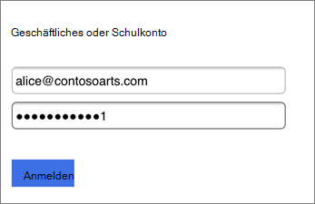
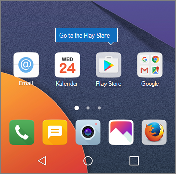
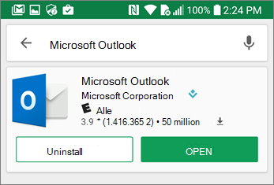
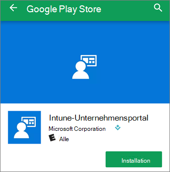
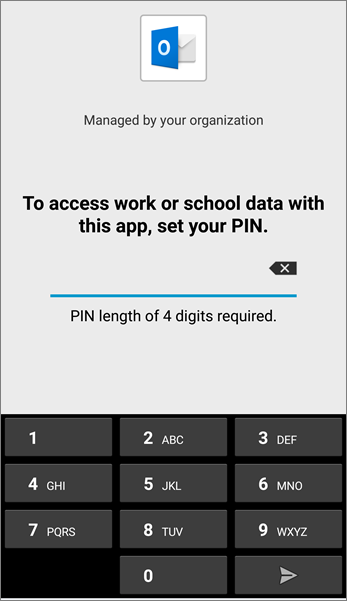

# Einrichten von mobilen Geräten für Microsoft 365 for Business-BenutzerSet up mobile devices for Microsoft 365 for business users

Folgen Sie den Anweisungen auf den Registerkarten, um Office auf einem iPhone oder einem Android-Smartphone zu installieren.Follow the instructions in the tabs to install Office on an iPhone or an Android phone. Nachdem Sie diese Schritte ausgeführt haben, werden Ihre in Office-Apps erstellten Arbeitsdateien von Microsoft 365 for Business geschützt.After you follow these steps, your work files created in Office apps will be protected by Microsoft 365 for business.

Das Beispiel ist für Outlook bestimmt, gilt aber auch für alle anderen Office-Apps, die Sie installieren möchten.The example is for Outlook, but applies for any other Office apps you want to install also.
  
## Einrichten mobiler GeräteSet up mobile devices

## [iPhoneiPhone](#tab/iPhone)
  
Sehen Sie sich ein kurzes Video zum Einrichten von Office-Apps auf IOS-Geräten mit Microsoft 365 for Business an.Watch a short video on how to set up Office apps on iOS devices with Microsoft 365 for business.  

> [!VIDEO https://www.microsoft.com/videoplayer/embed/RWee2n] 

Wenn Sie dieses Video hilfreich fanden, sehen Sie sich bitte die [komplette Schulungsserie für kleine Unternehmen und jene, die neu bei Microsoft 365 sind](https://support.microsoft.com/office/6ab4bbcd-79cf-4000-a0bd-d42ce4d12816), an.If you found this video helpful, check out the [complete training series for small businesses and those new to Microsoft 365](https://support.microsoft.com/office/6ab4bbcd-79cf-4000-a0bd-d42ce4d12816).

Wechseln Sie zum **App Store**, und geben Sie im Suchfeld Microsoft Outlook ein.Go to **App store**, and in the search field type in Microsoft Outlook.
  

  
Tippen Sie auf das Cloudsymbol, um Outlook zu installieren.Tap the cloud icon to install Outlook.
  

  
Tippen Sie nach Abschluss der Installation auf die Schaltfläche **Öffnen**, um Outlook zu öffnen. Tippen Sie dann auf **Erste Schritte**.When the installation is done, tap the **Open** button to open Outlook and then tap **Get Started**.
  

  
Geben Sie Ihre geschäftliche e-Mail-Adresse auf dem Bildschirm Add **-e-Mail-Konto** \> **Hinzufügen**ein, und geben Sie dann Ihre Anmeldeinformationen für Microsoft 365 for Business \> **Anmelden**ein.Enter your work email address on the **Add Email Account** screen \> **Add Account**, and then enter your Microsoft 365 for business credentials \> **Sign in**.
  

  
Wenn Ihre Organisation Dateien in apps schützt, wird ein Dialogfeld angezeigt, das besagt, dass Ihre Organisation jetzt die Daten in der APP schützt, und Sie müssen die APP neu starten, um Sie weiterhin zu verwenden.If your organization is protecting files in apps, you'll see a dialog stating that your organization is now protecting the data in the app and you need to restart the app to continue to use it. Tippen Sie auf **OK**, und schließen Sie Outlook.Tap **OK** and close Outlook. 
  

  
Suchen Sie Outlook auf dem iPhone, und starten Sie es erneut.Locate Outlook on the iPhone, and restart it. Wenn Sie dazu aufgefordert werden, geben Sie eine PIN ein, und überprüfen Sie Sie.When prompted, enter a PIN and verify it. Jetzt ist Outlook auf Ihrem iPhone einsatzbereit.Outlook on your iPhone is now ready to be used.
  

  
## [AndroidAndroid](#tab/Android)
  
Sehen Sie sich ein Video über die Installation von Outlook und Office auf Android-Geräten an.Watch a video about installing Outlook and Office on Android devices.  

> [!VIDEO https://www.microsoft.com/videoplayer/embed/ecc2e9c0-bc7e-4f26-8b14-91d84dbcfef0] 

Wenn Sie dieses Video hilfreich fanden, sehen Sie sich bitte die [komplette Schulungsserie für kleine Unternehmen und jene, die neu bei Microsoft 365 sind](https://support.microsoft.com/office/6ab4bbcd-79cf-4000-a0bd-d42ce4d12816), an.If you found this video helpful, check out the [complete training series for small businesses and those new to Microsoft 365](https://support.microsoft.com/office/6ab4bbcd-79cf-4000-a0bd-d42ce4d12816).

Um mit dem Setup auf Ihrem Android-Telefon zu beginnen, wechseln Sie zum Play Store.To begin setup on your Android phone, go to the Play Store.
  

  
Geben Sie Microsoft Outlook in das Google Play-Suchfeld ein, und tippen Sie auf **Installieren**.Enter Microsoft Outlook in the Google Play search box and tap **Install**. Nachdem Outlook fertig installiert wurde, tippen Sie auf **Öffnen**.Once Outlook is done installing, tap **Open**.
  

  
Tippen Sie in der Outlook-App auf **Erste Schritte**, fügen Sie Ihr Microsoft 365 for Business-e-Mail-Konto \> **weiterhin**hinzu, und melden Sie sich mit Ihren Anmeldeinformationen für Ihre Organisation an.In the Outlook app, tap **Get Started**, then add your Microsoft 365 for business email account \> **Continue**, and sign in with your organization credentials.
  

  
Tippen Sie im Dialogfeld mit der Anweisung, dass Sie die Intune-Unternehmensportal-App installieren müssen, auf **Zum Store wechseln**.In the dialog that states you must install the Intune Company Portal app, tap **Go to store**.
  

  
Installieren Sie im Wiedergabe-Store das InTune-Unternehmens Portal.In Play Store, install Intune Company Portal.
  

  
Öffnen Sie Outlook erneut. Geben Sie eine PIN ein, und bestätigen Sie sie. Ihre Outlook-App ist jetzt einsatzbereit.Open Outlook again, and enter and confirm a PIN. Your Outlook app is now ready for use.
  

## Siehe auchSee also

[Microsoft 365 für Unternehmen-SchulungsvideosMicrosoft 365 for business training videos](https://support.microsoft.com/office/6ab4bbcd-79cf-4000-a0bd-d42ce4d12816)

---
