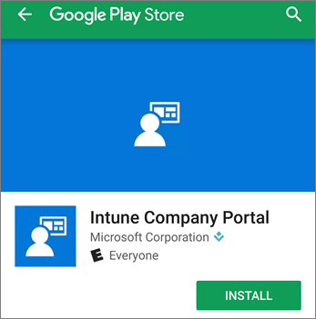

# Einrichten mobiler Geräte für Benutzer von Microsoft 365 BusinessSet up mobile devices for Microsoft 365 Business users

Folgen Sie den Anweisungen auf den Registerkarten, um Office auf einem iPhone oder einem Android-Smartphone zu installieren. Nachdem Sie diese Schritte ausgeführt haben, werden Ihre in Office-Apps erstellten Arbeitsdateien durch Microsoft 365 Business geschützt.Follow the instructions in the tabs to install Office on an iPhone or an Android phone. After you follow these steps, your work files created in Office apps will be protected by Microsoft 365 Business.

  
Das Beispiel ist für Outlook bestimmt, gilt aber auch für alle anderen Office-Apps, die Sie installieren möchten.The example is for Outlook, but applies for any other Office apps you want to install also.
  
## Einrichten von mobilen GerätenSet up mobile devices

## [iPhoneiPhone](#tab/iPhone)
  
Sehen Sie sich ein Video über das Office-apps auf iOS-Geräten mit Microsoft 365 Business einrichten:Watch a video on how to set up Office apps on iOS devices with Microsoft 365 Business:

> [!VIDEO https://www.microsoft.com/videoplayer/embed/e0ee7052-e0f4-4c42-a4f1-5e91b9776ce9?autoplay=false] 

Wechseln Sie zum **App Store**, und geben Sie im Suchfeld Microsoft Outlook ein.Go to **App store**, and in the search field type in Microsoft Outlook.
  

  
Tippen Sie auf das Cloudsymbol, um Outlook zu installieren.Tap the cloud icon to install Outlook.
  

  
Tippen Sie nach Abschluss der Installation auf die Schaltfläche **Öffnen**, um Outlook zu öffnen. Tippen Sie dann auf **Erste Schritte**.When the installation is done, tap the **Open** button to open Outlook and then tap **Get Started**.
  

  
Geben Sie Ihre geschäftliche e-Mail-Adresse auf dem **E-Mail-Konto hinzufügen** -Bildschirm \> **Konto hinzufügen**, und geben Sie Ihre Anmeldeinformationen für Microsoft 365 Business \> **Anmelden**.Enter your work email address on the **Add Email Account** screen \> **Add Account**, and then enter your Microsoft 365 Business credentials \> **Sign in**.
  

  
Wenn Ihre Organisation Dateien in Apps schützt, teilt Ihnen ein Dialogfeld mit, dass Ihre Organisation jetzt die Daten in der App schützt und Sie die App erneut starten müssen, um sie weiterhin verwenden zu können. Tippen Sie auf **OK**, und schließen Sie Outlook.If your organization is protecting files on apps, you'll see a dialog stating that your organization is now protecting the data in the app and you need to restart the app to continue to use it. Tap **OK** and close Outlook. 
  

  
Suchen Sie Outlook auf dem iPhone, und starten Sie es erneut. Geben Sie bei der entsprechenden Aufforderung eine PIN ein, und bestätigen Sie sie. Jetzt ist Outlook auf Ihrem iPhone einsatzbereit.Locate Outlook on the iPhone, and restart it. When prompted enter a PIN and verify it. Outlook on your iPhone is now ready to be used.
  

  
## [AndroidAndroid](#tab/Android)
  
Um Setup auf dem Android-Telefon zu beginnen, wechseln Sie an den Store wiedergeben.To begin setup on your Android phone, go to the Play Store.
  

  
Geben Sie im Suchfeld von Google Play "Microsoft Outlook" ein, und tippen Sie auf **Installieren**.Sobald Outlook fertig installiert ist, tippen Sie auf **Öffnen**.Enter Microsoft Outlook in the Google Play search box and tap **Install**.Once Outlook is done installing, tap **Open**.
  

  
In der Outlook-app Tippen Sie auf **Erste Schritte**aus, und fügen Sie Ihr e-Mail-Konto von Microsoft 365 Business \> **Weiter**, und melden Sie sich mit Ihren Anmeldeinformationen für die Organisation.In the Outlook app tap **Get Started**, then add your Microsoft 365 Business email account \> **Continue**, and sign in with your organization credentials.
  

  
Tippen Sie im Dialogfeld mit der Anweisung, dass Sie die Intune-Unternehmensportal-App installieren müssen, auf **Zum Store wechseln**.In the dialog that states you must install the Intune Company Portal app, tap **Go to store**.
  

  
Installieren Sie von "Intune-Unternehmensportal" aus dem Play StoreIn Play Store install Intune Company Portal.
  

  
Öffnen Sie Outlook erneut. Geben Sie eine PIN ein, und bestätigen Sie sie. Ihre Outlook-App ist jetzt einsatzbereit.Open Outlook again, and enter and confirm a PIN. Your Outlook app is now ready for use.
  

  
---

