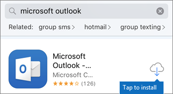

# Einrichten mobiler Geräte für Microsoft 365 für Geschäftsbenutzer

Folgen Sie den Anweisungen auf den Registerkarten, um Office auf einem iPhone oder einem Android-Smartphone zu installieren. Nachdem Sie diese Schritte ausführen, werden Ihre in Office erstellten Arbeitsdateien durch Microsoft 365 geschützt.

Das Beispiel ist für Outlook bestimmt, gilt aber auch für alle anderen Office-Apps, die Sie installieren möchten.
  
## Einrichten mobiler Geräte

## [iPhone](#tab/iPhone)
  
Sehen Sie sich ein kurzes Video zum Einrichten Office Apps auf iOS-Geräten mit Microsoft 365 Unternehmen an.  

> [!VIDEO https://www.microsoft.com/videoplayer/embed/RWee2n] 

Wenn Sie dieses Video hilfreich fanden, sehen Sie sich bitte die [komplette Schulungsserie für kleine Unternehmen und diejenigen, für die Microsoft 365 neu ist](../business-video/index.yml) an.

Wechseln Sie zum **App Store**, und geben Sie im Suchfeld Microsoft Outlook ein.
  

  
Tippen Sie auf das Cloudsymbol, um Outlook zu installieren.
  

  
Tippen Sie nach Abschluss der Installation auf die Schaltfläche **Öffnen**, um Outlook zu öffnen. Tippen Sie dann auf **Erste Schritte**.
  

  
Geben Sie Ihre geschäftliche  E-Mail-Adresse auf dem Bildschirm E-Mail-Konto hinzufügen ein, und geben Sie dann Microsoft 365 für \> Geschäftsanmeldeinformationen \> **anmelden ein.**
  

  
Wenn Ihre Organisation Dateien in Apps schützt, wird ein Dialogfeld angezeigt, in dem sie darauf hinweist, dass Ihre Organisation die Daten in der App schützt und Sie die App neu starten müssen, um sie weiterhin zu verwenden. Tippen Sie auf **OK**, und schließen Sie Outlook. 
  

  
Suchen Sie Outlook auf dem iPhone, und starten Sie es erneut. Wenn Sie dazu aufgefordert werden, geben Sie eine PIN ein, und überprüfen Sie sie. Jetzt ist Outlook auf Ihrem iPhone einsatzbereit.
  

  
## [Android](#tab/Android)
  
Sehen Sie sich ein Video zum Installieren Outlook und Office auf Android-Geräten an.  

> [!VIDEO https://www.microsoft.com/videoplayer/embed/ecc2e9c0-bc7e-4f26-8b14-91d84dbcfef0] 

Wenn Sie dieses Video hilfreich fanden, sehen Sie sich bitte die [komplette Schulungsserie für kleine Unternehmen und diejenigen, für die Microsoft 365 neu ist](../business-video/index.yml) an.

Um mit dem Setup auf Ihrem Android-Smartphone zu beginnen, wechseln Sie zum Store.
  

  
Geben Sie Microsoft Outlook in das Suchfeld Google Play ein, und tippen Sie auf **Installieren**. Nachdem Outlook installation fertig ist, tippen Sie **auf Öffnen**.
  

  
Tippen Sie Outlook app auf **Erste Schritte**, fügen Sie dann Ihr Microsoft 365 business-E-Mail-Konto Weiter hinzu, und melden Sie sich mit Ihren \> Organisationsanmeldeinformationen an.
  

  
Tippen Sie im Dialogfeld mit der Anweisung, dass Sie die Intune-Unternehmensportal-App installieren müssen, auf **Zum Store wechseln**.
  

  
Installieren Sie Store In Play Intune-Unternehmensportal.
  

  
Öffnen Sie Outlook erneut. Geben Sie eine PIN ein, und bestätigen Sie sie. Ihre Outlook-App ist jetzt einsatzbereit.
  

## Siehe auch

[Microsoft 365 für Unternehmen-Schulungsvideos](../business-video/index.yml)

---
