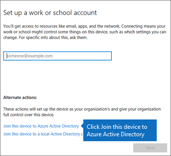

# Einrichten von Windows-Geräten für Benutzer von Microsoft 365 Business

## Voraussetzungen

Bevor Sie die Windows-Geräte für Microsoft 365 Business-Benutzer einrichten können, stellen Sie sicher, dass auf allen Windows-Geräten Windows 10 Pro, Version 1703 (Creators Update)) ausgeführt wird. Windows 10 Pro ist Voraussetzung für die Bereitstellung von Windows 10 Business. Windows 10 Business besteht aus einer Reihe von Clouddiensten und Funktionen zur Geräteverwaltung, die Windows 10 Pro ergänzen und die zentrale Verwaltung und Sicherheitskontrollen von Microsoft 365 Business ermöglichen.
  
Wenn Sie Windows-Geräte unter Windows 7 Pro, Windows 8 Pro oder Windows 8.1 Pro einsetzen, sind Sie im Rahmen Ihres Microsoft 365 Business-Abonnements berechtigt, auf Windows 10 zu aktualisieren.
  
Weitere Informationen zum Upgrade von Windows-Geräten auf Windows 10 Pro Creators Update erhalten Sie, indem Sie die Schritte in diesem Thema ausführen: [Aktualisieren von Windows-Geräten auf Windows Pro Creators Update](upgrade-to-windows-pro-creators-update.md).
  
Ziehen Sie [Sicherstellen, dass das Gerät auf Windows 10 Business aktualisiert wurde](set-up-windows-devices.md#bkmk_verifywin10) zurate, um sich zu vergewissern, dass Sie über das Upgrade verfügen bzw. dass das Upgrade erfolgreich war. 
  
## Verbinden von Windows 10-Geräten in Ihrer Organisation mit Azure AD

Nachdem alle Windows-Geräte in Ihrer Organisation entweder auf Windows 10 Pro Creators Update aktualisiert wurden oder bereits Windows 10 Pro Creators Update ausführen, können Sie diese Geräte in Ihrer Organisation mit Azure Active Directory verbinden. Sobald die Geräte verbunden sind, werden sie automatisch auf Windows 10 Business aktualisiert, das Teil Ihres Microsoft 365 Business-Abonnements ist.
  
### Ganz neue oder neu aktualisierte Windows 10 Pro-Geräte

Führen Sie für ganze neue Geräte mit Windows 10 Pro Creators Update oder für Geräte, die auf Windows 10 Pro Creators Update aktualisiert wurden, für die die Windows 10-Geräteinstallation jedoch noch nicht ausgeführt wurde, die folgenden Schritte aus.
  
1. Führen Sie die Windows 10-Geräteinstallation aus, bis die Seite **Wie soll das Setup erfolgen** angezeigt wird. 
    
    
  
2. Wählen Sie hier **Für eine Organisation einrichten** aus, und geben Sie Ihren Benutzernamen und das Kennwort für Microsoft 365 Business ein. 
    
3. Beenden Sie die Windows 10-Geräteinstallation.
    
   Sobald Sie fertig sind, wird der Benutzer in Ihrer Organisation mit Azure AD verbunden. Ziehen Sie zur Sicherheit [Sicherstellen, dass das Gerät mit Azure AD verbunden ist](set-up-windows-devices.md#bkmk_verifyaad) zurate. 
  
### Geräte, die bereits eingerichtet wurden und Windows 10 Pro ausführen

 **Herstellen der Verbindung der Benutzer zu Azure AD:**
  
1. Klicken Sie auf dem Windows-PC des Benutzers, auf dem Windows 10 Pro, Version 1703 (Creators Update) ausgeführt wird (siehe [Voraussetzungen](pre-requisites-for-data-protection.md)), auf das Windows-Logo und dann auf das Symbol "Einstellungen".
  
   
  
2. Wechseln Sie unter **Einstellungen** zu **Konten**.
  
   
  
3. Klicken Sie auf der Seite **Ihre Informationen** auf **Auf Arbeits- oder Schulkonto zugreifen** \> **Verbinden**.
  
   
  
4. Wählen Sie im Dialogfeld **Geschäfts-, Schul- oder Unikonto einrichten** unter **Alternative Aktionen** die Option **Dieses Gerät in Azure Active Directory einbinden**.
  
   
  
5. Geben Sie auf der Seite **Fangen Sie angemeldet** Ihr Konto arbeiten oder Schule \> **Weiter**.
  
   Geben Sie auf der Seite **Kennwort eingeben** , Ihr Kennwort \> **Anmelden**.
  
   
  
6. Klicken Sie auf die ** sicherstellen, dass dies ist Ihre Organisation ** Seite, stellen Sie sicher, dass die Informationen korrekt sind, und klicken Sie auf **teilnehmen**.
  
   Klicken Sie auf der Seite **Sie sind fertig!** auf **Fertig**.
  
   
  
Wenn Sie Dateien nach OneDrive for Business hochgeladen haben, synchronisieren Sie diese wieder. Wenn Sie ein Drittanbietertool zum Migrieren von Profil und Dateien verwendet haben, synchronisieren Sie diese auch in das neue Profil.
  
## Sicherstellen, dass das Gerät mit Azure AD verbunden ist

Um Ihren Synchronisierungsstatus zu überprüfen, klicken Sie auf der Seite **Auf Arbeits- oder Schulkonto zugreifen** unter **Einstellungen** in den Bereich **Verbunden mit** _ \<organization name\> _, um die Schaltflächen **Info** und **Trennen** verfügbar zu machen. Klicken Sie auf **Info**, um Ihren Synchronisierungsstatus abzurufen. 
  
Klicken Sie auf der Seite "Synchronisierungsstatus" auf "Synchronisieren", um die neuesten Verwaltungsrichtlinien für Mobilgeräte auf den Computer abzurufen.
  
Um mit der Verwendung des Microsoft 365 Business-Kontos zu beginen, klicken Sie auf die Windows-Schaltfläche **Start**, klicken Sie mit der rechten Maustaste auf das Bild Ihres aktuellen Kontos, und klicken Sie dann auf **Konto wechseln**. Melden Sie sich mit der E-Mail-Adresse und dem Kennwort Ihrer Organisation an.
  

  
## Sicherstellen, dass das Gerät auf Windows 10 Business aktualisiert wurde

Stellen Sie sicher, dass Ihre mit Azure AD verbundenen Windows 10-Geräte im Rahmen Ihres Microsoft 365 Business-Abonnements auf Windows 10 Business aktualisiert wurden.
  
1. Wechseln Sie zu **Einstellungen** \> **System** \> **Info**.
    
2. Überprüfen Sie, ob unter **Edition** **Windows 10 Business** angezeigt wird.
    
    
  
## Weitere Schritte

Informationen zum Einrichten von mobilen Geräten finden Sie unter [Einrichten von mobilen Geräten für Microsoft 365 Business-Benutzer](set-up-mobile-devices.md). Informationen zum Festlegen von Richtlinien zum Schutz von Geräten oder Apps finden Sie unter [Verwalten von Microsoft 365 Business](manage.md).
  
