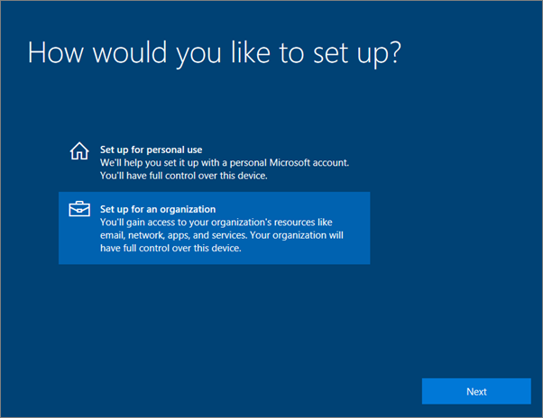

# Einrichten von Windows-Geräten für Benutzer von Microsoft 365 BusinessSet up Windows devices for Microsoft 365 Business users

## VoraussetzungenPrerequisites

Bevor Sie die Windows-Geräte für Microsoft 365 Business-Benutzer einrichten können, stellen Sie sicher, dass auf allen Windows-Geräten Windows 10 Pro, Version 1703 (Creators Update)) ausgeführt wird. Windows 10 Pro ist Voraussetzung für die Bereitstellung von Windows 10 Business. Windows 10 Business besteht aus einer Reihe von Clouddiensten und Funktionen zur Geräteverwaltung, die Windows 10 Pro ergänzen und die zentrale Verwaltung und Sicherheitskontrollen von Microsoft 365 Business ermöglichen.Before you can set up Windows devices for Microsoft 365 Business users, make sure all the Windows devices are running Windows 10 Pro, version 1703 (Creators Update). Windows 10 Pro is a prerequisite for deploying Windows 10 Business, which is a set of cloud services and device management capabilities that complement Windows 10 Pro and enable the centralized management and security controls of Microsoft 365 Business.
  
Wenn Sie Windows-Geräte unter Windows 7 Pro, Windows 8 Pro oder Windows 8.1 Pro einsetzen, sind Sie im Rahmen Ihres Microsoft 365 Business-Abonnements berechtigt, auf Windows 10 zu aktualisieren.If you have Windows devices running Windows 7 Pro, Windows 8 Pro, or Windows 8.1 Pro, your Microsoft 365 Business subscription entitles you to a Windows 10 upgrade.
  
Weitere Informationen zum Upgrade von Windows-Geräten auf Windows 10 Pro Creators Update erhalten Sie, indem Sie die Schritte in diesem Thema ausführen: [Aktualisieren von Windows-Geräten auf Windows Pro Creators Update](upgrade-to-windows-pro-creators-update.md).For more information on how to upgrade Windows devices to Windows 10 Pro Creators Update, follow the steps in this topic: [Upgrade Windows devices to Windows Pro Creators Update](upgrade-to-windows-pro-creators-update.md).
  
Ziehen Sie [Sicherstellen, dass das Gerät auf Windows 10 Business aktualisiert wurde](set-up-windows-devices.md#bkmk_verifywin10) zurate, um sich zu vergewissern, dass Sie über das Upgrade verfügen bzw. dass das Upgrade erfolgreich war.See [Verify the device is upgraded to Windows 10 Business](set-up-windows-devices.md#bkmk_verifywin10) to verify you have the upgrade, or to make sure the upgrade worked. 
  
## Verbinden von Windows 10-Geräten in Ihrer Organisation mit Azure ADJoin Windows 10 devices to your organization's Azure AD

Nachdem alle Windows-Geräte in Ihrer Organisation entweder auf Windows 10 Pro Creators Update aktualisiert wurden oder bereits Windows 10 Pro Creators Update ausführen, können Sie diese Geräte in Ihrer Organisation mit Azure Active Directory verbinden. Sobald die Geräte verbunden sind, werden sie automatisch auf Windows 10 Business aktualisiert, das Teil Ihres Microsoft 365 Business-Abonnements ist.Once all Windows devices in your organization have either been upgraded to Windows 10 Pro Creators Update or are already running Windows 10 Pro Creators Update, you can join these devices to your organization's Azure Active Directory. Once the devices are joined, they will automatically be upgraded to Windows 10 Business, which is part of your Microsoft 365 Business subscription.
  
### Ganz neue oder neu aktualisierte Windows 10 Pro-GeräteFor a brand new, or newly upgraded, Windows 10 Pro device

Führen Sie für ganze neue Geräte mit Windows 10 Pro Creators Update oder für Geräte, die auf Windows 10 Pro Creators Update aktualisiert wurden, für die die Windows 10-Geräteinstallation jedoch noch nicht ausgeführt wurde, die folgenden Schritte aus.For a brand new device running Windows 10 Pro Creators Update, or for a device that was upgraded to Windows 10 Pro Creators Update but has not gone through Windows 10 device setup, follow these steps.
  
1. Führen Sie die Windows 10-Geräteinstallation aus, bis die Seite **Wie soll das Setup erfolgen** angezeigt wird.Go through Windows 10 device setup until you get to the **How would you like to set up?** page. 
    
    
  
2. Wählen Sie hier **Für eine Organisation einrichten** aus, und geben Sie Ihren Benutzernamen und das Kennwort für Microsoft 365 Business ein.Here, choose **Set up for an organization** and then enter your username and password for Microsoft 365 Business. 
    
3. Beenden Sie die Windows 10-Geräteinstallation.Finish Windows 10 device setup.
    
   Sobald Sie fertig sind, wird der Benutzer in Ihrer Organisation mit Azure AD verbunden. Ziehen Sie zur Sicherheit [Sicherstellen, dass das Gerät mit Azure AD verbunden ist](set-up-windows-devices.md#bkmk_verifyaad) zurate.Once you're done, the user will be connected to your organization's Azure AD. See [Verify the device is connected to Azure AD](set-up-windows-devices.md#bkmk_verifyaad) to make sure. 
  
### Geräte, die bereits eingerichtet wurden und Windows 10 Pro ausführenFor a device already set up and running Windows 10 Pro

 **Herstellen der Verbindung der Benutzer zu Azure AD:****Connect users to Azure AD:**
  
1. Klicken Sie auf dem Windows-PC des Benutzers, auf dem Windows 10 Pro, Version 1703 (Creators Update) ausgeführt wird (siehe [Voraussetzungen](pre-requisites-for-data-protection.md)), auf das Windows-Logo und dann auf das Symbol "Einstellungen".In your user's Windows PC, that is running Windows 10 Pro, version 1703 (Creators Update) (see [pre-requisites](pre-requisites-for-data-protection.md)), click the Windows logo, and then the Settings icon.
  
   
  
2. Wechseln Sie unter **Einstellungen** zu **Konten**.In **Settings**, go to **Accounts**.
  
   
  
3. Klicken Sie auf der Seite **Ihre Informationen** auf **Auf Arbeits- oder Schulkonto zugreifen** \> **Verbinden**.On **Your info** page, click **Access work or school** \> **Connect**.
  
   
  
4. Wählen Sie im Dialogfeld **Geschäfts-, Schul- oder Unikonto einrichten** unter **Alternative Aktionen** die Option **Dieses Gerät in Azure Active Directory einbinden**.On the **Set up a work or school account** dialog, under **Alternate actions**, choose **Join this device to Azure Active Directory**.
  
   
  
5. Geben Sie auf der Seite **Fangen Sie angemeldet** Ihr Konto arbeiten oder Schule \> **Weiter**.On the **Let's get you signed in** page, enter your work or school account \> **Next**.
  
   Geben Sie auf der Seite **Kennwort eingeben** , Ihr Kennwort \> **Anmelden**.On the **Enter password** page, enter your password \> **Sign in**.
  
   
  
6. Klicken Sie auf die \*\* sicherstellen, dass dies ist Ihre Organisation \*\* Seite, stellen Sie sicher, dass die Informationen korrekt sind, und klicken Sie auf **teilnehmen**.On the \*\* Make sure this is your organization \*\* page, verify that the information is correct, and click **Join**.
  
   Klicken Sie auf der Seite **Sie sind fertig!** auf **Fertig**.On the **You're all set!** page, click **Done**.
  
   
  
Wenn Sie Dateien nach OneDrive for Business hochgeladen haben, synchronisieren Sie diese wieder. Wenn Sie ein Drittanbietertool zum Migrieren von Profil und Dateien verwendet haben, synchronisieren Sie diese auch in das neue Profil.If you uploaded files to OneDrive for Business, sync them back down. If you used a third party tool to migrate profile and files, sync those also to the new profile.
  
## Sicherstellen, dass das Gerät mit Azure AD verbunden istVerify the device is connected to Azure AD

Um Ihren Synchronisierungsstatus zu überprüfen, klicken Sie auf der Seite **Auf Arbeits- oder Schulkonto zugreifen** unter **Einstellungen** in den Bereich **Verbunden mit** _ \<organization name\> _, um die Schaltflächen **Info** und **Trennen** verfügbar zu machen. Klicken Sie auf **Info**, um Ihren Synchronisierungsstatus abzurufen.To verify your sync status, on the **Access work or school** page in **Settings**, click in the **Connected to** _ \<organization name\> _ area to expose the buttons **Info** and **Disconnect**. Click on **Info** to get your synchronization status. 
  
Klicken Sie auf der Seite "Synchronisierungsstatus" auf "Synchronisieren", um die neuesten Verwaltungsrichtlinien für Mobilgeräte auf den Computer abzurufen.On the Sync status page, click Sync to get the latest mobile device management policies onto the PC.
  
Um mit der Verwendung des Microsoft 365 Business-Kontos zu beginen, klicken Sie auf die Windows-Schaltfläche **Start**, klicken Sie mit der rechten Maustaste auf das Bild Ihres aktuellen Kontos, und klicken Sie dann auf **Konto wechseln**. Melden Sie sich mit der E-Mail-Adresse und dem Kennwort Ihrer Organisation an.To start using the Microsoft 365 Business account, go to the Windows **Start** button, right-click your current account picture and then **Switch account**. Sign in by using your organization email and password.
  

  
## Sicherstellen, dass das Gerät auf Windows 10 Business aktualisiert wurdeVerify the device is upgraded to Windows 10 Business

Stellen Sie sicher, dass Ihre mit Azure AD verbundenen Windows 10-Geräte im Rahmen Ihres Microsoft 365 Business-Abonnements auf Windows 10 Business aktualisiert wurden.Verify that your Azure AD joined Windows 10 devices were upgraded to Windows 10 Business as part of your Microsoft 365 Business subscription.
  
1. Wechseln Sie zu **Einstellungen** \> **System** \> **Info**.Go to **Settings** \> **System** \> **About**.
    
2. Überprüfen Sie, ob unter **Edition** **Windows 10 Business** angezeigt wird.Confirm that the **Edition** shows **Windows 10 Business**.
    
    
  
## Weitere SchritteNext steps

Informationen zum Einrichten von mobilen Geräten finden Sie unter [Einrichten von mobilen Geräten für Microsoft 365 Business-Benutzer](set-up-mobile-devices.md). Informationen zum Festlegen von Richtlinien zum Schutz von Geräten oder Apps finden Sie unter [Verwalten von Microsoft 365 Business](manage.md).To set up your mobile devices, see [Set up mobile devices for Microsoft 365 Business users](set-up-mobile-devices.md), To set device protection or app protection policies, see [Manage Microsoft 365 Business](manage.md).
  
