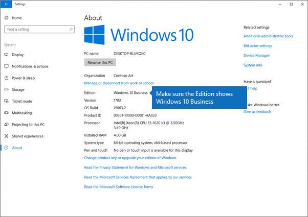

# Einrichten Windows Geräte für Microsoft 365 Business Premium BenutzerSet up Windows devices for Microsoft 365 Business Premium users

## Bevor Sie beginnen:Before you begin

Bevor Sie Windows Geräte für Microsoft 365 Business Premium Benutzer einrichten können, stellen Sie sicher, dass alle Windows Geräte Windows 10 Pro Version 1703 (Creators Update) ausgeführt werden.Before you can set up Windows devices for Microsoft 365 Business Premium users, make sure all the Windows devices are running Windows 10 Pro, version 1703 (Creators Update). Windows 10 Pro ist eine Voraussetzung für die Bereitstellung von Windows 10 Business. Dabei handelt es sich um eine Reihe von Clouddiensten und Geräteverwaltungsfunktionen, die Windows 10 Pro ergänzen und die zentrale Verwaltung und Sicherheitskontrollen von Microsoft 365 Business Premium ermöglichen.Windows 10 Pro is a prerequisite for deploying Windows 10 Business, which is a set of cloud services and device management capabilities that complement Windows 10 Pro and enable the centralized management and security controls of Microsoft 365 Business Premium.
  
Wenn Windows Geräte Windows 7 Pro, Windows 8 Pro oder Windows 8.1 Pro ausgeführt werden, führt Ihr Microsoft 365 Business Premium Abonnement zu einem Windows 10 Upgrade.If you have Windows devices running Windows 7 Pro, Windows 8 Pro, or Windows 8.1 Pro, your Microsoft 365 Business Premium subscription entitles you to a Windows 10 upgrade.
  
Weitere Informationen zum Upgrade von Windows-Geräten auf Windows 10 Pro Creators Update erhalten Sie, indem Sie die Schritte in diesem Thema ausführen: [Aktualisieren von Windows-Geräten auf Windows Pro Creators Update](upgrade-to-windows-pro-creators-update.md).For more information on how to upgrade Windows devices to Windows 10 Pro Creators Update, follow the steps in this topic: [Upgrade Windows devices to Windows Pro Creators Update](upgrade-to-windows-pro-creators-update.md).
  
Lesen [Sie "Überprüfen, ob das Gerät mit Azure AD verbunden ist",](#verify-the-device-is-connected-to-azure-ad) um zu überprüfen, ob Sie über das Upgrade verfügen, oder um sicherzustellen, dass das Upgrade funktioniert hat.See [Verify the device is connected to Azure AD](#verify-the-device-is-connected-to-azure-ad) to verify you have the upgrade, or to make sure the upgrade worked.

## Watch: Verbinden Ihres PCs an Microsoft 365 BusinessWatch: Connect your PC to Microsoft 365 Business

> [!VIDEO https://www.microsoft.com/videoplayer/embed/RE3yXh3] 

Wenn Sie dieses Video hilfreich fanden, sehen Sie sich bitte die [komplette Schulungsserie für kleine Unternehmen und diejenigen, für die Microsoft 365 neu ist](../business-video/index.yml) an.If you found this video helpful, check out the [complete training series for small businesses and those new to Microsoft 365](../business-video/index.yml).
  
## Verbinden von Windows 10-Geräten in Ihrer Organisation mit Azure ADJoin Windows 10 devices to your organization's Azure AD

Wenn alle Windows Geräte in Ihrer Organisation entweder auf Windows 10 Pro Creators Update aktualisiert wurden oder bereits Windows 10 Pro Creators Update ausgeführt werden, können Sie diese Geräte dem Azure Active Directory Ihrer Organisation hinzufügen.When all Windows devices in your organization have either been upgraded to Windows 10 Pro Creators Update or are already running Windows 10 Pro Creators Update, you can join these devices to your organization's Azure Active Directory. Sobald die Geräte verbunden sind, werden sie automatisch auf Windows 10 Business aktualisiert, das Teil Ihres Microsoft 365 Business Premium-Abonnements ist.Once the devices are joined, they'll be automatically upgraded to Windows 10 Business, which is part of your Microsoft 365 Business Premium subscription.
  
### Ganz neue oder neu aktualisierte Windows 10 Pro-GeräteFor a brand new, or newly upgraded, Windows 10 Pro device

Führen Sie für ganze neue Geräte mit Windows 10 Pro Creators Update oder für Geräte, die auf Windows 10 Pro Creators Update aktualisiert wurden, für die die Windows 10-Geräteinstallation jedoch noch nicht ausgeführt wurde, die folgenden Schritte aus.For a brand new device running Windows 10 Pro Creators Update, or for a device that was upgraded to Windows 10 Pro Creators Update but has not gone through Windows 10 device setup, follow these steps.
  
1. Führen Sie die Windows 10-Geräteinstallation aus, bis die Seite **Wie soll das Setup erfolgen** angezeigt wird.Go through Windows 10 device setup until you get to the **How would you like to set up?** page. 
    
    
  
2. Wählen Sie hier **"Für eine Organisation einrichten"** aus, und geben Sie dann Ihren Benutzernamen und Ihr Kennwort für Microsoft 365 Business Premium ein.Here, choose **Set up for an organization** and then enter your username and password for Microsoft 365 Business Premium. 
    
3. Beenden Sie die Windows 10-Geräteinstallation.Finish Windows 10 device setup.
    
   Sobald Sie fertig sind, wird der Benutzer in Ihrer Organisation mit Azure AD verbunden. Ziehen Sie zur Sicherheit [Sicherstellen, dass das Gerät mit Azure AD verbunden ist](#verify-the-device-is-connected-to-azure-ad) zurate.Once you're done, the user will be connected to your organization's Azure AD. See [Verify the device is connected to Azure AD](#verify-the-device-is-connected-to-azure-ad) to make sure. 
  
### Geräte, die bereits eingerichtet wurden und Windows 10 Pro ausführenFor a device already set up and running Windows 10 Pro

 **Herstellen der Verbindung der Benutzer zu Azure AD:****Connect users to Azure AD:**
  
1. Klicken Sie auf dem Windows-PC des Benutzers, auf dem Windows 10 Pro, Version 1703 (Creators Update) ausgeführt wird (siehe [Voraussetzungen](pre-requisites-for-data-protection.md)), auf das Windows-Logo und dann auf das Symbol "Einstellungen".In your user's Windows PC, that is running Windows 10 Pro, version 1703 (Creators Update) (see [pre-requisites](pre-requisites-for-data-protection.md)), click the Windows logo, and then the Settings icon.
  
   
  
2. Wechseln Sie unter **Einstellungen** zu **Konten**.In **Settings**, go to **Accounts**.
  
   
  
3. Klicken Sie auf der Seite **Ihre Informationen** auf **Auf Arbeits- oder Schulkonto zugreifen** \> **Verbinden**.On **Your info** page, click **Access work or school** \> **Connect**.
  
   
  
4. Wählen Sie im Dialogfeld **Geschäfts-, Schul- oder Unikonto einrichten** unter **Alternative Aktionen** die Option **Dieses Gerät in Azure Active Directory einbinden**.On the **Set up a work or school account** dialog, under **Alternate actions**, choose **Join this device to Azure Active Directory**.
  
   
  
5. On the **Let's get you signed in** page, enter your work or school account \> **Next**.On the **Let's get you signed in** page, enter your work or school account \> **Next**.
  
   On the **Enter password** page, enter your password \> **Sign in**.On the **Enter password** page, enter your password \> **Sign in**.
  
   
  
6. Überprüfen Sie auf der Seite **"Sicherstellen, dass dies Ihre Organisation ist",** ob die Informationen korrekt sind, und wählen Sie **"Beitreten"** aus.On the **Make sure this is your organization** page, verify that the information is correct, and choose **Join**.
  
   Klicken Sie auf der Seite **Sie sind fertig!**On the **You're all set!** page, chosse **Done**.page, chosse **Done**.
  
   
  
Wenn Sie Dateien nach OneDrive for Business hochgeladen haben, synchronisieren Sie diese wieder.If you uploaded files to OneDrive for Business, sync them back down. Wenn Sie ein Drittanbietertool zum Migrieren von Profilen und Dateien verwendet haben, synchronisieren Sie diese ebenfalls mit dem neuen Profil.If you used a third-party tool to migrate profile and files, also sync those to the new profile.
  
## Stellen Sie sicher, dass das Gerät mit Azure AD verbunden istVerify the device is connected to Azure AD

Um Ihren Synchronisierungsstatus zu überprüfen, wählen Sie auf der Seite **"Arbeit oder Schule** zugreifen" in **Einstellungen** den Bereich **Verbunden mit** _ _ \<organization name\> aus, um die Schaltflächen **"Info"** und **"Trennen"** verfügbar zu machen.To verify your sync status, on the **Access work or school** page in **Settings**, select the **Connected to** _ \<organization name\> _ area to expose the buttons **Info** and **Disconnect**. Wählen Sie **"Info"** aus, um den Synchronisierungsstatus abzurufen.Choose **Info** to get your synchronization status. 
  
Wählen Sie auf der Seite **"Synchronisierungsstatus"** die Option **"Synchronisieren"** aus, um die neuesten Richtlinien für die Verwaltung mobiler Geräte auf dem PC abzurufen.On the **Sync status** page, choose **Sync** to get the latest mobile device management policies onto the PC.
  
To start using the Microsoft 365 Business Premium account, go to the Windows **Start** button, right-click your current account picture, and then **Switch account**.To start using the Microsoft 365 Business Premium account, go to the Windows **Start** button, right-click your current account picture, and then **Switch account**. Melden Sie sich mit der E-Mail-Adresse und dem Kennwort Ihrer Organisation an.Sign in by using your organization email and password.
  

  
## Überprüfen Sie, ob der PC auf Windows 10 Business aktualisiert wurde.Verify the PC is upgraded to Windows 10 Business

Stellen Sie sicher, dass Ihre in Azure AD eingebundenen Windows 10 Geräte im Rahmen Ihres Microsoft 365 Business Premium-Abonnements auf Windows 10 Business aktualisiert werden.Verify that your Azure AD joined Windows 10 devices are upgraded to Windows 10 Business as part of your Microsoft 365 Business Premium subscription.
  
1. Wechseln Sie zu **Einstellungen** \> **System** \> **Info**.Go to **Settings** \> **System** \> **About**.
    
2. Überprüfen Sie, ob unter **Edition** **Windows 10 Business** angezeigt wird.Confirm that the **Edition** shows **Windows 10 Business**.
    
    
  
## Nächste SchritteNext steps

Informationen zum Einrichten Ihrer mobilen Geräte finden Sie unter ["Einrichten mobiler Geräte für Microsoft 365 Business Premium Benutzer".](set-up-mobile-devices.md)Informationen zum Festlegen von Richtlinien zum Geräteschutz oder zum Schutz von Apps finden Sie unter [Verwalten Microsoft 365 für Unternehmen.](manage.md)To set up your mobile devices, see [Set up mobile devices for Microsoft 365 Business Premium users](set-up-mobile-devices.md), To set device protection or app protection policies, see [Manage Microsoft 365 for business](manage.md).
  
## Verwandte InhalteRelated content

[Microsoft 365 für Business-Schulungsvideos](../business-video/index.yml) (Linkseite)[Microsoft 365 for business training videos](../business-video/index.yml) (link page)
