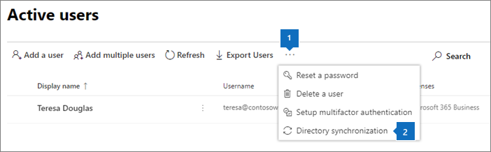

# Einrichten von Microsoft 365 BusinessSet up Microsoft 365 Business

Weitere Informationen finden Sie unter [Get Microsoft 365 Business](get-microsoft-365-business.md) for Sign-up Details.Before you get started, see [Get Microsoft 365 Business](get-microsoft-365-business.md) for sign-up details.

Sehen Sie sich ein [kurzes Video über das Einrichten von Microsoft 365 Business](https://support.office.com/article/38003e30-9d10-44cf-b596-f1b5f662bfa1) mithilfe des Assistenten zum Einrichten und wenn Sie nicht über ein lokales Active Directory verfügen.Watch a [short video on how to set up Microsoft 365 Business](https://support.office.com/article/38003e30-9d10-44cf-b596-f1b5f662bfa1) by using the set up wizard, and when you don't have an on-premises Active Directory
  

## ÜbersichtOverview

Die meisten der einrichten-Schritte können im Setup-Assistenten ausgeführt werden, die anderen Optionen werden ebenfalls aufgeführt.Most of the set up steps can be done in the setup wizard, but the other options are also listed.

1. [Hinzufügen Ihrer Domäne](#add-your-domain-to-personalize-sign-in) (wenn Sie Ihre Domäne während der [Registrierung](sign-up.md)erworben haben, ist dieser Schritt bereits erfolgt.)[Add your domain](#add-your-domain-to-personalize-sign-in) (if you bought your domain during [sign up](sign-up.md), this step is already done.)
2. Fügen Sie Benutzer hinzu.Add users. Sie haben die folgenden Möglichkeiten:You can do this in any of the three ways:
    - Im [Setup-Assistenten](#add-users-in-the-wizard).In the [setup wizard](#add-users-in-the-wizard).
    - Verwenden Sie die Verzeichnissynchronisierung, um [Benutzer mithilfe von Azure AD Connect hinzuzufügen](#add-users-by-using-azure-ad-connect) , wenn Sie über ein lokales Active Directory verfügen.Use directory synchronization to [add users by using Azure AD Connect](#add-users-by-using-azure-ad-connect) if you have an on-premises Active directory.
    - Sie können auch später im Admin Center [Benutzer hinzufügen](add-users-m365b.md) .You can also [add users later](add-users-m365b.md) in the admin center.
3. Einrichten von Sicherheitsrichtlinien und Konfigurieren von GerätenSet up security policies and configure devices. Sie haben die folgenden Möglichkeiten:You can do this in any of the three ways:
    - Im [Setup-Assistenten](#set-up-policies-in-the-wizard).In the [setup wizard](#set-up-policies-in-the-wizard).  
    - Im [Admin Center](#modify-or-add-policies-in-the-admin-center).In the [admin center](#modify-or-add-policies-in-the-admin-center).
    - Im [InTune Admin Center](https://docs.microsoft.com/intune/what-is-device-management).In the [Intune admin center](https://docs.microsoft.com/intune/what-is-device-management).
4. Einrichten und Verwalten von Windows 10-Geräten.Set up and manage Windows 10 devices.

    Wenn Sie einem Windows 10-Gerät zu Azure AD beitreten, werden alle Richtlinien angewendet.When you join a WIndows 10 device to Azure AD, all the policies get applied to it.
    - Richten Sie Windows 10-Gerätekonfigurationen im [Setup-Assistenten](#set-up-policies-in-the-wizard)ein.Set up Windows 10 device configurations in the [setup wizard](#set-up-policies-in-the-wizard).
    - Verbinden Sie ein [neues Windows 10-Gerät](set-up-windows-devices.md#for-a-brand-new-or-newly-upgraded-windows-10-pro-device) mit Azure AD.Join a [new Windows 10 device](set-up-windows-devices.md#for-a-brand-new-or-newly-upgraded-windows-10-pro-device) to Azure AD.
    - Verbinden Sie ein [vorhandenes Windows 10-Gerät](set-up-windows-devices.md#for-a-device-already-set-up-and-running-windows-10-pro) mit Azure AD.Join an [existing Windows 10 device](set-up-windows-devices.md#for-a-device-already-set-up-and-running-windows-10-pro) to Azure AD.
1. Installieren Sie Office 365 Business.Install Office 365 Business.
    - Sie können Office auf den Windows-Geräten mithilfe des Setup- [Assistenten](#set-up-policies-in-the-wizard)automatisch installieren.You can automatically install Office in the Windows devices by using the [setup wizard](#set-up-policies-in-the-wizard).
    - [Installieren Sie Office](auto-install-or-uninstall-office.md) automatisch über das Admin Center.Automatically [install Office](auto-install-or-uninstall-office.md) from the admin center.
    - Benutzer können [Office-Apps](https://docs.microsoft.com/office365/admin/setup/install-applications) für Windows und Geräte installieren.Let users [install Office apps](https://docs.microsoft.com/office365/admin/setup/install-applications) for Windows and devices.
     
1. Richten Sie zusätzliche Sicherheit ein.Set up additional security.
    - Der Setup-Assistent fügt Richtlinien hinzu, um Ihre Geräte zu schützen, aber Sie können auch [zusätzliche Sicherheits](#additional-security-settings) Funktionen nutzen, um Ihre Daten, Konten und e-Mails zu schützen.The setup wizard adds policies to secure your devices, but you can also take advantage of [additional security](#additional-security-settings) capabilities to helps secure your data, accounts, and emails. 

## Hinzufügen Ihrer Domäne, der Benutzer und Einrichten von RichtlinienAdd your domain, users and set up policies

Wenn Sie Microsoft 365 Business erwerben, haben Sie die Möglichkeit, eine Domäne zu verwenden, die Sie besitzen, oder einen während der [Registrierung](sign-up.md)zu kaufen.When you purchase Microsoft 365 Business, you have the option of using a domain you own, or buying one during the [sign-up](sign-up.md).

- Wenn Sie bei der Registrierung eine neue Domäne erworben haben, ist Ihre Domäne vollständig eingerichtet, und Sie können zum [Hinzufügen von Benutzern und zum Zuweisen von Lizenzen](#add-users-and-assign-licenses)wechseln.If you purchased a new domain when you signed up, your domain is all set up and you can move to [Add users and assign licenses](#add-users-and-assign-licenses).

### Hinzufügen Ihrer Domäne zur Personalisierung der AnmeldungAdd your domain to personalize sign-in

1. Melden Sie sich mit ihren globalen Administratoranmeldeinformationen beim [Microsoft 365 Admin Center](https://admin.microsoft.com) an.Sign in to [Microsoft 365 admin center](https://admin.microsoft.com) by using your global admin credentials. 

2. Wählen Sie **Domäne hinzufügen** aus, um den Assistenten zu starten.Choose **Add a domain** to start the wizard.

    
    
3. Geben Sie im Assistenten den Domänennamen ein, den Sie verwenden möchten (wie contoso.com).In the wizard, enter the domain name you want to use (like contoso.com).

    

    
4. Führen Sie die Schritte im Assistenten aus, um [DNS-Einträge bei einem beliebigen DNS-Hostinganbieter für Office 365 zu erstellen](https://docs.microsoft.com/office365/admin/get-help-with-domains/create-dns-records-at-any-dns-hosting-provider) , der überprüft, ob Sie die Domäne besitzen.Follow the steps in the wizard to [Create DNS records at any DNS hosting provider for Office 365](https://docs.microsoft.com/office365/admin/get-help-with-domains/create-dns-records-at-any-dns-hosting-provider) that verifies you own the domain. Wenn Sie Ihren Domänenhost kennen, lesen Sie auch die [hostspezifischen Anweisungen](https://docs.microsoft.com/office365/admin/get-help-with-domains/set-up-your-domain-host-specific-instructions).If you know your domain host, see also the [host specific instructions](https://docs.microsoft.com/office365/admin/get-help-with-domains/set-up-your-domain-host-specific-instructions).

    Wenn Ihr Hostinganbieter GoDaddy ist, ist der Vorgang einfach und Sie werden automatisch aufgefordert, sich anzumelden und Microsoft in Ihrem Namen zu authentifizieren:If your hosting provider is GoDaddy, the process is easy and you will be automatically asked to sign in and let Microsoft authenticate on your behalf:

    

### Hinzufügen von Benutzern und Zuweisen von LizenzenAdd users and assign licenses

Sie können Benutzer im Assistenten hinzufügen, Sie können aber auch später im Admin Center [Benutzer hinzufügen](add-users-m365b.md) .You can add users in the wizard, but you can also [add users later](add-users-m365b.md) in the admin center. Darüber hinaus können Sie Benutzer mit [Azure AD Connect](https://docs.microsoft.com/azure/active-directory/hybrid/how-to-connect-install-express)hinzufügen, wenn Sie über einen lokalen Domänencontroller verfügen.Additionally, if you have a local domain controller, you can add users with [Azure AD Connect](https://docs.microsoft.com/azure/active-directory/hybrid/how-to-connect-install-express).

#### Hinzufügen von Benutzern im AssistentenAdd users in the wizard

Alle Benutzer, die Sie im Assistenten hinzufügen, erhalten automatisch eine Microsoft 365 Business-Lizenz.Any users you add in the wizard get automatically assigned a Microsoft 365 Business license.
Wenn Sie über einen lokalen Domänencontroller verfügen und Active Directory verwenden, erfahren Sie, [wie Sie DDD-Benutzer mithilfe von Azure AD Connect verwenden](#add-users-by-using-azure-ad-connect).If you have a local domain controller, and are using Active Directory, see [how to ddd users by using Azure AD Connect](#add-users-by-using-azure-ad-connect).

1. Wenn Ihr Microsoft 365 Business-Abonnement über vorhandene Benutzer verfügt (beispielsweise, wenn Sie Azure AD Connect verwendet haben), erhalten Sie jetzt die Option, Ihnen Lizenzen zuzuweisen.If your Microsoft 365 Business subscription has existing users (for example, if you used Azure AD Connect) , you will get an option to assign licenses to them now. Gehen Sie vor, und fügen Sie Lizenzen hinzu.Go ahead and add licenses to them as well.

3. Nachdem Sie die Benutzer hinzugefügt haben, erhalten Sie auch die Möglichkeit, die Anmeldeinformationen für die neuen Benutzer freizugeben, die Sie hinzugefügt haben.After you have added the users, you will also get an option to share credentials with the new users you added. Sie können auswählen, ob Sie Sie ausdrucken, per e-Mail versenden oder herunterladen möchten.You can choose to print them out, email them, or download them.

4. Überspringen Sie die Migration von e-Mail-Nachrichten, und wählen Sie **weiter** auf Seite **e-Mails migrieren** .Skip migrating email messages and choose **Next** on **Migrate email messages** page. 

    Wenn Sie von einem anderen e-Mail-Anbieter wechseln und Ihre Daten später kopieren möchten, können Sie [e-Mails und Kontakte zu Office 365 migrieren](https://support.office.com/article/a3e3bddb-582e-4133-8670-e61b9f58627e).If you are moving from another email provider and want to copy your data later, you can [Migrate email and contacts to Office 365](https://support.office.com/article/a3e3bddb-582e-4133-8670-e61b9f58627e).

#### Hinzufügen von Benutzern mithilfe von Azure AD ConnectAdd users by using Azure AD Connect

 Wenn Sie über einen lokalen Domänencontroller mit Active Directory verfügen, synchronisieren Sie Ihre Benutzer mit Microsoft 365 Business mithilfe von [Azure AD Connect](https://docs.microsoft.com/azure/active-directory/hybrid/how-to-connect-install-express).If you have a local domain controller with Active Directory, you synchronize your users with Microsoft 365 Business by using [Azure AD Connect](https://docs.microsoft.com/azure/active-directory/hybrid/how-to-connect-install-express). Führen Sie diese Schritte aus, bevor Sie den Setup-Assistenten starten.Complete this before you start the setup wizard. Sie können es im Admin Center herunterladen:You can download it in the admin center:

- Wechseln Sie zu **Users** \> **Active Users**, wählen Sie die Ellipsen oben auf der Seite aus, und wählen Sie dann **Verzeichnissynchronisierung** zum Herunterladen von Azure AD Connect aus.Go to **Users** \> **Active users**, select the ellipses on the top of the page and then select **Directory synchronization** to download Azure AD Connect.

    

    > [!IMPORTANT]
    > Wenn Sie Benutzer auf diese Weise erstellen, müssen Sie Ihnen im Admin Center weiterhin Lizenzen zuweisen.If you create users this way, you will still have to assign licenses to them in the admin center.

##### Weiterhin Zugriff auf Domänen verbundene apps und GeräteContinue to access domain-joined apps and devices

Wenn Sie weiterhin auf Domänen-Joined-apps und-Geräte zugreifen möchten, lesen Sie die folgenden Artikel, um Folgendes zu ermöglichen:If you want to continue to access domain-joined apps and devices, read the following articles for two different way of enabling that:
  
- [Aktivieren von Domänenbeitritt zu Windows 10-Geräten, die von Microsoft 365 Business verwaltet werdenEnable domain-joined Windows 10 devices to be managed by Microsoft 365 Business](manage-windows-devices.md)
    - Dies ist die empfohlene Methode.This is the recommended way.

- [Zugreifen auf lokale Ressourcen über ein Azure AD-verbundenes Gerät in Microsoft 365 BusinessAccess on-premises resources from an Azure AD-joined device in Microsoft 365 Business](access-resources.md)

### Verbinden Ihrer DomäneConnect your domain

> [!NOTE]
> Wenn Sie die. onmicrosoft-Domäne verwenden oder Azure AD Connect zum Einrichten von Benutzern verwendet haben, wird dieser Schritt nicht angezeigt.If you chose to use the .onmicrosoft domain, or used Azure AD Connect to set up users, you will not see this step.
  
Um Dienste einzurichten, müssen Sie einige Datensätze bei Ihrem DNS-Host oder Ihrer Domänenregistrierungsstelle aktualisieren.To set up services, you have to update some records at your DNS host or domain registrar.
  
1. Der Setup-Assistent erkennt in der Regel Ihre Registrierungsstelle und gibt Ihnen einen Link zu Schritt-für-Schritt-Anweisungen zum Aktualisieren Ihrer NS-Einträge auf der Registrierungsstelle.The setup wizard typically detects your registrar and gives you a link to step-by-step instructions for updating your NS records at the registrar website. Wenn dies nicht der Fall ist, [Ändern Sie die Namenserver, um Office 365 für eine beliebige Domänenregistrierungsstelle](https://support.office.com/article/a8b487a9-2a45-4581-9dc4-5d28a47010a2)einzurichten.If it doesn't, [Change nameservers to set up Office 365 with any domain registrar](https://support.office.com/article/a8b487a9-2a45-4581-9dc4-5d28a47010a2). 

    - Wenn Sie über vorhandene DNS-Einträge verfügen (beispielsweise eine vorhandene Website), sollten Sie Ihre eigenen DNS-Einträge verwalten, um sicherzustellen, dass die vorhandenen Dienste verbunden bleiben.If you have existing DNS records, for example an existing web site, you will want to manage your own DNS records to make sure the existing services stay connected. Weitere Informationen finden Sie unter [Grundlagen der Domäne](https://docs.microsoft.com/office365/admin/get-help-with-domains/dns-basics) .See [domain basics](https://docs.microsoft.com/office365/admin/get-help-with-domains/dns-basics) for more info.

        

2. Führen Sie die Schritte im Assistenten aus, und e-Mails und andere Dienste werden für Sie eingerichtet.Follow the steps in the wizard and email and other services will be set up for you.

### Einrichten von Sicherheitsrichtlinien und GerätekonfigurationenSet up security policies and device configurations 

Diese Richtlinien gelten für jeden Benutzer, dem Sie eine Lizenz erteilen, oder für eine Gruppe von Benutzern, wenn Sie eine Reihe von Benutzern unterschiedliche Richtlinien zuweisen möchten.These policies apply to every user you give a license to, or to a group of users if you decide to assign different policies to a set of users.

#### Einrichten von Richtlinien im AssistentenSet up policies in the wizard

Die Richtlinien, die Sie im Assistenten einrichten, werden automatisch auf eine [Sicherheitsgruppe](https://docs.microsoft.com/office365/admin/create-groups/compare-groups#security-groups) namens " *alle Benutzer*" angewendet.The policies you set up in the wizard are applied automatically to a [Security group](https://docs.microsoft.com/office365/admin/create-groups/compare-groups#security-groups) called *All Users*.

1. Aktivieren Sie auf der Seite **schützen Sie Ihre Arbeitsdateien auf mobilen Geräten** standardmäßig die Option **Arbeitsdateien bei verlorenen oder gestohlenen Geräten schützen** .On the **Protect your work files on mobile devices** the option **Protect work files when devices are lost or stolen** is selected by default. Sie haben die Möglichkeit, zu **Steuern, wie Benutzer auf Office-Dateien auf mobilen Geräten zugreifen**, und dies wird empfohlen.You have an option to turn on **Manage how users access Office files on mobile devices**, and this is recommended.

    

     - Wenn Sie **Arbeitsdateien schützen erweitern, wenn Geräte verloren gehen oder gestohlen**werden, sind die [Standardwerte](protect-work-files-on-lost-or-stolen-device.md) vorab ausgewählt:If you expand **Protect work files when devices are lost or stolen**, the [default values](protect-work-files-on-lost-or-stolen-device.md) are pre-selected:

        

    - Wenn Sie verwalten auswählen, **wie Benutzer auf mobilen Geräten auf Office-Dateien zugreifen** und diese erweitern, werden die [Standardwerte](manage-user-access-on-mobile-devices.md) angezeigt.If you select **Manage how users access Office files on mobile devices** and expand it, the [default values](manage-user-access-on-mobile-devices.md) are shown. Wir empfehlen, während des Setups die Standardwerte zu übernehmen, um Anwendungsrichtlinien für Android, iOS und Windows 10 zu erstellen, die für alle Benutzer gelten.We recommend you accept the default values during setup to create application policies for Android, iOS, and Windows 10 that apply to all users. Nach Abschluss des Setups können Sie weitere Richtlinien erstellen.You can create more policies after setup completes.

        

2. Im letzten Schritt zum Schutz von Daten und Geräten können Sie Richtlinien einrichten, um Windows 10-Geräte zu sichern.The last step on protect data and devices allows you to set up policies to secure Windows 10 devices. Diese Einstellungen werden automatisch angewendet, wenn Windows 10 eines Benutzers eine Verbindung mit Ihrer Organisation herstellt.These settings are applied automatically when a user's Windows 10 connects to your organization. Sie können **Secure Windows 10-Geräte** erweitern, um die [Standardwerte](secure-windows-10-devices.md)anzuzeigen und zu ändern.You can expand **Secure Windows 10 devices** to see and modify the [default values](secure-windows-10-devices.md).
3. Sie können Office auf Windows 10-Geräten auch [automatisch installieren](install-office-on-windows-10-during-setup.md) .You can also choose to [automatically install Office](install-office-on-windows-10-during-setup.md) on Windows 10 devices.

    

#### Ändern oder Hinzufügen von Richtlinien im Admin CenterModify or add policies in the admin center

Weitere Informationen finden Sie unter [Verwalten von Microsoft 365 Business](manage.md) für Links zu Themen zum Anzeigen und Ändern von Geräte-und App-Schutzrichtlinien sowie zum Entfernen von Daten aus oder Zurücksetzen von Benutzergeräten.See [manage Microsoft 365 Business](manage.md) for links to topics on how to view and modify device and app protection polices, and how to remove data from, or reset user devices.

## Bereitstellen und Verwalten von Windows 10Deploy and manage Windows 10
Weitere Informationen finden Sie unter [Einrichten von Windows-Geräten für Microsoft 365 Business-Benutzer](set-up-windows-devices.md) zur manuellen Verbindung mit Azure AD, entweder beim Setup für neue Computer oder durch Ändern des Anmelde Profils für vorhandene Computer.See [Set up Windows devices for Microsoft 365 Business users](set-up-windows-devices.md) to manually connect to Azure AD, either during setup for new computers, or by changing sign-in profile for existing computers. 

### Verwenden von Autopilot zum Einrichten neuer GeräteUse Autopilot to set up new devices

Sie können [Windows Autopilot](add-autopilot-devices-and-profile.md) verwenden, um **neue** Windows 10-Geräte für einen Benutzer automatisch vorkonfigurieren, aber es ist möglicherweise einfacher, einen [Partner](https://www.microsoft.com/solution-providers/search) zu erhalten, der dies für Sie tun kann.You can use [Windows Autopilot](add-autopilot-devices-and-profile.md) to automatically pre-configure **new** Windows 10 devices for a user, but it might be easier to get a [partner](https://www.microsoft.com/solution-providers/search) who can do this for you. Sie können auch zu [Microsoft Store](https://go.microsoft.com/fwlink/?linkid=874598) wechseln und einen Experten für die Cloud-Technologie bitten, neue Geräte einzurichten, die Sie für Sie erwerben.You can also go to [Microsoft Store](https://go.microsoft.com/fwlink/?linkid=874598) and ask a cloud technology expert set up new devices you purchase for you.

### Zugriff auf lokale RessourcenAccess on-premises resources

Wenn Ihre Organisation Windows Server Active Directory lokal verwendet, können Sie Microsoft 365 Business einrichten, um Ihre Windows 10-Geräte zu schützen, ohne dabei den Zugriff auf lokale Ressourcen zu gewährleisten, die lokal authentifiziert werden müssen.If your organization uses Windows Server Active Directory on-premises, you can set up Microsoft 365 Business to protect your Windows 10 devices, while still maintaining access to on-premises resources that require local authentication. Führen Sie die Schritte unter [enable Domain-Joined Windows 10 Devices aus, die von Microsoft 365 Business verwaltet werden](manage-windows-devices.md) , um diese einzurichten.Follow the steps in [Enable domain-joined Windows 10 devices to be managed by Microsoft 365 Business](manage-windows-devices.md) to set this up. Dies ist die bevorzugte Methode, und die Geräte in diesem Zustand werden als hybride Azure AD-verbundene Geräte bezeichnet.This is the preferred method and devices in this state are called Hybrid Azure AD joined devices.

Wenn Ihr Unternehmen über ein lokales Active Directory verfügt, das einige lokale Ressourcen (wie Dateifreigaben und Drucker) enthält, können Sie Ihren Azure AD-verbundenen Geräten Zugriff auf diese Ressourcen gewähren, indem Sie die folgenden Schritte ausführen: [Zugriff auf lokale Ressourcen über eine Azure AD-verbundenes Gerät in Microsoft 365 Business](access-resources.md).If your business has a local Active Directory that contains some on-premises resources (such as file shares and printers) , you can give your Azure AD-joined devices access to these resources by following the steps here: [Access on-premises resources from an Azure AD-joined device in Microsoft 365 Business](access-resources.md).

## Bereitstellen von Office 365-Client-appsDeploy Office 365 client apps

Wenn Sie während des Einrichtens die automatische Installation von Office-Apps ausgewählt haben, werden die apps auf den Windows 10-Geräten installiert, sobald sich die Benutzer bei Azure AD von Ihren Windows-Geräten mit Ihren Anmeldeinformationen angemeldet haben.If you chose to automatically install Office apps in during the set up, the apps will install on the Windows 10 devices once the users have signed in to Azure AD from their Windows devices with their work credentials.
Informationen zum Installieren von Office auf mobilen IOS-oder Android-Geräten finden Sie unter [Einrichten von mobilen Geräten für Microsoft 365 Business-Benutzer](set-up-mobile-devices.md).To install Office on mobile iOS or Android devices, see [Set up mobile devices for Microsoft 365 Business users](set-up-mobile-devices.md).

Sie können Office auch einzeln installieren.You can also install Office individually. Anweisungen hierzu finden Sie unter [Installieren von Office auf einem PC oder Mac](https://support.office.com/article/4414eaaf-0478-48be-9c42-23adc471665) .See [install Office on a PC or Mac](https://support.office.com/article/4414eaaf-0478-48be-9c42-23adc471665) for instructions.

## Zusätzliche SicherheitseinstellungenAdditional security settings

Zusätzlich zur Sicherheits-und Konformitäts Einstellung im Setup-Assistenten können Sie auch die folgenden zusätzlichen Einstellungen einrichten:In addition to the security and compliance setting in the setup wizard, you can also set up the following additional settings:
  
- **Schutz von e-Mail-Schadsoftware****Email malware protection**
- **Advanced Threat Protection (ATP) sichere Anlagen****Advanced Threat Protection (ATP) Safe Attachments**
- **ATP-sichere Links****ATP Safe Links**
- **APT-Phishing****APT anti-phishing**
- **Exchange Online-Archivierung****Exchange Online Archiving**
- **Verhinderung von Datenverlusten (Data Loss Prevention, DLP)****Data loss prevention (DLP)**
- **Azure Information Protection** (Plan 1)**Azure Information Protection** (Plan 1)
- **InTune-Portal Verfügbarkeit****Intune portal availability**

Weitere Informationen finden Sie unter [Einrichten von erweiterten Sicherheitsrichtlinien](set-up-advanced-security.md).To get started see, [set up advanced security policies](set-up-advanced-security.md).

Weitere Informationen finden Sie unter [Top 10 Ways to Secure your Microsoft 365 Business](https://docs.microsoft.com/office365/admin/security-and-compliance/secure-your-business-data) for a Roadmap of Best Security Practices.See also [top 10 ways to secure your Microsoft 365 Business](https://docs.microsoft.com/office365/admin/security-and-compliance/secure-your-business-data) for a roadmap of best security practices.