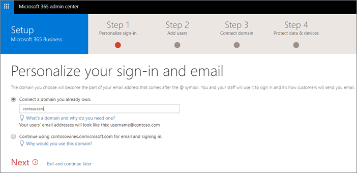

# Einrichten von Microsoft 365 Business im Setup-AssistentenSet up Microsoft 365 Business in the setup wizard

## Hinzufügen von Richtlinien für Domäne, Benutzer und einrichtenAdd your domain, users, and set up policies

Wenn Sie Microsoft 365 Business erwerben, haben Sie die Möglichkeit, eine Domäne zu verwenden, die Sie besitzen, oder einen Kauf während der [Anmeldung](sign-up.md).When you purchase Microsoft 365 Business, you have the option of using a domain you own, or buying one during the [sign-up](sign-up.md).

- Wenn Sie bei der Registrierung eine neue Domäne erworben haben, ist Ihre Domäne eingerichtet, und Sie können zum [Hinzufügen von Benutzern und Zuweisen von Lizenzen](#add-users-and-assign-licenses)umsteigen.If you purchased a new domain when you signed up, your domain is all set up and you can move to [Add users and assign licenses](#add-users-and-assign-licenses).

### Hinzufügen Ihrer Domäne zur Personalisierung der AnmeldungAdd your domain to personalize sign-in

1. Melden Sie sich mit ihren globalen Administratoranmeldeinformationen beim [Microsoft 365 Admin Center](https://admin.microsoft.com) an.Sign in to [Microsoft 365 admin center](https://admin.microsoft.com) by using your global admin credentials. 

2. Wählen Sie **Hinzufügen einer Domäne** oder **Hinzufügen von Benutzern** aus, um den Assistenten zu starten.Choose **Add a domain** or **Add users** to start the wizard.
    > [!IMPORTANT]
    > Wenn Sie während der Registrierung eine Domäne erworben haben, wird hier kein Domänen Schritt **Hinzufügen** angezeigt.If you purchased a domain during the sign-up, you will not see **Add a domain** step here. Wechseln Sie stattdessen zu [Benutzer hinzufügen](#add-users-and-assign-licenses) .Go to [Add users ](#add-users-and-assign-licenses) instead.

    
    
3. Geben Sie im Assistenten den Domänennamen ein, den Sie verwenden möchten (wie contoso.com).In the wizard, enter the domain name you want to use (like contoso.com).

    

    
4. Befolgen Sie die Schritte im Assistenten zum [Erstellen von DNS-Einträgen bei einem beliebigen DNS-Hostinganbieter für Office 365](https://docs.microsoft.com/office365/admin/get-help-with-domains/create-dns-records-at-any-dns-hosting-provider) , die ihre eigene Domäne verifizieren.Follow the steps in the wizard to [Create DNS records at any DNS hosting provider for Office 365](https://docs.microsoft.com/office365/admin/get-help-with-domains/create-dns-records-at-any-dns-hosting-provider) that verifies you own the domain. Wenn Sie Ihren Domänenhost kennen, lesen Sie auch die [hostspezifischen Anweisungen](https://docs.microsoft.com/office365/admin/get-help-with-domains/set-up-your-domain-host-specific-instructions).If you know your domain host, see also the [host specific instructions](https://docs.microsoft.com/office365/admin/get-help-with-domains/set-up-your-domain-host-specific-instructions).

    Wenn es sich bei Ihrem Hostinganbieter um einen GoDaddy oder einen anderen Host handelt, der mit der [Domäne Connect](https://docs.microsoft.com/office365/admin/get-help-with-domains/domain-connect)aktiviert ist, ist der Prozess einfach, und Sie werden automatisch aufgefordert, sich anzumelden und die Authentifizierung von Microsoft in Ihrem Namen zu ermöglichen:If your hosting provider is GoDaddy, or another host enabled with [domain connect](https://docs.microsoft.com/office365/admin/get-help-with-domains/domain-connect),the process is easy and you will be automatically asked to sign in and let Microsoft authenticate on your behalf:

    

### Hinzufügen von Benutzern und Zuweisen von LizenzenAdd users and assign licenses

Sie können Benutzer im Assistenten hinzufügen, Sie können aber auch später im Admin Center [Hinzufügen](add-users-m365b.md) .You can add users in the wizard, but you can also [add users later](add-users-m365b.md) in the admin center. Wenn Sie über einen lokalen Domänencontroller verfügen, können Sie außerdem Benutzer mit [Azure AD Connect](https://docs.microsoft.com/azure/active-directory/hybrid/how-to-connect-install-express)hinzufügen.Additionally, if you have a local domain controller, you can add users with [Azure AD Connect](https://docs.microsoft.com/azure/active-directory/hybrid/how-to-connect-install-express).

#### Hinzufügen von Benutzern im AssistentenAdd users in the wizard

Alle Benutzer, die Sie dem Assistenten hinzufügen, erhalten automatisch eine Microsoft 365 Business-Lizenz zugewiesen.Any users you add in the wizard get automatically assigned a Microsoft 365 Business license.

1. Wenn Ihr Microsoft 365 Business-Abonnement über vorhandene Benutzer verfügt (beispielsweise, wenn Sie Azure AD Connect verwendet haben), erhalten Sie eine Option, um Ihnen jetzt Lizenzen zuzuweisen.If your Microsoft 365 Business subscription has existing users (for example, if you used Azure AD Connect) , you get an option to assign licenses to them now. Fügen Sie die Lizenzen ebenfalls hinzu.Go ahead and add licenses to them as well.

3. Nachdem Sie die Benutzer hinzugefügt haben, erhalten Sie auch eine Option zum Freigeben von Anmeldeinformationen für die neuen Benutzer, die Sie hinzugefügt haben.After you have added the users, you will also get an option to share credentials with the new users you added. Sie können auswählen, ob Sie Sie ausdrucken, per e-Mail versenden oder herunterladen möchten.You can choose to print them out, email them, or download them.

4. Überspringen Sie die Migration von e-Mail-Nachrichten, und wählen Sie **weiter** auf Seite **e-Mails migrieren** .Skip migrating email messages and choose **Next** on **Migrate email messages** page. 

    Wenn Sie von einem anderen e-Mail-Anbieter wechseln und Ihre Daten später kopieren möchten, können Sie [e-Mails und Kontakte in Office 365 migrieren](https://support.office.com/article/a3e3bddb-582e-4133-8670-e61b9f58627e).If you are moving from another email provider and want to copy your data later, you can [Migrate email and contacts to Office 365](https://support.office.com/article/a3e3bddb-582e-4133-8670-e61b9f58627e).

### Verbinden Ihrer DomäneConnect your domain

> [!NOTE]
> Wenn Sie sich für die Verwendung der. onmicrosoft-Domäne entschieden oder Azure AD Connect zum Einrichten von Benutzern verwendet haben, wird dieser Schritt nicht angezeigt.If you chose to use the .onmicrosoft domain, or used Azure AD Connect to set up users, you will not see this step.
  
Zum Einrichten von Diensten müssen Sie einige Datensätze bei Ihrem DNS-Host oder Ihrer Domänenregistrierungsstelle aktualisieren.To set up services, you have to update some records at your DNS host or domain registrar.
  
1. Der Setup-Assistent erkennt normalerweise Ihre Registrierungsstelle und stellt einen Link zu Schritt-für-Schritt-Anweisungen zum Aktualisieren der NS-Einträge auf der Registrierungsstellen Website bereit.The setup wizard typically detects your registrar and gives you a link to step-by-step instructions for updating your NS records at the registrar website. Wenn dies nicht der Fall ist, ändern Sie Namen [Server, um Office 365 bei einer beliebigen Domänenregistrierungsstelle einzurichten](https://support.office.com/article/a8b487a9-2a45-4581-9dc4-5d28a47010a2).If it doesn't, [Change nameservers to set up Office 365 with any domain registrar](https://support.office.com/article/a8b487a9-2a45-4581-9dc4-5d28a47010a2). 

    - Wenn Sie über vorhandene DNS-Einträge verfügen, beispielsweise eine vorhandene Website, Ihr DNS-Host jedoch für die [Domäne Connect](https://docs.microsoft.com/office365/admin/get-help-with-domains/domain-connect)aktiviert ist, wählen Sie **für mich Datensätze hinzufügen**aus.If you have existing DNS records, for example an existing web site, but your DNS host is enabled for [domain connect](https://docs.microsoft.com/office365/admin/get-help-with-domains/domain-connect), choose **Add records for me**. 
    - Wenn Sie über vorhandene DNS-Einträge mit anderen DNS-Hosts verfügen (nicht für Domäne Connect aktiviert), sollten Sie Ihre eigenen DNS-Einträge verwalten, um sicherzustellen, dass die vorhandenen Dienste verbunden bleiben.If you have existing DNS records with other DNS hosts (not enabled for domain connect), you will want to manage your own DNS records to make sure the existing services stay connected. Weitere Informationen finden Sie unter [Domain Basics](https://docs.microsoft.com/office365/admin/get-help-with-domains/dns-basics) .See [domain basics](https://docs.microsoft.com/office365/admin/get-help-with-domains/dns-basics) for more info.

        

2. Führen Sie die Schritte im Assistenten aus, und e-Mail und andere Dienste werden für Sie eingerichtet.Follow the steps in the wizard and email and other services will be set up for you.

### Einrichten von Sicherheitsrichtlinien und GerätekonfigurationenSet up security policies and device configurations 

Die Richtlinien, die Sie im Assistenten eingerichtet haben, werden automatisch auf eine [Sicherheitsgruppe](https://docs.microsoft.com/office365/admin/create-groups/compare-groups#security-groups) mit dem Namen " *alle Benutzer*" angewendet.The policies you set up in the wizard are applied automatically to a [Security group](https://docs.microsoft.com/office365/admin/create-groups/compare-groups#security-groups) called *All Users*. Sie können auch weitere Gruppen zum Zuweisen von Richtlinien im Admin Center erstellen.You can also create additional groups to assign policies to in the admin center.

1. Wählen Sie auf der Seite zum **Schützen Ihrer Arbeitsdateien auf mobilen Geräten** standardmäßig die Option **Arbeitsdateien schützen, wenn Geräte verloren gehen oder gestohlen werden** .On the **Protect your work files on mobile devices** the option **Protect work files when devices are lost or stolen** is selected by default. Sie haben die Möglichkeit, die **Verwaltung der Benutzerzugriffe auf Office-Dateien auf mobilen Geräten**zu aktivieren, und dies wird empfohlen.You have an option to turn on **Manage how users access Office files on mobile devices**, and this is recommended.

    

     - Erweitern Sie **Protect work Files, wenn Geräte verloren gehen oder gestohlen werden** , um die [Standardwerte](protect-work-files-on-lost-or-stolen-device.md)anzuzeigen:Expand **Protect work files when devices are lost or stolen** to display the [default values](protect-work-files-on-lost-or-stolen-device.md):

        

    - Wählen Sie **verwalten, wie Benutzer auf Office-Dateien auf mobilen Geräten zugreifen** , und erweitern Sie diese, um die [Standardwerte](manage-user-access-on-mobile-devices.md)anzuzeigen.Select **Manage how users access Office files on mobile devices** and expand it to display the [default values](manage-user-access-on-mobile-devices.md). Es wird empfohlen, während des Setups die Standardwerte zu übernehmen, um Anwendungsrichtlinien für Android, IOS und Windows 10 zu erstellen, die für alle Benutzer gelten.We recommend that you accept the default values during setup to create application policies for Android, iOS, and Windows 10 that apply to all users. Nach Abschluss des Setups können Sie weitere Richtlinien erstellen.You can create more policies after setup completes.

        

2. Der letzte Schritt zum Schutz von Daten und Geräten ermöglicht Ihnen das Einrichten von Richtlinien für die Sicherung von Windows 10-Geräten.The last step on protect data and devices allows you to set up policies to secure Windows 10 devices. Diese Einstellungen werden automatisch angewendet, wenn Windows 10 eines Benutzers eine Verbindung mit Ihrer Organisation herstellt.These settings are applied automatically when a user's Windows 10 connects to your organization. Sie können **sichere Windows 10-Geräte** erweitern, um die [Standardwerte](secure-windows-10-devices.md)anzuzeigen und zu ändern.You can expand **Secure Windows 10 devices** to see and modify the [default values](secure-windows-10-devices.md).
3. Sie können auch festlegen, dass Office auf Windows 10-Geräten [automatisch installiert](install-office-on-windows-10-during-setup.md) wird.You can also choose to [automatically install Office](install-office-on-windows-10-during-setup.md) on Windows 10 devices.

    

## Bereitstellen von Office 365-Client-appsDeploy Office 365 client apps

Wenn Sie Office-Apps während der Einrichtung automatisch in installieren, werden die apps auf den Windows 10-Geräten installiert, sobald sich die Benutzer bei Azure AD von Ihren Windows-Geräten mit ihren Arbeits Anmeldeinformationen angemeldet haben.If you chose to automatically install Office apps in during the set up, the apps will install on the Windows 10 devices once the users have signed in to Azure AD from their Windows devices with their work credentials.
Informationen zum Installieren von Office auf mobilen IOS-oder Android-Geräten finden Sie unter [Einrichten von mobilen Geräten für Microsoft 365 Business-Benutzer](set-up-mobile-devices.md).To install Office on mobile iOS or Android devices, see [Set up mobile devices for Microsoft 365 Business users](set-up-mobile-devices.md).

Sie können Office auch einzeln installieren.You can also install Office individually. Anweisungen finden Sie unter [Installieren von Office auf einem PC oder Mac](https://support.office.com/article/4414eaaf-0478-48be-9c42-23adc4716658) .See [install Office on a PC or Mac](https://support.office.com/article/4414eaaf-0478-48be-9c42-23adc4716658) for instructions.
