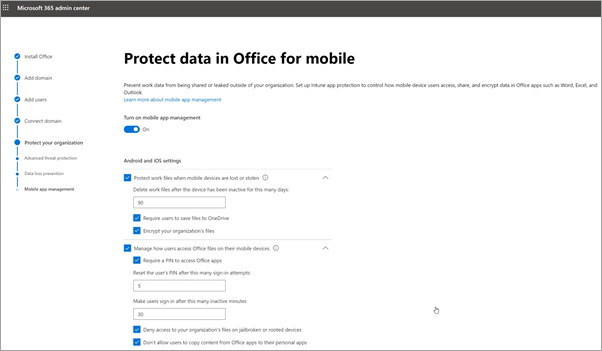

# Einrichten von Microsoft 365 Business Premium im Setup-Assistenten

In diesem Video sehen Sie eine Übersicht über das Microsoft 365 Business Premium-Setup.  

> [!VIDEO https://www.microsoft.com/videoplayer/embed/RE1FYSM] 

Wenn Sie dieses Video hilfreich fanden, sehen Sie sich bitte die [komplette Schulungsserie für kleine Unternehmen und jene, die neu bei Microsoft 365 sind](https://support.office.com/article/6ab4bbcd-79cf-4000-a0bd-d42ce4d12816), an.

## Hinzufügen von Richtlinien für Domäne, Benutzer und einrichten

Wenn Sie Microsoft 365 Business Premium erwerben, haben Sie die Möglichkeit, eine Domäne zu verwenden, die Sie besitzen oder die Sie während der [Anmeldung](sign-up.md)kaufen.

- Wenn Sie bei der Registrierung eine neue Domäne erworben haben, ist Ihre Domäne eingerichtet, und Sie können zum [Hinzufügen von Benutzern und Zuweisen von Lizenzen](#add-users-and-assign-licenses)umsteigen.

### Hinzufügen Ihrer Domäne zur Personalisierung der Anmeldung

1. Melden Sie sich mit ihren globalen Administratoranmeldeinformationen beim [Microsoft 365 Admin Center](https://admin.microsoft.com) an. 

2. Wählen Sie **Gehe zu Setup** aus, um den Assistenten zu starten.

    

3. Auf der Seite **Office-Apps installieren** können Sie optional die apps auf Ihrem eigenen Computer installieren.
    
4. Geben Sie im Schritt **Domäne hinzufügen** den Domänennamen ein, den Sie verwenden möchten (wie contoso.com).

    > [!IMPORTANT]
    > Wenn Sie während der Registrierung eine Domäne erworben haben, wird hier kein Domänen Schritt **Hinzufügen** angezeigt. Wechseln Sie stattdessen zu [Benutzer hinzufügen](#add-users-and-assign-licenses) .

    

    
4. Befolgen Sie die Schritte im Assistenten zum [Erstellen von DNS-Einträgen bei einem beliebigen DNS-Hostinganbieter für Office 365](https://docs.microsoft.com/office365/admin/get-help-with-domains/create-dns-records-at-any-dns-hosting-provider) , die ihre eigene Domäne verifizieren. Wenn Sie Ihren Domänenhost kennen, lesen Sie auch die [hostspezifischen Anweisungen](https://docs.microsoft.com/office365/admin/get-help-with-domains/set-up-your-domain-host-specific-instructions).

    Wenn Ihr Hosting-Anbieter GoDaddy oder ein anderer Host ist, der mit der [Domäne Connect](https://docs.microsoft.com/office365/admin/get-help-with-domains/domain-connect)aktiviert ist, ist der Prozess einfach, und Sie werden automatisch aufgefordert, sich anzumelden und Microsoft in Ihrem Namen authentifizieren zu lassen.

    

### Hinzufügen von Benutzern und Zuweisen von Lizenzen

Sie können Benutzer im Assistenten hinzufügen, Sie können aber auch später im Admin Center [Hinzufügen](add-users-m365b.md) . Wenn Sie über einen lokalen Domänencontroller verfügen, können Sie außerdem Benutzer mit [Azure AD Connect](https://docs.microsoft.com/azure/active-directory/hybrid/how-to-connect-install-express)hinzufügen.

#### Hinzufügen von Benutzern im Assistenten

Alle Benutzer, die Sie dem Assistenten hinzufügen, erhalten automatisch eine Microsoft 365 Business Premium-Lizenz zugewiesen.

1. Wenn Ihr Microsoft 365 Business Premium-Abonnement über vorhandene Benutzer verfügt (beispielsweise wenn Sie Azure AD Connect verwendet haben), erhalten Sie eine Option, um Ihnen jetzt Lizenzen zuzuweisen. Fügen Sie die Lizenzen ebenfalls hinzu.

2. Nachdem Sie die Benutzer hinzugefügt haben, erhalten Sie auch eine Option zum Freigeben von Anmeldeinformationen für die neuen Benutzer, die Sie hinzugefügt haben. Sie können auswählen, ob Sie Sie ausdrucken, per e-Mail versenden oder herunterladen möchten.

### Verbinden Ihrer Domäne

> [!NOTE]
> Wenn Sie sich für die Verwendung der. onmicrosoft-Domäne entschieden oder Azure AD Connect zum Einrichten von Benutzern verwendet haben, wird dieser Schritt nicht angezeigt.
  
Zum Einrichten von Diensten müssen Sie einige Datensätze bei Ihrem DNS-Host oder Ihrer Domänenregistrierungsstelle aktualisieren.
  
1. Der Setup-Assistent erkennt normalerweise Ihre Registrierungsstelle und stellt einen Link zu Schritt-für-Schritt-Anweisungen zum Aktualisieren der NS-Einträge auf der Registrierungsstellen Website bereit. Wenn dies nicht der Fall ist, ändern Sie Namen [Server, um Office 365 bei einer beliebigen Domänenregistrierungsstelle einzurichten](https://docs.microsoft.com/microsoft-365/admin/get-help-with-domains/change-nameservers-at-any-domain-registrar). 

    - Wenn Sie über vorhandene DNS-Einträge verfügen, beispielsweise eine vorhandene Website, Ihr DNS-Host jedoch für die [Domäne Connect](https://docs.microsoft.com/office365/admin/get-help-with-domains/domain-connect)aktiviert ist, wählen Sie **für mich Datensätze hinzufügen**aus. Übernehmen Sie auf der Seite **Wählen Sie Ihre Onlinedienste aus** alle Standardeinstellungen, und wählen Sie **weiter**aus, und klicken Sie auf der Seite Ihres DNS-Hosts auf **autorisieren** .
    - Wenn Sie über vorhandene DNS-Einträge mit anderen DNS-Hosts verfügen (nicht für Domäne Connect aktiviert), sollten Sie Ihre eigenen DNS-Einträge verwalten, um sicherzustellen, dass die vorhandenen Dienste verbunden bleiben. Weitere Informationen finden Sie unter [Domain Basics](https://docs.microsoft.com/office365/admin/get-help-with-domains/dns-basics) .

        

2. Führen Sie die Schritte im Assistenten aus, und e-Mail und andere Dienste werden für Sie eingerichtet.

### Schützen Ihrer Organisation 

Die Richtlinien, die Sie im Assistenten eingerichtet haben, werden automatisch auf eine [Sicherheitsgruppe](https://docs.microsoft.com/office365/admin/create-groups/compare-groups#security-groups) mit dem Namen " *alle Benutzer*" angewendet. Sie können auch weitere Gruppen zum Zuweisen von Richtlinien im Admin Center erstellen.

1. Um den **Schutz vor fortgeschrittenen Cyber-Bedrohungen zu verbessern**, wird empfohlen, dass Sie die Standardeinstellungen akzeptieren, damit [Office 365 Advance Threat Protection](https://docs.microsoft.com/microsoft-365/security/office-365-security/office-365-atp) Scandateien und Links in Office-Apps.

    

2. Übernehmen Sie auf der Seite " **Lecks von vertraulichen Daten verhindern** " die Standardeinstellungen, um die Office 365 Verhinderung von Datenverlust (Data Loss Prevention, DLP) zum Nachverfolgen vertraulicher Daten in Office-Apps zu aktivieren und die unbeabsichtigte Freigabe dieser außerhalb Ihrer Organisation zu verhindern.

3. Lassen Sie Mobile App Verwaltung auf der Seite **Daten in Office für Mobile schützen** auf, erweitern Sie die Einstellungen, und überprüfen Sie Sie, und wählen Sie dann **Mobile App Verwaltungsrichtlinie erstellen**aus.

    

## Sichere Windows 10-PCs

Wählen Sie im linken Navigationsbereich die Option **Setup** aus, und wählen Sie dann unter **Anmeldung und Sicherheit** **die Option Sichern Ihrer Windows 10-Computer**aus. Wählen Sie **Ansicht** für erste Schritte aus. Ausführliche Anweisungen finden Sie unter [Sichern Ihrer Windows 10-Computer](secure-win-10-pcs.md) .

## Bereitstellen von Office 365-Client-apps

Wenn Sie während des Setups die automatische Installation von Office-Apps ausgewählt haben, werden die apps auf den Windows 10-Geräten installiert, sobald sich die Benutzer bei Azure AD von Ihren Windows-Geräten unter Verwendung ihrer Arbeits Anmeldeinformationen angemeldet haben.

Informationen zum Installieren von Office auf mobilen IOS-oder Android-Geräten finden Sie unter [Einrichten von mobilen Geräten für Microsoft 365 Business Premium-Benutzer](set-up-mobile-devices.md).

Sie können Office auch einzeln installieren. Anweisungen finden Sie unter [Installieren von Office auf einem PC oder Mac](https://support.office.com/article/4414eaaf-0478-48be-9c42-23adc4716658) .

## Siehe auch

[Microsoft 365 für Unternehmen-Schulungsvideos](https://support.office.com/article/6ab4bbcd-79cf-4000-a0bd-d42ce4d12816)
