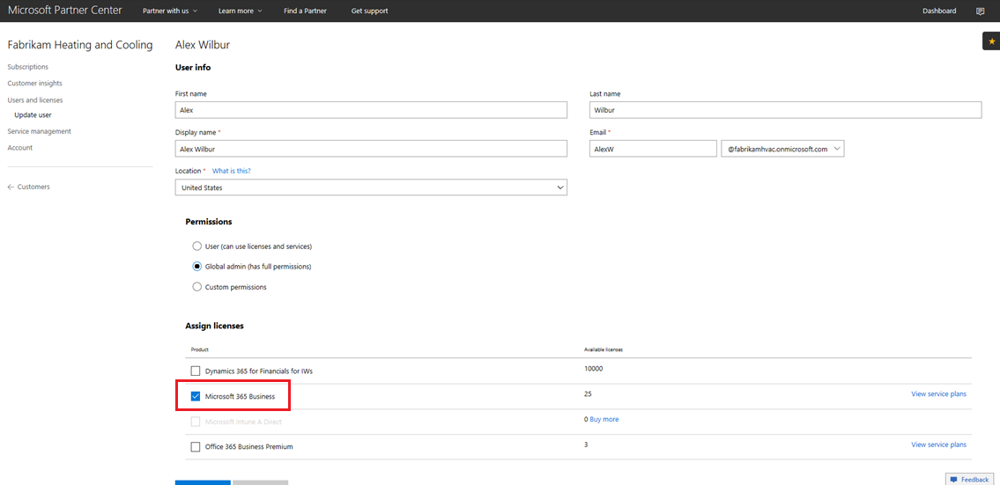

# Übertragen eines Microsoft 365 Business-CSP-Abonnements

Wenn Sie über ein Microsoft 365 Business-Vorschau-CSP-Abonnement verfügen, lesen Sie dieses Handbuch, um zu erfahren, wie Sie Ihr vorhandenes Vorschau-Abonnement auf Microsoft 365 Business GA (allgemeine Verfügbarkeit) umstellen können.

**So wechseln Sie von einem Vorschau-Abonnement auf ein GA**

1. Melden Sie sich beim <a href="https://partnercenter.microsoft.com" target="_blank">Partner Center</a> an.
2. Wählen Sie im Dashboard **Kunden** aus und suchen Sie dann nach dem Firmennamen und wählen Sie ihn aus.

    Die Abonnements für Ihr Unternehmen werden aufgeführt.

    
    
3. Wählen Sie auf der Seite **Abonnements** des Unternehmens **Abonnement hinzufügen**aus.
4. Wählen Sie auf der Seite **Neues Abonnement** die Option **Small Business** aus, und wählen Sie dann **Microsoft 365 Business** aus der Liste aus.
5. Fügen Sie die Anzahl der Lizenzen hinzu und wählen Sie dann **Weiter: Überprüfung** aus, um das Abonnement zu überprüfen. Wählen Sie **Übermitteln** aus.

    

    Das **lizenzbasierte Abonnement** zeigt **Microsoft 365 Business-Vorschau** und **Microsoft 365 Business** an. Sie können das Vorschau-Abonnement als nächstes anhalten.

6. Wählen Sie **Microsoft 365 Business-Vorschau** aus.
7. Wählen Sie auf der Seite **Microsoft 365 Business Preview** die Option **angehalten** aus, um das Vorschau Abonnement anhalten zu können.

    

8. Wählen Sie zur Bestätigung **Übermitteln** aus.

    Bestätigen Sie auf der Seite **Abonnements** , dass der Status **Microsoft 365 Business Preview** **angehalten**angezeigt wird.

    

9. Optional können Sie auch den Lizenzvertrag überprüfen. Gehen Sie hierzu folgendermaßen vor:
    1. Wählen Sie **Benutzer und Lizenzen** aus der Unternehmensseite **Abonnements** aus.
    2. Wählen Sie auf der Seite **Benutzer und Lizenzen** einen Benutzer aus.
    3. Überprüfen Sie auf der Seite des Benutzers im Abschnitt **Lizenzen zuweisen** , und bestätigen Sie, dass **Microsoft 365 Business**angezeigt wird.

        

## Auswirkungen auf Kunden und Benutzer während und nach der Umstellung

Es gibt keine Auswirkungen auf Kunden und Benutzer während des Übergangs und nach dem Übergang.

## Auswirkungen auf Kunden, die nicht wechseln

In der folgende Tabelle werden die Auswirkungen auf Kunden zusammengefasst, die nicht von einem Microsoft 365 Business-Vorschau-Abonnement auf ein Microsoft 365 Business-Abonnement wechseln.

|       | T-0 to T+30     | T+30 to T+60 | T+60 to T+120 | Über T+120  |
|-------|-----------------|--------------|---------------|---------------|
| **Status** | Karenzzeit | Abgelaufen      | Deaktiviert      | Nicht Bereitgestellt |
| **Auswirkungen auf den Dienst**                                                        |
| **Microsoft 365 Business-Verwaltungsportal** | Die Funktionalität wird dadurch nicht beeinträchtigt | Die Funktionalität wird dadurch nicht beeinträchtigt | Kann Benutzer hinzufügen oder entfernen, Abonnements erwerben.  Lizenzen können nicht zugewiesen/widerrufen werden. | Abonnement des Kunden und alle Daten werden gelöscht. Administrator kann andere kostenpflichtige Abonnements verwalten. |
| **Office-Apps**                         | Keine Auswirkungen für Endbenutzer | Keine Auswirkungen für Endbenutzer | Office wechselt in den Modus mit eingeschränkter Funktionalität.  Benutzer können nur Dateien anzeigen. | Office wechselt in den Modus mit eingeschränkter Funktionalität.  Benutzer können nur Dateien anzeigen. |
| **Cloud-Dienste (SharePoint Online, Exchange Online, Skype, Teams und mehr)** | Keine Auswirkungen für Endbenutzer | Keine Auswirkungen für Endbenutzer | Endbenutzer und Administratoren haben keinen Zugriff auf Daten in der Cloud. | Abonnement des Kunden und alle Daten werden gelöscht. |
| **EM+S-Komponenten** | Keine Auswirkung für den Administrator  Keine Auswirkungen für Endbenutzer | Keine Auswirkung für den Administrator  Keine Auswirkungen für Endbenutzer | Die Funktion wird nicht mehr erzwungen.  Weitere Informationen finden Sie unter [Mobile device impacts upon subscription expiration](#mobile-device-impacts-upon-subscription-expiration) und [Windows 10 PC impacts upon subscription expiration](#windows-10-pc-impacts-upon-subscription-expiration). | Die Funktion wird nicht mehr erzwungen.  Weitere Informationen finden Sie unter [Mobile device impacts upon subscription expiration](#mobile-device-impacts-upon-subscription-expiration) und [Windows 10 PC impacts upon subscription expiration](#windows-10-pc-impacts-upon-subscription-expiration). |
| **Windows 10 Business** | Keine Auswirkung für den Administrator  Keine Auswirkungen für Endbenutzer | Keine Auswirkung für den Administrator  Keine Auswirkungen für Endbenutzer | Die Funktion wird nicht mehr erzwungen.  Weitere Informationen finden Sie unter [Mobile device impacts upon subscription expiration](#mobile-device-impacts-upon-subscription-expiration) und [Windows 10 PC impacts upon subscription expiration](#windows-10-pc-impacts-upon-subscription-expiration). | Die Funktion wird nicht mehr erzwungen.  Weitere Informationen finden Sie unter [Mobile device impacts upon subscription expiration](#mobile-device-impacts-upon-subscription-expiration) und [Windows 10 PC impacts upon subscription expiration](#windows-10-pc-impacts-upon-subscription-expiration). |
| **Azure AD-Anmeldung auf einem Windows10-PC** | Keine Auswirkung für den Administrator  Keine Auswirkungen für Endbenutzer | Keine Auswirkung für den Administrator  Keine Auswirkungen für Endbenutzer | Keine Auswirkung für den Administrator  Keine Auswirkungen für Endbenutzer | Nachdem der Mandant gelöscht wurde, kann sich ein Benutzer nur mit lokalen Anmeldeinformationen anmelden. Erstellen Sie ein neues Abbild des Geräts, wenn keine lokalen Anmeldeinformationen vorhanden sind. |

## Auswirkungen auf Mobilgeräte nach Ablauf des Abonnements

In der folgenden Tabelle werden die Auswirkungen auf die APP-Verwaltungsrichtlinien auf mobilen Geräten zusammengefasst.

|                            | Vollständig lizenziert                      | T+60 Tage nach Ablauf          |
|----------------------------|------------------------------------------------|------------------------------------|
| **Löschen Sie Arbeitsdateien von einem inaktiven Gerät** | Arbeitsdateien werden nach ausgewählten Tagen entfernt | Arbeitsdateien bleiben auf persönlichen Mobilgeräten des Benutzers erhalten |
| **Erzwingen, dass Benutzer alle Dateien auf OneDrive for Business speichern** | Arbeitsdateien können nur auf OneDrive for Business gespeichert werden | Arbeitsdateien können überall gespeichert werden |
| **Verschlüsseln von Arbeitsdateien** | Arbeitsdateien werden verschlüsselt. | Arbeitsdateien werden nicht mehr verschlüsselt.  Sicherheitsrichtlinien und Office-Daten für Apps werden entfernt. |
| **Erfordert PIN oder Fingerabdruck für den Zugriff auf Office-Apps** | Eingeschränkter Zugriff auf Apps | Keine Beschränkung für den Zugriff auf App-Ebene |
| **Zurücksetzen der PIN, wenn die Anmeldung fehlschlägt** | Eingeschränkter Zugriff auf Apps | Keine Beschränkung für den Zugriff auf App-Ebene |
| **Erfordert, dass Benutzer sich erneut anmelden, wenn Office-Apps sich im Leerlauf befunden haben** | Anmeldung erforderlich | Keine Anmeldung erforderlich |
| **Verweigern des Zugriffs auf Arbeitsdateien auf gehackten Geräten oder Geräten mit Nutzungsbeschränkungen** | Auf Arbeitsdateien kann nicht auf jailbroken/verwurzelten Geräten zugegriffen werden | Zugriffs auf Arbeitsdateien auf gehackten Geräten oder Geräten mit Nutzungsbeschränkungen ist möglich |
| **Benutzern ermöglichen, Inhalte von Office-Apps auf persönliche Apps zu kopieren.** | Kopieren/Einfügen beschränkt auf Apps, die Teil des Microsoft 365 Business-Abonnements sind | Kopieren und Einfügen für alle Apps verfügbar |

## Auswirkungen auf Windows 10 PC nach Ablauf des Abonnements

In der folgende Tabelle werden die Auswirkungen auf Windows10-Geräte-Konfigurationsrichtlinien zusammengefasst.

|                            | Vollständig lizenziert                      | T+60 Tage nach Ablauf          |
|----------------------------|------------------------------------------------|------------------------------------|
| **Schützt PCs vor Bedrohungen mithilfe von Windows Defender** | Aktivieren/Deaktivieren liegt außerhalb der Benutzersteuerung | Benutzer kann Windows Defender auf dem Windows 10-PC aktivieren/deaktivieren |
| **Schützt PCs vor webbasierten Bedrohungen in Microsoft Edge** | PC-Schutz in Microsoft Edge | Benutzer kann PC-Schutz in Microsoft Edge aktivieren/deaktivieren |
| **Ausschalten des Gerätebildschirms im Leerlauf** | Der Administrator legt Zeitlimitrichtlinien für Bildschirmtimeout fest | Bildschirmtimeout kann durch Endbenutzer konfiguriert werden |
| **Ermöglicht Benutzern den Download von Apps aus dem Microsoft Store** | Der Administrator legt fest, ob ein Benutzer Apps aus dem Microsoft Store herunterladen kann | Benutzer kann Apps jederzeit aus dem Microsoft Store herunterladen |
| **Ermöglicht Benutzern den Zugriff auf Cortana** | Administrator definiert die Richtlinie des Benutzerzugriffs auf Cortana | Anwendergerät schaltet Cortana ein/aus |
| **Benutzer können Tipps und Werbung von Microsoft erhalten** | Der Administrator definiert die Richtlinie, ob Benutzer Tipps und Werbung von Microsoft erhalten | Benutzer kann Tipps und Ankündigungen von Microsoft an-und ausschalten |
| **Benutzer können Inhalte von Office-Apps auf persönliche Apps kopieren** | Der Administrator definiert Richtlinien, um Windows 10-Geräte auf dem neuesten Stand zu halten. | Benutzer können entscheiden, wann Windows aktualisiert werden soll |
