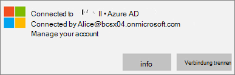

# Überprüfen der Einstellungen für den App-Schutz auf Windows 10-PCs

## Sicherstellen, dass Benutzer keine Unternehmensdaten in persönliche Dateien auf Unternehmensgeräten kopieren können

Nachdem Sie [App-Schutzrichtlinien eingerichtet haben](protection-settings-for-windows-10-devices.md), kann es einige Stunden dauern, bis die Richtlinie für die Geräte der Benutzer wirksam wird. Wenn Sie das **Kopieren von Unternehmensdaten in persönliche Dateien durch Benutzer verhindern aktiviert haben und Sie zum Speichern von Arbeitsdateien in OneDrive für Unternehmen** Einstellung für unternehmenseigene Geräte zwingen, können Sie dies auf dem Gerät des Benutzers überprüfen, nachdem **Sie eine Verbindung** mit Azure AD hergestellt und sich angemeldet haben. 
  
 **Überprüfen der Verbindungseinstellungen**
  
1. Nachdem Sie sich mit Microsoft 365 Business Premium-Anmeldeinformationen angemeldet haben und eine Verbindung mit Azure AD hergestellt haben, wie unter [Einrichten von Windows-Geräten für Microsoft 365 Business Premium-Benutzer](set-up-windows-devices.md)beschrieben, wechseln Sie zu **Windows-Einstellungen** \> - **Konten** \> **Zugriff auf Arbeit oder Schule**. Choose **Connected to \<tenant name\> Azure AD**, and then choose **Info**.
    
    
  
2. Auf der Seite **verwaltet nach** \<Mandantenname\> werden die **Verbindungsinformationen** angezeigt, die eine **Verwaltungs Server Adresse** enthalten, wie in der folgenden Abbildung dargestellt. 
    
    
  
 **Sicherstellen, dass keine Unternehmensdaten in eine nicht verwaltete app eingefügt werden können**
  
1. Öffnen Sie Outlook 2016, das von Microsoft 365 Business Premium installiert wurde.
    
2. Öffnen Sie eine E-Mail, und kopieren Sie einige Inhalt daraus.
    
    Öffnen Sie den Editor, und versuchen Sie, den Inhalt einzufügen.
    
    Sie erhalten eine Fehlermeldung, die besagt, dass die APP nicht auf Inhalte zugreifen kann.
    
    
  
    Sie können den gleichen Inhalt jedoch in Word 2016 einfügen.
    
## Sicherstellen, dass Benutzer keine Unternehmensdaten in persönliche Dateien auf persönlichen Geräten kopieren können

 **Überprüfen der Verbindungseinstellungen**
  
1. Wechseln Sie auf Ihrem persönlichen Windows 10-Gerät, in dem Sie als lokaler Benutzer angemeldet sind, zu **Windows-Einstellungen**, und klicken oder tippen Sie auf **Konten** \> **Zugriff für Arbeit oder Schule**.
    
2. Klicken Sie unter **Auf Arbeits- oder Schulkonto zugreifen** auf **Verbinden**.
    
3. Geben Sie Ihre Anmeldeinformationen für Microsoft 365 Business Premium in das **Dialogfeld** \> Einrichten einer Geschäfts-oder Schulkonto **Anmeldung**ein.
    
4. Wählen Sie auf der Seite **Auf Arbeits- oder Schulkonto zugreifen** die Option **Geschäfts-, Schul- oder Unikonto** und dann **Informationen** aus.
    
    
  
5. Auf der Seite **Access work oder School** können Sie die **Verbindungsinformationen** sehen, die eine **Verwaltungs Server Adresse** enthalten, wie in der folgenden Abbildung dargestellt, und enthält die Wörter *WIP* und *MAM* in. 
    
    
  
 **Sicherstellen, dass keine Unternehmensdaten in eine nicht verwaltete app eingefügt werden können**
  
1. Öffnen Sie Outlook 2016, und fügen Sie Ihr Microsoft 365 Business Premium-Konto bei Bedarf hinzu, und melden Sie sich mit Ihren Microsoft 365 Business Premium-Anmeldeinformationen an.
    
2. Öffnen Sie eine E-Mail, und kopieren Sie einige Inhalt daraus.
    
    Öffnen Sie den Editor, und versuchen Sie, den Inhalt einzufügen.
    
    Sie erhalten eine Fehlermeldung, dass besagt, dass APP nicht auf Inhalte zugreifen kann.
    
    
  
    Sie können den gleichen Inhalt jedoch in Word 2016 einfügen.
    

