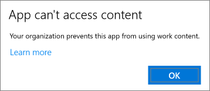

# Überprüfen der Einstellungen für den App-Schutz auf Windows 10-PCs

## Sicherstellen, dass Benutzer keine Unternehmensdaten in persönliche Dateien auf Unternehmensgeräten kopieren können

Nachdem Sie [App-Schutzrichtlinien eingerichtet haben](protection-settings-for-windows-10-devices.md), kann es einige Stunden dauern, bis die Richtlinie für die Geräte der Benutzer wirksam wird. Wenn Sie  die Einstellung Benutzer am Kopieren von Unternehmensdaten in persönliche Dateien hindern aktiviert haben und sie zwingen, Arbeitsdateien auf **OneDrive for #A0** für Geräte im Besitz des Unternehmens zu speichern, können Sie dies auf dem Gerät des Benutzers überprüfen, nachdem sie mit Azure AD verbunden und angemeldet sind. 
  
 **Überprüfen der Verbindungseinstellungen**
  
1. Nachdem Sie sich mit Microsoft 365 Business Premium-Anmeldeinformationen angemeldet haben und eine Verbindung mit Azure AD hergestellt haben, wie unter Einrichten von Windows-Geräten für [Microsoft 365 Business Premium-Benutzer](set-up-windows-devices.md)beschrieben, wechseln Sie zu **Windows Settings** \> **Accounts** \> **Access work or school**. Wählen **Sie Verbunden mit Azure \<tenant name\> AD** aus, und wählen Sie dann **Info aus.**
    
    
  
2. Auf der **Seite Verwaltet nach** sehen Sie die Verbindungsinformationen, die eine \<tenant name\> **Verwaltungsserveradresse** wie die in der folgenden Abbildung gezeigte  enthalten. 
    
    
  
 **Überprüfen, ob Sie Keine Unternehmensdaten in eine nicht verwaltete App einfügen können**
  
1. Öffnen Sie Outlook 2016, das von Microsoft 365 Business Premium installiert wurde.
    
2. Öffnen Sie eine E-Mail, und kopieren Sie einige Inhalt daraus.
    
    Öffnen Sie den Editor, und versuchen Sie, den Inhalt einzufügen.
    
    Sie erhalten eine Fehlermeldung, die besagt, dass die App nicht auf Inhalte zugreifen kann.
    
    
  
    Sie können den gleichen Inhalt jedoch in Word 2016 einfügen.
    
## Sicherstellen, dass Benutzer keine Unternehmensdaten in persönliche Dateien auf persönlichen Geräten kopieren können

 **Überprüfen der Verbindungseinstellungen**
  
1. Wechseln Sie auf Ihrem persönlichen Windows 10-Gerät, auf dem Sie als lokaler Benutzer angemeldet sind, zu Windows-Einstellungen, und klicken oder tippen Sie auf **KontenZugriff** auf Arbeit oder \> **Schule**.
    
2. Klicken Sie unter **Auf Arbeits- oder Schulkonto zugreifen** auf **Verbinden**.
    
3. Geben Sie Ihre Microsoft 365 Business Premium-Anmeldeinformationen im Dialogfeld Einrichten eines Geschäfts- oder **Schulkontos** \> **anmelden ein.**
    
4. Wählen Sie auf der Seite **Auf Arbeits- oder Schulkonto zugreifen** die Option **Geschäfts-, Schul- oder Unikonto** und dann **Informationen** aus.
    
    
  
5. Auf der **Seite Arbeits-** oder Schulzugriff sehen Sie die Verbindungsinformationen, die eine  **Verwaltungsserveradresse** wie in der folgenden Abbildung enthalten, und die Wörter *Wip* und *mam* enthalten. 
    
    
  
 **Überprüfen, ob Sie Keine Unternehmensdaten in eine nicht verwaltete App einfügen können**
  
1. Öffnen Sie Outlook 2016, und fügen Sie bei Bedarf Ihr Microsoft 365 Business Premium-Konto hinzu, und melden Sie sich mit Ihren Microsoft 365 Business Premium-Anmeldeinformationen an.
    
2. Öffnen Sie eine E-Mail, und kopieren Sie einige Inhalt daraus.
    
    Öffnen Sie den Editor, und versuchen Sie, den Inhalt einzufügen.
    
    Sie erhalten eine Fehlermeldung, die besagt, dass App nicht auf Inhalte zugreifen kann.
    
    
  
    Sie können den gleichen Inhalt jedoch in Word 2016 einfügen.
    

