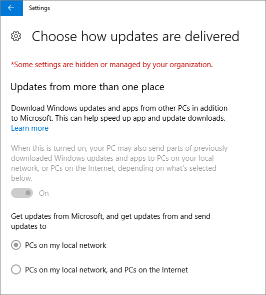

# Überprüfen von Geräteschutzeinstellungen auf Windows 10-PCsValidate device protection settings on Windows 10 PCs

## Sicherstellen, dass Windows 10-Geräterichtlinien festgelegt sindVerify that Windows 10 device policies are set

Nachdem Sie [Geräterichtlinien eingerichtet haben](protection-settings-for-windows-10-pcs.md), kann es einige Stunden dauern, bis die jeweilige Richtlinie auf den Geräten der Benutzer in Kraft tritt.After you [set up devices policies](protection-settings-for-windows-10-pcs.md), it may take up to a few hours for the policy to take effect on users' devices. Sie können bestätigen, dass die Richtlinien in Kraft getreten sind, indem Sie sich auf den Geräten der Benutzer die verschiedenen Bildschirme der Windows-Einstellungen ansehen.You can confirm that the policies took effect by looking at various Windows Settings screens on the users' devices. Da die Benutzer nicht in der Lage sind, die Antivirus-Einstellungen für Windows Update und Windows Defender auf Ihren Windows 10-Geräten zu ändern, werden viele Optionen abgeblendet.Because the users won't be able to modify the Windows Update and Windows Defender Antivirus settings on their Windows 10 devices, many options will be grayed out.
  
1. Wechseln Sie **zu Einstellungen** \> **Update &amp; Security** \> **Windows Update** \> - **Neustartoptionen** , und vergewissern Sie sich, dass alle Einstellungen abgeblendet sind.Go to **Settings** \> **Update &amp; security** \> **Windows Update** \> **Restart options** and confirm that all settings are grayed out. 
    
    
  
2. Wechseln Sie **zu Einstellungen** \> **Update &amp; Security** \> **Windows Update** \> **Erweiterte Optionen** , und vergewissern Sie sich, dass alle Einstellungen abgeblendet sind.Go to **Settings** \> **Update &amp; security** \> **Windows Update** \> **Advanced options** and confirm that all settings are grayed out. 
    
    
  
3. Go to **Settings** \> **Update &amp; security** \> **Windows Update** \> **Advanced options** \> **Choose how updates are delivered**.Go to **Settings** \> **Update &amp; security** \> **Windows Update** \> **Advanced options** \> **Choose how updates are delivered**.
    
    Vergewissern Sie sich, dass die Nachricht (in rot) angezeigt wird, dass einige Einstellungen von Ihrer Organisation ausgeblendet oder verwaltet werden und alle Optionen abgeblendet sind.Confirm that you can see the message (in red) that some settings are hidden or managed by your organization, and all the options are grayed out.
    
    
  
4. To open the Windows Defender Security Center, go to **Settings** \> **Update &amp; security** \> **Windows Defender** \> click **Open Windows Defender Security Center** \> **Virus &amp; thread protection** \> **Virus &amp; threat protection settings**.To open the Windows Defender Security Center, go to **Settings** \> **Update &amp; security** \> **Windows Defender** \> click **Open Windows Defender Security Center** \> **Virus &amp; thread protection** \> **Virus &amp; threat protection settings**. 
    
5. Stellen Sie sicher, dass alle Optionen abgeblendet sind.Verify that all options are grayed out. 
    
    
  
## Verwandte ThemenRelated Topics

[Microsoft 365 Business-Dokumentation und -RessourcenMicrosoft 365 Business documentation and resources](https://go.microsoft.com/fwlink/p/?linkid=853701)
  
[Erste Schritte mit Microsoft 365 BusinessGet started with Microsoft 365 Business](microsoft-365-business-overview.md)
  
[Verwalten von Microsoft 365 BusinessManage Microsoft 365 Business](manage.md)
  
[Festlegen von Geräteschutzeinstellungen für Windows 10-PCsSet device configurations for Windows 10 PCs](protection-settings-for-windows-10-pcs.md)
  

