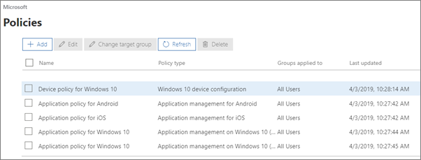

# Anzeigen und Verwalten von Richtlinien und Geräten

Dieser Artikel bezieht sich auf Microsoft 365 Business Premium.

## Anzeigen und Bearbeiten von Geräterichtlinien

1.  Wechseln Sie zum Admin Center unter <a href="https://go.microsoft.com/fwlink/p/?linkid=837890" target="_blank">https://admin.microsoft.com</a>.
2. Wählen Sie im linken Navigationsbereich **Geräte** \> **Richtlinien**aus.

    Auf dieser Seite können Sie eine Zielgruppe erstellen, bearbeiten, ändern oder eine Richtlinie löschen.

    
  
## Anzeigen und Verwalten von Geräten

1. Wählen Sie im linken Navigationsbereich **Geräte** \> **Verwalten**aus. 
    
    Auf dieser Seite können Sie ein oder mehrere Geräte auswählen und Unternehmensdaten entfernen. Windows 10-Geräte, für die Sie Geräteschutzeinstellungen festgelegt haben, können Sie bei Bedarf auch auf die Werkseinstellungen zurücksetzen.
  
   

