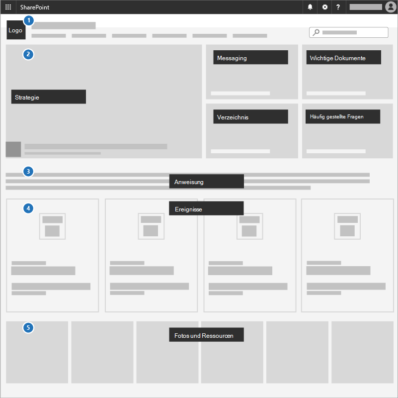

# Erstellen einer Kommunikationswebsite

Eine großartige Möglichkeit, Prioritäten zu kommunizieren, Strategiedokumente gemeinsam zu nutzen und bevorstehende Ereignisse zu hervorheben, ist die Verwendung einer Kommunikationswebsite in SharePoint. Kommunikationswebsites sind für die gemeinsame Nutzung von Dingen in Ihrem gesamten Unternehmen oder Ihrer Gesamten Kampagne. Es ist Ihre interne Strategiewebsite.

## Bewährte Methoden

Fügen Sie die folgenden Elemente in Ihre Kommunikationswebsite ein:

1. Fügen Sie Ihr Logo und Ihre Farben als Kopfzeilenbild und Design hinzu.
2. Führen Sie mit Ihrer Strategie, Nachricht, wichtigen Dokumenten, einem Verzeichnis und häufig gestellten Fragen in einem **Hero-Web part.**
3. Schließen Sie eine CEO- oder Kandidaten-Anweisung in das Team in ein **Text-Web part ein.**
4. Fügen Sie einem **Event-Web part** Ereignisse hinzu, damit jeder sehen kann, was kommt.
5. Hinzufügen von Fotos, die Benutzer verwenden oder teilen können, zu einem **Bilderkatalog-Web part**.

## Infographic: Create a Communications Site infographic

Die folgenden Links für PowerPoint und PDF können im Tabloidformat heruntergeladen und gedruckt werden (auch als Ledger, 11 x 17 oder A3 bekannt).

[PDF](downloads/M365CampaignsCreateCommunicationSite.pdf)  |  [PowerPoint](downloads/M365CampaignsCreateCommunicationSite.pptx)

## Einrichtung

1. Melden Sie sich bei https://Office.com an.
2. Wählen Sie in der oberen linken Ecke der Seite das Symbol für das App-Startfeld aus, und wählen Sie dann die **Kachel SharePoint** aus. Wenn die **SharePoint-Kachel** nicht angezeigt wird, klicken Sie auf die Kachel **Websites** oder **Alle,** wenn SharePoint nicht sichtbar ist.
3. Klicken Sie oben auf der SharePoint-Startseite auf **+ Website erstellen,** und wählen Sie die Option **Kommunikationswebsite** aus.

Erfahren Sie [mehr über Kommunikationswebsites](https://support.office.com/article/What-is-a-SharePoint-communication-site-94A33429-E580-45C3-A090-5512A8070732) und das Erstellen [einer Kommunikationswebsite in SharePoint Online.](https://support.microsoft.com/en-us/office/create-a-communication-site-in-sharepoint-online-7fb44b20-a72f-4d2c-9173-fc8f59ba50eb)

## Administratoreinstellungen

Wenn der Link **+** Website erstellen nicht zu sehen ist, ist die Self-Service-Websiteerstellung in Microsoft 365 möglicherweise nicht verfügbar. Wenden Sie sich zum Erstellen einer Teamwebsite an die Person, die Microsoft 365 in Ihrer Organisation verwaltet. Wenn Sie ein Microsoft 365-Administrator sind, lesen Sie Verwalten der Websiteerstellung [in SharePoint Online,](/sharepoint/manage-site-creation) um die Self-Service-Websiteerstellung für Ihre Organisation zu aktivieren, oder Verwalten von Websites im neuen [SharePoint Admin Center](/sharepoint/manage-sites-in-new-admin-center) zum Erstellen einer Website aus dem SharePoint Online Admin Center.