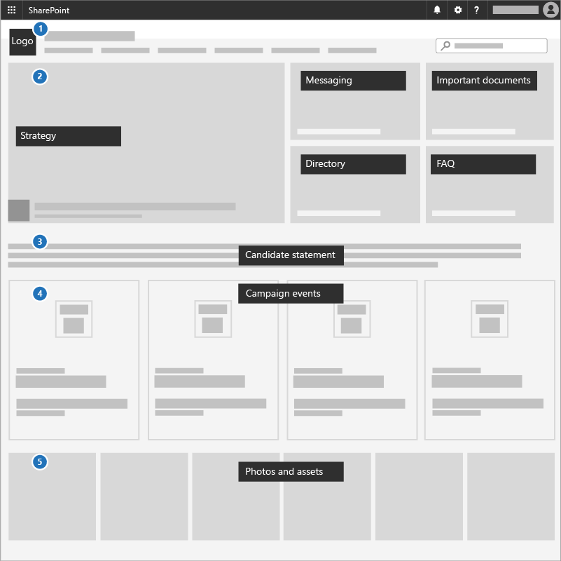

# Erstellen einer Kommunikationswebsite für Ihre KampagneCreate a communications site for your campaign

Eine hervorragende Möglichkeit, Prioritäten zu kommunizieren, Strategiedokumente freizugeben und bevorstehende Ereignisse hervorzuheben, ist die Verwendung einer Kommunikationswebsite in SharePoint.A great way to communicate priorities, share strategy documents, and highlight upcoming events is to use a communications site in SharePoint. Kommunikationswebsites sind für die gemeinsame Nutzung von Dingen über die gesamte Kampagne hinweg. Es handelt sich um Ihre interne Kampagnenwebsite.Communications sites are for sharing things broadly across your whole campaign; it's your internal campaign site.

## Bewährte MethodenBest practices

Fügen Sie die folgenden Elemente auf Ihrer Kommunikationswebsite ein:Include the following elements in your Communications site:

1. Hinzufügen Ihres Kampagnenlogos und der Farben als Kopfzeilen Bild und-DesignAdd your campaign logo and colors as a header image and theme
2. Führen Sie mit ihrer Strategie, Nachrichten, wichtigen Dokumenten, einem Verzeichnis und häufig gestellten FAQ in einem **Hero-Webpart**.Lead with your strategy, message, important documents, a directory, and FAQ in a **Hero web part**.
3. Fügen Sie eine Kandidaten-Anweisung in das Team in einem **Text Webpart**ein.Include a candidate statement to the team in a **Text web part**.
4. Hinzufügen von Kampagnenereignissen zu einem **Event-Webpart** , damit jeder sehen kann, was kommt.Add campaign events to an **Events web part** so everyone can see what's coming up.
5. Fügen Sie Fotos hinzu, die Benutzer in einem **Bildgalerie-Webpart**verwenden oder freigeben können.Add photos that people can use or share to an **Image gallery web part**.

## Infografik: Erstellen einer Infografik für eine KommunikationswebsiteInfographic: Create a Communications Site infographic 
Die folgenden Links für PowerPoint und PDF können heruntergeladen und im Tabloid-Format (auch Ledger, 11 x 17 oder a3 genannt) gedruckt werden.The following links for PowerPoint and PDF can be downloaded and printed in tabloid format (also known as ledger, 11 x 17, or A3).

[PDF](downloads/M365CampaignsCreateCommunicationSite.pdf) | [PowerPoint](https://github.com/MicrosoftDocs/microsoft-365-docs-pr/raw/live/m365-democracy/microsoft-365/campaigns/downloads/M365CampaignsCreateCommunicationSite.pptx)[PDF](downloads/M365CampaignsCreateCommunicationSite.pdf) | [PowerPoint](https://github.com/MicrosoftDocs/microsoft-365-docs-pr/raw/live/m365-democracy/microsoft-365/campaigns/downloads/M365CampaignsCreateCommunicationSite.pptx)

## EinrichtungSet it up

1. Melden Sie sich https://Office.combei an.Sign in to https://Office.com.
2. Wählen Sie in der oberen linken Ecke der Seite das App-Start Symbol aus, und wählen Sie dann die **SharePoint** -Kachel aus.In the top-left corner of the page, select the app launcher icon and then select the **SharePoint** tile. Wenn die **SharePoint** -Kachel nicht angezeigt wird, klicken Sie auf die Kachel " **Websites** " oder " **alle** ", wenn SharePoint nicht sichtbar ist.If you don't see the **SharePoint** tile, click the **Sites** tile or **All** if SharePoint isn't visible.
3. Klicken Sie oben auf der SharePoint-Startseite auf **+ Website erstellen** , und wählen Sie die Option **Kommunikationswebsite** aus.At the top of the SharePoint home page, click **+ Create site** and choose the **Communication site** option.

Hier finden Sie Informationen zu [Kommunikationswebsites](https://support.office.com/article/What-is-a-SharePoint-communication-site-94A33429-E580-45C3-A090-5512A8070732) und zum [Erstellen einer Kommunikationswebsite in SharePoint Online](https://support.office.com/article/Create-a-communication-site-in-SharePoint-Online-7FB44B20-A72F-4D2C-9173-FC8F59BA50EB).Learn all [about Communications sites](https://support.office.com/article/What-is-a-SharePoint-communication-site-94A33429-E580-45C3-A090-5512A8070732) and how to [create a communication site in SharePoint Online](https://support.office.com/article/Create-a-communication-site-in-SharePoint-Online-7FB44B20-A72F-4D2C-9173-FC8F59BA50EB).

## AdministratoreinstellungenAdmin settings

Wenn der Link **+ Create** Site nicht angezeigt wird, ist Self-Service Site Creation in Microsoft 365 möglicherweise nicht verfügbar.If you don't see the **+ Create** site link, self-service site creation might not be available in Microsoft 365. Um eine Teamwebsite zu erstellen, wenden Sie sich an die Person, die Microsoft 365 in Ihrer Organisation verwaltet.To create a team site, contact the person administering Microsoft 365 in your organization. Wenn Sie ein Microsoft 365-Administrator sind, finden Sie weitere Informationen unter [Manage Site Creation in SharePoint Online](https://docs.microsoft.com/sharepoint/manage-site-creation) , um Self-Service Site Creation für Ihre Organisation zu aktivieren oder [Websites im neuen SharePoint Admin Center zu verwalten](https://docs.microsoft.com/sharepoint/manage-sites-in-new-admin-center) , um eine Website aus dem SharePoint Online Admin Center zu erstellen.If you're a Microsoft 365 admin, see [Manage site creation in SharePoint Online](https://docs.microsoft.com/sharepoint/manage-site-creation) to enable self-service site creation for your organization or [Manage sites in the new SharePoint admin center](https://docs.microsoft.com/sharepoint/manage-sites-in-new-admin-center) to create a site from the SharePoint Online admin center.
  