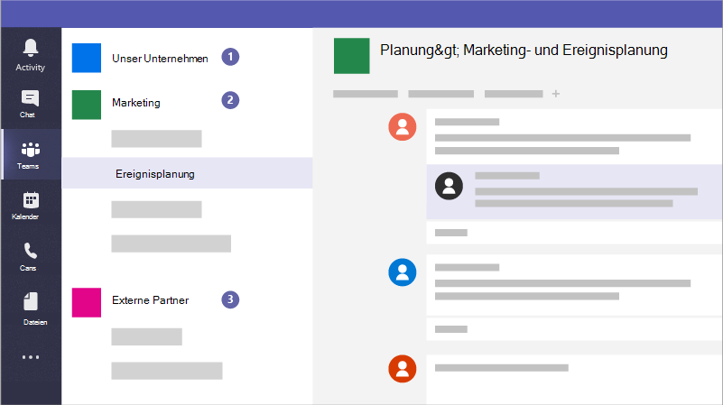

# Erstellen von Teams für die Zusammenarbeit in Microsoft TeamsCreate teams for collaboration in Microsoft Teams

Microsoft Teams ist eine App für die Zusammenarbeit, mit der Ihre Mitarbeiter auf jedem Gerät organisiert bleiben und Unterhaltungen führen können.Microsoft Teams is a collaboration app that helps your staff stay organized and have conversations, from any device. Sie können Microsoft Teams verwenden, um Sofortunterhaltungen mit Mitarbeitern oder Gästen außerhalb Ihrer Organisation zu führen.You can use Microsoft Teams to have instant conversations with members of your staff or guests outside your organization. Sie können auch telefonieren, Besprechungen hosten und Dateien freigeben.You can also make phone calls, host meetings, and share files.

## Bewährte MethodenBest practices

1. Erstellen Sie private Teams für vertrauliche Informationen.Create private teams for sensitive information.
1. Erstellen Sie ein organisationsweites Team für die Kommunikation mit allen in Ihrer Organisation.Create an org-wide team for communication with everyone across your organization.
1. Erstellen Sie Teams für bestimmte Projekte, und wenden Sie den richtigen Schutz basierend darauf an, wer einbezogen werden soll.Create teams for specific projects and apply the right amount of protection based on who should be included.
1. Erstellen Sie bestimmte Teams für die Kommunikation mit externen Partnern, um sie von allen vertraulichen Informationen für Ihr Unternehmen zu trennen.Create specific teams for communication with external partners to keep them separate from anything sensitive for your business.

Beispielsweise könnten eine Geschäfts-, Rechts- oder Gesundheitspraxis die folgenden Teams erstellen:For example, a business, legal firm, or healthcare practice could create the following teams:

1. **Ein unternehmens-, firmen- oder praxisweites Team:** Dies ist für alle für die täglichen Kommunikationen und die Arbeit in Ihrem Unternehmen zu verwenden.**A business-, firm-, or practice-wide team:** This is for everyone to use for day to day communications and work across your business. Sie können dieses Team verwenden, um Ankündigungen zu veröffentlichen oder Informationen zu teilen, die für Ihre gesamte Firma oder Praxis von Interesse sind.You can use this team to post announcements or share information of interest for your whole firm or practice.
1. **Einzelne Teams:** Richten Sie Teams für kleinere Gruppen ein, um über ihre täglichen Arbeit zusammenzuarbeiten.**Individual teams:** Set up teams for smaller groups to collaborate about their day to day work.
1. **Ein externes Kommunikationsteam oder -teams:** Koordinieren Sie sich mit Ihren Lieferanten, Partnern oder Clients, ohne dass diese vertraulich sind.**An external communications team or teams:** Coordinate with your vendors, partners, or clients without allowing them into anything sensitive. Richten Sie unterschiedliche Kanäle für bestimmte Gruppen ein.Set up different channels for specific groups.

Und Kampagnen könnten die folgenden Teams erstellen, um sicher zu kommunizieren und zusammenzuarbeiten:And campaigns could create the following teams to communicate and collaborate securely:

1. **Ein Kampagnen-Leads-Team:** Richten Sie dies als privates Team ein, damit nur Ihre wichtigsten Kampagnenmitglieder darauf zugreifen und potenziell vertrauliche Bedenken besprechen können.**A campaign Leads team:** Set this up as a private team so that only your key campaign members can access it and discuss potentially sensitive concerns.
2. **Ein allgemeines Kampagnenteam:** Dies ist für alle für die täglichen Kommunikation und Arbeit zu verwenden.**A general campaign team:** This is for everyone to use for day to day communications and work. Einzelpersonen, Gruppen oder Komitees können Kanäle in diesem Team einrichten, um ihre Arbeit zu tun.Individuals, groups, or committees can set up channels in this team to do their work. Die Ereignisplanungs-Personen können beispielsweise einen Kanal zum Chat einrichten und die Logistik für Kampagnenereignisse koordinieren.For example, the event planning people can set up a channel to chat and coordinate logistics for campaign events.
3. **Ein Partnerteam:** Koordinieren Sie sich mit Ihren Lieferanten, Partnern oder Freiwilligen, ohne dass sie in etwas Vertrauliches eingewilligt werden.**A partners team:** Coordinate with your vendors, partners, or volunteers without allowing them into anything sensitive.

Wenn Sie ein Team erstellen, wird hier das, was sonst erstellt wird:When you create a team, here's what else gets created:

- Eine neue [Microsoft 365-Gruppe](/MicrosoftTeams/office-365-groups)A new [Microsoft 365 group](/MicrosoftTeams/office-365-groups)
- Eine [SharePoint Online-Website](/MicrosoftTeams/sharepoint-onedrive-interact) und Dokumentbibliothek zum Speichern von TeamdateienA [SharePoint Online](/MicrosoftTeams/sharepoint-onedrive-interact) site and document library to store team files
- Ein [freigegebenes Exchange Online-Postfach](/MicrosoftTeams/exchange-teams-interact) und -KalenderAn [Exchange Online](/MicrosoftTeams/exchange-teams-interact) shared mailbox and calendar
- Ein OneNote-NotizbuchA OneNote notebook
- Verbindungen zu anderen Office 365-Apps wie Planner und Power BITies into other Office 365 apps such as Planner and Power BI

In Microsoft Teams finden Sie:Inside Microsoft Teams, you can find:

1. **Teams:** Suchen Sie Nach Kanälen, zu denen Sie gehören möchten, oder erstellen Sie eigene Kanäle.**Teams:** Find channels to belong to or create your own. Innerhalb von Kanälen können Sie Besprechungen vor Ort halten, Unterhaltungen führen und Dateien freigeben.Inside channels you can hold on-the-spot meetings, have conversations, and share files.
2. **Besprechungen:** Sehen Sie sich alles an, was Sie für den Tag oder die Woche eingerichtet haben.**Meetings:** See everything you've got lined up for the day or week. Oder planen Sie eine Besprechung.Or, schedule a meeting. Dieser Kalender wird mit Ihrem Outlook-Kalender synchronisiert.This calendar syncs with your Outlook calendar.
3. **Anrufe:** Wenn Ihre Organisation eingerichtet ist, können Sie in einigen Fällen jeden von Microsoft Teams anrufen, auch wenn microsoft Teams nicht verwendet wird.**Calls:** In some cases, if your organization has it set up, you can call anyone from Microsoft Teams, even if they're not using Microsoft Teams.
4. **Aktivität:** Holen Sie all Ihre ungelesenen Nachrichten, @mentions, Antworten und vieles mehr nach.**Activity:** Catch up on all your unread messages, @mentions, replies, and more.

Verwenden Sie das Befehlsfeld oben, um nach bestimmten Elementen oder Personen zu suchen, schnelle Aktionen zu ergreifen und Apps zu starten.Use the command box at the top to search for specific items or people, take quick actions, and launch apps.

## EinrichtungSet it up

Erstellen Sie ein privates Team nur für den Geschäftsbesitzer und manager oder Kampagnenmanager und Kandidaten wie diesen.Create a private team for just the business owner and managers, or campaign manager and candidate like this.

> [!VIDEO https://www.microsoft.com/videoplayer/embed/RWeqWA]

Erstellen Sie ein organisationsweites Team, mit dem alle Mitarbeiter des Unternehmens oder der Kampagne kommunizieren und Dateien freigeben können.Create an organization-wide team that everyone in the business or campaign can use to communicate and share files.

> [!VIDEO https://www.microsoft.com/videoplayer/embed/RE2GCG9]

Erstellen Sie ein Team, das Sie mit Gästen außerhalb Ihrer Organisation teilen, z. B. für Werbung oder Finanzen.Create a team that you share with guests outside your organization, such as for advertising or finances.

> [!VIDEO https://www.microsoft.com/videoplayer/embed/RE1FQMp]

Weitere Informationen zu Microsoft Teams finden Sie in [der technischen Dokumentation zu Microsoft Teams](/microsoftteams/microsoft-teams)Learn more about Microsoft Teams at [Microsoft Teams technical documentation](/microsoftteams/microsoft-teams)

## AdministratoreinstellungenAdmin settings

Sie müssen ein Administrator sein, um ein organisationsweites Team zu erstellen.You must be an admin to create an organization-wide team. Weitere Informationen finden Sie unter [Was ist ein Administrator in Microsoft 365?](https://support.office.com/article/what-is-an-admin-e123627e-4892-4461-b9aa-1b6d57a5cfa4?ui=en-US&rs=en-US&ad=US).For more information, see [What is an Admin in Microsoft 365?](https://support.office.com/article/what-is-an-admin-e123627e-4892-4461-b9aa-1b6d57a5cfa4?ui=en-US&rs=en-US&ad=US).