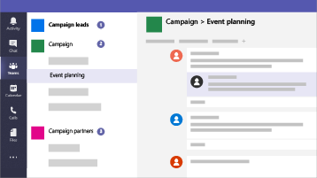

Microsoft 365 für Kampagnen
===========================

In unserer aktuellen Welt ist die Sicherung von Daten und Kommunikation eine Priorität, insbesondere für politische Kampagnen, medizinische und rechtliche Praktiken und viele andere Unternehmen. Microsoft 365 für Kampagnen enthält eine Reihe von Empfehlungen, die zum Schutz Ihrer Daten dienen. Diese Bibliothek enthält Hilfe zum Einrichten und Verwenden dieser empfohlenen Umgebung, auch wenn Sie keine Kampagne sind.

> [!VIDEO https://www.microsoft.com/videoplayer/embed/RE3clbH] 

**Was ist Microsoft 365 für Kampagnen?** Es handelt sich um eine empfohlene Sicherheitskonfiguration, die Microsoft 365 Business umfasst, sodass Sie Folgendes tun können:
- Verlassen Sie sich auf vertrauenswürdige Geschäfts Produktivitäts-und Zusammenarbeitstools wie Outlook, Word, Excel und andere Office-Produkte. 
- Schützen Sie Ihre Arbeitsdateien auf allen IOS-, Android-und Windows 10-Geräten mit unternehmensübergreifender Sicherheit, die einfach zu verwalten ist. 
- Anwenden eines zusätzlichen Schutzes für Benutzerkonten und Identität 

Während sich Bundes Wahlkampagnen in den Vereinigten Staaten für spezielle Preise für Microsoft 365 Business qualifizieren, kann jede Organisation mit diesem Plan diese Anleitung nutzen, um erhöhte Sicherheit zu konfigurieren und zu erfahren, wie Sie sicher zusammenarbeiten.

Diese Bibliothek umfasst Folgendes:
- Anleitungen für das Hinzufügen erhöhter Sicherheit.
- Hilfe für Benutzer zum Einrichten von Geräten für sicheren Zugriff.
- Anleitung zur sicheren Zusammenarbeit und Freigabe.

Weitere Informationen zum Lieferumfang von finden Sie unter [Microsoft 365 Business](https://www.microsoft.com/microsoft-365/business). 

Erste Schritte
--------------------------

<ul class="panelContent cardsJ">
    <li>
        

            

                

                    

                        

                            
                        

                    

                    

                        
<b>Gehen Sie folgendermaßen vor, um loszulegen:</b>

                        
<a href="get-microsoft-365-campaigns.md">Abrufen von Microsoft 365-Kampagnen</a>

                        
<a href="m365-campaigns-users.md">Informationen dazu, wie Ihre Benutzer mit Microsoft 365 arbeiten</a>

                        
<a href="microsoft-365-campaigns-setup-overview.md">Einrichten von Microsoft 365-Kampagnen</a>

                    

                

            

        

    </li>
</ul>

Lösungen für Ihre Kampagne oder für kleine Unternehmen
--------------------------

Nachdem Sie Ihre sichere Microsoft 365-Umgebung eingerichtet haben, können Sie die folgenden Lösungen verwenden, um die Arbeit zu erhalten:

<ul class="panelContent cardsW cols cols2">
    <li>
        

            

                

                    

                        

                            
                        

                    

                    

                        <h3>Erstellen von Teams für die Zusammenarbeit</h3>
                        
Machen Sie einen Raum für Kommunikation und Zusammenarbeit mit bestimmten Teams für wichtige Mitarbeiter, alle Mitarbeiter und Partner oder Lieferanten mit Microsoft Teams.

                        
<a href="create-teams-for-collaboration.md">Erstellen Ihres Teams</a>

                    

                

            

        

    </li>
    <li>
        

            

                

                    

                        

                            
                        

                    

                    

                        <h3>Einrichten von Onlinebesprechungen</h3>
                        
Planen einer Besprechung mit Audio, Video und Freigabe mit Microsoft Teams.

                        
<a href="set-up-meetings.md">Einrichten einer Besprechung</a>

                    

                

            

        

    </li>
    <li>
        

            

                

                    

                        

                            
                        

                    

                    

                        <h3>Verschlüsseln oder bezeichnen von vertraulichen e-Mails</h3>
                        
Verwenden Sie Verschlüsselungs-und Vertraulichkeits Bezeichnungen, um e-Mails zu schützen, die vertrauliche oder vertrauliche Informationen enthalten.

                        
<a href="send-encrypted-email.md">Senden verschlüsselter E-Mail-Nachrichten</a>

                    

                

            

        

    </li>
    <li>
        

            

                

                    

                        

                            
                        

                    

                    

                        <h3>Erstellen einer Kommunikationswebsite</h3>
                        
Freigeben von Ereignissen, Nachrichten, Bildern und mehr mit Ihrem Team in einer internen Kommunikationswebsite, die mit SharePoint erstellt wurde.

                        
<a href="create-communications-site.md">Erstellen Ihrer Website</a>

                    

                

            

        

    </li>
    <li>
        

            

                

                    

                        

                            
                        

                    

                    

                        <h3>Freigeben von Dateien und Videos</h3>
                        
Speichern Sie Ihre Dateien und Videos in der Cloud, damit Sie für alle geeigneten Personen verfügbar sind.

                        
<a href="share-files-and-videos.md">Freigabe starten</a>

                    

                

            

        

    </li>
</ul>
