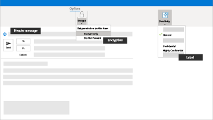

Microsoft 365 für Kampagnen
===========================

Heutzutage ist es mehr denn je wichtig, Daten und Kommunikation zu sichern. Das gilt besonders für politische Kampagnen, Arztpraxen und Kanzleien, sowie viele weitere Geschäftsbereiche. Microsoft 365 für Kampagnen enthält eine Reihe an Empfehlungen, die Ihnen dabei helfen sollen, sich und Ihre Daten zu schützen. Die Bibliothek enthält außerdem Anweisungen für die Einrichtung und Verwendung dieser empfohlenen Umgebung, auch wenn Sie keine Kampagne sind.

> [!VIDEO https://www.microsoft.com/videoplayer/embed/RE3clbH]

Was ist Microsoft 365 für Kampagnen?
------------------------------------

Es handelt sich um eine empfohlene sichere Konfiguration, die Microsoft 365 Business Premium mit einschließt. So können Sie:

- Sich auf vertrauenswürdige Tools für die Produktivität und Zusammenarbeit verlassen, wie zum Beispiel Outlook, Word, Excel, und weitere Office-Produkte
- Ihre Arbeitsdateien auf allen Ihren iOS-, Android-, und Windows 10-Geräten mit einfach zu verwaltenden Sicherheitsfunktionen auf Unternehmensniveau schützen
- Wenden Sie zusätzlichen Schutz auf Benutzerkonten und Identitäten an.

Die Präsidentschaftswahlen in den Vereinigten Staaten von Amerika sind für das Sonderangebot von Microsoft 365 Business Premium qualifiziert, doch auch alle anderen Organisationen mit diesem Plan können sich diese Anleitung zunutze machen, um eine erhöhte Sicherheit zu konfigurieren und sicher mit anderen zusammenzuarbeiten.

Die Bibliothek enthält Folgendes:

- Einrichtungsanleitung zur Steigerung der Sicherheit.
- Hilfe für Benutzer bei der Einrichtung Geräten für einen sicheren Zugriff.
- Anleitung zum sicheren Zusammenarbeiten und Austausch von Dateien.

Weitere Informationen zum Funktionsumfang finden Sie unter [Microsoft 365 Business Premium](https://www.microsoft.com/microsoft-365/business).

Erste Schritte
--------------------------

Gehen Sie folgendermaßen vor, um loszulegen:

- [Rufen Sie Microsoft 365 Kampagnen ab](get-microsoft-365-campaigns.md)
- [Erfahren Sie, wie Ihre Benutzer mit Microsoft 365 arbeiten](m365-campaigns-users.md)
- [Richten Sie Microsoft 365 Kampagnen ein](microsoft-365-campaigns-setup-overview.md)

Lösungen für Ihre Kampagne oder Ihr kleines Unternehmen
--------------------------

Nachdem Sie Ihre sichere Microsoft 365-Umgebung eingerichtet haben, können Sie mit den folgenden Lösungen zu arbeiten beginnen:

| Erstellen von Teams für die Zusammenarbeit | Einrichten von Online-Besprechungen |
| ------------- | ------------- |
|  |  |
| Schaffen Sie mit Microsoft Teams einen Raum für die Kommunikation und Zusammenarbeit mit spezifischen Teams für wichtige Mitarbeiter, die gesamte Belegschaft sowie für Partner oder Lieferanten. [Erstellen Ihres Teams](create-teams-for-collaboration.md) | Planen Sie eine Besprechung mit Audio, Video, und dem Austausch von Dateien mit Microsoft Teams. [Einrichten einer Besprechung](set-up-meetings.md) |

| Verschlüsseln oder beschriften Sie Ihre vertraulichen E-Mails | Erstellen einer Kommunikationswebsite |
| ------------- | ------------- |
|  |  |
| Verwenden Sie eine Verschlüsselung oder Vertraulichkeitsbezeichnungen, um E-Mails mit vertraulichen oder sensiblen Informationen zu schützen. [Senden verschlüsselter E-Mail-Nachrichten](send-encrypted-email.md) | Erstellen Sie mit SharePoint eine Seite für die interne Kommunikation, und geben Sie Ereignisse, Nachrichten, Bilder und mehr für Ihr Team frei. [Erstellen Ihrer Website](create-communications-site.md) |

| Freigeben von Dateien und Videos |
| ------------- |
|  |
| Speichern Ihrer Dateien und Videos in der Cloud, damit sie für alle verfügbar sind   der richtigen Personen. [Teilen beginnen](share-files-and-videos.md) |

