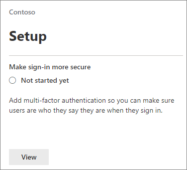

# Erzwingen der mehrstufigen Authentifizierung und Einrichten von Richtlinien für bedingten Zugriff

Sie schützen den Zugriff auf Ihre Daten mit mehrstufiger Authentifizierung und Richtlinien für bedingten Zugriff. Dadurch wird eine erhebliche zusätzliche Sicherheit hinzugefügt. Microsoft stellt eine Reihe von Baseline-bedingten Zugriffsrichtlinien bereit, die für alle Kunden empfohlen werden. Baseline-Richtlinien sind eine Reihe von vordefinierten Richtlinien, die Organisationen vor zahlreichen häufigen Angriffen schützen sollen. Diese häufigen Angriffe können Kenn Wort Spray, Wiedergabe und Phishing umfassen.

Für diese Richtlinien müssen Administratoren und Benutzer eine zweite Authentifizierungsform (mehrstufige Authentifizierung oder MFA genannt) eingeben, wenn bestimmte Bedingungen erfüllt sind. Wenn beispielsweise ein Benutzer in Ihrer Organisation versucht, sich bei Microsoft 365 aus einem anderen Land oder einem unbekannten Gerät anzumelden, wird die Anmeldung möglicherweise als riskant eingestuft. Der Benutzer muss eine zusätzliche Form der Authentifizierung (beispielsweise Fingerabdruck oder Code) bereitstellen, um seine Identität nachzuweisen. 

Derzeit umfassen Baseline-Richtlinien Folgendes:
- Einrichten im Microsoft 365 Admin Center:
    - **MFA für Administratoren erforderlich** – erfordert mehrstufige Authentifizierung für die privilegierten Administratorrollen, einschließlich des globalen Administrators.
    - **Endbenutzer Schutz** – erfordert mehrstufige Authentifizierung für Benutzer nur, wenn eine Anmeldung riskant ist. 
- Einrichten in Azure Active Directory Portal:
    - **Legacy Authentifizierung blockieren** – ältere Client-apps und einige neue Apps verwenden keine neueren, sichereren Authentifizierungsprotokolle. Diese älteren Apps können Richtlinien für bedingten Zugriff umgehen und nicht autorisierten Zugriff auf Ihre Umgebung erlangen. Diese Richtlinie blockiert den Zugriff von Clients, die keinen bedingten Zugriff unterstützen. 
    - **MFA für die Dienstverwaltung erforderlich** – erfordert mehrstufige Authentifizierung für den Zugriff auf Verwaltungstools, einschließlich Azure-Portal (in dem Sie Basisrichtlinien konfigurieren). 

Microsoft empfiehlt, alle diese Basisrichtlinien zu aktivieren. Nachdem diese Richtlinien aktiviert wurden, werden Administratoren und Benutzer aufgefordert, sich für die Azure-mehrstufige Authentifizierung zu registrieren.

Weitere Informationen zu diesen Richtlinien finden Sie unter [Was sind Basisrichtlinien](https://docs.microsoft.com/azure/active-directory/conditional-access/concept-baseline-protection)?

## MFA erforderlich

So legen Sie fest, dass sich alle Benutzer mit einem zweiten ID-Formular anmelden müssen:

1. Wechseln Sie zum Admin Center unter <a href="https://go.microsoft.com/fwlink/p/?linkid=837890" target="_blank">https://admin.microsoft.com</a> , und wählen Sie **Setup**aus.

2. Wählen Sie auf der Seite Setup die Option **Ansicht** in **sicherer Karte anmelden** .

    
3. Wählen Sie auf der Seite Anmeldung sicherer gestalten die Option **Erste Schritte**aus.
 
4. Aktivieren Sie im Bereich Anmeldesicherheit verstärken die Kontrollkästchen neben mehrstufiger **Authentifizierung für Administratoren erforderlich** , und fordern Sie die **Benutzer auf, die mehrstufige Authentifizierung zu registrieren und den Zugriff zu blockieren, wenn das Risiko erkannt wird**.
    Achten Sie darauf, das [Notfall](m365-campaigns-protect-admin-accounts.md#create-an-emergency-admin-account) -oder "Break-Glass"-Administratorkonto aus der MFA-Anforderung im Feld **Benutzer suchen** auszuschließen.
    
    

5. Klicken Sie unten auf der Seite auf **Richtlinie erstellen** .

## Einrichten von Baseline-Richtlinien

1. Wechseln Sie [zu Azure-Portal](https://portal.azure.com), und navigieren Sie dann zu **Azure Active Directory** \> **bedingten Zugriff**.
    
    Die grundlegenden Richtlinien werden auf der Seite aufgeführt, und Sie können sehen, dass MFA für Administratoren und Endbenutzer Schutz erforderlich ist, nachdem Sie die Schritte in " [MFA erfordern](#require-mfa)" abgeschlossen haben.

    
2. Lesen Sie die folgenden spezifischen Anweisungen für jede Richtlinie:

    - [MFA für Administratoren erforderlich](https://docs.microsoft.com/azure/active-directory/conditional-access/howto-baseline-protect-administrators)

       
    -   [MFA für Benutzer erforderlich](https://docs.microsoft.com/azure/active-directory/conditional-access/howto-baseline-protect-end-users)  
    - [Legacy Authentifizierung blockieren](https://docs.microsoft.com/azure/active-directory/conditional-access/howto-baseline-protect-legacy-auth)
    - [MFA für Service Management erforderlich](https://docs.microsoft.com/azure/active-directory/conditional-access/howto-baseline-protect-azure)

Sie können zusätzliche Richtlinien einrichten, beispielsweise das Anfordern von genehmigten Client-apps. Weitere Informationen finden Sie in der [Dokumentation zum bedingten Zugriff](https://docs.microsoft.com/azure/active-directory/conditional-access/) .
