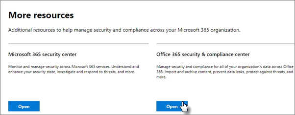

# Erhöhen des Bedrohungsschutzes für Microsoft 365-Abonnements

Dieser Artikel hilft Ihnen, den Schutz in Ihrem Microsoft 365-Abonnement zum Schutz vor Phishing, Schadsoftware und anderen Bedrohungen zu erhöhen. Diese Empfehlungen sind für Organisationen geeignet, die einen erhöhten Sicherheitsbedarf haben, z. B. politische Kampagnen, Anwaltskanzleien und Gesundheitseinrichtungen.

Bevor Sie beginnen, überprüfen Sie Ihre Microsoft-Sicherheitsüberprüfung. Die Microsoft Secure Score analysiert die Sicherheit Ihrer Organisation basierend auf Ihren regulären Aktivitäten und Sicherheitseinstellungen und weist eine Bewertung zu. Notieren Sie sich zunächst Ihre aktuelle Bewertung. Wenn Sie die in diesem Artikel empfohlenen Aktionen ausführen, wird Ihre Bewertung erhöht. Ziel ist es nicht, die maximale Punktzahl zu erreichen, sondern sich der Möglichkeiten zum Schutz Ihrer Umgebung bewusst zu sein, die sich nicht negativ auf die Produktivität ihrer Benutzer auswirken.

Weitere Informationen finden Sie unter [Microsoft Secure Score](https://docs.microsoft.com/microsoft-365/security/mtp/microsoft-secure-score).

## Erhöhen des Schutzniveaus vor Schadsoftware in E-Mails

Ihre Office 365- oder Microsoft 365-Umgebung bietet Schutz vor Schadsoftware. Sie können diesen Schutz jedoch erhöhen, indem Sie Anlagen mit Dateitypen blockieren, die häufig für Schadsoftware verwendet werden. So stoßen Sie den Schutz vor Schadsoftware in E-Mails an:

1. Wechseln Sie <https://protection.office.com> zu Und melden Sie sich mit Ihren Administratorkontoanmeldeinformationen an.

2. Wählen Sie im Security & Compliance Center im linken Navigationsbereich unter "Bedrohungsverwaltung" die Option "Richtlinie  \> **an malware " aus.**

3. Doppelklicken Sie auf die Standardrichtlinie, um diese unternehmensweite Richtlinie zu bearbeiten.

4. Klicken Sie auf **Einstellungen**.

5. Wählen **Sie unter "Common Attachment Types Filter"** die Option **"Ein" aus.** Die gesperrten Dateitypen werden im Fenster direkt unterhalb dieses Steuerelements aufgeführt. Stellen Sie sicher, dass Sie die folgenden Dateitypen hinzufügen:

   `ade, adp, ani, bas, bat, chm, cmd, com, cpl, crt, hlp, ht, hta, inf, ins, isp, job, js, jse, lnk, mda, mdb, mde, mdz, msc, msi, msp, mst, pcd, reg, scr, sct, shs, url, vb, vbe, vbs, wsc, wsf, wsh, exe, pif`

   Sie können Dateitypen bei Bedarf später hinzufügen oder löschen.

6. Klicken Sie auf **Speichern**.

Weitere Informationen finden Sie unter [An malware protection in EOP](https://docs.microsoft.com/microsoft-365/security/office-365-security/anti-malware-protection).

## Schutz vor Ransomware

Ransomware schränkt den Zugriff auf Daten ein, indem Dateien verschlüsselt oder Computerbildschirme gesperrt werden. Sie versucht dann, Geld von Opfer zu erpressen, indem sie "Lösegeld" in Form von Kryptos wie Etwa als Lösegeldforderung anfordert, um Zugriff auf Daten zu erhalten.

Sie können vor Ransomware schützen, indem Sie eine oder mehrere Nachrichtenflussregeln erstellen, um  Dateierweiterungen zu blockieren, die häufig für Ransomware verwendet werden (diese wurden hinzugefügt, um den Schutz vor Schadsoftware im E-Mail-Schritt zu erhöhen) oder Benutzer zu warnen, die diese Anlagen per E-Mail erhalten.

Zusätzlich zu den Dateien, die Sie im vorherigen Schritt blockiert haben, ist es auch eine bewährte Methode, eine Regel zu erstellen, mit der Benutzer gewarnt werden, bevor Sie Office-Dateianlagen öffnen, die Makros enthalten. Ransomware kann in Makros ausgeblendet werden. Warnen Sie die Benutzer daher davor, diese Dateien von Personen zu öffnen, die sie nicht kennen.

So erstellen Sie eine E-Mail-Transportregel:

1. Wechseln Sie zum Admin Center, <https://admin.microsoft.com> und wählen Sie Admin **Center** \> **Exchange aus.**

2. Klicken Sie **in der Kategorie "Nachrichtenfluss"** auf **Regeln.**

3. Klicken **+** Sie auf , und klicken Sie dann auf **"Neue Regel erstellen".**

4. Klicken **Sie unten im** Dialogfeld auf "Weitere Optionen", um den vollständigen Satz von Optionen anzuzeigen.

5. Wenden Sie die Einstellungen in der folgenden Tabelle für die Regel an. Lassen Sie die restlichen Einstellungen auf den Standardwert festgelegt, es sei denn, Sie möchten sie ändern.

6. Klicken Sie auf **Speichern**.

|Setting|Warnen von Benutzern vor dem Öffnen von Anlagen von Office-Dateien|
|---|---|
|Name|Anti-Ransomware-Regel: Benutzer warnen|
|Wenden Sie diese Regel an, wenn . . .|Eine Anlage . . . Dateierweiterung entspricht . . .|
|Angeben von Wörtern oder Ausdrücken|Fügen Sie die folgenden Dateitypen hinzu:   `dotm, docm, xlsm, sltm, xla, xlam, xll, pptm, potm, ppam, ppsm, sldm`|
|Gehen Sie wie folgt vor. . .|Empfänger durch Nachricht benachrichtigen|
|Bereitstellen von Nachrichtentext|Öffnen Sie diese Dateitypen nicht von Personen, die Sie nicht kennen, da sie Möglicherweise Makros mit bösartigem Code enthalten.|

Weitere Informationen finden Sie unter:

- [Ransomware: Verringern des Risikos](https://www.microsoft.com/security/blog/2020/04/28/ransomware-groups-continue-to-target-healthcare-critical-services-heres-how-to-reduce-risk/)

- [Wiederherstellen Ihres OneDrive](https://support.microsoft.com//office/fa231298-759d-41cf-bcd0-25ac53eb8a15)

## Beenden der automatischen Weiterleitung für E-Mails

Hacker, die Zugriff auf das Postfach eines Benutzers erhalten, können Ihre E-Mails stehlen, indem sie das Postfach so festlegen, dass E-Mails automatisch weitergeleitet werden. Dies kann auch ohne die Sensibilisierung des Benutzers geschehen. Sie können dies verhindern, indem Sie eine Nachrichtenflussregel konfigurieren.

Um eine E-Mail-Transportregel zu erstellen, schauen Sie sich [dieses kurze Video an,](https://support.office.com/article/f9d693ba-5c78-47c0-b156-8e461e062aa7) oder führen Sie die folgenden Schritte aus:

1. Klicken Sie im Microsoft 365 Admin Center auf **Admin Center** \> **Exchange**.

2. Klicken Sie **in der Kategorie "Nachrichtenfluss"** auf **Regeln.**

3. Klicken **+** Sie auf , und klicken Sie dann auf **"Neue Regel erstellen".**

4. Klicken **Sie unten im** Dialogfeld auf "Weitere Optionen", um den vollständigen Satz von Optionen anzuzeigen.

5. Wenden Sie die Einstellungen in der folgenden Tabelle an. Lassen Sie die restlichen Einstellungen auf den Standardwert festgelegt, es sei denn, Sie möchten sie ändern.

6. Klicken Sie auf **Speichern**.

|Setting|Warnen von Benutzern vor dem Öffnen von Anlagen von Office-Dateien|
|---|---|
|Name|Verhindern der automatischen Weiterleitung von E-Mails an externe Domänen|
|Wenden Sie diese Regel an, wenn ...|Der Absender . . . extern/intern ist. . . Innerhalb der Organisation|
|Bedingung hinzufügen|Die Nachrichteneigenschaften . . . den Nachrichtentyp enthalten. . . Automatische Weiterleitung|
|Gehen Sie wie folgt vor...|Nachricht blockieren . . . die Nachricht ablehnen und eine Erklärung enthalten.|
|Bereitstellen von Nachrichtentext|Die automatische Weiterleitung von E-Mails außerhalb dieser Organisation wird aus Sicherheitsgründen verhindert.|

## Schützen Ihrer E-Mails vor Phishingangriffen

Wenn Sie eine oder mehrere benutzerdefinierte Domänen für Ihre Office 365- oder Microsoft 365-Umgebung konfiguriert haben, können Sie den gezielten Antiphishingschutz konfigurieren. Antiphishingschutz, Teil von Microsoft Defender für Office 365, kann Dazu beitragen, Ihre Organisation vor böswilligen Phishingangriffen auf Identitätswechsel und anderen Phishingangriffen zu schützen. Wenn Sie keine benutzerdefinierte Domäne konfiguriert haben, müssen Sie dies nicht tun.

Es wird empfohlen, mit diesem Schutz zu beginnen, indem Sie eine Richtlinie zum Schutz Ihrer wichtigsten Benutzer und Ihrer benutzerdefinierten Domäne erstellen.

Um eine Antiphishingrichtlinie in Defender für Office 365 zu erstellen, schauen Sie sich dieses kurze Schulungsvideo [an,](https://support.office.com/article/86c425e1-1686-430a-9151-f7176cce4f2c)oder führen Sie die folgenden Schritte aus:

1. Wechseln Sie zu <https://protection.office.com>.

2. Wählen Sie im Security & Compliance Center im linken Navigationsbereich unter **Bedrohungsverwaltung** **"Richtlinie" aus.**

3. Wählen Sie **auf der Seite** "Richtlinie" **"Antiphishing" aus.**

4. Wählen Sie **auf der Seite "Antiphishing"** die Option **+Erstellen aus.** Ein Assistent startet, der Sie durch die Definition Ihrer Antiphishingrichtlinie führt.

5. Geben Sie den Namen, die Beschreibung und die Einstellungen für Ihre Richtlinie wie im folgenden Diagramm empfohlen an. Weitere Informationen finden Sie unter [Informationen zu Antiphishingrichtlinien in Microsoft Defender für Office 365-Optionen.](https://docs.microsoft.com/microsoft-365/security/office-365-security/set-up-anti-phishing-policies)

6. Nachdem Sie Ihre Einstellungen überprüft haben, wählen Sie **"Diese Richtlinie erstellen"** oder **"Speichern"** aus.

|Einstellung oder Option|Empfohlene Einstellung|
|---|---|
|Name|Domäne und wertvollste Mitarbeiter|
|Beschreibung|Stellen Sie sicher, dass die wichtigsten Mitarbeiter und unsere Domäne nicht imitiert werden.|
|Zu schützende Benutzer hinzufügen|Select **+ Add a condition, The recipient is**. Geben Sie Benutzernamen oder die E-Mail-Adresse der Geschäftsbesitzer, Partner oder Kandidaten, Manager und anderer wichtiger Mitarbeiter ein. Sie können bis zu 20 interne und externe Adressen hinzufügen, die Sie vor Identitätswechsel schützen möchten.|
|Zu schützende Domänen hinzufügen|Select **+ Add a condition, The recipient domain is**. Geben Sie die benutzerdefinierte Domäne ein, die Ihrem Microsoft 365-Abonnement zugeordnet ist, wenn Sie eine definiert haben. Sie können mehrere Domänen eingeben.|
|Aktionen auswählen|Wenn E-Mails von einem imitierten Benutzer gesendet werden: **Wählen** Sie "Nachricht an eine andere E-Mail-Adresse umleiten" aus, und geben Sie dann die E-Mail-Adresse des Sicherheitsadministrators ein. Beispiel: *Alice   @contoso.com*.   Wenn eine E-Mail von einer imitierten Domäne gesendet wird: Wählen Sie **Nachricht in Quarantäne verschieben** aus.|
|Mailbox Intelligence|Standardmäßig wird die Mailbox Intelligence ausgewählt, wenn Sie eine neue Anti-Phishing-Richtlinie erstellen. Lassen Sie diese Einstellung auf **Ein**, um optimale Ergebnisse zu erzielen.|
|Vertrauenswürdige Absender und Domänen hinzufügen|Hier können Sie Ihre eigene Domäne oder andere vertrauenswürdige Domänen hinzufügen.|
|Angewendet auf|Wählen Sie **Die Domäne des Empfängers ist** aus. Wählen Sie unter **Einer dieser**, **Auswählen** aus. Wählen Sie **+ Hinzufügen** aus. Aktivieren Sie das Kontrollkästchen neben dem Namen der Domäne, z. B. *"contoso".   com*, in der Liste, und wählen Sie **dann** Hinzufügen aus. Wählen Sie **Fertig** aus.|

Weitere Informationen finden Sie unter [Einrichten von Antiphishingrichtlinien in Defender für Office 365.](https://docs.microsoft.com/microsoft-365/security/office-365-security/set-up-anti-phishing-policies)

## Schutz vor schädlichen Anlagen, Dateien und Links mit Defender für Office 365

Stellen Sie zunächst sicher, dass im Admin Center die neue <https://admin.microsoft.com> Admin Center-Vorschau aktiviert ist. Schalten Sie den Umschalter neben dem Text **"The new admin center" ein.**

   

Wenn die Seite **"Setup"** noch nicht mit Karten in Ihrem Mandanten angezeigt wird, erfahren Sie, wie Sie diese Schritte im Security & Compliance Center ausführen. Weitere Informationen finden Sie unter Einrichten sicherer Anlagen im [Security & Compliance Center](#set-up-safe-attachments-in-the-security--compliance-center) und Einrichten sicherer Links im Security & Compliance [Center.](#set-up-safe-links-in-the-security--compliance-center)

1. Wählen Sie in der linken Navigationsleiste **Setup aus.**
2. On the **Setup** page, choose **View** on the **Increase protection from advanced threats** card.

   

3. Wählen Sie **auf der Seite "Schutz vor erweiterten Bedrohungen** erhöhen" die Option **"Erste Schritte" aus.**
4. Aktivieren Sie im bereich, der geöffnet wird, die Kontrollkästchen neben Links und Anlagen **in** E-Mail, Dateien **in SharePoint, OneDrive** und Teams überprüfen und Links **in Office Desktop-** und Office #A0 unter Elemente auf bösartige Inhalte **überprüfen.**

   Geben **Sie unter Links und Anlagen in** E-Mail alle Benutzer oder die bestimmten Benutzer ein, deren E-Mails überprüft werden sollen.

   

5. Wählen **Sie "Richtlinien erstellen"** aus, um "Sichere Anlagen" und "Sichere Links" zu aktivieren.

### Einrichten sicherer Anlagen im Security & Compliance Center

Personen senden, empfangen und geben Anlagen wie Dokumente, Präsentationen, Tabellenkalkulationen und vieles mehr regelmäßig weiter. Es ist nicht immer einfach zu wissen, ob eine Anlage sicher oder schädlich ist, indem Sie sich eine E-Mail-Nachricht anschauen. Microsoft Defender für Office 365 bietet sicheren Anlagenschutz, ist jedoch nicht standardmäßig aktiviert. Es wird empfohlen, eine neue Regel zu erstellen, um mit der Verwendung dieses Schutzes zu beginnen. Dieser Schutz erstreckt sich auf Dateien in SharePoint, OneDrive und Microsoft Teams.

Um eine Richtlinie für sichere Anlagen zu erstellen, schauen Sie sich entweder [dieses kurze](https://support.office.com/article/e7e68934-23dc-4b9c-b714-e82e27a8f8a5)Video an, oder führen Sie die folgenden Schritte aus:

1. Wechseln Sie <https://protection.office.com> zu Ihrem Administratorkonto, und melden Sie sich mit ihrem Administratorkonto an.

2. Wählen Sie im Security & Compliance Center im linken Navigationsbereich unter **Bedrohungsverwaltung** **"Richtlinie" aus.**

3. Wählen Sie auf der Seite "Richtlinie" die Option **"Sichere Anlagen" aus.**

4. Wenden Sie diesen Schutz auf der Seite "Sichere Anlagen" allgemein an, indem Sie das Kontrollkästchen ATP für **SharePoint, OneDrive** und Microsoft Teams aktivieren.

5. Wählen Sie **+** diese Option aus, um eine neue Richtlinie zu erstellen.

6. Wenden Sie die Einstellungen in der folgenden Tabelle an.

7. Nachdem Sie Ihre Einstellungen überprüft haben, wählen **Sie "Diese Richtlinie erstellen"** oder **"Speichern"** aus.

|Einstellung oder Option|Empfohlene Einstellung|
|---|---|
|Name|Blockieren Sie aktuelle und zukünftige E-Mails mit erkannter Schadsoftware.|
|Beschreibung|Blockieren Sie aktuelle und zukünftige E-Mails und Anlagen mit erkannter Schadsoftware.|
|Speichern von Anlagen unbekannte Schadsoftwareantwort|Select **Block - Block the current and future emails and attachments with detected malware**.|
|Anlage bei Erkennung umleiten|Umleitung aktivieren (aktivieren Sie dieses Kontrollkästchen)   Geben Sie das Administratorkonto oder ein Postfach für die Quarantäne ein.   Wenden Sie die oben aufgeführte Auswahl an, wenn bei der Schadsoftwareprüfung auf Anlagen ein Zeitfehler auftritt oder ein Fehler auftritt (aktivieren Sie dieses Feld).|
|Angewendet auf|Die Empfängerdomäne ist . . . wählen Sie Ihre Domäne aus.|

Weitere Informationen finden Sie unter [Einrichten von Antiphishingrichtlinien in Defender für Office 365.](https://docs.microsoft.com/microsoft-365/security/office-365-security/set-up-anti-phishing-policies)

### Einrichten sicherer Links im Security & Compliance Center

Hacker blenden manchmal schädliche Websites in Links in E-Mails oder anderen Dateien aus. Sichere Links, Teil von Microsoft Defender für Office 365, können Zum Schutz Ihrer Organisation beitragen, indem sie die Überprüfung von Webadressen (URLs) per Mausklick in E-Mail-Nachrichten und Office-Dokumenten bereitstellen. Der Schutz wird durch Richtlinien für sichere Links definiert.

Es wird empfohlen, die folgenden Schritte zu tun:

- Ändern Sie die Standardrichtlinie, um den Schutz zu erhöhen.

- Fügen Sie eine neue Richtlinie für alle Empfänger in Ihrer Domäne hinzu.

Sehen Sie sich zum Einrichten von sicheren Links dieses [kurze Schulungsvideo](https://support.office.com/article/61492713-53c2-47da-a6e7-fa97479e97fa)an, oder führen Sie die folgenden Schritte aus:

1. Wechseln Sie <https://protection.office.com> zu Ihrem Administratorkonto, und melden Sie sich mit ihrem Administratorkonto an.

2. Wählen Sie im Security & Compliance Center im linken Navigationsbereich unter **Bedrohungsverwaltung** **"Richtlinie" aus.**

3. Wählen Sie auf der Seite "Richtlinie" die Option **"Sichere Links" aus.**

So ändern Sie die Standardrichtlinie:

1. Wählen Sie auf der Seite "Sichere Links" unter **"Richtlinien, die für die gesamte** Organisation gelten" die **Standardrichtlinie** aus.

2. Wählen **Sie unter Einstellungen, die für Inhalte** außer E-Mail gelten, Microsoft **365 Apps for Enterprise, Office für iOS und Android aus.**

3. Klicken Sie auf **Speichern**.

So erstellen Sie eine neue Richtlinie für alle Empfänger in Ihrer Domäne:

1. Klicken Sie auf der Seite "Sichere Links" unter **Richtlinien, die für** die gesamte Organisation gelten, auf eine neue **+** Richtlinie.

2. Wenden Sie die in der folgenden Tabelle aufgeführten Einstellungen an.

3. Klicken Sie auf **Speichern**.

|Einstellung oder Option|Empfohlene Einstellung|
|---|---|
|Name|Richtlinie für sichere Links für alle Empfänger in der Domäne|
|Auswählen der Aktion für unbekannte potenziell schädliche URLs in Nachrichten|Select **On - URLs werden umgeschrieben** und mit einer Liste bekannter bösartiger Links überprüft, wenn der Benutzer auf den Link klickt.|
|Verwenden von sicheren Anlagen zum Überprüfen von herunterladbaren Inhalten|Aktivieren Sie dieses Feld.|
|Angewendet auf|Die Empfängerdomäne ist . . . wählen Sie Ihre Domäne aus.|

Weitere Informationen finden Sie unter ["Sichere Links" in Defender für Office 365.](https://docs.microsoft.com/microsoft-365/security/office-365-security/atp-safe-links)

## Aktivieren des einheitlichen Überwachungsprotokolls

Nachdem Sie die Überwachungsprotokollsuche im Security & Compliance Center aktivieren, können Sie den Administrator und andere Benutzeraktivitäten im Protokoll beibehalten und durchsuchen.

Ihnen muss die Rolle "Überwachungsprotokolle" in Exchange Online zugewiesen sein, um die Überwachungsprotokollsuche in Ihrem Microsoft 365-Abonnement zu aktivieren oder zu deaktivieren. Diese Rolle wird standardmäßig den Rollengruppen "Verwaltung der Richtlinieneinzugsverwaltung" und "Organisationsverwaltung" auf der Seite "Berechtigungen" im Exchange Admin Center zugewiesen. Globale Administratoren in Microsoft 365 sind standardmäßig Mitglieder dieser Gruppe.

1. Um die Überwachungsprotokollsuche zu aktivieren, wechseln Sie zum Admin Center, und wählen Sie dann in der linken <https://admin.microsoft.com> Navigationsleiste unter **"Admin Center"** die Option "Sicherheit" aus. 
2. On the **Microsoft 365 Security** page, choose **More resources**, and then **Open** on the **Office 365 Security & Compliance Center** card.

    
3. On the security and compliance page, choose **Search** and then **Audit log search**.
4. On the top of the **Audit log search** page, choose Turn on **auditing**.

Nachdem das Feature aktiviert wurde, können Sie nach Dateien, Ordnern und vielen Aktivitäten suchen. Weitere Informationen finden Sie unter [Durchsuchen des Überwachungsprotokolls.](https://docs.microsoft.com/microsoft-365/compliance/search-the-audit-log-in-security-and-compliance)

## Optimieren der Einstellungen für die anonyme Freigabe für SharePoint- und #A0 und -Ordner

(Standardablauf für anonyme Links auf 14 Tage ändern, Standardfreigabetyp in "Bestimmte Personen" ändern) So ändern Sie die Freigabeeinstellungen für OneDrive und SharePoint:

1. Wechseln Sie zum Admin Center, und wählen Sie <https://admin.microsoft.com> **dann SharePoint** unter **Admin Center** in der linken Navigationsleiste aus.
2. Wechseln Sie im SharePoint Admin Center zu **"Richtlinienfreigabe".** \> 
3. Wählen Sie auf der Seite "Freigabe" unter "Datei- und Ordnerlinks" die Option "Bestimmte Personen" aus, und wählen Sie unter "Erweiterte Einstellungen für  "Jeder"-Links die Option "Diese Links **müssen** innerhalb dieser vielen Tage ablaufen" aus und geben Sie 14 (oder eine andere Anzahl von Tagen) ein, auf die Sie die Linklebensdauer beschränken möchten. 

   

## Aktivitätswarnungen

Sie können Aktivitätswarnungen verwenden, um Administrator- und Benutzeraktivitäten nachverfolgt und Schadsoftware- und Verhinderungsvorfälle in Ihrer Organisation zu erkennen. Ihr Abonnement enthält eine Reihe von Standardrichtlinien, Aber Sie können auch benutzerdefinierte Erstellen. Weitere Informationen finden Sie unter [Warnungsrichtlinien.](https://docs.microsoft.com/microsoft-365/compliance/alert-policies) Wenn Sie beispielsweise eine wichtige Datei in SharePoint speichern, die niemand extern freigeben soll, können Sie eine Benachrichtigung erstellen, mit der Sie benachrichtigt werden, wenn sie von einer Person gemeinsam verwendet wird.

Die folgende Abbildung zeigt die Standardrichtlinien, die in Microsoft 365 enthalten sind.

## Deaktivieren oder Verwalten der Kalenderfreigabe

Sie können verhindern, dass Personen in Ihrer Organisation ihre Kalender freigeben, oder Sie können auch verwalten, was sie freigeben können. Beispielsweise können Sie die Freigabe auf Frei/Gebucht-Zeiten beschränken.

1. Wechseln Sie zum Admin Center, <https://admin.microsoft.com> und wählen Sie **"Organisationseinstellungen"** \> **aus.**
2. Wählen Sie **auf** der Seite "Dienste" "Kalender" aus, und wählen Sie aus, ob Personen in Ihrer Organisation ihre Kalender für Personen außerhalb von Office 365 oder Exchange oder für andere Personen freigeben können.

   Wenn Sie die Option "Freigeben für jeden" auswählen, können Sie auch nur Frei/Gebucht-Informationen freigeben.

3. Klicken **Sie unten auf** der Seite auf "Änderungen speichern".

   Die folgende Abbildung zeigt, dass die Kalenderfreigabe nicht zulässig ist.

   

   Die folgende Abbildung zeigt die Einstellungen, wenn die Kalenderfreigabe mit einem E-Mail-Link mit nur Frei/Gebucht-Informationen zulässig ist.

   

Wenn Ihre Benutzer ihre Kalender freigeben  dürfen, lesen Sie die folgenden Anweisungen für die Freigabe aus Outlook im Web.
