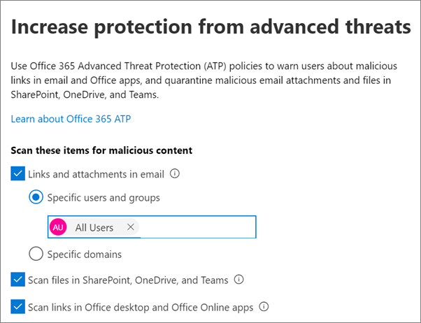

# Erhöhen des Bedrohungsschutzes

Dieser Artikel unterstützt Sie bei der Verbesserung des Schutzes Ihres Microsoft 365-Abonnements zum Schutz vor Phishing, Schadsoftware und anderen Bedrohungen. Diese Empfehlungen sind für Organisationen mit einem erhöhten Sicherheitsbedürfnis geeignet, beispielsweise für politische Kampagnen, Anwaltskanzleien und Kliniken für das Gesundheitswesen. 

Bevor Sie beginnen, überprüfen Sie Ihr Office 365 sicheres Ergebnis. Office 365 Secure Score analysiert die Sicherheit Ihrer Organisation basierend auf Ihren regulären Aktivitäten und Sicherheitseinstellungen und weist eine Bewertung zu. Notieren Sie sich zunächst Ihre aktuelle Bewertung. Wenn Sie die in diesem Artikel empfohlenen Aktionen durchführen, erhöhen Sie die Punktzahl. Ziel ist nicht die maximale Punktzahl, sondern die Möglichkeiten zum Schutz Ihrer Umgebung, die sich negativ auf die Produktivität Ihrer Benutzer auswirken. 

Weitere Informationen finden Sie unter [Microsoft Secure Score](https://docs.microsoft.com/microsoft-365/security/mtp/microsoft-secure-score).

## Erhöhen des Schutzniveaus gegen Schadsoftware in Mail

Ihre Office 365-oder Microsoft 365-Umgebung umfasst Schutz vor Schadsoftware, aber Sie können diesen Schutz verbessern, indem Sie Anlagen mit Dateitypen blockieren, die häufig für Schadsoftware verwendet werden. So stoßen Sie Malware Schutz in e-Mails an:
  
1. Wechseln Sie zu, [https://protection.office.com](https://protection.office.com) und melden Sie sich mit den Anmeldeinformationen Ihres Administratorkontos an. 
    
2. &amp;Wählen Sie im Security Compliance Center im linken Navigationsbereich unter **Threat Management**die Option **Policy** \> **Anti-Malware**aus.
    
3. Doppelklicken Sie auf die Standardrichtlinie, um diese unternehmensweite Richtlinie zu bearbeiten.
    
4. Klicken Sie auf **Einstellungen**.
    
5. Wählen Sie unter **Allgemeine Filter für Anlagentypen**die Option **ein**aus. Die blockierten Dateitypen werden im Fenster direkt unterhalb dieses Steuerelements aufgeführt.  Stellen Sie sicher, dass Sie diese FileTypes hinzufügen:
   - Ade, ADP, Ani, Bas, bat, CHM, cmd, com, CPL, CRT, HLP, HT, HTA, inf, ins, ISP, Job, JS, JSE, lnk, MDA, MDB, MDE, MDZ, MSC, MSI, MSP, MST, PCD, SHS, URL, VB, Visual Basic, VBS, WSC, WSF, WSH, exe, PIF    Sie können Dateitypen bei Bedarf später hinzufügen oder löschen.
    
6. Klicken Sie auf **Speichern**.
    
Weitere Informationen finden Sie unter [Anti-Malware Protection](https://go.microsoft.com/fwlink/?linkid=2015692&amp;clcid=0x409).
  

## Schutz vor Ransomware

Ransomware schränkt den Zugriff auf Daten ein, indem Dateien verschlüsselt oder Computerbildschirme gesperrt werden. Er versucht dann, Geld von den Opfern zu erpressen, indem er nach "Lösegeld" fragt, normalerweise in Form von cryptocurrencies wie Bitcoin, im Gegenzug für den Zugriff auf Daten. 
  
Sie können Schutz vor Ransomware durch Erstellen einer oder mehrerer Nachrichtenfluss Regeln zum Blockieren von Dateierweiterungen, die häufig für Ransomware verwendet werden (diese wurden in der [Erhöhung der Schutz vor Schadsoftware im e-Mail](#raise-the-level-of-protection-against-malware-in-mail) -Schritt hinzugefügt), oder um Benutzer zu warnen, die diese Anlagen in e-Mails empfangen.

Zusätzlich zu den Dateien, die Sie im vorherigen Schritt blockiert haben, empfiehlt es sich auch, eine Regel zu erstellen, um Benutzer vor dem Öffnen von Office-Dateianlagen mit Makros zu warnen. Ransomware können in Makros ausgeblendet werden, daher warnen Sie die Benutzer davor, diese Dateien nicht von Personen zu öffnen, die Sie nicht kennen.

So erstellen Sie eine e-Mail-Transportregel:
  
1. Wechseln Sie zum Admin Center unter <a href="https://go.microsoft.com/fwlink/p/?linkid=837890" target="_blank">https://admin.microsoft.com</a> , und wählen Sie **Admin Center** \> **Exchange**aus.
    
2. Klicken Sie in der Kategorie **Nachrichtenfluss** auf **Regeln**.
    
3. Klicken Sie auf **+** , und klicken Sie dann auf **neue Regel erstellen**.
    
4. Klicken Sie unten im Dialogfeld auf **Weitere Optionen** , um die vollständige Palette von Optionen anzuzeigen. 
    
5. Wenden Sie die Einstellungen in der folgenden Tabelle für die Regel an. Lassen Sie die restlichen Einstellungen standardmäßig unverändert, es sei denn, Sie möchten Sie ändern.
    
6. Klicken Sie auf **Speichern**.
    
|**Einstellung**|**Benutzer vor dem Öffnen von Anlagen von Office-Dateien warnen**||
|:-----|:-----|:-----|
|Name    |Anti-Ransomware-Regel: Benutzer warnen     |
|Wenden Sie diese Regel an, wenn. . .    |Jede Anlage. . . Dateierweiterung entspricht. . .    |
|Angeben von Wörtern oder Ausdrücken    |Fügen Sie diese Dateitypen hinzu:    DOTM, DOCM, XLSM, sltm, XLA, xlam, XLL, PPTM, POTM, PPAM, PPSM, sldm   |
|Führen Sie die folgenden Schritte aus. . .    |Empfänger durch Nachricht benachrichtigen    |
|Nachrichtentext bereitstellen    |Öffnen Sie diese Dateitypen nicht von Personen, die Sie nicht kennen, da Sie möglicherweise Makros mit bösartigem Code enthalten.    |
   
Weitere Informationen finden Sie unter:
  
- [Umgang mit Ransomware](https://go.microsoft.com/fwlink/?linkid=2016501&amp;clcid=0x409)
    
- [Wiederherstellen der OneDrive](https://support.office.com/article/fa231298-759d-41cf-bcd0-25ac53eb8a15.aspx)
    

## Beenden der automatischen Weiterleitung für e-Mail

Hacker, die Zugriff auf das Postfach eines Benutzers erhalten, können Ihre e-Mails stehlen, indem Sie das Postfach so festlegen, dass e-Mails automatisch weitergeleitet werden. Dies kann auch ohne das Bewusstsein des Benutzers geschehen. Sie können dies verhindern, indem Sie eine e-Mail-Fluss Regel konfigurieren. 
  
Um eine e-Mail-Transportregel zu erstellen, schauen Sie sich [Dieses kurze Video](https://support.office.com/article/f9d693ba-5c78-47c0-b156-8e461e062aa7) an, oder führen Sie die folgenden Schritte aus:
  
1. Klicken Sie im Microsoft 365 Admin Center auf **Admin** Centers \> **Exchange**.
    
2. Klicken Sie in der Kategorie **Nachrichtenfluss** auf **Regeln**.
    
3. Klicken Sie auf **+** , und klicken Sie dann auf **neue Regel erstellen**.
    
4. Klicken Sie unten im Dialogfeld auf **Weitere Optionen** , um die vollständige Palette von Optionen anzuzeigen. 
    
5. Wenden Sie die Einstellungen in der folgenden Tabelle an. Lassen Sie die restlichen Einstellungen standardmäßig unverändert, es sei denn, Sie möchten Sie ändern.
    
6. Klicken Sie auf **Speichern**.
    
|**Einstellung**|**Benutzer vor dem Öffnen von Anlagen von Office-Dateien warnen**|
|:-----|:-----|
|Name    |Verhindern der automatischen Weiterleitung von e-Mails an externe Domänen    |
|Diese Regel anwenden, wenn...    |Absender. . . ist extern/intern. . . Innerhalb der Organisation    |
|Bedingung hinzufügen    |Die Nachrichteneigenschaften. . . Geben Sie den Nachrichtentyp ein. . . Automatische Weiterleitung    |
|Führen Sie die folgenden Schritte aus...    |Blockiert die Nachricht. . . die Nachricht ablehnen und eine Erklärung einschließen.    |
|Nachrichtentext bereitstellen    |Die automatische Weiterleitung von e-Mails außerhalb dieser Organisation wird aus Sicherheitsgründen verhindert.    |

## Schützen Ihrer e-Mails vor Phishing-Angriffen

Wenn Sie eine oder mehrere benutzerdefinierte Domänen für Ihre Office 365-oder Microsoft 365-Umgebung konfiguriert haben, können Sie den gezielten Schutz gegen Phishing konfigurieren. Der ATP-Schutz gegen Phishing, ein Teil Office 365 Advanced Threat Protection, kann zum Schutz Ihrer Organisation vor böswilligen Identitätswechsel basierten Phishing-Angriffen und anderen Phishing-Angriffen beitragen. Wenn Sie keine benutzerdefinierte Domäne konfiguriert haben, müssen Sie dies nicht tun.
  
Es wird empfohlen, dass Sie mit diesem Schutz beginnen, indem Sie eine Richtlinie zum Schutz ihrer wichtigsten Benutzer und Ihrer benutzerdefinierten Domäne erstellen. 

Um eine ATP-Anti-Phishing-Richtlinie zu erstellen, schauen Sie sich [Dieses kurze Schulungsvideo](https://support.office.com/article/86c425e1-1686-430a-9151-f7176cce4f2c)an, oder führen Sie die folgenden Schritte aus:
  
1. Wechseln Sie zu [https://protection.office.com](https://protection.office.com). 
    
2. &amp;Wählen Sie im Security Compliance Center im linken Navigationsbereich unter **Bedrohungs Verwaltung**die Option **Richtlinie**aus.
    
3. Wählen Sie auf der Seite **Richtlinie** die Option **ATP Anti-Phishing**aus.
    
4. Wählen Sie auf der Seite **Anti-Phishing** die Option **+ Create**aus. Ein Assistent wird gestartet, der Sie schrittweise durch die Definition ihrer Anti-Phishing-Richtlinie führt.
    
5. Geben Sie den Namen, die Beschreibung und die Einstellungen für Ihre Richtlinie wie im folgenden Diagramm empfohlen an. Weitere Informationen finden Sie unter [Learn about ATP Anti-Phishing Policy Options](https://docs.microsoft.com/microsoft-365/security/office-365-security/set-up-anti-phishing-policies). 
    
6. Nachdem Sie Ihre Einstellungen überprüft haben, wählen Sie **Erstellen Sie diese Richtlinie** oder **Speichern**, je nach Bedarf.
    

|**Einstellung oder Option** |**Empfohlene Einstellung**  |
|:-----|:-----|
|Name    |Domäne und die wertvollsten Kampagnen Mitarbeiter    |
|Beschreibung    |Stellen Sie sicher, dass die meisten wichtigen Mitarbeiter und unsere Domäne nicht angenommen werden.    |
|Zu schützende Benutzer hinzufügen    |Wählen Sie **+ Bedingung hinzufügen, ist der Empfänger**. Geben Sie Benutzernamen ein, oder geben Sie die e-Mail-Adresse des Kandidaten, des Kampagnen Managers und anderer wichtiger Mitarbeiter ein. Sie können bis zu 20 interne und externe Adressen hinzufügen, die Sie vor dem Identitätswechsel schützen möchten.    |
|Zu schützende Domänen hinzufügen    |Wählen Sie **+ Bedingung hinzufügen, die Empfängerdomäne ist**. Geben Sie die benutzerdefinierte Domäne, die Ihrem Microsoft 365-Abonnement zugeordnet ist, ein, wenn Sie eine definiert haben. Sie können mehr als eine Domäne eingeben.    |
|Aktionen auswählen    |Wenn e-Mail von einem imitierten Benutzer gesendet wird: Wählen Sie **Nachricht an eine andere e-Mail-Adresse umleiten**aus, und geben Sie dann die e-Mail-Adresse des Sicherheitsadministrators ein. Beispiel: *Alice   @contoso. com*.          Wenn eine E-Mail von einer imitierten Domäne gesendet wird: Wählen Sie **Nachricht in Quarantäne verschieben**aus.    |
|Mailbox Intelligence    |Standardmäßig wird die Mailbox Intelligence ausgewählt, wenn Sie eine neue Anti-Phishing-Richtlinie erstellen. Lassen Sie diese Einstellung auf **Ein**, um optimale Ergebnisse zu erzielen.    |
|Vertrauenswürdige Absender und Domänen hinzufügen    |Hier können Sie Ihre eigene Domäne oder andere vertrauenswürdige Domänen hinzufügen.    |
|Angewendet auf    |Wählen Sie **Die Domäne des Empfängers ist** aus. Wählen Sie unter **Einer dieser**, **Auswählen** aus. Wählen Sie **+ Hinzufügen** aus. Aktivieren Sie das Kontrollkästchen neben dem Namen der Domäne, beispielsweise *contoso.   com*in der Liste aus, und wählen Sie dann **Hinzufügen**aus. Wählen Sie **Fertig** aus.    |
   
Weitere Informationen finden Sie unter [Einrichten von Office 365 ATP-Richtlinien zum Schutz vor Phishing](https://docs.microsoft.com/microsoft-365/security/office-365-security/set-up-anti-phishing-policies).
  
## Schutz vor böswilligen Anlagen, Dateien und Links mit Advanced Threat Protection (ATP)

Stellen Sie zunächst sicher, dass im Admin Center <a href="https://go.microsoft.com/fwlink/p/?linkid=837890" target="_blank">https://admin.microsoft.com</a> die neue Vorschau für das Admin Center aktiviert ist. Aktivieren Sie die Umschaltfläche neben dem Text **das neue Admin Center**.

   

Wenn die Seite **Setup** noch nicht mit Karten in Ihrem Mandanten angezeigt wird, finden Sie weitere Informationen unter Vorgehensweise beim Ausführen dieser Schritte im Security &amp; Compliance Center. Weitere Informationen finden Sie unter [Einrichten von ATP-Safe Attachments im Security & Compliance Center](#set-up-atp-safe-attachments-in-the-security--compliance-center) und [Einrichten von ATP-Safe-Links im Security & Compliance Center](#set-up-atp-safe-links-in-the-security--compliance-center).

1.  Klicken Sie im linken Navigationsbereich auf **Setup**.
2. Wählen Sie auf der Seite **Setup** die Option **Ansicht** auf der Karte zum **Schutz vor fortgeschrittenen Bedrohungen vergrößern aus** .  
     

3. Wählen Sie auf der Seite **Schutz vor fortgeschrittenen Bedrohungen erweitern** die Option **Erste Schritte**aus.
4. Aktivieren Sie im geöffneten Bereich die Kontrollkästchen neben **Links und Anlagen in e-Mail**, **Dateien in SharePoint, OneDrive**und Microsoft Teams überprüfen und **Links in Office Desktop-und Office Online-apps** unter **Scanelemente für böswillige Inhalte**scannen.

      - Geben Sie unter **Links und Anlagen in e-Mail**alle Benutzer oder die spezifischen Benutzer ein, deren e-Mail gescannt werden soll.

    
5. Wählen Sie **Richtlinien erstellen** aus, um ATP-sichere Anlagen und ATP-sichere Links zu aktivieren.

### Einrichten von ATP-Safe Attachments im Security & Compliance Center

Personen senden, empfangen und teilen regelmäßig Anlagen wie Dokumente, Präsentationen, Tabellenkalkulationen und vieles mehr. Es ist nicht immer einfach zu erkennen, ob eine Anlage sicher oder böswillig ist, indem nur eine e-Mail-Nachricht angezeigt wird. Office 365 Advanced Threat Protection umfasst den Schutz von ATP-Sicherheitsanlagen, dieser Schutz ist jedoch nicht standardmäßig aktiviert. Es wird empfohlen, dass Sie eine neue Regel erstellen, um mit diesem Schutz zu beginnen. Dieser Schutz erstreckt sich auf Dateien in SharePoint, OneDrive und Microsoft Teams.
  
Um eine Richtlinie für eine ATP-sichere Anlage zu erstellen, schauen Sie sich [Dieses kurze Video](https://support.office.com/article/e7e68934-23dc-4b9c-b714-e82e27a8f8a5)an, oder führen Sie die folgenden Schritte aus:
  
1. Wechseln Sie zu, [https://protection.office.com](https://protection.office.com) und melden Sie sich mit Ihrem Administratorkonto an. 
    
2. &amp;Wählen Sie im Security Compliance Center im linken Navigationsbereich unter **Bedrohungs Verwaltung**die Option **Richtlinie**aus.
    
3. Wählen Sie auf der Seite Richtlinie die Option **ATP-sichere Anlagen**aus.
    
4. Wenden Sie diesen Schutz auf der Seite sichere Anlagen allgemein an, indem Sie das Kontrollkästchen **ATP für SharePoint, OneDrive und Microsoft Teams aktivieren** aktivieren. 
    
5. Wählen Sie diese Option aus **+** , um eine neue Richtlinie zu erstellen. 
    
6. Wenden Sie die Einstellungen in der folgenden Tabelle an. 
    
7. Nachdem Sie Ihre Einstellungen überprüft haben, wählen Sie **Erstellen Sie diese Richtlinie** oder **Speichern**, je nach Bedarf.
    

|**Einstellung oder Option**|**Empfohlene Einstellung**  |
|:-----|:-----|
|Name    |Blockiert aktuelle und zukünftige e-Mails mit erkannter Schadsoftware.    |
|Beschreibung    |Blockiert aktuelle und zukünftige e-Mails und Anlagen mit erkannter Schadsoftware.    |
|Anhänge speichern unbekannte Schadsoftware-Antwort    |Wählen Sie **die Option Blockieren der aktuellen und zukünftigen e-Mails und Anlagen mit erkannter Schadsoftware**aus.    |
|Umleitungs Anlage bei der Erkennung    |Umleitung aktivieren (aktivieren Sie dieses Kontrollkästchen) geben Sie das Administratorkonto oder ein Post Fach Setup für Quarantäne ein.          Wenden Sie die obige Auswahl an, wenn bei der Malwareüberprüfung nach Anlagen ein Timeout oder ein Fehler auftritt (aktivieren Sie dieses Kontrollkästchen).    |
|Angewendet auf    |Die Empfängerdomäne ist. . . Wählen Sie Ihre Domäne aus.    |
   
Weitere Informationen finden Sie unter [Einrichten von Office 365 ATP-Richtlinien zum Schutz vor Phishing](https://docs.microsoft.com/microsoft-365/security/office-365-security/set-up-anti-phishing-policies).
  
### Einrichten von ATP-Sicherheits Links im Security & Compliance Center

Hacker verbergen manchmal böswillige Websites in Links in e-Mails oder anderen Dateien. Office 365 ATP-sichere Links (ATP-sichere Links), ein Teil Office 365 Advanced Threat Protection, können zum Schutz Ihrer Organisation beitragen, indem Sie die Zeit-für-Klick-Überprüfung von Webadressen (URLs) in e-Mail-Nachrichten und Office-Dokumenten ermöglichen. Der Schutz wird durch Richtlinien für ATP-sichere Links definiert.
  
Es wird empfohlen, dass Sie die folgenden Schritte ausführen:
  
- Ändern Sie die Standardrichtlinie, um den Schutz zu verbessern.
    
- Fügen Sie eine neue Richtlinie hinzu, die für alle Empfänger in Ihrer Domäne vorgesehen ist.
    
Um ATP-sichere Links einzurichten, schauen Sie sich [Dieses kurze Schulungsvideo](https://support.office.com/article/61492713-53c2-47da-a6e7-fa97479e97fa)an, oder führen Sie die folgenden Schritte aus:
  
1. Wechseln Sie zu, [https://protection.office.com](https://protection.office.com) und melden Sie sich mit Ihrem Administratorkonto an. 
    
2. &amp;Wählen Sie im Security Compliance Center im linken Navigationsbereich unter **Bedrohungs Verwaltung**die Option **Richtlinie**aus.
    
3. Wählen Sie auf der Seite Richtlinie die Option **ATP-sichere Links**aus.
    
So ändern Sie die Standardrichtlinie:
  
1. Wählen Sie auf der Seite sichere Links unter **Richtlinien, die für die gesamte Organisation gelten**, die **Standard** Richtlinie aus. 
    
2. Wählen Sie unter **Einstellungen für Inhalt außer e-Mail**die Option **Microsoft 365 apps for Enterprise, Office für IOS und Android**aus.
    
3. Klicken Sie auf **Speichern**. 
    
So erstellen Sie eine neue Richtlinie, die für alle Empfänger in Ihrer Domäne vorgesehen ist:
  
1. Klicken Sie auf der Seite sichere Links unter **Richtlinien, die für die gesamte Organisation gelten**, auf, **+** um eine neue Richtlinie zu erstellen. 
    
2. Wenden Sie die in der folgenden Tabelle aufgeführten Einstellungen an.
    
3. Klicken Sie auf **Speichern**. 

|**Einstellung oder Option**|**Empfohlene Einstellung**  |
|:-----|:-----|
|Name    |Richtlinie für sichere Links für alle Empfänger in der Domäne    |
|Auswählen der Aktion für unbekannte potenziell bösartige URLs in Nachrichten    |Select **on-URLs werden umgeschrieben und anhand einer Liste bekannter böswilliger Links überprüft, wenn der Benutzer auf den Link klickt**.    |
|Verwenden sicherer Anlagen zum Überprüfen herunterladbarer Inhalte    |Aktivieren Sie dieses Kontrollkästchen.    |
|Angewendet auf    |Die Empfängerdomäne ist. . . Wählen Sie Ihre Domäne aus.    |
   
Weitere Informationen finden Sie unter [Office 365 ATP-sichere Links](https://go.microsoft.com/fwlink/?linkid=2016138&amp;clcid=0x409).
  
## Aktivieren des einheitlichen Überwachungsprotokolls

Nachdem Sie die Überwachungsprotokoll Suche im Security &amp; Compliance Center aktiviert haben, können Sie den Administrator und andere Benutzeraktivitäten im Protokoll beibehalten und durchsuchen. 

Sie müssen der Rolle Überwachungsprotokolle in Exchange Online zugewiesen sein, damit die Überwachungsprotokoll Suche in Ihrem Microsoft 365-Abonnement aktiviert oder deaktiviert wird. Diese Rolle wird standardmäßig der Rollengruppe Compliance Management und Organisationsverwaltung auf der Seite Berechtigungen im Exchange Admin Center zugewiesen. Globale Administratoren in Microsoft 365 sind standardmäßig Mitglieder dieser Gruppe.

1. Wenn Sie die Überwachungsprotokoll Suche aktivieren möchten, wechseln Sie zum Admin Center unter, <a href="https://go.microsoft.com/fwlink/p/?linkid=837890" target="_blank">https://admin.microsoft.com</a> und wählen Sie dann im linken Navigationsbereich die Option **Compliance** unter **Admin Centers** aus. 
2. Wählen Sie auf der Seite **Microsoft 365-Kompatibilität** **Weitere Ressourcen**aus, und **Öffnen** Sie dann auf der **Office 365 Security &amp; Center** -Karte.

    
3. Wählen Sie auf der Seite Sicherheit und Kompatibilität die Option **Suche** und dann **Überwachungsprotokoll Suche**aus.
1. Wählen Sie oben auf der Seite **Überwachungsprotokoll Suche** die Option **Überwachung aktivieren**aus.

Nachdem das Feature aktiviert wurde, können Sie nach Dateien, Ordnern und vielen Aktivitäten suchen. Weitere Informationen finden Sie unter [Durchsuchen des Überwachungsprotokolls](https://docs.microsoft.com/microsoft-365/compliance/search-the-audit-log-in-security-and-compliance).

## Optimieren anonymer Freigabeeinstellungen für SharePoint-und OneDrive-Dateien und-Ordner

(Ändern des Standard Ablaufs für anonyme Links auf 14 Tage, Ändern des Standardfreigabe Typs in "bestimmte Personen") So ändern Sie die Freigabeeinstellungen für OneDrive und SharePoint:
1. Wechseln Sie zum Admin Center bei <a href="https://go.microsoft.com/fwlink/p/?linkid=837890" target="_blank">https://admin.microsoft.com</a> , und wählen Sie dann **SharePoint** unter **Admin Centers** im linken Navigationsbereich aus. 
2. Wechseln Sie im SharePoint Admin Center zu **Richtlinien** \> **Freigeben**.
3. Wählen Sie auf der Seite **Freigabe** unter **Datei-und Ordner Links**die Option **bestimmte Personen**aus, und wählen Sie unter **Erweiterte Einstellungen für "jeder"** die Option **diese Links müssen innerhalb dieser vielen Tage ablaufen**, und geben Sie 14 ein (oder eine andere Anzahl von Tagen, auf die Sie die Link Lebensdauer beschränken möchten).

    

## Aktivitäts Warnungen

Sie können Aktivitäts Warnungen zum Nachverfolgen von Administrator-und Benutzeraktivitäten sowie zum Erkennen von Schadsoftware und Vorfällen zur Verhinderung von Datenverlust in Ihrer Organisation verwenden. Ihr Abonnement enthält eine Reihe von Standardrichtlinien, aber Sie können auch benutzerdefinierte Richtlinien erstellen. Weitere Informationen finden Sie unter [Warnungsrichtlinien](https://docs.microsoft.com/microsoft-365/compliance/alert-policies). Wenn Sie beispielsweise eine wichtige Datei in SharePoint speichern, die nicht von allen Personen extern freigegeben werden soll, können Sie eine Benachrichtigung erstellen, mit der Sie benachrichtigt werden, wenn Sie von einer anderen Person freigegeben wird.

In der folgenden Abbildung sind die Standardrichtlinien aufgeführt, die in Microsoft 365 enthalten sind.   
    

## Deaktivieren oder Verwalten der Kalenderfreigabe

Sie können verhindern, dass Personen in Ihrer Organisation ihre Kalender freigeben, oder Sie können auch verwalten, was Sie freigeben können. Beispielsweise können Sie die Freigabe nur auf Frei/Gebucht-Zeiten beschränken.

1. Wechseln Sie zum Admin Center unter <a href="https://go.microsoft.com/fwlink/p/?linkid=837890" target="_blank">https://admin.microsoft.com</a> , und wählen Sie **Einstellungen** \> **Dienste & Add-ins**aus.
2. Wählen Sie auf der Seite **Dienste &-Add-ins** die Option **Kalender**aus, und wählen Sie aus, ob Personen in Ihrer Organisation ihre Kalender für Personen freigeben können, die sich außerhalb von Office 365 oder Exchange oder mit anderen Personen befinden. 
    Wenn Sie die Option für jeden freigeben auswählen, können Sie auch nur Frei/Gebucht-Informationen freigeben.

3. Klicken Sie unten auf der Seite auf **Änderungen speichern** .

    Die folgende Abbildung zeigt, dass die Kalenderfreigabe nicht zulässig ist.   
    

    In der folgenden Abbildung sind die Einstellungen dargestellt, wenn die Kalenderfreigabe mit einem e-Mail-Link nur mit Frei/Gebucht-Informationen zulässig ist.

   

Wenn Ihre Benutzer ihre Kalender freigeben dürfen, lesen Sie [diese Anweisungen](https://support.office.com/article/7ecef8ae-139c-40d9-bae2-a23977ee58d5) zum Freigeben von Outlook im Internet.
