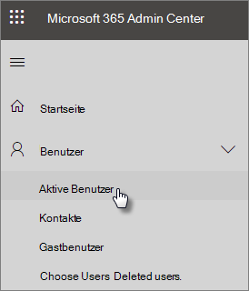
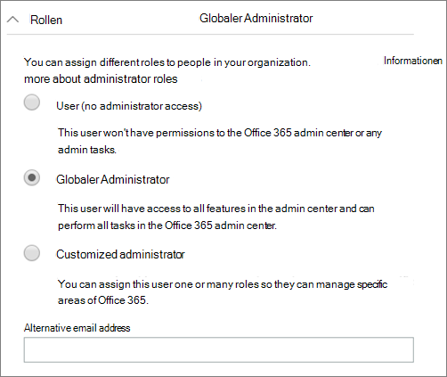

# Schützen Ihrer AdministratorkontenProtect your administrator accounts

Da Administratorkonten mit erhöhten Rechten ausgestattet sind, sind Sie wertvolle Ziele für Hacker und Cyber-Kriminelle.Because admin accounts come with elevated privileges, they're valuable targets for hackers and cyber criminals. Inhalt dieses ArtikelsThis article describes:

- Einrichten eines zusätzlichen Administratorkontos für Notfälle.How to set up an additional administrator account for emergencies.
- Wie diese Konten geschützt werden.How to protect these accounts.
 
Wenn Sie sich für Microsoft 365 Business registrieren und Ihre Informationen eingeben, werden Sie automatisch zum globalen Administrator. Ein globaler Administrator hat die ultimative Kontrolle über Benutzerkonten und alle anderen Einstellungen im Microsoft Admin Center, aber es gibt viele verschiedene Arten von Administratorkonten mit unterschiedlichem Zugriffs Grad.When you sign up for Microsoft 365 Business and enter your information, you automatically become the global admin. A global admin has the ultimate control of user accounts and all the other settings in the Microsoft admin center, but there are many different kinds of admin accounts with varying degrees of access. Unter Informationen zu [Administratorrollen](https://docs.microsoft.com/office365/admin/add-users/about-admin-roles) finden Sie Informationen zu den verschiedenen Zugriffsebenen für jede Art von Administratorrolle.See [about admin roles](https://docs.microsoft.com/office365/admin/add-users/about-admin-roles) for information about the different access levels for each kind of admin role.

## Erstellen zusätzlicher AdministratorkontenCreate additional admin accounts

Verwenden Sie Administratorkonten nur für die Verwaltung.Use admin accounts only for administration. Administratoren sollten über ein separates Benutzerkonto für die regelmäßige Verwendung von Office-Apps verfügen und bei Bedarf nur Ihr Administratorkonto verwenden, um Konten und Geräte zu verwalten, sowie bei der Arbeit an anderen Verwaltungsfunktionen.Admins should have a separate user account for regular use of Office apps and only use their administrative account when necessary to manage accounts and devices, and while working on other admin functions. Es empfiehlt sich auch, die Microsoft 365 Business License aus den Administratorkonten zu entfernen, damit Sie nicht dafür bezahlen müssen.It's also a good idea to remove the Microsoft 365 Business license from the admin accounts so you don't have to pay for them.

Sie möchten mindestens ein zusätzliches globales Administratorkonto einrichten, um Administratorzugriff auf einen anderen vertrauenswürdigen Mitarbeiter zu erhalten.You'll want to set up at least one additional global admin account to give admin access to another trusted employee. Sie können auch separate Administratorkonten für die Benutzerverwaltung erstellen (diese Rolle wird als **Benutzer Verwaltungs Administrator**bezeichnet).You can also create separate admin accounts for user management (this role is called **User management administrator**). Weitere Informationen finden Sie unter [Informationen zu Administratorrollen](https://docs.microsoft.com/office365/admin/add-users/about-admin-roles).For more information, see [about admin roles](https://docs.microsoft.com/office365/admin/add-users/about-admin-roles).

So erstellen Sie zusätzliche Administratorkonten:To create additional admin accounts:

 1. Wechseln Sie zum <a href="https://go.microsoft.com/fwlink/p/?linkid=837890" target="_blank">Admin Center</a> , und wählen Sie dann **Benutzer** \> **aktive Benutzer** im linken Navigationsbereich aus.Go to the <a href="https://go.microsoft.com/fwlink/p/?linkid=837890" target="_blank">admin center</a> and then choose **Users** \> **Active users** in the left nav.

    

2. Wählen Sie auf der Seite **aktive Benutzer** oben auf der Seite **einen Benutzer hinzufügen** aus, und geben Sie im Bereich **neuer Benutzer** den Namen und andere Informationen ein.On the **Active users** page, select **Add a user** at the top of the page, and on the **New user** panel, enter the name and other information.
3. Erweitern Sie den Abschnitt **Rollen** , und wählen Sie **globaler Administrator** aus, um diesem Benutzer den globalen Administratorzugriff zu gewähren.Expand the **Roles** section, and choose **Global administrator** to give this user global admin access. Sie können auch **benutzerdefinierten Administrator** auswählen und eine der Rollen auswählen, die angezeigt werden.You can also choose **Customized administrator** and choose any of the roles that are displayed.

    Geben Sie eine Alternative e-Mail in das Textfeld **Alternative e-Mail-Adresse** ein.Enter an alternate email in the **Alternative email address** text box. Sie können diese Adresse verwenden, um Ihre Kennwortinformationen wiederherzustellen, wenn Sie gesperrt werden. Für globale Administratoren wird auch eine Abrechnungs Anweisung an diese Adresse gesendet.You can use this address to recover your password information if you get locked out. For global admins, a billing statement will also be sent to this address.

    
    
4. Stellen Sie im Abschnitt **Produktlizenzen** den Selektor für **Microsoft 365 Business** auf **aus** , und legen Sie den **Benutzer ohne Produktlizenz** auf **ein**.In the **Product licenses** section, move the selector for **Microsoft 365 Business** to **Off** and the **Create user without product license** to **On**.

    

## Erstellen eines Notfall AdministratorkontosCreate an emergency admin account

Sie sollten auch ein sicherungskonto erstellen, das nicht mit mehrstufiger Authentifizierung (Multi-Factor Authentication, MFA) eingerichtet ist, damit Sie sich nicht versehentlich selbst verschließen (beispielsweise wenn Sie Ihr Telefon verlieren, das Sie als zweite Überprüfung verwenden).You should also create a backup account that isn't set up with multi-factor authentication (MFA) so you don't accidentally lock yourself out (for example if you lose your phone that you're using as a second form of verification). Stellen Sie sicher, dass das Kennwort für dieses Konto ein Ausdruck oder mindestens 16 Zeichen lang ist.Make sure that the password for this account is a phrase or at least 16 characters long. Dies wird häufig als "Break-Glass-Konto" bezeichnet.This is often referred to as a "break-glass account."

## Erstellen eines Benutzerkontos für sich selbstCreate a user account for yourself

Verwenden Sie Ihr Benutzerkonto, um an der Zusammenarbeit mit Ihrer Organisation teilzunehmen, einschließlich der Überprüfung von e-Mails.Use your user account to participate in collaboration with your organization, including checking mail. Das heißt, Ihre Administratoranmeldeinformationen ähneln möglicherweise *Alice. Chavez@contoso. org* , und Ihr reguläres Benutzerkonto ähnelt *Alice@contoso. com*.This means your admin credentials might be similar to  *Alice.Chavez@Contoso.org* and your regular user account might be similar to *Alice@Contoso.com*.

So erstellen Sie ein neues Benutzerkonto:To create a new user account:
1. Wechseln Sie zum <a href="https://go.microsoft.com/fwlink/p/?linkid=837890" target="_blank">Admin Center</a> , und wählen Sie dann **Benutzer** \> **aktive Benutzer** im linken Navigationsbereich aus.Go to the <a href="https://go.microsoft.com/fwlink/p/?linkid=837890" target="_blank">admin center</a> and then choose **Users** \> **Active users** in the left nav.
2. Wählen Sie auf der Seite **aktive Benutzer** oben auf der Seite **einen Benutzer hinzufügen** aus, und geben Sie im Bereich **neuer Benutzer** den Namen und andere Informationen ein.On the **Active users** page, select **Add a user** at the top of the page, and on the **New user** panel, enter the name and other information.
3. Erweitern Sie den Abschnitt **Rollen** , und wählen Sie **Benutzer (kein Administratorzugriff)** aus.Expand the **Roles** section, and choose **User (no administrative access)**.
1. Stellen Sie im Abschnitt **Produktlizenzen** den Selektor für **Microsoft 365 Business** auf **ein**.In the **Product licenses** section, move the selector for **Microsoft 365 Business** to **On**. 

## Registrieren jedes dieser Konten für mehrstufige AuthentifizierungRegister each of these accounts for multi-factor authentication

## Weitere EmpfehlungenAdditional recommendations

- Stellen Sie sicher, dass auch Administratorkonten für die mehrstufige Authentifizierung eingerichtet sind.Be sure that admin accounts are also set up for multi-factor authentication. In diesem Artikel erfahren Sie, wie Sie die [Richtlinien für bedingten Zugriff konfigurieren](m365-campaigns-conditional-access.md).We'll show you how to do this in [Configure conditional access policies](m365-campaigns-conditional-access.md).
- Schließen Sie vor der Verwendung von Administratorkonten alle nicht verwandten Browsersitzungen und apps, einschließlich persönlicher e-Mail-Konten.Before using admin accounts, close out all unrelated browser sessions and apps, including personal email accounts. Sie können auch in privaten oder inkognito-Browserfenstern verwenden.You can also use in private, or incognito browser windows.
- Nachdem Sie die Administratoraufgaben abgeschlossen haben, müssen Sie sich bei der Browsersitzung abmelden.After completing admin tasks, be sure to sign out of the browser session.
