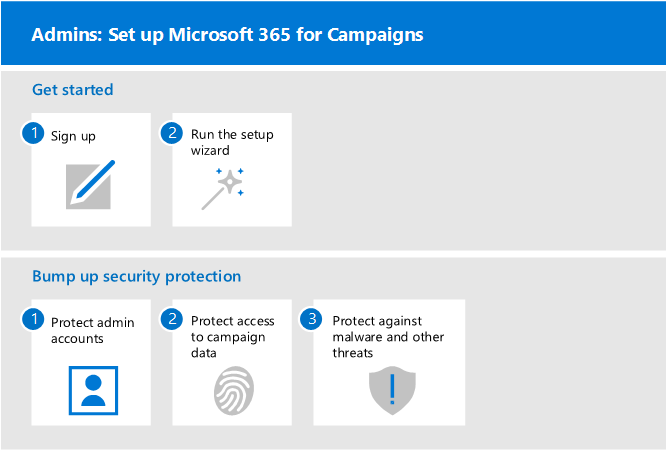

# Einrichten von Microsoft 365 für KampagnenSet up Microsoft 365 for Campaigns

In diesem Artikel wird der Vorgang des Einrichtens von Microsoft 365 für Kampagnen beschrieben.This article describes the process of setting up Microsoft 365 for Campaigns. Jeder mit Microsoft 365 Business kann diese Anleitung verwenden, um die Sicherheit zu verstärken.Anybody with Microsoft 365 Business can use this guidance to step up security. 

## Administratoren: Einrichten von Microsoft 365 für KampagnenAdmins: Set up Microsoft 365 for Campaigns
Im folgenden Diagramm wird beschrieben, wie Microsoft 365 für Kampagnen von Administratoren eingerichtet wurde.The following diagram describes how admins set up Microsoft 365 for Campaigns.

Für Kampagnen, die sich für spezielle Preise qualifizieren, beginnen Sie mit dem [Anfordern einer Einladung von Microsoft](https://m365forcampaigns.microsoft.com/), und melden [Sie sich dann bei Microsoft 365 für Kampagnen](m365-campaigns-sign-up.md)an.For campaigns that qualify for special pricing, get started by [requesting an invite from Microsoft](https://m365forcampaigns.microsoft.com/), then [signing up for Microsoft 365 for Campaigns](m365-campaigns-sign-up.md). Führen Sie zum Abschließen [des Setups den Setup-Assistenten](../business/set-up.md?toc=/microsoft-365/campaigns/toc.json) aus, um die Kerneinstellungen zu konfigurieren.To complete setup, [run the setup wizard](../business/set-up.md?toc=/microsoft-365/campaigns/toc.json) to configure the core settings.

Für alle anderen Organisationen, nachdem Sie [sich für Microsoft 365 Business registriert](../business/sign-up.md)haben, führen Sie das Setup durch [Ausführen des Setup-Assistenten](../business/set-up.md?toc=/microsoft-365/campaigns/toc.json) aus, um die Kerneinstellungen zu konfigurieren.For all other organizations, after you've [signed up for Microsoft 365 Business](../business/sign-up.md), complete setup by [running the setup wizard](../business/set-up.md?toc=/microsoft-365/campaigns/toc.json) to configure the core settings.

Stoßen Sie für alle Organisationen Sicherheitsschutz durch: [Schützen von Administratorkonten](m365-campaigns-protect-admin-accounts.md), [Schützen des Zugriffs auf e-Mails und Daten](m365-campaigns-conditional-access.md)und [erhöhen des Bedrohungsschutzes](m365-campaigns-increase-protection.md).For all organizations, bump up security protection by: [protecting admin accounts](m365-campaigns-protect-admin-accounts.md), [protecting access to mail and data](m365-campaigns-conditional-access.md), and [increasing threat protection](m365-campaigns-increase-protection.md).

 ## Jeder: Einrichten der GeräteEveryone: Set up your devices 
 
Benutzer müssen sich einige Minuten Zeit nehmen, um Geräte für die Verwendung dieser Umgebung einzurichten.Users will need to take a few minutes to set up devices to work with this environment. Für Ihre Hauptbenutzer (diejenigen, die die höchsten Wert Ziele für Hacker sind) können Sie neue Geräte einrichten und vorab konfigurieren.For your key users (those who are the highest value targets for hackers), you can set up and pre-configure new devices. Auf diese Weise können Sie beginnen, wenn Sie sich mit Ihren Microsoft 365-Anmeldeinformationen anmelden.This helps them to get started when they sign in with their Microsoft 365 credentials. 

  
So richten Sie Benutzer Geräte ein:To set up user devices: 
1. Jeder Benutzer [richtet seine mobilen Geräte](../business/set-up-mobile-devices.md?toc=%2Fmicrosoft-365%2Fcampaigns%2Ftoc.json)ein.Each user [sets up their mobile devices](../business/set-up-mobile-devices.md?toc=%2Fmicrosoft-365%2Fcampaigns%2Ftoc.json). 
2. Bei nicht verwalteten Geräten richten Benutzer ihre [PCs und Macs](m365-campaigns-protect-pcs-macs.md)ein.For unmanaged devices, users set up their [PCs and Macs](m365-campaigns-protect-pcs-macs.md). Für wichtige Mitarbeiter wird empfohlen, dass Sie [verwaltete Geräte](../business/set-up-windows-devices.md?toc=/microsoft-365/campaigns/toc.json) für einen noch besseren Schutz verwenden.For key staff, we recommend that you use [managed devices](../business/set-up-windows-devices.md?toc=/microsoft-365/campaigns/toc.json) for even better protection. Für alle Geräte sollten Sie die mehrstufige [Authentifizierung](m365-campaigns-multifactor-authenication.md)einrichten.For all devices, you'll want to set up [multifactor authentication](m365-campaigns-multifactor-authenication.md). 
3. Alle Benutzer sollten erfahren, wie Sie sich selbst und Ihre Kampagne schützen, indem Sie über [Phishing und andere Angriffe](m365-campaigns-phishing-and-attacks.md)lernen.All users should learn how to protect themselves and your campaign by learning about [phishing and other attacks](m365-campaigns-phishing-and-attacks.md). Diese [Infografik](m365-campaigns-protect-campaign-infographic.md) kann Ihren Benutzern auch helfen, zu verstehen, wie Sie Ihre Kampagne vor Onlinebedrohungen schützen.This [infographic](m365-campaigns-protect-campaign-infographic.md) can also help your users understand how to help protect your campaign from online threats.

## wenden Sie sich an den Support,Contact support

 **Wenn Sie den Support kontaktieren müssen:****If you need to contact support:**
  
Als Microsoft 365 Business-Administrator haben Sie Zugriff auf unser Kundensupport Team, \*\* [kontaktieren des Supports für Business-Produkte – Administratorhilfe](https://support.office.com/article/32a17ca7-6fa0-4870-8a8d-e25ba4ccfd4b)\*\*As a Microsoft 365 Business admin, you have access to our customer support team, **[Contact support for business products - Admin Help](https://support.office.com/article/32a17ca7-6fa0-4870-8a8d-e25ba4ccfd4b)**
    

