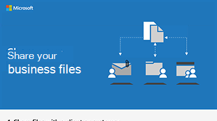

# Freigeben von Dateien und Videos

Wenn Sie steuern müssen, wer Ihre Dateien anzeigen kann und wer Sie bearbeiten kann, müssen Sie die Dateien an einem sicheren Ort speichern, wo Sie sicherstellen können, dass die Berechtigungen ordnungsgemäß angewendet werden. Sie können Microsoft Teams verwenden, um Ihre Dateien zu speichern und die Dateien dann entweder innerhalb oder außerhalb Ihrer Kampagne mithilfe von Microsoft Teams oder durch Senden von SharePoint-Links freizugeben. Wenn Sie einen Link anstelle einer e-Mail-Anlage senden, wissen Sie, wer die Dateien anzeigt und ändert, und Sie können ohne Ihre Berechtigung nicht angezeigt oder geändert werden. 

Mit Ihren Dateien in Microsoft Teams und SharePoint können Sie die Dateien auch zusammen bearbeiten und sich gegenseitig die Änderungen ansehen. Verwenden Sie Microsoft Teams, um Dateien innerhalb einer politischen Kampagne freizugeben. Wenn Sie extern für Personen außerhalb der Kampagne freigeben möchten, können Sie diese als Gäste zu einem Team hinzufügen oder Ihnen eine sichere SharePoint-Verknüpfung senden.

Sie können auch Microsoft Stream zum Speichern und Freigeben von Videos für Ihre Kampagne verwenden. Diese Videos sind für die Öffentlichkeit nicht sichtbar, daher eignen Sie sich ideal für interne Kampagnen Nachrichten.

## Bewährte Methoden

Verwenden Sie diese Methoden, um Dateien und Videos sicher freizugeben:

1. Speichern Sie Dateien in Microsoft Teams oder SharePoint, und stellen Sie sicher, dass nur die Personen, die Zugriff auf diese Dateien benötigen, diese besitzen. 
2. Wenn Sie freigeben möchten, fügen Sie keine Dateien an eine e-Mail an. Wählen Sie stattdessen **Link** aus Microsoft Teams oder SharePoint abrufen aus, und senden Sie den Link in der e-Mail.
3. Wenn Sie eine Datei extern freigeben möchten, fügen Sie den Benutzer Ihrem Team als Gast hinzu, oder verwenden Sie SharePoint, um einen sicheren Link zu erhalten, um nur diese Datei freizugeben.
4. Verwenden Sie Microsoft Stream, um Videos zu hosten, die Ihre Kampagne anzeigen soll. 
5. Verwenden Sie Microsoft Teams oder SharePoint zum Speichern von Videodateien, für die Ihr Team zusammenarbeiten oder freigeben muss.

 
## Einrichten

Führen Sie die folgenden Schritte aus, um ein Team zu erstellen und Gäste wie Inserenten oder Finanzierungspartner hinzuzufügen.

> [!VIDEO https://www.microsoft.com/videoplayer/embed/RE1FQMp]

Wenn Sie einen sicheren Link für einen Gast freigeben möchten, ohne Microsoft Teams zu verwenden, führen Sie die folgenden Schritte aus:

> [!VIDEO https://www.microsoft.com/videoplayer/embed/RE22Yf0]

Führen Sie die folgenden Schritte aus, um Videos zu erstellen und freizugeben.

> [!VIDEO https://www.microsoft.com/videoplayer/embed/RWrv0F]

Laden Sie eine Infografik in [PDF](https://go.microsoft.com/fwlink/?linkid=2079435) oder [PowerPoint](https://go.microsoft.com/fwlink/?linkid=2079438) herunter, um einen schnellen Überblick über die Möglichkeiten zum Freigeben von Dateien zu erhalten.

