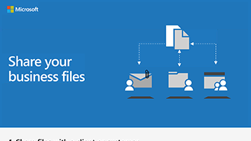

# Freigeben von Dateien und VideosShare files and videos

Wenn Sie steuern müssen, wer Ihre Dateien anzeigen und bearbeiten kann, müssen Sie die Dateien an einem sicheren Ort speichern, an dem Sie sicherstellen können, dass die Berechtigungen entsprechend angewendet werden.When you need to control who can view and who can edit your files, you need to store the files in a secure location, where you can make sure permissions are applied appropriately. Sie können Microsoft Teams verwenden, um Ihre Dateien zu speichern, und dann die Dateien entweder innerhalb oder außerhalb Ihrer Firma, Praxis oder Kampagne mithilfe von Microsoft Teams oder durch Senden von SharePoint-Links freigeben.You can use Microsoft Teams to store your files, and then share the files either inside or outside of your firm, practice, or campaign by using Microsoft Teams or by sending SharePoint links. Das Senden eines Links anstelle einer E-Mail-Anlage bedeutet, dass Sie wissen, wer die Dateien anzeigen und ändern kann, und dass sie ohne Ihre Erlaubnis nicht angezeigt oder geändert werden können.Sending a link rather than an email attachment means that you know who is viewing and modifying the files, and they can't be viewed or modified without your permission.

Mit Ihren Dateien in Microsoft Teams und SharePoint können Sie auch gemeinsam an den Dateien arbeiten und sich gegenseitig ihre Änderungen überprüfen.With your files in Microsoft Teams and SharePoint, you can also work on the files together and review each other's changes. Verwenden Sie Microsoft Teams, um Dateien innerhalb eines Unternehmens, einer Praxis oder einer Kampagne zu teilen.Use Microsoft Teams to share files inside of a firm, practice, or campaign. Wenn Sie externe Freigaben für Personen außerhalb Ihrer Organisation benötigen, können Sie sie als Gäste zu einem Team hinzufügen oder ihnen einen sicheren SharePoint-Link senden.If you need to share externally with people outside your organization, you can add them as guests to a team or send them a secure SharePoint link.

Sie können Microsoft Stream auch verwenden, um Videos intern zu speichern und zu teilen.You can also use Microsoft Stream to store and share videos internally. Diese Videos können nicht für die Öffentlichkeit angezeigt werden, sodass sie ideal für interne Kampagnennachrichten geeignet sind.These videos are not viewable to the public so they are ideal for internal campaign messaging.

## Bewährte MethodenBest practices

Verwenden Sie diese Methoden, um Dateien und Videos sicher zu teilen:Use these methods to share files and videos securely:

1. Speichern Sie Dateien in Microsoft Teams oder SharePoint, und stellen Sie sicher, dass nur die Personen, die Zugriff auf diese Dateien benötigen, diese haben.Store files in Microsoft Teams or SharePoint, and make sure that only the people who need access to those files have them.
2. Wenn Sie freigeben möchten, fügen Sie keine Dateien an eine E-Mail an.When you want to share, don't attach files to an email. Wählen Sie stattdessen **"Link von** Microsoft Teams oder SharePoint erhalten" aus, und senden Sie den Link per E-Mail.Instead, choose **Get link** from Microsoft Teams or SharePoint and send the link in email.
3. Wenn Sie eine Datei extern freigeben möchten, fügen Sie den Benutzer als Gast zu Ihrem Team hinzu, oder verwenden Sie SharePoint, um einen sicheren Link zum Freigeben dieser Datei zu erhalten.To share a file externally, add the user as a guest to your team, or use SharePoint to get a secure link to share just that file.
4. Verwenden Sie Microsoft Stream, um Videos zu hosten, die Ihre Kampagne anzeigen soll.Use Microsoft Stream to host videos you want your campaign to see.
5. Verwenden Sie Microsoft Teams oder SharePoint, um Videodateien zu speichern, die Ihr Team für die Zusammenarbeit oder Freigabe benötigt.Use Microsoft Teams or SharePoint to store video files you need your team to collaborate on or share.

## EinrichtenSet up

Führen Sie die folgenden Schritte aus, um ein Team zu erstellen und Gäste hinzuzufügen, z. B. Werbekunden oder Finanzpartner.To create a team and add guests, like advertisers or financing partners, to it, follow these steps.

> [!VIDEO https://www.microsoft.com/videoplayer/embed/RE1FQMp]

Führen Sie die folgenden Schritte aus, um einen sicheren Link für einen Gast ohne Verwendung von Microsoft Teams zu teilen.To share a secure link with a guest, without using Microsoft Teams, follow these steps.

> [!VIDEO https://www.microsoft.com/videoplayer/embed/RE22Yf0]

Führen Sie die folgenden Schritte aus, um Videos zu erstellen und zu teilen.To create and share videos, follow these steps.

> [!VIDEO https://www.microsoft.com/videoplayer/embed/RWrv0F]

Laden Sie eine Infografik in [PDF](https://go.microsoft.com/fwlink/?linkid=2079435) oder [PowerPoint herunter,](https://go.microsoft.com/fwlink/?linkid=2079438) um einen schnellen Überblick über die Möglichkeiten zum Freigeben Ihrer Dateien zu erhalten.Download an infographic in [PDF](https://go.microsoft.com/fwlink/?linkid=2079435) or [PowerPoint](https://go.microsoft.com/fwlink/?linkid=2079438) to get a quick overview of ways to share your files.

