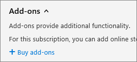

# Hinzufügen von Speicherplatz für Ihr Abonnement

Wenn der Speicherplatz für Ihre SharePoint Online Websitesammlungen nicht mehr zur Verfügung steht, können Sie Ihrem Abonnementspeicher hinzufügen, wenn Ihr Plan berechtigt ist. Wenn in der Liste der verfügbaren Add-ons der **Office 365 zusätzliche Dateispeicherung** nicht angezeigt wird, bedeutet dies, dass Ihr Plan nicht berechtigt ist. Weitere Informationen finden Sie unter [ist mein Plan berechtigt?](#is-my-plan-eligible-for-office-365-extra-file-storage)

## Anzeigen des verfügbaren Speicherplatzes

::: moniker range="o365-worldwide"

1. Melden Sie sich bei https://admin.microsoft.com als globaler oder SharePoint-Administrator an. (Wenn eine Nachricht angezeigt wird, dass Sie keine Berechtigung zum Zugreifen auf die Seite haben, haben Sie keine Office 365-Administratorberechtigungen in Ihrer Organisation.)
    
2. Wählen Sie im linken Bereich unter **Admin Center**die Option **SharePoint**aus. Wenn das klassische SharePoint Admin Center angezeigt wird, wählen Sie **Jetzt öffnen** am oberen Rand der Seite aus, um das neue SharePoint Admin Center zu öffnen. 
    
3. Wählen Sie im linken Bereich des neuen SharePoint Admin Center **Aktive Websites** aus.

4. In der oberen rechten Ecke der Seite sehen Sie, wie viel Speicherplatz für alle Websites verwendet wird, und den Gesamtspeicher für Ihr Abonnement. (Wenn Ihre Organisation Multi-Geo in Office 365 konfiguriert hat, zeigt der Balken auch die Menge an Speicherplatz an, die für alle geografischen Standorte verwendet wird.) 

::: moniker-end

::: moniker range="o365-germany"

1. Melden Sie sich https://portal.office.de bei als globaler oder SharePoint-Administrator an, und wählen Sie dann die Kachel admin aus, um das Admin Center zu öffnen. (Wenn eine Meldung angezeigt wird, dass Sie keine Berechtigung für den Zugriff auf die Seite haben, verfügen Sie nicht über Office 365 Administratorberechtigungen in Ihrer Organisation.)
    
2. Wählen Sie im linken Bereich unter **Admin Center**die Option **SharePoint**aus. Wenn das klassische SharePoint Admin Center angezeigt wird, wählen Sie **Jetzt öffnen** am oberen Rand der Seite aus, um das neue SharePoint Admin Center zu öffnen. 
    
3. Wählen Sie im linken Bereich des neuen SharePoint Admin Center **Aktive Websites** aus.

4. In der oberen rechten Ecke der Seite sehen Sie, wie viel Speicherplatz für alle Websites verwendet wird, und den Gesamtspeicher für Ihr Abonnement. 

::: moniker-end

::: moniker range="o365-21vianet"

1. Melden Sie sich https://login.partner.microsoftonline.cn/ bei als globaler oder SharePoint-Administrator an, und wählen Sie dann die Kachel admin aus, um das Admin Center zu öffnen. (Wenn eine Meldung angezeigt wird, dass Sie keine Berechtigung für den Zugriff auf die Seite haben, verfügen Sie nicht über Office 365 Administratorberechtigungen in Ihrer Organisation.)
     
2. Wählen Sie im linken Bereich unter **Admin Center**die Option **SharePoint**aus. Wenn das klassische SharePoint Admin Center angezeigt wird, wählen Sie **Jetzt öffnen** am oberen Rand der Seite aus, um das neue SharePoint Admin Center zu öffnen. 
    
3. Wählen Sie im linken Bereich des neuen SharePoint Admin Center **Aktive Websites** aus.

4. In der oberen rechten Ecke der Seite sehen Sie, wie viel Speicherplatz für alle Websites verwendet wird, und den Gesamtspeicher für Ihr Abonnement.  

::: moniker-end

> [!NOTE]
> Der verwendete Speicher umfasst keine Änderungen, die innerhalb der letzten 24-48 Stunden vorgenommen wurden. 

Nachdem Sie festgestellt haben, wie viel Speicherplatz Sie verwenden, können Sie Speicherplatz für Ihr Abonnement hinzufügen oder entfernen. Um herauszufinden, wie viel Speicherplatz hinzugefügt werden kann, befolgen Sie die Schritte in diesem Artikel, und überprüfen Sie die Preisinformationen vor dem Kauf.
  
Informationen zum Festlegen von Speichergrenzwerten für Websitesammlungen finden Sie unter [Manage Site Collection Storage Limits](https://docs.microsoft.com/sharepoint/manage-site-collection-storage-limits).
  
## Hinzufügen von Speicher zu Ihrem Abonnement

Wenn Sie noch keinen zusätzlichen Speicherplatz für Ihr Abonnement erworben haben, können Sie dies tun.

::: moniker range="o365-worldwide"

> [!NOTE]
> Wenn Sie das neue Microsoft 365 Admin Center nicht verwenden, können Sie es aktivieren, indem Sie den Umschalter **Das neue Admin Center** am oberen Rand der Startseite auswählen.

1. Wechseln Sie im Admin Center zur Seite **Abrechnungs** \> - <a href="https://go.microsoft.com/fwlink/p/?linkid=868433" target="_blank">Einkaufsdienste</a> .

2. Wählen Sie unten auf der Seite " **Einkaufsdienste** " **Add-ons**aus.

3. Wählen Sie **Office 365 zusätzlichen Dateispeicher**aus.

4. Wählen Sie auf der Seite **zusätzliche Dateispeicher Office 365** , falls angezeigt, das Basisabonnement aus, und geben Sie dann die Anzahl von Gigabyte Speicher ein, die Sie hinzufügen möchten.

5. Wählen Sie **jetzt Auschecken aus**.

6. Überprüfen Sie auf der Seite **wie sieht** das aus? die Anzahl von Gigabytes Speicher, die Sie ausgewählt haben, überprüfen Sie die Preisinformationen, und wählen Sie dann **weiter**aus.

7. Überprüfen Sie auf der Seite **vollständige Bestellung** die Summe. Wenn Sie Änderungen vornehmen müssen, wählen Sie **Bestellung bearbeiten**aus. Wenn für die Bestellung eine Bonitätsprüfung erforderlich ist, aktivieren Sie das Kontrollkästchen. Wenn Sie fertig sind, klicken Sie auf \> **Bestellung aufgeben** , **um zu admin Home zu wechseln**.

::: moniker-end

::: moniker range="o365-germany"

1. Wechseln Sie im Admin Center zur Seite **Abrechnungs** \> <a href="https://go.microsoft.com/fwlink/p/?linkid=847745" target="_blank">Abonnements</a> .  

2. Wählen Sie auf der Seite **Abonnements** das Abonnement aus, dem Sie Speicherplatz hinzufügen möchten, und wählen Sie dann **Add-ons**aus.

    
  
    > [!NOTE]
    > Wenn **Add-ons**nicht angezeigt werden und Ihr Abonnement über einen Partner erworben wurde, wählen Sie **Volume Licensing Service Center (VLSC)** aus.
  
3. Wählen Sie **Add-ons kaufen**aus.

    
  
4. Klicken Sie auf der Seite " **Dienste kaufen** " mit der Maus oder tippen Sie auf **Office 365 zusätzlichen Dateispeicher**, und wählen Sie dann **Jetzt kaufen**aus.
  
5. Geben Sie die Anzahl der benötigten Benutzerlizenzen ein, und wählen Sie, falls dies angezeigt wird, ein Basisabonnement aus. Wählen Sie **jetzt Auschecken aus**.
  
6. Überprüfen Sie auf der Seite **wie sieht** das aus? die Anzahl von Gigabytes Speicher, die Sie ausgewählt haben, überprüfen Sie die Preisinformationen, und wählen Sie dann **weiter**aus.

7. Wählen Sie auf der Seite **vollständige Bestellung** die Option **Bestellung platzieren**aus.

::: moniker-end

::: moniker range="o365-21vianet"

1. Navigieren Sie im Admin Center zur Seite **Abrechnung** \> <a href="https://go.microsoft.com/fwlink/p/?linkid=850626" target="_blank">Abonnements</a>.

2. Wählen Sie auf der Seite **Abonnements** das Abonnement aus, dem Sie Speicherplatz hinzufügen möchten, und wählen Sie dann **Add-ons**aus.

    
  
    > [!NOTE]
    > Wenn **Add-ons**nicht angezeigt werden und Ihr Abonnement über einen Partner erworben wurde, wählen Sie **Volume Licensing Service Center (VLSC)** aus.
  
3. Wählen Sie **Add-ons kaufen**aus.

    
  
4. Klicken Sie auf der Seite " **Dienste kaufen** " mit der Maus oder tippen Sie auf **Office 365 zusätzlichen Dateispeicher**, und wählen Sie dann **Jetzt kaufen**aus.
  
5. Geben Sie die Anzahl der benötigten Benutzerlizenzen ein, und wählen Sie, falls dies angezeigt wird, ein Basisabonnement aus. Wählen Sie **jetzt Auschecken aus**.
  
6. Überprüfen Sie auf der Seite **wie sieht** das aus? die Anzahl von Gigabytes Speicher, die Sie ausgewählt haben, überprüfen Sie die Preisinformationen, und wählen Sie dann **weiter**aus.

7. Wählen Sie auf der Seite **vollständige Bestellung** die Option **Bestellung platzieren**aus.

::: moniker-end

## Erweitern oder verringern des Speicherplatzes

Wenn Sie bereits über das **Office 365 extra File Storage** -Add-on zusätzlichen Dateispeicher erworben haben, können Sie diese Schritte verwenden, um den zusätzlichen Speicherplatz für Ihr Abonnement zu erweitern oder zu verringern. Sie können den Speicher auf so niedrig wie 1 Gigabyte reduzieren. Wenn Sie den gesamten zusätzlichen Speicherplatz entfernen möchten, müssen Sie [sich an den Support wenden](../admin/contact-support-for-business-products.md).

::: moniker range="o365-worldwide"

> [!NOTE]
> Wenn Sie das neue Microsoft 365 Admin Center nicht verwenden, können Sie es aktivieren, indem Sie den Umschalter **Das neue Admin Center** am oberen Rand der Startseite auswählen.

1. Navigieren Sie im Admin Center zur Seite **Abrechnung** \> <a href="https://go.microsoft.com/fwlink/p/?linkid=842054" target="_blank">Produkte und Dienste</a>.

2. Wählen Sie das Abonnement aus, das das Add-on " **Office 365 extra File Storage** " enthält.

3. Wählen Sie **Add-ons**aus, und wählen Sie dann **Menge ändern**aus.

4. Geben Sie im Bereich **Gigabytes hinzufügen/entfernen** die Gesamtzahl der Gigabytes ein, die für das Abonnement angezeigt werden sollen, und wählen Sie dann **Änderung übermitteln**aus.

::: moniker-end

::: moniker range="o365-germany"

1. Navigieren Sie im Admin Center zur Seite **Abrechnung** \> <a href="https://go.microsoft.com/fwlink/p/?linkid=847745" target="_blank">Abonnements</a>.

2. Wählen Sie auf der Seite **Abonnements** die Option **Add-ons**aus.

    
  
    > [!NOTE]
    > Wenn **Add-ons**nicht angezeigt werden und Ihr Abonnement über einen Partner erworben wurde, wählen Sie **Volume Licensing Service Center (VLSC)** aus.
  
3. Wählen Sie unter **Office 365 zusätzlicher Dateispeicher**die Option **Menge ändern**aus.

    
  
4. Geben Sie im rechten Bereich die Gesamtanzahl von Gigabytes ein, die Sie benötigen, und wählen Sie dann **Absenden**aus.

    Wenn Sie derzeit über 200 Gigabyte an zusätzlichen Dateispeicher verfügen, jedoch nur 100 Gigabyte benötigen, geben Sie **100** in das Feld ein.

5. Wählen Sie **Schließen** aus.

::: moniker-end

::: moniker range="o365-21vianet"

1. Navigieren Sie im Admin Center zur Seite **Abrechnung** \> <a href="https://go.microsoft.com/fwlink/p/?linkid=850626" target="_blank">Abonnements</a>.

2. Wählen Sie auf der Seite **Abonnements** die Option **Add-ons**aus.

    
  
    > [!NOTE]
    > Wenn **Add-ons**nicht angezeigt werden und Ihr Abonnement über einen Partner erworben wurde, wählen Sie **Volume Licensing Service Center (VLSC)** aus.
  
3. Wählen Sie unter **Office 365 zusätzlicher Dateispeicher**die Option **Menge ändern**aus.

    
  
4. Geben Sie im rechten Bereich die Gesamtanzahl von Gigabytes ein, die Sie benötigen, und wählen Sie dann **Absenden**aus.

    Wenn Sie derzeit über 200 Gigabyte an zusätzlichen Dateispeicher verfügen, jedoch nur 100 Gigabyte benötigen, geben Sie **100** in das Feld ein.

5. Wählen Sie **Schließen** aus.

::: moniker-end

## Bin ich im Rahmen meines Plans für Office 365 Extra File Storage berechtigt?

Office 365 Extra File Storage steht im Rahmen der folgenden Abonnements zur Verfügung:
  
- Office 365 Enterprise E1

- Office 365 Enterprise E2

- Office 365 Enterprise E3

- Office 365 Enterprise E4

- Office 365 Enterprise E5

- Office für das Internet mit SharePoint-Plan 1

- Office für das Internet mit SharePoint-Plan 2

- SharePoint Online Plan 1

- SharePoint Online Plan 2

- Office 365 Business Essentials

- Office 365 Business Premium

- Microsoft 365 Business

- Microsoft 365 E3

- Microsoft 365 E5

- Microsoft 365 F1

> [!NOTE]
> Office 365 zusätzliche Dateispeicherung steht auch für gcc-, gcc-High-und DoD-Pläne zur Verfügung.