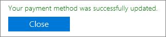

# Hinzufügen, aktualisieren oder Entfernen Ihrer Zahlungsmethoden

::: moniker range="o365-worldwide"
Sie können Produkte und Dienste von Microsoft mit einer Kreditkarte oder einer Debitkarte oder einem Bankkonto erwerben. Sie können Ihre Zahlungsinformationen auf der Seite **Zahlungsmethoden** eingeben oder wenn Sie einen Einkauf tätigen.

Sie können nur Zahlungsmethoden verwalten, die Sie hinzugefügt haben.

> [!NOTE]
> Die Option zur Zahlung mit einem Bankkonto steht in einigen Ländern oder Regionen nicht zur Verfügung.
>
> Sie müssen eine Kreditkarte verwenden, die aus demselben Land wie Ihr Mandant ausgestellt wurde.

**Stimmt die Schnittstelle, die Sie sehen, nicht mit dem in diesem Artikel beschriebenen überein?** Wenn dies der Fall ist, finden Sie unter [Manage Payment Methods](manage-payment-methods.md).

## Hinzufügen einer Zahlungsmethode

1. Wechseln Sie im Admin Center zur Seite **Billing** > **Bills & Payments** > <a href="https://go.microsoft.com/fwlink/p/?linkid=2018806" target="_blank">Payment Methods</a> .
2. Wählen Sie **Zahlungsmethode hinzufügen** aus.
3. Wählen Sie auf der Seite **Zahlungsmethoden** im Dropdownmenü eine Zahlungsmethode aus.
4. Geben Sie die Informationen für das neue Kreditkarten-oder Bank Konto ein, und wählen Sie dann **Hinzufügen**aus.

## Aktualisieren einer vorhandenen Zahlungsmethode

Sie können die Nummer auf einer vorhandenen Karte oder einem Konto nicht ändern. Wenn sich die Karten-oder Bank Kontonummer geändert hat, fügen Sie Sie als neue Zahlungsmethode hinzu. Als nächstes wählen Sie die Zahlungsoption für Ihr Abonnement aus, und entfernen Sie dann die vorhandene Karte oder das Konto. Sie müssen eine Karte verwenden, die aus demselben Land wie Ihr Mandant ausgestellt wurde.

1. Wechseln Sie im Admin Center zur Seite **Billing** > **Bills & Payments** > <a href="https://go.microsoft.com/fwlink/p/?linkid=2018806" target="_blank">Payment Methods</a> .
2. Wählen Sie auf der Seite **Zahlungsmethoden** die zu aktualisierbare Karte oder das Bankkonto aus, und klicken Sie dann auf **Bearbeiten**.
3. Aktualisieren Sie Ihre Zahlungsmethoden Informationen (Name auf der Karte oder Bankverbindung, Rechnungsadresse, Telefonnummer oder Ablaufdatum), und wählen Sie dann **Speichern**aus.

## Ändern einer Zahlungsmethode

Sie können die Zahlungsmethode ändern, die für das bezahlen eines einzelnen Abonnements verwendet wird. Sie können auch alle Abonnements von einer Zahlungsmethode zu einer anderen verlagern.

### Ändern der für ein einzelnes Abonnement verwendeten Zahlungsmethode

1. Navigieren Sie im Admin Center zur Seite **Abrechnung** > <a href="https://go.microsoft.com/fwlink/p/?linkid=842054" target="_blank">Produkte und Dienste</a>.
2. Wählen Sie das Abonnement aus, für das Sie mit der neuen Karte oder dem neuen Bankkonto bezahlen möchten. Wählen Sie unter **Abrechnung**neben der Zahlungsmethode die Option **Bearbeiten**aus.
3. Wählen Sie neben der vorhandenen Zahlungsmethode die Option **Change**aus.
4. Wählen Sie im Dropdownmenü eine alternative Zahlungsmethode aus, oder wählen Sie aus, um eine Zahlungsmethode hinzuzufügen.
5. Wenn Sie eine Zahlungsmethode hinzufügen, geben Sie die Karten-oder Kontodetails ein, und wählen Sie dann **Speichern**aus.
6. Stellen Sie sicher, dass die ausgewählte Zahlungsmethode richtig ist, und wählen Sie dann **Speichern**aus.

### Ändern der für mehrere Abonnements verwendeten Zahlungsmethode

1. Wechseln Sie im Admin Center zur Seite **Billing** > **Bills & Payments** > <a href="https://go.microsoft.com/fwlink/p/?linkid=2018806" target="_blank">Payment Methods</a> .
2. Wählen Sie neben der Zahlungsmethode, die Sie ändern möchten, das Menü **mehr** (drei Punkte) aus, und wählen Sie dann **Abonnements ändern**aus.
3. Im Bereich **Zahlungsmethode ändern** werden vorhandene Abonnements aufgelistet, die diese Zahlungsmethode verwenden.
4. Wählen Sie in der Dropdownliste **Zahlungsmethode auswählen** eine andere Zahlungsmethode aus, und wählen Sie dann **Speichern**aus.

> [!NOTE]
> Sie können nur zwischen vorhandenen Zahlungsmethoden im Bereich " **Zahlungsmethode ändern** " wechseln. Wenn Sie die Zahlung per Rechnung ändern möchten, lesen Sie [Ändern von Kreditkarten-oder Bank Konto zu Rechnung](change-payment-method.md#change-from-credit-card-or-bank-account-to-invoice).

## Entfernen einer Zahlungsmethode

Sie können eine Kredit-oder Debitkarte oder ein Bankkonto nur aus der Liste der Zahlungsmethoden entfernen, wenn es keinem Abonnement zugeordnet ist. Dies gilt für alle Abonnements unabhängig von Ihrem Status. Fügen Sie eine Zahlungsmethode für das Abonnement hinzu, und entfernen Sie dann die alte aus diesem Abonnement. Wenn die Zahlungsmethode einem Abrechnungsprofil zugeordnet ist, ändern Sie die Zahlungsmethode, die für das Abrechnungsprofil verwendet wird, und entfernen Sie dann die Zahlungsmethode.

### Löschen einer Zahlungsmethode

Wenn Ihre Zahlungsmethode keinem Abonnement zugeordnet ist, können Sie Sie sofort löschen.

1. Wechseln Sie im Admin Center zur Seite **Billing** > **Bills & Payments** > <a href="https://go.microsoft.com/fwlink/p/?linkid=2018806" target="_blank">Payment Methods</a> .
2. Zeigen Sie mit der Maus auf die Karte oder das Bankkonto, und wählen Sie dann das Symbol Löschen aus.
3. Wählen Sie unten im Bereich **Zahlungsmethode löschen** die Option **Löschen**aus.

### Hinzufügen einer alternativen Zahlungsmethode, die zum bezahlen von Abonnements verwendet wird

Wenn Ihre Zahlungsmethode mit Abonnements verknüpft ist und Sie keine alternative Zahlungsmethode für die Datei haben, fügen Sie zunächst eine Zahlungsmethode hinzu. Ändern Sie als nächstes die Zahlungsmethode, mit der die Abonnements bezahlt werden. Anschließend können Sie die Zahlungsmethode löschen.

1. Wechseln Sie im Admin Center zur Seite **Billing** > **Bills & Payments** > <a href="https://go.microsoft.com/fwlink/p/?linkid=2018806" target="_blank">Payment Methods</a> .
2. Zeigen Sie mit der Maus auf die Karte oder das Bankkonto, und wählen Sie dann das Symbol Löschen aus.
3. Im Bereich **Zahlungsmethode löschen** werden vorhandene Abonnements aufgelistet, die diese Zahlungsmethode verwenden.
4. Wählen Sie **Zahlungsmethode hinzufügen** aus.
5. Wählen Sie den Typ der Zahlungsmethode aus, die Sie hinzufügen möchten, geben Sie die Kontoinformationen ein, und wählen Sie dann **Hinzufügen**aus.
6. Wählen Sie in der Dropdownliste die neue Zahlungsmethode aus, und wählen Sie dann **ändern**aus.
    > [!WARNING]
    > Dadurch werden alle Abonnements für die neue Zahlungsmethode verlagert.
7. Wählen Sie **Löschen**aus.

### Ändern der Zahlungsmethode, die zum bezahlen von Abonnements verwendet wird

Wenn Ihre Zahlungsmethode mit Abonnements verknüpft ist und Sie über mindestens eine alternative Zahlungsmethode für die Datei verfügen, ändern Sie zunächst die Zahlungsmethode, die zum bezahlen der Abonnements verwendet wird. Anschließend können Sie die Zahlungsmethode löschen.

1. Wechseln Sie im Admin Center zur Seite **Billing** > **Bills & Payments** > <a href="https://go.microsoft.com/fwlink/p/?linkid=2018806" target="_blank">Payment Methods</a> .
2. Zeigen Sie mit der Maus auf die Karte oder das Bankkonto, und wählen Sie dann das Symbol Löschen aus.
3. Im Bereich **Zahlungsmethode löschen** werden vorhandene Abonnements aufgelistet, die diese Zahlungsmethode verwenden.
4. Wählen Sie **Zahlungsmethode ändern**aus.
5. Wählen Sie in der Dropdownliste eine alternative Zahlungsmethode aus, und wählen Sie dann **ändern**aus.
    > [!WARNING]
    > Dadurch werden alle Abonnements zur alternativen Zahlungsmethode gewechselt.
6. Wählen Sie **Löschen**aus.

### Ändern der Zahlungsmethode für ein Abrechnungsprofil

Wenn Ihre Zahlungsmethode einem Abrechnungsprofil zugeordnet ist und nicht auch für die direkte Bezahlung anderer Abonnements verwendet wird, ändern Sie zunächst die zugehörige Zahlungsmethode. Anschließend können Sie die Zahlungsmethode löschen.

1. Wechseln Sie im Admin Center zur > **Seite Billing** Bills ** &amp; Payments** > <a href="https://go.microsoft.com/fwlink/p/?linkid=2103629" target="_blank">Billing Profiles</a> .
2. Wählen Sie das Abrechnungsprofil aus, das Sie aktualisieren möchten.
3. Wählen Sie auf der Seite Abrechnungsprofil Details unter **Zahlungsmethode**die Option **Bearbeiten**aus.
4. Wenn Sie eine alternative Zahlungsmethode hinzufügen, wählen Sie **Zahlungsmethode hinzufügen**aus. Geben Sie Ihre Kontoinformationen ein, und wählen Sie dann **Hinzufügen**aus.
5. Wählen Sie in der Dropdownliste **Wählen Sie eine Zahlungsmethode** aus eine andere Zahlungsmethode aus, und wählen Sie dann **Speichern**aus.
6. Führen Sie die Schritte unter [Delete a Payment Method](#delete-a-payment-method)aus.

### Ändern der Zahlungsmethode, die sowohl für ein Abrechnungsprofil als auch für Abonnements verwendet wird

Wenn Ihre Zahlungsmethode einem Abrechnungsprofil zugeordnet ist und auch zum direkten bezahlen von Abonnements verwendet wird, ändern Sie zunächst die Zahlungsmethode, die dem Abrechnungsprofil zugeordnet ist. Ändern Sie als nächstes die Zahlungsmethode, mit der die Abonnements bezahlt werden. Anschließend können Sie die Zahlungsmethode löschen.

1. Führen Sie die Schritte 1 bis 5 unter [Ändern der Zahlungsmethode für ein Abrechnungsprofil](#change-the-payment-method-for-a-billing-profile)aus.
2. Wenn Sie keine alternative Zahlungsmethode haben, befolgen Sie die Schritte unter [Hinzufügen einer alternativen Zahlungsmethode, die für das bezahlen von Abonnements verwendet wird](#add-an-alternate-payment-method-used-to-pay-for-subscriptions).
3. Wenn Sie bereits andere Zahlungsmethoden zur Verfügung haben, befolgen Sie die Schritte unter [Ändern einer Zahlungsmethode](#change-a-payment-method).

## Problembehandlung bei Zahlungsmethoden

|**Problem**|**Schritte zur Problembehandlung**|
|:-----|:-----|
|**Ich erhalte eine Fehlermeldung mit dem Hinweis "der Browser ist derzeit auf Cookies blockieren" festgelegt.**   |Konfigurieren Sie Ihren Browser so, dass er Cookies von Drittanbietern zulässt, und versuchen Sie es dann erneut.    |
|**Meine Kreditkarte oder Debitkarte wurde abgelehnt.**   |Wenn Sie per Kreditkarte oder Debitkarte bezahlen und Ihre Karte abgelehnt wird, erhalten Sie eine e-Mail, die besagt, dass Microsoft die Zahlung nicht verarbeiten konnte. Stellen Sie sicher, dass die Karten &mdash; Nummer, das Ablaufdatum, der Name auf der Karte und die Adresse, einschließlich Stadt, Bundesland und Postleitzahl, genau so angezeigt werden, wie Sie auf der Karte und ihrer Erklärung dargestellt werden. Sie können Ihre Karteninformationen aktualisieren und die Zahlung sofort über den Link **Ausgleichs Saldo** im Abschnitt **Abrechnung** auf der Seite Abonnementdetails übermitteln. Weitere Informationen finden Sie unter [Was passiert, wenn meine Kreditkarte abgelehnt wurde und meine Zahlung überfällig ist?](pay-for-your-subscription.md#what-if-my-credit-card-was-declined-and-my-payment-is-past-due).      Wenn die Kreditkarte dann immer noch abgelehnt wird, wenden Sie sich an Ihre Bank. Es ist möglich, dass Ihre Karte nicht aktiv ist. Wenn Sie die Karte kürzlich in der e-Mail mit einem aktualisierten Ablaufdatum erhalten haben, stellen Sie sicher, dass Sie aktiviert ist. Ihre Bank kann Ihnen auch mitteilen, ob Ihre Karte nicht für Online-, internationale oder wiederkehrende Transaktionen genehmigt wurde.    |
|**Ich möchte eine Karten-oder Bank Kontonummer aktualisieren.**   |Sie können die Nummer auf einer vorhandenen Karte oder einem Konto nicht ändern. Wenn sich Ihre Kreditkarten-oder Bank Kontonummer geändert hat, fügen Sie eine weitere Kartennummer oder ein Bankkonto hinzu. Als nächstes können Sie alle aktiven Abonnements von der alten Karte oder aus dem neuen Konto in die neue ablegen. Löschen Sie dann die alte Karte oder das Konto. Weitere Informationen finden Sie unter [Hinzufügen einer Zahlungsmethode](#add-a-payment-method) oder [Ändern einer Zahlungsmethode](#change-a-payment-method). |
|**Ich habe nur eine Karte oder ein Bankkonto in meinem Konto und möchte es entfernen.**   |Wenn Sie nur über eine Karte oder ein Bankkonto verfügen, wird eine Fehlermeldung angezeigt, wenn Sie versuchen, Sie zu entfernen. Um den Fehler zu beheben, vergewissern Sie sich, dass Sie eine andere Zahlungsmethode verwenden, um alle Ihre Abonnements zu bezahlen, und versuchen Sie dann erneut, die Karte oder das Bankkonto zu entfernen.    |
|**Meine Karte oder Ihr Bankkonto kann nicht hinzugefügt werden.**   |Wenn Sie Probleme bei der Eingabe Ihrer Kreditkarten-oder Bankkontoinformationen haben, können Sie [sich an den Support wenden](../../admin/contact-support-for-business-products.md).    |

::: moniker-end

::: moniker range="o365-21vianet"

[] Sie müssen ein globaler Administrator oder ein Abrechnungsadministrator sein, um die in diesem Artikel beschriebenen Aufgaben auszuführen.
  
 **Sie sind kein Administrator?** Wenden Sie sich an Ihren IT-Administrator, um Hilfe zu erhalten. [Wer verfügt über Administratorberechtigungen in meinem Unternehmen?](../../admin/admin-overview/admin-overview.md#who-has-admin-permissions-in-my-business)
  
 Informationen **zum Office 365 privat oder persönlich**finden Sie unter [Ändern der Zahlungsmethode oder Kreditkarte, die mit Ihrem Microsoft-Konto verknüpft](https://support.microsoft.com/help/4026594)ist.
  
> [!NOTE]
> Die Option zur Zahlung mit einem Bankkonto steht in einigen Ländern oder Regionen nicht zur Verfügung.
>
> Sie müssen eine Kreditkarte verwenden, die aus demselben Land wie Ihr Mandant ausgestellt wurde.

## Hinzufügen einer Kreditkarte oder eines Bankkontos

1. Navigieren Sie im Admin Center zur Seite **Abrechnung** \> <a href="https://go.microsoft.com/fwlink/p/?linkid=850626" target="_blank">Abonnements</a>.

2. Wählen Sie das Abonnement aus, das Sie mit der neuen Kreditkarte oder dem Konto bezahlen möchten, und wählen Sie dann **Zahlungsdetails aktualisieren**aus.

    
  
3. Wählen Sie den Dropdownpfeil unter **Hinzufügen oder Auswählen einer Zahlungsmethode**aus, und wählen Sie dann **neue Kreditkarte** oder **neues Bankkonto**aus.

    
  
4. Geben Sie die Informationen für die neue Kreditkarte oder das Konto ein, und wählen Sie dann **Absenden**aus.

    > [!NOTE]
    > Die neue Kreditkarte oder das Konto wird nur für das Office 365 Abonnement verwendet, das Sie in Schritt 2 gewählt haben. Wenn Sie weitere Abonnements besitzen, für die Sie die neue Kreditkarte oder das Bankkonto verwenden möchten, führen Sie die in diesem Artikel beschriebenen Schritte aus, um die Kreditkarte oder das Bankkonto zu ändern, die/das zum Bezahlen der einzelnen Abonnements verwendet wird.

::: moniker-end

::: moniker range="o365-germany"
## Hinzufügen einer Kreditkarte oder eines Bankkontos

[] Sie müssen ein globaler Administrator oder ein Abrechnungsadministrator sein, um die in diesem Artikel beschriebenen Aufgaben auszuführen.
  
 **Sie sind kein Administrator?** Wenden Sie sich an Ihren Administrator, um Hilfe zu erhalten. [Wer hat in meinem Unternehmen Administratorberechtigungen?](../../admin/admin-overview/admin-overview.md#who-has-admin-permissions-in-my-business)
  
 Informationen **zum Office 365 privat oder persönlich**finden Sie unter [Ändern der Zahlungsmethode oder Kreditkarte, die mit Ihrem Microsoft-Konto verknüpft](https://support.microsoft.com/help/4026594)ist.
  
> [!NOTE]
> Die Option zur Zahlung mit einem Bankkonto steht in einigen Ländern oder Regionen nicht zur Verfügung.
>
> Sie müssen eine Kreditkarte verwenden, die aus demselben Land wie Ihr Mandant ausgestellt wurde.

1. Navigieren Sie im Admin Center zur Seite **Abrechnung** \> <a href="https://go.microsoft.com/fwlink/p/?linkid=847745" target="_blank">Abonnements</a>.

2. Wählen Sie das Abonnement aus, das Sie mit der neuen Kreditkarte oder dem Konto bezahlen möchten, und wählen Sie dann **Zahlungsdetails aktualisieren**aus.

    
  
3. Wählen Sie den Dropdownpfeil unter **Hinzufügen oder Auswählen einer Zahlungsmethode**aus, und wählen Sie dann **neue Kreditkarte** oder **neues Bankkonto**aus.

    
  
4. Geben Sie die Informationen für die neue Kreditkarte oder das Konto ein, und wählen Sie dann **Absenden**aus.

    > [!NOTE]
    > Die neue Kreditkarte oder das Konto wird nur für das Office 365 Abonnement verwendet, das Sie in Schritt 2 gewählt haben. Wenn Sie weitere Abonnements besitzen, für die Sie die neue Kreditkarte oder das Bankkonto verwenden möchten, führen Sie die in diesem Artikel beschriebenen Schritte aus, um die Kreditkarte oder das Bankkonto zu ändern, die/das zum Bezahlen der einzelnen Abonnements verwendet wird.

::: moniker-end

::: moniker range="o365-21vianet"
## Aktualisieren einer vorhandenen Kreditkarte oder eines vorhandenen Bankkontos

> [!NOTE]
> Die Nummer einer vorhandenen Kreditkarte oder eines vorhandenen Bankkontos kann nicht geändert werden. Wenn sich die Kreditkarten-oder Bank Kontonummer geändert hat, fügen Sie Sie als neue Kreditkarte oder Bank Konto hinzu. Als nächstes wählen Sie die Zahlungsoption für Ihr Abonnement aus, und entfernen Sie dann die vorhandene Kreditkarte oder das Konto.
> Sie müssen eine Kreditkarte verwenden, die aus demselben Land wie Ihr Mandant ausgestellt wurde.

1. Navigieren Sie im Admin Center zur Seite **Abrechnung** \> <a href="https://go.microsoft.com/fwlink/p/?linkid=850626" target="_blank">Abonnements</a>.

2. Wählen Sie das Abonnement aus, das Sie mit dem Kreditkartenkonto erworben haben, das Sie aktualisieren möchten, und wählen Sie dann **Zahlungsdetails aktualisieren**aus.

    > [!NOTE]
    > Wenn ein anderer Administrator das Abonnement erworben hat, können Sie die Kreditkarten- oder Bankkontoinformationen dafür nicht aktualisieren. Wenn die Kreditkarte bald abläuft und der andere Administrator Sie nicht aktualisieren kann, können Sie eine Dienstunterbrechung verhindern, wenn Sie eine andere Kreditkarte oder ein neues Bankkonto für das Abonnement hinzufügen.
  
    
  
3. Wählen Sie den Dropdownpfeil unter **Hinzufügen oder wählen Sie eine Zahlungsmethode aus**. Wählen Sie die Kreditkarte oder das Bankkonto aus, das Sie aktualisieren möchten, und wählen Sie dann **Details bearbeiten**aus.

    
  
4. Aktualisieren Sie Ihre Kreditkarten-oder Bankkontoinformationen (Name auf der Kreditkarte oder Bankverbindung, Rechnungsadresse. Telefonnummer oder Ablaufdatum) bei Bedarf, und wählen Sie dann über **Mitteln**.

5. Eine Bestätigungsaufforderung wird angezeigt. Falls das nicht der Fall ist, lesen Sie [Behandeln von Problemen mit Kreditkarten und Bankkonten](#troubleshooting-credit-cards-and-bank-accounts).

    

::: moniker-end

::: moniker range="o365-germany"
## Aktualisieren einer vorhandenen Kreditkarte oder eines vorhandenen Bankkontos

> [!NOTE]
> Die Nummer einer vorhandenen Kreditkarte oder eines vorhandenen Bankkontos kann nicht geändert werden. Wenn sich die Kreditkarten-oder Bank Kontonummer geändert hat, fügen Sie Sie als neue Kreditkarte oder Bank Konto hinzu. Als nächstes wählen Sie die Zahlungsoption für Ihr Abonnement aus, und entfernen Sie dann die vorhandene Kreditkarte oder das Konto.
> Sie müssen eine Kreditkarte verwenden, die aus demselben Land wie Ihr Mandant ausgestellt wurde.

1. Navigieren Sie im Admin Center zur Seite **Abrechnung** \> <a href="https://go.microsoft.com/fwlink/p/?linkid=847745" target="_blank">Abonnements</a>.

2. Wählen Sie das Abonnement aus, das Sie mit dem Kreditkartenkonto erworben haben, das Sie aktualisieren möchten, und wählen Sie dann **Zahlungsdetails aktualisieren**aus.

    > [!NOTE]
    > Wenn ein anderer Administrator das Abonnement erworben hat, können Sie die Kreditkarten- oder Bankkontoinformationen dafür nicht aktualisieren. Wenn die Kreditkarte bald abläuft und der andere Administrator Sie nicht aktualisieren kann, können Sie eine Dienstunterbrechung verhindern, wenn Sie eine andere Kreditkarte oder ein neues Bankkonto für das Abonnement hinzufügen.
  
    
  
3. Wählen Sie den Dropdownpfeil unter **Hinzufügen oder wählen Sie eine Zahlungsmethode aus**. Wählen Sie die Kreditkarte oder das Bankkonto aus, das Sie aktualisieren möchten, und wählen Sie dann **Details bearbeiten**aus.

    
  
4. Aktualisieren Sie Ihre Kreditkarten-oder Bankkontoinformationen (Name auf der Kreditkarte oder Bankverbindung, Rechnungsadresse. Telefonnummer oder Ablaufdatum) bei Bedarf, und wählen Sie dann über **Mitteln**.

5. Eine Bestätigungsaufforderung wird angezeigt. Falls das nicht der Fall ist, lesen Sie [Behandeln von Problemen mit Kreditkarten und Bankkonten](#troubleshooting-credit-cards-and-bank-accounts).

    

::: moniker-end

::: moniker range="o365-21vianet"
## Entfernen einer Kreditkarte oder eines Bankkontos

1. Navigieren Sie im Admin Center zur Seite **Abrechnung** \> <a href="https://go.microsoft.com/fwlink/p/?linkid=850626" target="_blank">Abonnements</a>.

2. Wählen Sie ein beliebiges Abonnement aus, und wählen Sie **Zahlungsdetails aktualisieren**aus.

    
  
3. Wählen Sie den Dropdownpfeil unter **Hinzufügen oder wählen Sie eine Zahlungsmethode aus**.

4. Wählen Sie die Kreditkarte oder das Bankkonto aus, und wählen Sie dann **Entfernen**aus.

    
  
5. Wählen Sie erneut **Entfernen** aus, um die Kreditkarte oder das Bankkonto zu löschen.

    
  
    > [!NOTE]
    > Sie können eine Kreditkarte oder ein Bankkonto nicht entfernen, wenn Sie zurzeit für ein Abonnement bezahlt werden. Wenn Sie versuchen, wird eine Meldung wie die folgende angezeigt   
    > Um die Kreditkarte oder das Bankkonto zu entfernen, wählen Sie **zurück** aus, und führen Sie die Schritte in diesem Artikel aus, um die Kreditkarte oder das Bankkonto zu ändern, mit dem Sie das Abonnement bezahlen. Versuchen Sie dann erneut, die Kreditkarte oder das Bankkonto zu entfernen.

::: moniker-end

::: moniker range="o365-germany"
## Entfernen einer Kreditkarte oder eines Bankkontos

1. Navigieren Sie im Admin Center zur Seite **Abrechnung** \> <a href="https://go.microsoft.com/fwlink/p/?linkid=847745" target="_blank">Abonnements</a>.

2. Wählen Sie ein beliebiges Abonnement aus, und wählen Sie **Zahlungsdetails aktualisieren**aus.

    
  
3. Wählen Sie den Dropdownpfeil unter **Hinzufügen oder wählen Sie eine Zahlungsmethode aus**.

4. Wählen Sie die Kreditkarte oder das Bankkonto aus, und wählen Sie dann **Entfernen**aus.

    

5. Wählen Sie erneut **Entfernen** aus, um die Kreditkarte oder das Bankkonto zu löschen.

    
  
    > [!NOTE]
    > Sie können eine Kreditkarte oder ein Bankkonto nicht entfernen, wenn Sie zurzeit für ein Abonnement bezahlt werden. Wenn Sie versuchen, wird eine Meldung wie die folgende angezeigt   
    > Um die Kreditkarte oder das Bankkonto zu entfernen, wählen Sie **zurück** aus, und führen Sie die Schritte in diesem Artikel aus, um die Kreditkarte oder das Bankkonto zu ändern, mit dem Sie das Abonnement bezahlen. Versuchen Sie dann erneut, die Kreditkarte oder das Bankkonto zu entfernen.

::: moniker-end

::: moniker range="o365-21vianet"
## Ändern der Kreditkarte oder des Bankkontos, das zum bezahlen eines Abonnements verwendet wird

1. Navigieren Sie im Admin Center zur Seite **Abrechnung** \> <a href="https://go.microsoft.com/fwlink/p/?linkid=850626" target="_blank">Abonnements</a>.

2. Wählen Sie das Abonnement aus, das Sie mit der neuen Kreditkarte oder dem Konto bezahlen möchten, und wählen Sie dann **Zahlungsdetails aktualisieren**aus.

    
  
3. Wählen Sie den Dropdownpfeil unter **Hinzufügen oder wählen Sie eine Zahlungsmethode** aus, und wählen Sie die Kreditkarte oder das Bankkonto aus, das Sie verwenden möchten.

    
  
4. Wählen Sie **Submit** aus. Wenn die gewünschte Kreditkarte oder das Konto, das Sie verwenden möchten, noch nicht aufgeführt ist, wählen Sie **neue Kreditkarte** oder **neues Bankkonto** aus, um Sie hinzuzufügen.

::: moniker-end

::: moniker range="o365-germany"
## Ändern der Kreditkarte oder des Bankkontos, das zum bezahlen eines Abonnements verwendet wird

1. Navigieren Sie im Admin Center zur Seite **Abrechnung** \> <a href="https://go.microsoft.com/fwlink/p/?linkid=847745" target="_blank">Abonnements</a>.

2. Wählen Sie das Abonnement aus, das Sie mit der neuen Kreditkarte oder dem Konto bezahlen möchten, und wählen Sie dann **Zahlungsdetails aktualisieren**aus.

    
  
3. Wählen Sie den Dropdownpfeil unter **Hinzufügen oder wählen Sie eine Zahlungsmethode** aus, und wählen Sie die Kreditkarte oder das Bankkonto aus, das Sie verwenden möchten.

    
  
4. Wählen Sie **Submit** aus. Wenn die gewünschte Kreditkarte oder das Konto, das Sie verwenden möchten, noch nicht aufgeführt ist, wählen Sie **neue Kreditkarte** oder **neues Bankkonto** aus, um Sie hinzuzufügen.

::: moniker-end

::: moniker range="o365-21vianet"
## Behandeln von Problemen mit Kreditkarten und Bankkonten

|**Problem**|**Schritte zur Problembehandlung**|
|:-----|:-----|
|**Ich erhalte eine Fehlermeldung, die Folgendes besagt: "In Ihrem Browser werden Cookies derzeit blockiert."**   |Konfigurieren Sie Ihren Browser so, dass er Cookies von Drittanbietern zulässt, und versuchen Sie es dann erneut.    |
|**Meine Kreditkarte wurde abgelehnt.**   |Wenn Sie per Kreditkarte bezahlen und Ihre Kreditkarte abgelehnt wird, erhalten Sie eine e-Mail, dass wir die Zahlung nicht verarbeiten konnten. Stellen Sie sicher, dass die Kreditkartendetails (Kartennummer, Ablaufdatum, Name auf der Kreditkarte und Adresse, einschließlich Stadt, Staat und Postleitzahl) genau so angezeigt werden wie auf der Kreditkarte und Ihrer Kreditkartenabrechnung. Sie können Ihre Kreditkarteninformationen aktualisieren und die Zahlung sofort über die Funktion " **Jetzt bezahlen** " übermitteln. Weitere Informationen finden Sie unter [Was passiert, wenn meine Kreditkarte abgelehnt wurde und meine Zahlung überfällig ist?](pay-for-your-subscription.md#what-if-my-credit-card-was-declined-and-my-payment-is-past-due).      Wenn die Kreditkarte dann immer noch abgelehnt wird, wenden Sie sich an Ihre Bank. Es ist möglich, dass Ihre Kreditkarte nicht aktiv ist. Wenn Sie die Kreditkarte kürzlich mit einem aktualisierten Ablaufdatum in der e-Mail erhalten haben, stellen Sie sicher, dass Sie aktiviert ist. Ihre Bank kann Ihnen auch mitteilen, ob Ihre Kreditkarte nicht für Online-, internationale oder wiederkehrende Transaktionen genehmigt wurde.    |
|**Ich möchte eine Kreditkarten-oder Bank Kontonummer aktualisieren.**   |Die Nummer einer vorhandenen Kreditkarte oder eines vorhandenen Bankkontos kann nicht geändert werden. Wenn Ihre Kreditkarten-oder Bank Kontonummer geändert wurde, [fügen Sie eine neue Kreditkarte oder ein Bankkonto hinzu](#add-a-credit-card-or-bank-account), [Ändern Sie Ihr Abonnement für diese Karte oder Ihr Bankkonto](#change-the-credit-card-or-bank-account-used-to-pay-for-a-subscription), und löschen Sie dann [die alte Kreditkarte oder das](#remove-a-credit-card-or-bank-account)Konto. |
|**Ich besitze nur eine Kreditkarte oder nur ein Bankkonto für mein Konto und möchte sie/es entfernen.**   |Wenn Sie nur über eine Kreditkarte oder ein Bankkonto verfügen, wird eine Fehlermeldung angezeigt, wenn Sie versuchen, die Verbindung zu entfernen. Um Fehler zu beheben, stellen Sie sicher, dass Sie eine andere Zahlungsmethode verwenden, um alle Ihre Abonnements zu bezahlen, und versuchen Sie dann erneut, die Kreditkarte oder das Bankkonto zu entfernen.    |
|**Ich kann meine Kreditkarte bzw. mein Bankkonto nicht hinzufügen.**   |Wenn es bei der Eingabe Ihrer Kreditkarten- bzw. Bankkontoinformationen Probleme gibt, können Sie [den Support kontaktieren](../../admin/contact-support-for-business-products.md).      |

::: moniker-end

::: moniker range="o365-germany"
## Behandeln von Problemen mit Kreditkarten und Bankkonten

|**Problem**|**Schritte zur Problembehandlung**|
|:-----|:-----|
|**Ich erhalte eine Fehlermeldung, die Folgendes besagt: "In Ihrem Browser werden Cookies derzeit blockiert."**   |Konfigurieren Sie Ihren Browser so, dass er Cookies von Drittanbietern zulässt, und versuchen Sie es dann erneut.    |
|**Meine Kreditkarte wurde abgelehnt.**   |Wenn Sie per Kreditkarte bezahlen und Ihre Kreditkarte abgelehnt wird, erhalten Sie eine e-Mail, dass wir die Zahlung nicht verarbeiten konnten. Stellen Sie sicher, dass die Kreditkartendetails (Kartennummer, Ablaufdatum, Name auf der Kreditkarte und Adresse, einschließlich Stadt, Staat und Postleitzahl) genau so angezeigt werden wie auf der Kreditkarte und Ihrer Kreditkartenabrechnung. Sie können Ihre Kreditkarteninformationen aktualisieren und die Zahlung sofort über die Funktion " **Jetzt bezahlen** " übermitteln. Weitere Informationen finden Sie unter [Was passiert, wenn meine Kreditkarte abgelehnt wurde und meine Zahlung überfällig ist?](pay-for-your-subscription.md#what-if-my-credit-card-was-declined-and-my-payment-is-past-due).      Wenn die Kreditkarte dann immer noch abgelehnt wird, wenden Sie sich an Ihre Bank. Es ist möglich, dass Ihre Kreditkarte nicht aktiv ist. Wenn Sie die Kreditkarte kürzlich mit einem aktualisierten Ablaufdatum in der e-Mail erhalten haben, stellen Sie sicher, dass Sie aktiviert ist. Ihre Bank kann Ihnen auch mitteilen, ob Ihre Kreditkarte nicht für Online-, internationale oder wiederkehrende Transaktionen genehmigt wurde.    |
|**Ich möchte eine Kreditkarten-oder Bank Kontonummer aktualisieren.**   |Die Nummer einer vorhandenen Kreditkarte oder eines vorhandenen Bankkontos kann nicht geändert werden. Wenn Ihre Kreditkarten-oder Bank Kontonummer geändert wurde, [fügen Sie eine neue Kreditkarte oder ein Bankkonto hinzu](#add-a-credit-card-or-bank-account-1), [Ändern Sie Ihr Abonnement auf die Kreditkarte oder das Bankkonto](#change-the-credit-card-or-bank-account-used-to-pay-for-a-subscription-1), und löschen Sie dann [die alte Kreditkarte oder das](#remove-a-credit-card-or-bank-account-1)Konto. |
|**Ich besitze nur eine Kreditkarte oder nur ein Bankkonto für mein Konto und möchte sie/es entfernen.**   |Wenn Sie nur über eine Kreditkarte oder ein Bankkonto verfügen, wird eine Fehlermeldung angezeigt, wenn Sie versuchen, die Verbindung zu entfernen. Um Fehler zu beheben, stellen Sie sicher, dass Sie eine andere Zahlungsmethode verwenden, um alle Ihre Abonnements zu bezahlen, und versuchen Sie dann erneut, die Kreditkarte oder das Bankkonto zu entfernen.    |
|**Ich kann meine Kreditkarte bzw. mein Bankkonto nicht hinzufügen.**   |Wenn es bei der Eingabe Ihrer Kreditkarten- bzw. Bankkontoinformationen Probleme gibt, können Sie [den Support kontaktieren](../../admin/contact-support-for-business-products.md).      |

::: moniker-end

## Verwandte Artikel

[Ändern der Rechnungsadressen](change-your-billing-addresses.md)
  
[Kündigen Ihres Abonnements](../subscriptions/cancel-your-subscription.md)
