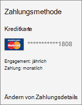

# Ändern der ZahlungsmethodeChange your payment method

::: moniker range="o365-worldwide"

Wenn Sie ein Abonnement kaufen, können Sie mit einer Kreditkarte oder einem Bankkonto bezahlen oder per Rechnung bezahlen.When you buy a subscription, you choose to pay with a credit card or bank account, or to pay by invoice. Sie können Zwischenzahlung per Kreditkarte oder Bankkonto und Zahlung per Rechnung zu jeder Zeit während Ihres Abonnements ändern.You can change between paying by credit card or bank account and paying by invoice at any time during your subscription.
  
> [!IMPORTANT]
> Das bezahlen mit einem Bankkonto steht in einigen Ländern oder Regionen nicht zur Verfügung.Paying with a bank account is not available in some countries or regions.

 **Möchten Sie lediglich Ihre Kreditkarten- oder Bankkontoinformationen ändern?****Just want to change your credit card or bank account information?** Weitere Informationen finden Sie unter [hinzufügen, aktualisieren oder Entfernen einer Kreditkarte oder eines Bankkontos](add-update-or-remove-credit-card-or-bank-account.md).See [Add, update, or remove a credit card or bank account](add-update-or-remove-credit-card-or-bank-account.md).

 **Möchten Sie nur ändern, wie oft Sie in Rechnung gestellt werden?****Just want to change how often you're billed?** Weitere Informationen finden Sie unter [Ändern der Zahlungshäufigkeit](change-payment-frequency.md).See [Change your payment frequency](change-payment-frequency.md).
  
 **Was passiert, wenn noch eine Saldoforderung existiert?****What if I have an outstanding balance?**
  
Wenn Sie von einer Rechnung in eine Kreditkarte oder ein Bankkonto wechseln, werden Ihre aktuellen Rechnungsgebühren nicht auf Ihre Kreditkarte oder Ihr Bankkonto übertragen.If you change from invoice to credit card or bank account, your current invoice charges aren't transferred to your credit card or bank account. Stellen Sie sicher, dass Sie einen ausstehenden Rechnungssaldo per Überweisung bezahlen.Be sure to pay any outstanding invoice balance by wire transfer. In einigen Regionen können Sie auch ihren ausstehenden Saldo mit einem Scheck bezahlen.In some regions, you can also pay your outstanding balance with a check. Weitere Informationen zum bezahlen Ihres ausstehenden Saldos finden Sie in Ihrer Rechnung.For more information about how to pay your outstanding balance, see your invoice.
  
Wenn Sie von Kreditkarte oder Bankkonto zu Rechnung wechseln, wird ein ausstehender Saldo auf Ihre nächste Rechnung übertragen.If you change from credit card or bank account to invoice, any outstanding balance is transferred to your next invoice.
  
> [!NOTE]
> Wenn Sie per Kreditkarte bezahlen und Ihre Kreditkarte abgelehnt wird, erhalten Sie eine e-Mail, die Sie darüber informiert, dass die Zahlung nicht mehr verarbeitet werden konnte.If you pay by credit card, and your credit card is declined, you receive an email that lets you know that we were unable to process the payment. Sie können Ihre Kreditkarteninformationen aktualisieren und die Zahlung sofort über den Link **Ausgleichs Saldo** auf der Seite **Produkte & Dienste** übermitteln.You can update your credit card information and immediately submit the payment by using the **Settle balance** link on the **Products & services** page. Weitere Informationen finden Sie unter [Was passiert, wenn meine Kreditkarte abgelehnt wurde und meine Zahlung überfällig ist?](pay-for-your-subscription.md#what-if-my-credit-card-was-declined-and-my-payment-is-past-due)For more information, see [What if my credit card was declined and my payment is past due?](pay-for-your-subscription.md#what-if-my-credit-card-was-declined-and-my-payment-is-past-due) 
  
::: moniker-end

::: moniker range="o365-germany"

Beim Kauf von Office 365 Business können Sie entscheiden, ob Sie per Kreditkarte oder Bankkonto zahlen, per Rechnung zahlen oder einen im Voraus bezahlten Product Key verwenden möchten. Sie können während der Laufzeit des Abonnements jederzeit zwischen Zahlung per Kreditkarte oder Bankkonto und Zahlung per Rechnung wechseln. Wenn Sie zunächst einen im Voraus bezahlten Product Key verwendet haben, können Sie nach Ablauf des Lizenzzeitraums auf Zahlung per Kreditkarte oder Bankkonto oder auf Zahlung per Rechnung umstellen.When you buy Office 365 for business, you choose to pay by credit card or bank account, pay by invoice, or pay by using a prepaid product key. You can switch between paying by credit card or bank account and paying by invoice at any time during your subscription. If you paid using a prepaid product key, you can choose to switch over to paying by credit card or bank account, or to paying by invoice after your licensing period has ended.
  
> [!NOTE]
> Nachdem Sie die Zahlungsmethode geändert haben, behalten die Benutzer die gleichen Lizenzzuweisungen wie zuvor.After you switch payment methods, your users will continue to have the same license assignments as before.
  
 **Sie möchten Ihre Zahlungshäufigkeit ändern?****Want to change your payment frequency?** Wenn Sie ändern möchten, wie häufig Sie für Ihr Abonnement bezahlen, entweder von Jahr zu Monat oder monatlich, müssen Sie [Office 365 Support aufrufen](../../admin/contact-support-for-business-products.md) , um Hilfe zu erhalten.If you want to change how frequently you pay for your subscription, either from annual to monthly or monthly to annual, you'll need to [call Office 365 support](../../admin/contact-support-for-business-products.md) for help.
  
 **Möchten Sie lediglich Ihre Kreditkarten- oder Bankkontoinformationen ändern?** Lesen Sie [Hinzufügen, Aktualisieren oder Entfernen einer Kreditkarte oder eines Bankkontos in Office 365 Business](add-update-or-remove-credit-card-or-bank-account.md).**Just want to change your credit card or bank account information?** See [Add, update, or remove a credit card or bank account in Office 365 for business](add-update-or-remove-credit-card-or-bank-account.md).
  
 **Was passiert, wenn noch eine Saldoforderung existiert?****What if I have an outstanding balance?**
  
Wenn Sie von einer *Rechnung auf eine Kreditkarte oder ein Bankkonto*umziehen, werden Ihre vorhandenen Rechnungsgebühren nicht auf Ihre Kreditkarte oder Ihr Bankkonto übertragen, daher müssen Sie einen ausstehenden Rechnungssaldo per Überweisung bezahlen.If you're moving from *invoice to credit card or bank account*, your existing invoice charges won't be transferred to your credit card or bank account, so be sure to pay any outstanding invoice balance by wire transfer. In einigen Regionen können ausstehende Zahlungen auch per Scheck bezahlt werden.In some regions, you can also pay your outstanding balance by check. Weitere Informationen zum Zahlen von Saldoforderungen finden Sie auf Ihrer Rechnung.See your invoice for more information about paying your outstanding balance.
  
Wenn Sie von einer *Kreditkarte oder einem Bankkonto zu einer Rechnung*wechseln, wird ein ausstehender Saldo auf Ihre nächste Rechnung übertragen.If you're moving from *credit card or bank account to invoice*, any outstanding balance will be transferred to your next invoice.
  
> [!NOTE]
> Wenn Sie per Kreditkarte bezahlen und Ihre Kreditkarte abgelehnt wird, erhalten Sie eine e-Mail mit der Information, dass wir die Zahlung nicht verarbeiten konnten.If you pay by credit card, and your credit card is declined, you'll receive an email letting you know that we were unable to process the payment. Sie können Ihre Kreditkarteninformationen aktualisieren und die Zahlung sofort über die Schaltfläche **Jetzt bezahlen** auf der Seite **Abonnements** übermitteln.You can update your credit card information and immediately submit the payment by using the **Pay now** button on the **Subscriptions** page. Weitere Informationen finden Sie unter [Was passiert, wenn meine Kreditkarte abgelehnt wurde und meine Zahlung überfällig ist?](pay-for-your-subscription.md#what-if-my-credit-card-was-declined-and-my-payment-is-past-due)For more information, see [What if my credit card was declined and my payment is past due?](pay-for-your-subscription.md#what-if-my-credit-card-was-declined-and-my-payment-is-past-due) 
  
::: moniker-end

::: moniker range="o365-worldwide"
## Umstellen von Zahlung per Rechnung auf Zahlung per Kreditkarte oder BankkontoChange from invoice to credit card or bank account

> [!TIP]
> Die folgenden Schritte gelten nur für Einzelabonnements. Wenn Ihre Organisation über mehrere Abonnements verfügt, führen Sie diese Schritte für jedes Abonnement aus, das Sie ändern möchten.The following steps apply to individual subscriptions only. If you have multiple subscriptions in your organization, complete these steps for each subscription that you want to change.
  
Wenn Sie von der Zahlung per Rechnung zur Zahlung mit einer Kreditkarte oder einem Bankkonto wechseln, wird automatisch ein neues Abonnement für Sie erstellt, die Benutzer werden in das neue Abonnement übertragen und Ihr altes Abonnement deaktiviert.When you change from paying by invoice to paying with a credit card or bank account, we automatically create a new subscription for you, move your users to the new subscription, and then disable your old subscription. Keine Sorge, Ihre Benutzer sehen keine Unterbrechung des Diensts, und alle Ihre Informationen werden über das neue Abonnement zur Verfügung stehen.Don't worry, your users won't see a disruption in service and all their information will be available through the new subscription.

### Verwenden des neuen admin Centers zum Ändern von einer Rechnung in eine Kreditkarte oder ein BankkontoUse the new admin center to change from invoice to credit card or bank account

1. Wechseln Sie im Admin Center zur Seite **Abrechnungs** \> <a href="https://go.microsoft.com/fwlink/p/?linkid=842054" target="_blank">Produkte & Dienste</a> .In the admin center, go to the **Billing**\> <a href="https://go.microsoft.com/fwlink/p/?linkid=842054" target="_blank">Products & services</a> page.

2. Wenn Sie sich in der **Tabellen** Ansicht befinden, wählen Sie **Karten**aus.If you're in **Table** view, select **Cards**.

3. Suchen Sie das Abonnement, das Sie ändern möchten.Find the subscription that you want to change. Wählen Sie unter **Abrechnung**neben der Zahlungsmethode die Option **Bearbeiten**aus.Under **Billing**, next to the payment method, select **Edit**.
  
4. Wählen Sie neben der vorhandenen Zahlungsmethode die Option **Change**aus.Next to your existing payment method, select **Change**.
  
5. Wählen Sie im Dropdownmenü eine andere Zahlungsmethode aus, oder wählen Sie aus, um ein neues zu hinzufügen.From the drop-down menu, select a different payment method, or choose to add a new one.

6. Wenn Sie eine Zahlungsmethode hinzufügen, geben Sie die Karten-oder Kontodetails ein, und wählen Sie dann **Speichern**aus.If you add a payment method, enter the card or account details, then select **Save**.
  
7. Stellen Sie sicher, dass die ausgewählte Zahlungsmethode richtig ist, und wählen Sie dann **Speichern**aus.Verify that the selected payment method is correct, then select **Save**.

### Verwenden des alten admin Centers zum Ändern von einer Rechnung in eine Kreditkarte oder ein BankkontoUse the old admin center to change from invoice to credit card or bank account

1. Wechseln Sie im Admin Center zur Seite **Abrechnungs** \> <a href="https://go.microsoft.com/fwlink/p/?linkid=842054" target="_blank">Abonnements</a> .In the admin center, go to the **Billing**\> <a href="https://go.microsoft.com/fwlink/p/?linkid=842054" target="_blank">Subscriptions</a> page.

2. Suchen Sie das Abonnement, das Sie ändern möchten.Find the subscription that you want to change. Wählen Sie im Abschnitt **Zahlungsdetails** die Option **Zahlungsdetails ändern**aus.In the **Payment details** section, select **Change payment details**.
  
3. Wählen Sie im Bereich **Zahlungsdetails ändern** die Option **Zahlungsmethode ändern**aus.In the **Change payment details** pane, select **Change your payment method**.
  
4. Wählen Sie im Dialogfeld **Zahlungsmethode ändern** die Option **weiter**aus.In the **Change your payment method** dialog box, select **Continue**.
  
5. Auf der Seite **wie sieht das aus?** können Sie optional die Anzahl der für dieses Abonnement gewünschten Lizenzen erweitern.On the **How does this look?** page, you can optionally increase the number of licenses that you want for this subscription. Um den Vorgang fortzusetzen, wählen Sie **weiter**aus.To continue, select **Next**.

6. Bei einigen Abonnements gibt es die Möglichkeit, monatlich oder jährlich zu zahlen. Wenn Sie auf der Seite **Wie möchten Sie zahlen?** zwischen jährlicher und monatlicher Zahlung wählen können, geben Sie an, in welchem Turnus Sie zahlen möchten.Some subscriptions have the option to choose a monthly or annual commitment. If you see a choice to pay by the year or by the month on the **How do you want to pay?** page, choose how frequently you want to pay.
  
7. Wählen Sie in der Liste **Zahlungsmethode** die Option **vorhandene Karte**, **neue Kreditkarte**oder **neues Bankkonto**aus.In the **Payment method** list, choose **Existing card**, **New credit card**, or **New bank account**.
  
8. Wenn Sie die Option **neue Kreditkarte** oder **neue Bankkonten** ausgewählt haben, füllen Sie die restlichen Zahlungsinformationen aus.If you chose the **New credit card** or **New bank account** option, fill out the rest of your payment information.

9. Wenn Sie das Formular ausgefüllt haben, wählen Sie **Bestellung aufgeben**aus.When you're done filling out the form, select **Place order**.

Wenn Sie zur Seite **Abonnements** zurückkehren, stellen Sie fest, dass das alte Abonnement als **Deaktiviert** und das neue als **Aktiv** gekennzeichnet ist. Sie können das alte Abonnement auslaufen lassen.When you return to the **Subscriptions** page, you will see the old subscription marked **Disabled** and the new one marked **Active**. You can let the old subscription expire.

::: moniker-end

::: moniker range="o365-germany"
## Umstellen von Zahlung per Rechnung auf Zahlung per Kreditkarte oder BankkontoChange from invoice to credit card or bank account

> [!TIP]
> Die folgenden Schritte gelten nur für Einzelabonnements. Wenn Ihre Organisation über mehrere Abonnements verfügt, führen Sie diese Schritte für jedes Abonnement aus, das Sie ändern möchten.The following steps apply to individual subscriptions only. If you have multiple subscriptions in your organization, complete these steps for each subscription that you want to change.
  
Bei einer Umstellung von Zahlung per Rechnung auf Zahlung per Kreditkarte oder Bankkonto wird automatisch ein neues Abonnement für Sie erstellt. Verschieben Sie Ihre Benutzer in das neue Abonnement, und deaktivieren Sie dann das alte. Keine Sorge, für die Benutzer ergibt sich hieraus keine Dienstunterbrechung, und auch alle Daten stehen im neuen Abonnement wieder zur Verfügung.When you change from paying by invoice to paying by credit card or bank account, we automatically create a new subscription for you, move your users to the new subscription, and then disable your old subscription. Don't worry, your users won't see a disruption in service and all of their information will be available through the new subscription.

1. Wechseln Sie im Admin Center zur Seite **Abrechnungs** \> <a href="https://go.microsoft.com/fwlink/p/?linkid=847745" target="_blank">Abonnements</a> .In the admin center, go to the **Billing**\> <a href="https://go.microsoft.com/fwlink/p/?linkid=847745" target="_blank">Subscriptions</a> page.

2. Suchen Sie das Abonnement, das Sie ändern möchten.Find the subscription that you want to change. Wählen Sie im Abschnitt **Zahlungsdetails** die Option **Zahlungsdetails ändern**aus.In the **Payment details** section, select **Change payment details**.
  
3. Wählen Sie im Bereich **Zahlungsdetails ändern** die Option **Zahlungsmethode ändern**aus.In the **Change payment details** pane, select **Change your payment method**.
  
4. Wählen Sie im Dialogfeld **Zahlungsmethode ändern** die Option **weiter**aus.In the **Change your payment method** dialog box, select **Continue**.
  
5. Auf der Seite **wie sieht das aus?** können Sie optional die Anzahl der für dieses Abonnement gewünschten Benutzerlizenzen erweitern.On the **How does this look?** page, you can optionally increase the number of users licenses that you want for this subscription. Um den Vorgang fortzusetzen, wählen Sie **weiter**aus.To continue, select **Next**.

6. Bei einigen Abonnements gibt es die Möglichkeit, monatlich oder jährlich zu zahlen. Wenn Sie auf der Seite **Wie möchten Sie zahlen?** zwischen jährlicher und monatlicher Zahlung wählen können, geben Sie an, in welchem Turnus Sie zahlen möchten.Some subscriptions have the option to choose a monthly or annual commitment. If you see a choice to pay by the year or by the month on the **How do you want to pay?** page, choose how frequently you want to pay.
  
7. Wählen Sie in der Liste **Zahlungsmethode** die Option **vorhandene Karte**, **neue Kreditkarte**oder **neues Bankkonto**aus.In the **Payment method** list, choose **Existing card**, **New credit card**, or **New bank account**.
  
8. Wenn Sie in Schritt 9 die Option **Neue Kreditkarte** oder **Neues Bankkonto** ausgewählt haben, geben Sie die restlichen Zahlungsinformationen ein.If you chose the **New credit card** or **New bank account** option in step 9, fill out the rest of your payment information.

9. Wenn Sie das Formular ausgefüllt haben, wählen Sie **Bestellung aufgeben**aus.When you're done filling out the form, select **Place order**.

Wenn Sie zur Seite **Abonnements** zurückkehren, stellen Sie fest, dass das alte Abonnement als **Deaktiviert** und das neue als **Aktiv** gekennzeichnet ist. Sie können das alte Abonnement auslaufen lassen.When you return to the **Subscriptions** page, you will see the old subscription marked **Disabled** and the new one marked **Active**. You can let the old subscription expire.
  
::: moniker-end

::: moniker range="o365-worldwide"
## Umstellen von Zahlung per Kreditkarte oder Bankkonto auf Zahlung per RechnungChange from credit card or bank account to invoice

Sie können die Zahlungs Rechnung nur dann ändern, wenn Ihre Bestellung über einer bestimmten Menge liegt.You can change to pay by invoice only if your order is above a certain quantity. Wenn Sie die Anforderung nicht erfüllen, wird die Meldung "Ihre Bestellmenge ist nicht groß genug, um sich für Rechnung mit Scheck Draht qualifizieren" angezeigt.If you do not meet the requirement, you see the message “Your order quantity isn’t large enough to qualify for invoice with check wire.”

Wenn Ihre Bestellmenge zu hoch ist, ist möglicherweise eine Bonitätsprüfung erforderlich.If your order quantity is too high, a credit check might be required. Wenn dies der Fall ist, sehen Sie die Meldung "nicht berechtigt, zu Rechnung zu wechseln.If so, you see the message “Not eligible to change to invoice. Ihre Bestellung erfordert eine Bonitätsprüfung. "Your order requires a credit check.” In diesem Fall ändern Sie die Zahlung per Rechnung manuell.In this case, you change to pay by invoice manually. Führen Sie die folgenden Schritte aus, um die manuelle Änderung abzuschließen.Use the following steps to complete the manual change.

Wenn keine Bonitätsprüfung erforderlich ist, verwenden Sie die Schritte in [Verwenden des neuen admin Centers, um von Kreditkarten-oder Bankkonten zu Rechnung zu wechseln](#use-the-new-admin-center-to-change-from-credit-card-or-bank-account-to-invoice).If no credit check is required, use the steps in [Use the new admin center to change from credit card or bank account to invoice](#use-the-new-admin-center-to-change-from-credit-card-or-bank-account-to-invoice).

1. Wechseln Sie zu <a href="https://Office365.com" target="_blank">Office365.com</a> , und kaufen Sie das gleiche Abonnement wie das, das Sie derzeit haben.Go to <a href="https://Office365.com" target="_blank">Office365.com</a> and buy the same subscription as the one you currently have. Wählen Sie beim Auschecken die Option zur Zahlung per Rechnung aus.At check-out, choose the option to pay by invoice.

> [!IMPORTANT]
> Sie können die Seite **Produkte & Dienste** im Admin Center nicht zum erwerben des Abonnements verwenden.You can’t use the **Products & services** page in the admin center to buy the subscription. Sie müssen <a href="https://Office365.com" target="_blank">Office365.com</a>verwenden.You must use  <a href="https://Office365.com" target="_blank">Office365.com</a>.

2. Kündigen Sie nach Abschluss des Kaufs das ursprüngliche Abonnement.After the purchase is complete, cancel the original subscription. Ihre Benutzer werden automatisch in das neue Abonnement verschoben.Your users are automatically moved to the new subscription.

### Verwenden des neuen admin Centers zum Ändern von Kreditkarten-oder Bankkonten auf RechnungUse the new admin center to change from credit card or bank account to invoice

1. Wechseln Sie im Admin Center zur Seite **Abrechnungs** \> <a href="https://go.microsoft.com/fwlink/p/?linkid=842054" target="_blank">Produkte & Dienste</a> .In the admin center, go to the **Billing**\> <a href="https://go.microsoft.com/fwlink/p/?linkid=842054" target="_blank">Products & services</a> page.

2. Wenn Sie sich in der **Tabellen** Ansicht befinden, wählen Sie **Karten**aus.If you're in **Table** view, select **Cards**.

3. Suchen Sie das Abonnement, das Sie ändern möchten.Find the subscription that you want to change. Wählen Sie unter **Abrechnung**neben der Zahlungsmethode die Option **Bearbeiten**aus.Under **Billing**, next to the payment method, select **Edit**.
  
4. Wählen Sie neben der vorhandenen Zahlungsmethode die Option **Change**aus.Next to your existing payment method, select **Change**.
  
5. Wählen Sie im Dropdownmenü die Option **Rechnung oder über**Weisung aus.From the drop-down menu, select **Invoice or wire transfer**.

6. Geben Sie Ihren Namen, Ihre Adresse und Ihre Telefonnummer ein.Enter your name, address, and phone number. Sie können auch eine Bestellnummer hinzufügen, die auf der Rechnung angezeigt werden soll.You can also add a PO number to display on the invoice.
  
7. Wenn Sie fertig sind, wählen Sie **Speichern**aus.When you're finished, select **Save**.

8. Stellen Sie sicher, dass die ausgewählte Zahlungsmethode richtig ist, und wählen Sie dann **Speichern**aus.Verify that the selected payment method is correct, then select **Save**.

### Verwenden des alten admin Centers zum Ändern von Kreditkarten-oder Bankkonten auf RechnungUse the old admin center to change from credit card or bank account to invoice

1. Wechseln Sie im Admin Center zur Seite **Abrechnungs** \> <a href="https://go.microsoft.com/fwlink/p/?linkid=842054" target="_blank">Abonnements</a> .In the admin center, go to the **Billing**\> <a href="https://go.microsoft.com/fwlink/p/?linkid=842054" target="_blank">Subscriptions</a> page.

2. Suchen Sie das Abonnement, das Sie ändern möchten.Find the subscription that you want to change. Wählen Sie im Abschnitt **Zahlungsmethode** die Option **Zahlungsdetails ändern**aus.In the **Payment method** section, select **Change payment details**.

    
  
3. Wählen Sie im Bereich **Zahlungsdetails ändern** die Option **Zahlungsmethode ändern**aus.In the **Change payment details** pane, select **Change your payment method**.

    > [!TIP]
    > Wenn der Link **Ihre Zahlungsmethode ändern** nicht angezeigt wird, bedeutet dies, dass Sie nicht von Kreditkarte oder Bankkonto zu Rechnung wechseln können, da das Abonnement nicht den Mindestkosten Betrag erfüllt, der für die Zahlung per Rechnung erforderlich ist.If the **Change your payment method** link isn't displayed, it means that you can't change from credit card or bank account to invoice because the subscription doesn't meet the minimum cost amount required to pay by invoice. Der minimale Kostenbetrag variiert je nach geographischem Standort.The minimum cost amount varies by geographic location.
  
4. Wählen Sie im Dialogfeld **Zahlungsmethode ändern** die Option **weiter**aus.In the **Change your payment method** dialog box, select **Continue**.
  
5. Wählen Sie **OK** aus, um zum Admin Center zurückzukehren.Select **OK** to return to the admin center.

::: moniker-end

::: moniker range="o365-germany"
## Umstellen von Zahlung per Kreditkarte oder Bankkonto auf Zahlung per RechnungChange from credit card or bank account to invoice

> [!NOTE]
> Die Option zur Zahlung per Rechnung ist nur verfügbar, wenn Ihr Abonnement über einen bestimmten Betrag (je nach Dienststandort) kostenpflichtig ist.The option to pay by invoice is only available if your subscription costs over a certain amount (which varies by service location). Bei größeren Rechnungsbeträgen kann eine Bonitätsprüfung erforderlich werden.A credit check might be required for larger invoice payments. Weitere Informationen finden Sie unter [Bezahlen für Ihr Office 365 Business-Abonnement](pay-for-your-subscription.md).To learn more, see [Pay for your Office 365 for business subscription](pay-for-your-subscription.md).

1. Wechseln Sie im Admin Center zur Seite **Abrechnungs** \> <a href="https://go.microsoft.com/fwlink/p/?linkid=847745" target="_blank">Abonnements</a> .In the admin center, go to the **Billing**\> <a href="https://go.microsoft.com/fwlink/p/?linkid=847745" target="_blank">Subscriptions</a> page.

2. Suchen Sie das Abonnement, das Sie ändern möchten.Find the subscription that you want to change. Wählen Sie im Abschnitt **Zahlungsmethode** die Option **Zahlungsdetails ändern**aus.In the **Payment method** section, select **Change payment details**.
  
3. Wählen Sie im Bereich **Zahlungsdetails ändern** die Option **Zahlungsmethode ändern**aus.In the **Change payment details** pane, select **Change your payment method**.

    > [!TIP]
    > Wenn der Link **Ihre Zahlungsweise ändern** nicht angezeigt wird, bedeutet dies, dass ein Wechsel von Zahlung per Kreditkarte oder Bankkonto zur Zahlung per Rechnung für das Abonnement nicht möglich ist, da der Minimalbetrag für Zahlung per Rechnung nicht erreicht wird. Der erforderliche Minimalbetrag für Zahlung per Rechnung ist je nach geografischem Standort unterschiedlich.If the **Change your payment method** link isn't displayed, it means that switching from credit card or bank account to invoice isn't available for the subscription because the subscription doesn't meet the minimum cost amount for billing by invoice. The minimum cost amount required to be billed by invoice varies by geographic location.
  
4. Wählen Sie im Dialogfeld **Zahlungsmethode ändern** die Option **weiter**aus.In the **Change your payment method** dialog box, select **Continue**.

5. Wählen Sie **OK** aus, um zum Admin Center zurückzukehren.Select **OK** to return to the admin center.

::: moniker-end

::: moniker range="o365-worldwide"
## Überprüfen der konfigurierten ZahlungsmethodeVerify which payment method is configured

Sie können jederzeit die folgenden Schritte ausführen, um die Zahlungsmethode zu überprüfen, die für ein Abonnement konfiguriert wurde.You can use the following steps at any time to verify the payment method that's configured for a subscription.

> [!NOTE]
> Wenn Sie derzeit das neue Microsoft 365 Admin Center nicht verwenden, müssen Sie es zuerst aktivieren.If you don't currently use the new Microsoft 365 admin center, you must first turn it on. Um Sie zu aktivieren, wählen Sie die Schaltfläche **Neues Admin Center** -Toggle am oberen Rand der Startseite Testen aus.To turn it on, select the **Try the new admin center** toggle located at the top of the Home page.

### Überprüfen der konfigurierten Zahlungsmethode mithilfe des neuen admin CentersUse the new admin center to verify which payment method is configured

1. Wechseln Sie im Admin Center zur Seite **Abrechnungs** \> <a href="https://go.microsoft.com/fwlink/p/?linkid=842054" target="_blank">Produkte & Dienste</a> .In the admin center, go to the **Billing**\> <a href="https://go.microsoft.com/fwlink/p/?linkid=842054" target="_blank">Products & services</a> page.

2. Suchen Sie nach dem Abonnement, das Sie überprüfen möchten.Find the subscription that you want to verify. Die Zahlungsmethode, die für das Abonnement konfiguriert ist, wird im Abschnitt **Abrechnung** angezeigt.The payment method that's configured for the subscription appears in the **Billing** section.

### Überprüfen der konfigurierten Zahlungsmethode mithilfe des alten admin CentersUse the old admin center to verify which payment method is configured

1. Wechseln Sie im Admin Center zur Seite **Abrechnungs** \> <a href="https://go.microsoft.com/fwlink/p/?linkid=842054" target="_blank">Abonnements</a> .In the admin center, go to the **Billing**\> <a href="https://go.microsoft.com/fwlink/p/?linkid=842054" target="_blank">Subscriptions</a> page.

2. Suchen Sie nach dem Abonnement, das Sie überprüfen möchten.Find the subscription that you want to verify. Die Zahlungsmethode, die für das Abonnement konfiguriert ist, wird unter **Zahlungsmethode**angezeigt.The payment method that's configured for the subscription appears under **Payment method**.

::: moniker-end

::: moniker range="o365-germany"
## Überprüfen der konfigurierten ZahlungsmethodeVerify which payment method is configured

Sie können jederzeit die folgenden Schritte ausführen, um die Zahlungsmethode zu überprüfen, die für ein Abonnement konfiguriert wurde.You can use the following steps at any time to verify the payment method that's configured for a subscription.

1. Wechseln Sie im Admin Center zur Seite **Abrechnungs** \> <a href="https://go.microsoft.com/fwlink/p/?linkid=847745" target="_blank">Abonnements</a> .In the admin center, go to the **Billing**\> <a href="https://go.microsoft.com/fwlink/p/?linkid=847745" target="_blank">Subscriptions</a> page.

2. Suchen Sie nach dem Abonnement, das Sie überprüfen möchten.Find the subscription that you want to verify. Die Zahlungsmethode, die für das Abonnement konfiguriert ist, wird unter **Zahlungsmethode**angezeigt.The payment method that's configured for the subscription appears under **Payment method**.

::: moniker-end

::: moniker range="o365-21vianet"

Wenn Sie Office 365, betrieben von 21Vianet in China erwerben, wählen Sie entweder die Zahlung per Rechnung oder Onlinebezahlung über Alipay oder China UnionPay aus. Sie können die Zahlungsmethode später ändern, indem Sie den Support anrufen und den Kaufprozess erneut durchlaufen.When you purchase Office 365 operated by 21Vianet in China, you choose either to pay by invoice, or by online payment using Alipay or China UnionPay. You can change your payment method later by calling support and going through the purchasing process again.
  
> [!NOTE]
> Wenn Ihr Abonnement unter einem bestimmten Geldbetrag kostet (dieser Betrag variiert je nach Dienststandort), steht die Rechnungs Zahlungsmethode nicht als Option zur Verfügung.If your subscription costs under a certain amount of money (this amount varies by service location), the invoice payment method is not available as an option. Wenn Ihr Abonnement über einen bestimmten Geldbetrag verläuft, haben Sie die Möglichkeit, per Rechnung zu bezahlen.If your subscription costs over a certain amount of money, you will have the option to pay by invoice. Bei größeren Rechnungsbeträgen kann eine Bonitätsprüfung erforderlich werden.A credit check may be required for larger invoice payments.
  
1. Rufen Sie [das 21Vianet-Supportteam an](../../admin/contact-support-for-business-products.md).Call [the 21Vianet support team](../../admin/contact-support-for-business-products.md).

2. Warten Sie, während der Supportmitarbeiter Ihr Abonnement auf den Status "Gekündigt - Eingeschränkte Funktionalität" oder "Abgelaufen" setzt. Keine Sorge, Ihre Benutzer können während dieser Zeit weiterhin auf die Dienste zugreifen.Wait while the support agent puts your subscription in a "canceled - reduced functionality" or "expired" state. Don't worry, your users will still be able to use their services during this time.

3. Kaufen Sie während des Gesprächs mit dem Supportmitarbeiter ein neues Abonnement, und wählen Sie bei der Kaufabwicklung die Zahlungsmethode aus, zu der Sie wechseln möchten.While on the phone with the service agent, purchase a new subscription and, during checkout, choose the payment method you want to switch to.

Nach Abschluss dieser Schritte wird die Zahlungsmethode geändert. Ihre Benutzer verfügen weiterhin über die gleichen Lizenzzuweisungen wie zuvor.After you complete these steps, your payment method will be changed and your users will continue to have the same license assignments as before.
  
::: moniker-end