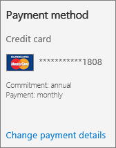

# Ändern der Rechnungsadressen für Office 365 Business

Ihre Rechnung oder Rechnung enthält drei Adressen:
  
- **Auftraggeberadresse** Dies ist Ihr Firmenname und die Adresse, wie in Ihrem Organisationsprofil dargestellt.

- **Rechnungsadresse** Dies ist die Adresse Ihrer zuständigen Rechnungsabteilung und meist mit der **Auftraggeberadresse** identisch.

- **Dienstnutzungsadresse** Dies ist die Adresse, unter welcher der Dienst genutzt wird. Normalerweise ist diese Adresse mit der **Auftraggeberadresse** identisch. Wenn Ihre Organisation Remotebenutzer oder mehrere Niederlassungen hat, verwenden Sie die Adresse, an der sich die Mehrheit der Benutzer befindet.

In den meisten Fällen sind diese Adressen identisch. Bei Bedarf können Sie eine oder mehrere Adressen ändern. Sie können auch eine alternative E-Mail-Adresse zum Empfang von Rechnungsbenachrichtigungen angeben, und die alternative E-Mail-Adresse für andere Administratoren ändern.
  
::: moniker range="o365-worldwide"

Weitere Informationen zu Ihrer Rechnung oder Rechnung finden Sie unter [Anzeigen Ihrer Rechnung oder Rechnung](view-your-bill-or-invoice.md) und [verstehen Ihrer Rechnung](understand-your-invoice2.md).

::: moniker-end

::: moniker range="o365-germany"

Weitere Informationen zu Ihrer Rechnung oder Rechnung finden Sie unter [Anzeigen Ihrer Rechnung oder Rechnung](view-your-bill-or-invoice.md) und [verstehen Ihrer Rechnung](understand-your-invoice2.md).

::: moniker-end

::: moniker range="o365-21vianet"

Wenn Sie Office 365 betrieben von 21Vianet in China verwenden, finden Sie weitere Informationen unter [View your Bill oder Get Fapiaos for Office 365 operated by 21Vianet](../../admin/services-in-china/view-your-bill-or-get-a-fapiao.md).

::: moniker-end

::: moniker range="o365-worldwide"

> [!NOTE]
> Wenn Sie das neue Microsoft 365 Admin Center nicht verwenden, können Sie es aktivieren, indem Sie den Umschalter **Das neue Admin Center** am oberen Rand der Startseite auswählen.

::: moniker-end

## Ändern der Auftraggeberadresse

1. Wechseln Sie im Admin Center zur Seite **Rechnungs** \> <a href="https://go.microsoft.com/fwlink/p/?linkid=2084771" target="_blank">Abrechnungskonten</a> .

2. Wählen Sie **Abrechnungskontoinformationen bearbeiten**aus.

3. Aktualisieren Sie Ihre Organisationsinformationen, und wählen Sie dann **Speichern**aus.
  
## Ändern der Rechnungsadresse

::: moniker range="o365-worldwide"

1. Wechseln Sie im Admin Center zur Seite **Abrechnungs** \> <a href="https://go.microsoft.com/fwlink/p/?linkid=2018806" target="_blank">Zahlungsmethoden</a> .

2. Wählen Sie die Kreditkarte oder das Bankkonto aus, das Sie ändern möchten.

3. Wählen Sie auf der Seite **Details der Zahlungsmethode** die Option **Bearbeiten**aus.

4. Aktualisieren Sie Ihre Rechnungsadresse, und wählen Sie dann **Save** \> **done**aus.

::: moniker-end

::: moniker range="o365-germany"

1. Navigieren Sie im Admin Center zur Seite **Abrechnung** \> <a href="https://go.microsoft.com/fwlink/p/?linkid=847745" target="_blank">Abonnements</a>.

2. Wählen Sie das Abonnement aus, das Sie ändern möchten, und wählen Sie **Zahlungsdetails ändern**aus.

    
  
3. *Kunden von Kreditkarten-und Bankkonten:*  Wählen Sie auf der Seite **Zahlungsdetails ändern** die Kreditkarte oder das Bankkonto aus, das Sie aktualisieren möchten, wählen Sie **Details bearbeiten**aus, aktualisieren Sie Ihre Rechnungsadresse, und wählen Sie dann **senden**aus.
  
    > [!NOTE]
    > Die Möglichkeit, per Bankkonto zu bezahlen, ist in einigen Ländern oder Regionen nicht verfügbar.

     *Rechnungs Kunden:*  Aktualisieren Sie auf der Seite **Zahlungsdetails ändern** Ihre Rechnungsadresse, und wählen Sie dann **Absenden**aus.
  
    > [!NOTE]
    > Die Möglichkeit, eine Rechnung per Scheck zu bezahlen, steht in einigen Ländern oder Regionen nicht zur Verfügung.

::: moniker-end

::: moniker range="o365-21vianet"

1. Navigieren Sie im Admin Center zur Seite **Abrechnung** \> <a href="https://go.microsoft.com/fwlink/p/?linkid=850626" target="_blank">Abonnements</a>.

2. Wählen Sie das Abonnement aus, das Sie ändern möchten, und wählen Sie **Zahlungsdetails ändern**aus.

    
  
3. Aktualisieren Sie auf der Seite **Zahlungsdetails ändern** Ihre Rechnungsadresse, und wählen Sie dann **Absenden**aus.

    Sie können [die Zahlungsmethode für Office 365, betrieben von 21Vianet, von "Zahlung per Rechnung" auf "Onlinezahlung" (Alipay oder UnionPay China) ändern](change-payment-method.md) (und umgekehrt).

::: moniker-end

## Ändern der Dienstnutzungsadresse

::: moniker range="o365-worldwide"

1. Navigieren Sie im Admin Center zur Seite **Abrechnung** \> <a href="https://go.microsoft.com/fwlink/p/?linkid=842054" target="_blank">Produkte und Dienste</a>.

2. Suchen Sie das Abonnement, das Sie ändern möchten. Wählen Sie im Abschnitt **Einstellungen & Aktionen** die Option **Dienst Verwendungs Adresse bearbeiten**aus.

3. Aktualisieren Sie im Bereich **Ihre Dienstnutzungsadresse bearbeiten** Ihre Adresse, und wählen Sie dann **Speichern**aus.

::: moniker-end

::: moniker range="o365-germany"

1. Navigieren Sie im Admin Center zur Seite **Abrechnung** \> <a href="https://go.microsoft.com/fwlink/p/?linkid=847745" target="_blank">Abonnements</a>.

2. Wählen Sie das Abonnement aus, das Sie ändern möchten, wählen Sie **Weitere Aktionen**aus, und wählen Sie dann **Dienstnutzungsadresse bearbeiten**aus.

    
  
3. Aktualisieren Sie im Bereich **Ihre Dienstnutzungsadresse bearbeiten** Ihre Adresse, und wählen Sie dann **Absenden**aus.

::: moniker-end

::: moniker range="o365-21vianet"

1. Navigieren Sie im Admin Center zur Seite **Abrechnung** \> <a href="https://go.microsoft.com/fwlink/p/?linkid=850626" target="_blank">Abonnements</a>.

2. Wählen Sie das Abonnement aus, das Sie ändern möchten, wählen Sie **Weitere Aktionen**aus, und wählen Sie dann **Dienstnutzungsadresse bearbeiten**aus.

    
  
3. Aktualisieren Sie im Bereich **Ihre Dienstnutzungsadresse bearbeiten** Ihre Adresse, und wählen Sie dann **Absenden**aus.

::: moniker-end

## Ändern der alternativen E-Mail-Adresse, an die Rechnungsbenachrichtigungen gesendet werden

Standardmäßig werden die Rechnungsbenachrichtigungen für Ihre Organisation an die Office 365-E-Mail-Adresse und an die alternative E-Mail-Adresse jedes globalen Administrators und Rechnungsadministrators in Ihrer Organisation gesendet. Jeder Administrator kann seine eigene alternative E-Mail-Adresse durch Aktualisieren seiner Profilinformationen ändern.
  
1. Melden Sie sich bei Office 365 mit Ihrem Firmen- oder Schulkonto als globaler Administrator an. [Hier erfahren Sie, wie Sie sich anmelden.](https://support.office.com/article/e9eb7d51-5430-4929-91ab-6157c5a050b4)

2. Wählen Sie das **Benutzersymbol**aus, und wählen Sie dann **mein Konto**aus.
  
3. Wählen Sie **persönliche Informationen**aus.
  
4. Wählen Sie im Feld **Kontaktdetails** die Option **Bearbeiten**aus.

5. Geben Sie im Feld **Alternative e-Mail** -Adresse die Alternative e-Mail-Adresse ein, die Sie verwenden möchten, und wählen Sie dann **Speichern**aus.
  
## Ändern der alternativen E-Mail-Adresse für einen anderen Administrator

Sie können auch die alternative E-Mail-Adresse anderer globaler Administratoren oder Rechnungsadministratoren in Ihrer Organisation ändern.
  
1. Wechseln Sie im Admin Center zur Seite **Billing** \> <a href="https://go.microsoft.com/fwlink/p/?linkid=853212" target="_blank">Billing Notifications</a> .

    Wenn Sie Office 365 Deutschland verwenden, navigieren Sie zu dieser Seite mit den <a href="https://go.microsoft.com/fwlink/p/?linkid=853213" target="_blank">Abrechnungs Benachrichtigungen</a> .

    Wenn Sie Office 365 betrieben von 21Vianet verwenden, navigieren Sie zu dieser Seite mit den <a href="https://go.microsoft.com/fwlink/p/?linkid=853215" target="_blank">Abrechnungs Benachrichtigungen</a> .

2. Wählen Sie auf der Seite " **Abrechnungs Benachrichtigungen** " den Administrator aus, den Sie ändern möchten.

3. Geben Sie im Bereich **Benutzerrollen bearbeiten** die Alternative e-Mail-Adresse ein, die Sie verwenden möchten, und wählen Sie dann **Speichern**aus.

## Verwandte Artikel

[Anzeigen Ihrer Rechnung](view-your-bill-or-invoice.md)

[Grundlegendes zur Ihrer Rechnung](understand-your-invoice2.md)

[Bezahlen für yoursubscription](pay-for-your-subscription.md)

[Abonnements und Abrechnung – Administratorhilfe](../subscriptions-and-billing.md)

