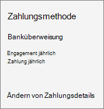

# Ändern der Rechnungsadressen

::: moniker range="o365-21vianet"

> [!NOTE]
> Das Admin Center wird geändert. Wenn Ihre Erfahrung nicht den hier aufgeführten Details entspricht, lesen Sie [über das neue Microsoft 365 Admin Center](https://docs.microsoft.com/microsoft-365/admin/microsoft-365-admin-center-preview?view=o365-21vianet&preserve-view=true).

::: moniker-end

Ihre Rechnung enthält drei Adressen:
  
- **Auftraggeberadresse** Dies ist Ihr Firmenname und die Adresse, wie in Ihrem Organisationsprofil dargestellt.

- **Rechnungsadresse** Dies ist die Adresse Ihrer zuständigen Rechnungsabteilung und meist mit der **Auftraggeberadresse** identisch.

- **Dienstnutzungsadresse** Dies ist die Adresse, unter welcher der Dienst genutzt wird. Normalerweise ist diese Adresse mit der **Auftraggeberadresse** identisch. Wenn Ihre Organisation Remotebenutzer oder mehrere Niederlassungen hat, verwenden Sie die Adresse, an der sich die Mehrheit der Benutzer befindet.

In den meisten Fällen sind diese Adressen identisch. Bei Bedarf können Sie eine oder mehrere Adressen ändern. Sie können auch eine alternative E-Mail-Adresse angeben, um Abrechnungsbenachrichtigungen zu erhalten und die alternative E-Mail-Adresse für andere Administratoren zu ändern.
  
::: moniker range="o365-worldwide"

Weitere Informationen zu Ihrer Rechnung finden Sie unter Anzeigen [Ihrer](view-your-bill-or-invoice.md) Rechnung und [Verstehen Ihrer Rechnung.](understand-your-invoice2.md)

::: moniker-end

::: moniker range="o365-germany"

Weitere Informationen zu Ihrer Rechnung finden Sie unter Anzeigen [Ihrer](view-your-bill-or-invoice.md) Rechnung und [Verstehen Ihrer Rechnung.](understand-your-invoice2.md)

::: moniker-end

::: moniker range="o365-21vianet"

If you're using Office 365 operated by 21Vianet in China, [see View your bill or get Fapiaos for Office 365 operated by 21Vianet](../../admin/services-in-china/view-your-bill-or-get-a-fapiao.md).

::: moniker-end

## Ändern der Auftraggeberadresse

1. Wechseln Sie im Admin Center zur **Seite** \> <a href="https://go.microsoft.com/fwlink/p/?linkid=2084771" target="_blank">"Abrechnungskonten".</a>

2. Wählen **Sie "Abrechnungskontoinformationen bearbeiten" aus.**

3. Aktualisieren Sie Ihre Organisationsinformationen, und wählen Sie dann Speichern **aus.**
  
## Ändern der Rechnungsadresse

::: moniker range="o365-worldwide"

1. Wechseln Sie im Admin Center zur **Seite** \> <a href="https://go.microsoft.com/fwlink/p/?linkid=2018806" target="_blank">Abrechnungszahlungsmethoden.</a>

2. Wählen Sie die Kreditkarte oder das Bankkonto aus, die Sie ändern möchten.

3. Wählen Sie **auf der Seite Zahlungsartendetails** die Option **Bearbeiten aus.**

4. Aktualisieren Sie Ihre Rechnungsadresse, und wählen Sie **"Fertig** \> **speichern" aus.**

::: moniker-end

::: moniker range="o365-germany"

1. Navigieren Sie im Admin Center zur Seite **Abrechnung** \> <a href="https://go.microsoft.com/fwlink/p/?linkid=847745" target="_blank">Abonnements</a>.

2. Wählen Sie das Abonnement aus, das Sie ändern möchten, und wählen Sie dann **"Zahlungsdetails ändern" aus.**

    
  
3. *Kreditkarten- und Bankkontokunden:*  Wählen Sie auf der Seite **Zahlungsdetails** ändern die Kreditkarte oder das Bankkonto aus, die Sie aktualisieren möchten, wählen Sie "Details **bearbeiten",** aktualisieren Sie Ihre Rechnungsadresse, und wählen Sie dann "Absenden" **aus.**
  
    > [!NOTE]
    > Die Möglichkeit, per Bankkonto zu bezahlen, ist in einigen Ländern oder Regionen nicht verfügbar.

     *Rechnungskunden:*  Aktualisieren Sie **auf der Seite Zahlungsdetails ändern** Ihre Rechnungsadresse, und wählen Sie dann **"Absenden" aus.**
  
    > [!NOTE]
    > Die Möglichkeit, eine Rechnung per Scheck zu bezahlen, ist in einigen Ländern oder Regionen nicht verfügbar.

::: moniker-end

::: moniker range="o365-21vianet"

1. Navigieren Sie im Admin Center zur Seite **Abrechnung** \> <a href="https://go.microsoft.com/fwlink/p/?linkid=850626" target="_blank">Abonnements</a>.

2. Wählen Sie das Abonnement aus, das Sie ändern möchten, und wählen Sie dann **"Zahlungsdetails ändern" aus.**

    
  
3. Aktualisieren Sie **auf der Seite Zahlungsdetails ändern** Ihre Rechnungsadresse, und wählen Sie dann "Absenden" **aus.**

    Sie können Ihre Zahlungsmethode für Office 365, betrieben von 21Vianet, mit Alipay oder China UnionPay von "Rechnung" in "Onlinezahlung" ändern oder umgekehrt.

::: moniker-end

## Ändern der Dienstnutzungsadresse

::: moniker range="o365-worldwide"

1. Navigieren Sie im Admin Center zur Seite **Abrechnung** \> <a href="https://go.microsoft.com/fwlink/p/?linkid=842054" target="_blank">Ihre Produkte</a>.
2. Wählen Sie auf der Registerkarte **Produkte** das Abonnement aus, das Sie ändern möchten.
3. Wählen Sie auf der  Seite mit den Abonnementdetails im Abschnitt "Dienstverwendungsadresse" die Option **"Dienstverwendungsadresse bearbeiten" aus.**
4. Aktualisieren Sie **im Adressbereich "Dienstverwendung bearbeiten"** Ihre Adresse, und wählen Sie dann "Speichern" **aus.**

::: moniker-end

::: moniker range="o365-germany"

1. Navigieren Sie im Admin Center zur Seite **Abrechnung** \> <a href="https://go.microsoft.com/fwlink/p/?linkid=847745" target="_blank">Abonnements</a>.

2. Wählen Sie das Abonnement aus, das Sie ändern möchten, wählen **Sie "Weitere** Aktionen" und dann **"Dienstverwendungsadresse bearbeiten" aus.**

    
  
3. Aktualisieren Sie **im Adressbereich "Dienstverwendung bearbeiten"** Ihre Adresse, und wählen Sie dann "Absenden" **aus.**

::: moniker-end

::: moniker range="o365-21vianet"

1. Navigieren Sie im Admin Center zur Seite **Abrechnung** \> <a href="https://go.microsoft.com/fwlink/p/?linkid=850626" target="_blank">Abonnements</a>.

2. Wählen Sie das Abonnement aus, das Sie ändern möchten, wählen **Sie "Weitere** Aktionen" und dann **"Dienstverwendungsadresse bearbeiten" aus.**

    
  
3. Aktualisieren Sie **im Adressbereich "Dienstverwendung bearbeiten"** Ihre Adresse, und wählen Sie dann "Absenden" **aus.**

::: moniker-end

## Ändern der alternativen E-Mail-Adresse, an die Rechnungsbenachrichtigungen gesendet werden

Standardmäßig werden die Abrechnungsbenachrichtigungen Ihrer Organisation an die Microsoft-E-Mail-Adresse und die alternative E-Mail-Adresse jedes globalen Und Abrechnungsadministrators in Ihrer Organisation gesendet. Jeder Administrator kann seine eigene alternative E-Mail-Adresse durch Aktualisieren seiner Profilinformationen ändern.
  
1. Melden Sie sich bei Microsoft 365 mit Ihrem Arbeits- oder Schulkonto als globaler Administrator an. Erfahren Sie, wie Sie [sich anmelden.](https://support.microsoft.com/office/e9eb7d51-5430-4929-91ab-6157c5a050b4)

2. Wählen Sie das **Symbol "Benutzer"** und dann **"Mein Konto" aus.**
  
3. Wählen Sie **persönliche Informationen aus.**
  
4. Wählen Sie **im Feld "Kontaktdetails"** die Option **"Bearbeiten" aus.**

5. Geben Sie **im Feld Alternative E-Mail** die alternative E-Mail-Adresse ein, die Sie verwenden möchten, und wählen Sie dann Speichern **aus.**
  
## Ändern der alternativen E-Mail-Adresse für einen anderen Administrator

Sie können auch die alternative E-Mail-Adresse anderer globaler Administratoren oder Rechnungsadministratoren in Ihrer Organisation ändern.

::: moniker range="o365-worldwide"
  
1. Navigieren Sie im Admin Center zur Seite **Abrechnung** \> <a href="https://go.microsoft.com/fwlink/p/?linkid=853212" target="_blank">Abrechnungsbenachrichtigungen</a>.

::: moniker-end

::: moniker range="o365-germany"

1. Navigieren Sie im Admin Center zur Seite **Abrechnung** \> <a href="https://go.microsoft.com/fwlink/p/?linkid=853213" target="_blank">Abrechnungsbenachrichtigungen</a>.

::: moniker-end

::: moniker range="o365-21vianet"

1. Wechseln Sie im Admin Center zur Seite  \> <a href="https://go.microsoft.com/fwlink/p/?linkid=853215" target="_blank">"Abrechnungsbenachrichtigungen".</a>

::: moniker-end

2. Wählen Sie auf der Seite "Abrechnungsbenachrichtigungen" den Administrator aus, den Sie ändern möchten. 

3. Geben Sie **im Bereich "Benutzerrollen** bearbeiten" die alternative E-Mail-Adresse ein, die Sie verwenden möchten, und wählen Sie dann Speichern **aus.**

## Verwandte Artikel

[Anzeigen Ihrer Rechnung](view-your-bill-or-invoice.md)

[Erläuterungen zu Ihrer Rechnung](understand-your-invoice2.md)

[Bezahlen Ihres Abonnements](pay-for-your-subscription.md)

[Abonnements und Abrechnung – Administratorhilfe](../index.yml)
