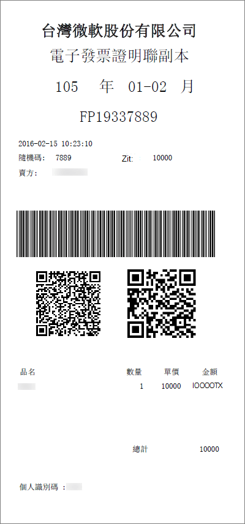

# Grundlegendes zur e-Rechnung für Microsoft 365 for Business (Taiwan)

e-invoice ist eine elektronische Rechnung, die vom Verkäufer nach dem Kauf des Käufers in Übereinstimmung mit den e-Rechnung-Anforderungen der Taiwan-Steuerbehörde ausgestellt wurde. Informationen werden zur Datensatzaufbewahrung an die elektronische Rechnungs Wolke der Taiwan-Steuerbehörde übermittelt. Informationen zu Taiwan e-invoice finden Sie hier:<a href="https://www.einvoice.nat.gov.tw/" target="_blank">財政部電子發票整合服務平台</a>
  
Eine Beispiel Kopie der e-Rechnung ist hier enthalten:
  

  
## Was ist mein Steuersatz?

Für kommerzielle Käufe wenden wir Steuern zusätzlich zum angegebenen Preis unserer Abonnements mit einem von der Taiwan Tax Authority verordneten Satz an. Für steuerliche Fragen oder Planung arbeiten Sie bitte mit Ihrem Steuerberater zusammen.
  
## Wann wird e-invoice für meine Microsoft 365-Dienste gestartet?

Microsoft ersetzt die aktuelle computerbezogene Rechnung per e-Rechnung am **15. September**. Für die Abrechnung vor dem 15. September werden Papierkopien-Steuerrechnungen direkt an Kunden gesendet. Nach dem 15. September wird e-Invoice in Ihrem Microsoft 365 Admin Center zum Anzeigen, herunterladen und Drucken angeboten und wird nicht mehr direkt an Sie gesendet. 
  
## Wo kann ich meine e-Rechnung finden?

Sie können Ihre e-Rechnung am Tag nach der Bereitstellung Ihrer Rechnung über Ihr Admin Center zusammen mit ihrer monatlichen Rechnung anzeigen, herunterladen und ausdrucken. [Zeigen Sie Ihre Rechnung](view-your-bill-or-invoice.md)an.
  
## Wie aktualisiere ich meine MwSt-ID?

Sie können Ihre Umsatzsteuer-ID zum Zeitpunkt des onboardings oder über Ihr Admin Center nach dem Onboard aktualisieren.
  
Zum Zeitpunkt der Kontoerstellung, in **Schritt 1**, willkommen, Let es Get to Know You, **Seite 2**, wo werden Sie diese verwenden?, unterhalb der **Service Empfänger-Adress** Informationen können Sie Ihre 8-stellige **USt-ID**hinzufügen. Wenn Sie keine Umsatzsteuer-ID haben, geben Sie "00000000" ein.
  
Nachdem Sie Ihr Konto erstellt haben, können Sie Ihre MwSt-ID über Ihr Admin Center aktualisieren, indem Sie die folgenden Schritte ausführen:
  
1. Navigieren Sie im Admin Center zur Seite **Abrechnung** \> <a href="https://go.microsoft.com/fwlink/p/?linkid=842054" target="_blank">Produkte und Dienste</a>.
    
2. Wählen Sie ein Abonnement aus, und wählen Sie dann **Weitere Aktionen**aus.
    
3. Wählen Sie **Update Service Recipient address**aus, und aktualisieren Sie die **Steuer-ID-** Informationen. 
    
## Wie fordere ich eine e-Rechnung-Papierkopie an?

Wenn Ihr Bon "Lucky Draw" gewonnen hat (nur für Kunden ohne USt-ID verfügbar), senden wir eine Kopie direkt an die per Einschreiben hinterlegten Adressen.
  
Wenn Sie die offizielle Papierkopie Ihrer e-Rechnung benötigen, [wenden Sie sich an den Support](../../admin/contact-support-for-business-products.md). Nachdem wir Ihre Anfrage erhalten haben, werden wir die Papierkopie der e-Rechnung an die Adresse in der Datei senden.
  
## Weitere Fragen?

[連絡客戶支援](../../admin/contact-support-for-business-products.md)