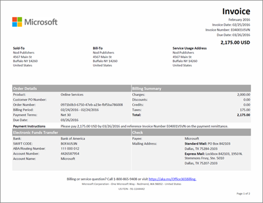

# Grundlegendes zu Ihrer Rechnung für Office 365 Business

Jeden Monat erhalten Sie eine e-Mail, die Ihnen mitteilt, dass Ihre neue Abrechnungs Anweisung im Admin Center zur Verfügung steht. [Erfahren Sie, wie Sie Ihre Rechnung finden und anzeigen](view-your-bill-or-invoice.md).
  
Ihre Rechnung enthält zwei Seiten. Seite 1 ist die Zusammenfassung der Rechnung und enthält allgemeine Informationen über die Rechnung, den Auftrag, den fälligen Betrag sowie dazu, wie Sie eine Zahlung vornehmen und wie Sie Kontakt zum Support aufnehmen können.
  

  
Seite 2 enthält Details zur Abrechnungsaktivität für jedes Abonnement.
  

  
Beschreibungen der Felder und Ausdrücke, die auf einer Rechnung enthalten sind, finden Sie unter [Glossar der Rechnungsfelder](#invoice-field-glossary) weiter unten in diesem Artikel.
  
## Grundlegendes zu den Abrechnungskonzepten

Bevor Sie eine Rechnung anzeigen, sollten Sie mit einigen wichtigen Abrechnungskonzepten vertraut sein.
  
### Rechnungssaldo und Auftragssaldo

 **Rechnungssaldo** ist der Betrag, der auf Ihrer Rechnung angezeigt wird, und ist nur der Betrag, der für diesen bestimmten Abrechnungszeitraum fällig ist. Ihr gesamtes **Auftragssaldo** ist die Summe aller nicht bezahlten Rechnungen. Sie können den Saldo Ihrer Bestellung im Abschnitt **Abrechnung** des Admin Centers anzeigen.
  
### Abrechnungshäufigkeit und Rechnungshäufigkeit

 **Abrechnungshäufigkeit** bedeutet, wie oft eine Rechnung für Sie erstellt wird. Abonnements werden entweder monatlich oder jährlich in Rechnung gestellt, je nachdem, welche Option Sie während des Abonnements erworben haben. **Rechnungshäufigkeit** bedeutet, wie oft Sie eine Rechnung erhalten. Wenn Sie jährliche Abrechnung gewählt haben, erhalten Sie nur eine Rechnung pro Jahr - es sei denn, dass die Aktivität für Ihr Abonnement eine Gebühr oder eine Gutschrift erfordert.
  
Haben Sie mehrere Aufträge, erhalten Sie für jeden Auftrag eine Rechnung.
  
## Glossar der Rechnungsfelder

In der folgenden Tabelle sind die Felder beschrieben, die möglicherweise auf Ihrer Rechnung zu sehen sind. Einige der hier aufgeführten Felder sind abhängig davon, ob Sie per Rechnung, Kreditkarte oder Bankeinzug bezahlen, möglicherweise nicht vorhanden.
  
> [!NOTE]
> Zahlung per Bankeinzug ist in einigen Ländern oder Regionen nicht verfügbar.
  
|**Name**|**Beschreibung**|
|:-----|:-----|
|Jährlicher Preis|Abonnements werden monatlich oder jährlich abgerechnet. Wenn Sie die jährliche Abrechnung während des Abonnements erworben haben, wird der jährliche Lizenzpreis auf der Rechnung widergespiegelt. Wenn Sie die Abrechnungshäufigkeit ändern möchten, müssen Sie Ihr Abonnement kündigen und es mit der neuen Abrechnungshäufigkeit erneut kaufen.|
|Abrechnungszeitraum|Der Abrechnungszeitraum entspricht dem Zeitraum seit dem letzten Rechnungsdatum. Der Dienstzeitraum ist der Zeitraum, für den Ihnen die Nutzung des Diensts in Rechnung gestellt wird.|
|Rechnungsempfänger|Dies ist die Adresse Ihrer zuständigen Abteilung und meist mit der Auftraggeberadresse identisch. Informationen zum Aktualisieren Ihrer Rechnungsadresse finden Sie unter [Ändern der Rechnungsadressen](change-your-billing-addresses.md).|
|Gebühren|Auf der Seite 1 Ihrer Rechnung sind alle Gebühren für den Abrechnungszeitraum der Rechnung zusammengefasst. Auf der Seite 2 sind die detaillierten Gebühren für jedes Abonnement aufgeführt.|
|Scheck|Wenn Sie per Rechnung bezahlen und in Ihrem Land Scheckzahlung angeboten wird, finden Sie unten auf der Seite 1 Informationen darüber, wohin Sie Ihre Zahlung senden sollen. Geben Sie auf Ihrem Scheck bitte die Rechnungsnummer an.|
|Gutschriften|Auf der Seite 1 Ihrer Rechnung sind alle Gutschriften für den Abrechnungszeitraum der Rechnung zusammengefasst. Auf der Seite 2 sind die detaillierten Gutschriften für jedes Abonnement aufgeführt.|
|Auftragsnummer des Kunden|Ihre Auftragsnummer. Wenn Sie die Auftragsnummer aktualisieren, wird sie auf zukünftigen Rechnungen enthalten sein. [Ändern Ihrer Auftragsnummer](#change-your-purchase-order-number).    **Hinweis:** Sie können keine Bestellnummer zu einer vorhandenen Rechnung hinzufügen.           |
|Tage|Jede Abrechnungstransaktion ist einem Dienstzeitraum zugeordnet. Die Spalte "Tage" gibt die Anzahl von Tagen die in diesem Dienstzeitraum an.|
|Rabatte|Auf der Seite 1 Ihrer Rechnung sind alle Rabatte für den Abrechnungszeitraum der Rechnung zusammengefasst. Auf der Seite 2 sind die detaillierten Rabatte für jedes Abonnement aufgeführt.|
|Fällig am|Das Datum, zu dem die Zahlung der Rechnung fällig ist. Wird Ihr Abonnement per Kreditkarte oder Bankeinzug bezahlt, wird Ihre Kreditkarte oder Ihr Bankkonto am Tag nach dem Rechnungsdatum belastet.  **Hinweis:** Die Zahlung per Bankkonto ist in einigen Ländern oder Regionen nicht möglich.           |
|Elektronischer Zahlungsverkehr|Wenn Sie "Rechnung" als Zahlungsmethode für Abonnements ausgewählt haben, enthält Seite 1 die Microsoft Bankkontoinformationen für elektronische Zahlungen (Wire, Ach, SEPA, etc.). Üblicherweise stellt Ihre Bank ein Referenzfeld zur Verfügung, das Sie ausfüllen, wenn Sie eine Zahlung senden. Geben Sie bitte die Rechnungsnummer an, die in diesem Feld angezeigt wird.|
|Gesamtergebnis|Diese Zeile enthält die Gesamtsummen für die Spalten "Gebühren", "Rabatte", "Gutschriften", "Zwischensumme", "Steuern" und "Summe" für alle Abonnements, die auf der Rechnung aufgeführt sind.|
|Rechnungsdatum|Das Erstellungsdatum der Rechnung. Das Rechnungsdatum entspricht dem Tag nach dem Ende des Abrechnungszeitraums. Ist Ihr Abrechnungszeitraum beispielsweise 15. Januar bis 14. Februar, ist der 15. Februar das Rechnungsdatum.|
|Rechnungsnummer|Die eindeutige Nummer auf Ihrer Rechnung. Geben Sie bei Ihrer Zahlung bitte die Rechnungsnummer an.|
|Monatlicher Preis|Abonnements werden monatlich oder jährlich abgerechnet. Wenn Sie die monatliche Abrechnung während des Abonnements erworben haben, wird der monatliche Lizenzpreis auf der Rechnung wiedergegeben. Wenn Sie die Abrechnungshäufigkeit ändern möchten, müssen Sie Ihr Abonnement kündigen und es mit der neuen Abrechnungshäufigkeit erneut erwerben.|
|Auftragsnummer|Jedes Mal, wenn Sie ein neues Abonnement kaufen, wird ein Auftrag erstellt. Jeden Monat erhalten Sie eine Rechnung für jeden Auftrag.|
|Zahlungsanweisungen|If you pay by credit card, you'll see "Do not pay - charged to credit card on file." If you pay by invoice, you'll see instructions for paying by Electronic Funds Transfer (EFT) and check (if applicable).|
|Zahlungsbedingungen|Die Anzahl von Tagen ab dem Rechnungsdatum, in denen die Zahlung fällig ist. Der Standard ist 30 Tage.|
|Produkt|Auf Seite 1 Ihrer Rechnung ist "Onlinedienste" der Oberbegriff, mit dem Ihre Abonnements beschrieben werden. Auf Seite 2 sehen Sie die Namen der einzelnen Abonnements.|
|Menge|Die Anzahl von Lizenzen, die während des Dienstzeitraums erworben wurden.|
|Dienstzeitraum|Der Dienstzeitraum ist der Zeitraum, für den Ihnen die Nutzung des Diensts in Rechnung gestellt wird. Ein Abrechnungszeitraum entspricht dem Zeitraum seit dem letzten Rechnungsdatum.|
|Dienstnutzungsadresse|Die Adresse, an der der Dienst genutzt wird, in der Regel mit der Auftraggeberadresse identisch. Informationen zum Aktualisieren Ihrer Dienstnutzungsadresse finden Sie unter [Ändern der Rechnungsadressen](change-your-billing-addresses.md).|
|Auftraggeber|Der Name und die Adresse Ihres Unternehmens. Wenn Sie diese Informationen ändern möchten, gehen sie so vor, wie unter [Ändern der Adresse Ihrer Organisation, der E-Mail-Adresse für den technischen Kontakt und anderer Informationen](../../admin/manage/change-address-contact-and-more.md) beschrieben.  |
|Teilsumme|Jedes Abonnement, das auf Ihrer Rechnung aufgeführt ist, hat eine eigene "Zwischensumme"-Zeile für die Spalten "Gebühren", "Rabatte", "Gutschriften", "Zwischensumme", "Steuer" und "Summe".|
|Steuer|Auf Seite 1 Ihrer Rechnung ist der Gesamtbetrag für Steuern angegeben. Auf Seite 2 sind der zutreffende Steuersatz und der Gesamtsteuerbetrag für jeden Einzelposten angegeben. Enthält Ihre Rechnung Steuern, ist Ihr Unternehmen aber steuerbefreit, [wenden Sie sich bitte an den Support](../../admin/contact-support-for-business-products.md).  |
|Summe|Der Betrag, der für den Abrechnungszeitraum der Rechnung fällig ist.|

## Ändern Ihrer Auftragsnummer

Wenn Sie per Rechnung bezahlen, können Sie Ihrem Abonnement die Auftragsnummer hinzufügen oder diese ändern.
  
> [!NOTE]
> Einer vorhandenen Rechnung können Sie keine Auftragsnummer hinzuzufügen. Die Auftragsnummer wird in allen zukünftigen Rechnungen angezeigt.

::: moniker range="o365-worldwide"

1. Navigieren Sie im Admin Center zur Seite **Abrechnung** \> <a href="https://go.microsoft.com/fwlink/p/?linkid=842054" target="_blank">Produkte und Dienste</a>.

2. Wenn Sie sich in der **Tabellen** Ansicht befinden, wählen Sie **Karten** aus, um Ansichten zu wechseln.

3. Suchen Sie das Abonnement, das Sie ändern möchten.

4. Wählen Sie im Abschnitt **Abrechnung** neben **Rechnung**die Option **Bearbeiten**aus.

5. Geben Sie unten im Bereich **Zahlungsdetails bearbeiten** Ihre Bestellnummer ein, und wählen Sie dann **Speichern**aus.

::: moniker-end

::: moniker range="o365-germany"

1. Navigieren Sie im Admin Center zur Seite **Abrechnung** \> <a href="https://go.microsoft.com/fwlink/p/?linkid=847745" target="_blank">Abonnements</a>.

2. Wählen Sie das Abonnement aus, das Sie ändern möchten, und wählen Sie im Abschnitt **Zahlungsmethode** die Option **Zahlungsdetails ändern**aus.

3. Geben Sie unten im Bereich **Zahlungsdetails ändern** Ihre Bestellnummer ein, und wählen Sie dann **Absenden**aus.

::: moniker-end

::: moniker range="o365-21vianet"

1. Navigieren Sie im Admin Center zur Seite **Abrechnung** \> <a href="https://go.microsoft.com/fwlink/p/?linkid=850626" target="_blank">Abonnements</a>.

2. Wählen Sie das Abonnement aus, das Sie ändern möchten, und wählen Sie im Abschnitt **Zahlungsmethode** die Option **Zahlungsdetails ändern**aus.

3. Geben Sie unten im Bereich **Zahlungsdetails ändern** Ihre Bestellnummer ein, und wählen Sie dann **Absenden**aus.

::: moniker-end

## Verwandte Artikel

[Bezahlen für Ihr Office 365 Business-Abonnement](pay-for-your-subscription.md)

[Minecraft Education Edition - Zahlungsoptionen](https://go.microsoft.com/fwlink/p/?linkid=838761)