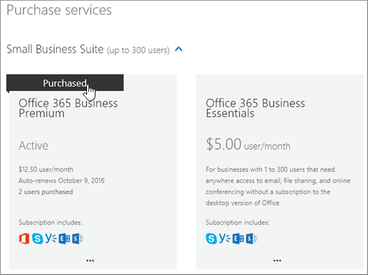

# Erwerben eines weiteren Microsoft 365 for Business-AbonnementsBuy another Microsoft 365 for business subscription

::: moniker range="o365-21vianet"

> [!NOTE]
> Das Admin Center wird geändert.The admin center is changing. Wenn Ihre Erfahrung nicht den hier aufgeführten Details entspricht, lesen Sie [über das neue Microsoft 365 Admin Center](https://docs.microsoft.com/microsoft-365/admin/microsoft-365-admin-center-preview?view=o365-21vianet).If your experience doesn't match the details presented here, see [About the new Microsoft 365 admin center](https://docs.microsoft.com/microsoft-365/admin/microsoft-365-admin-center-preview?view=o365-21vianet).

::: moniker-end

Wenn Sie bereits ein Microsoft 365 for Business-Abonnement haben und ein weiteres Abonnement für Ihre Organisation kaufen möchten, ist dies am besten über das Admin Center möglich.If you already have a Microsoft 365 for business subscription and you want to buy another subscription for your organization, the best way is to do it is through the admin center. Wenn Sie das erste Microsoft 365 for Business-Abonnement für Ihre Organisation noch nicht erworben haben, wählen Sie [hier](https://products.office.com/business/compare-office-365-for-business-plans) einen Plan aus.If you haven't yet purchased the first Microsoft 365 for business subscription for your organization, go [here](https://products.office.com/business/compare-office-365-for-business-plans) to choose a plan.
  
Wenn Sie ein weiteres Abonnement über das Admin Center kaufen, wird sichergestellt, dass das neue Abonnement derselben Organisation (Domänennamens Raum) wie Ihr vorhandenes Abonnement zugeordnet wird.When you buy another subscription through the admin center, you're guaranteed that the new subscription will be associated with the same organization (domain name space) as your existing subscription. Dadurch ist es einfacher, Benutzer in Ihrer Organisation zwischen Abonnements zu verschieben oder ihnen eine Benutzerlizenz für das benötigte zusätzliche Abonnement zuzuweisen.This makes it easier to move users within your organization between subscriptions or assign them a user license for the additional subscription they need.
  
Nachdem Sie ein neues Abonnement erworben haben, müssen Sie den Benutzern, die das Abonnement verwenden sollen, eine Benutzerlizenz dafür zuweisen.After purchasing a new subscription, you'll need to assign the users who you want to use that subscription a user license for it. Weitere Informationen finden Sie unter [Zuweisen von Lizenzen zu Benutzern in Microsoft 365 for Business](../admin/manage/assign-licenses-to-users.md).To learn how, see [Assign licenses to users in Microsoft 365 for business](../admin/manage/assign-licenses-to-users.md).
  
## Ein weiteres Abonnement kaufenBuy another subscription

::: moniker range="o365-worldwide"

1. Wechseln Sie im Admin Center zur Seite **Abrechnungs** - \> <a href="https://go.microsoft.com/fwlink/p/?linkid=868433" target="_blank">Einkaufsdienste</a> .In the admin center, go to the **Billing** \> <a href="https://go.microsoft.com/fwlink/p/?linkid=868433" target="_blank">Purchase services</a> page.

2. Wählen Sie auf der Seite **Einkaufsdienste** das Abonnement aus, das Sie kaufen möchten, und wählen Sie dann **kaufen**aus.On the **Purchase services** page, select the subscription that you want to buy, then select **Buy**.

3. Geben Sie die Anzahl der benötigten Lizenzen ein, und wählen Sie aus, ob Sie monatlich oder für das ganze Jahr bezahlen möchten.Enter the number of licenses that you need, and choose whether to pay each month or for the whole year. Wählen Sie aus, ob Sie allen Personen, die derzeit keine Lizenz besitzen, Lizenzen automatisch zuweisen möchten.Choose whether you want to automatically assign licenses to everyone who does not currently have a license. Wählen Sie dann **jetzt Auschecken aus**.Then select **Check out now**.

4. Ihr Einkaufswagen wird geöffnet.Your cart opens. Wenn Ihr Warenkorb nicht mehr auf dem Bildschirm angezeigt wird, wählen Sie **Warenkorb** aus, um ihn erneut zu öffnen, überprüfen Sie die Reihenfolge, und wählen Sie dann **Auschecken**aus.If your cart disappears from the screen, select **Cart** to reopen it, review the order and then select **Check Out**.

5. Überprüfen Sie die Preisinformationen, und wählen Sie **weiter**aus.Review the pricing information and select **Next**.

6. Geben Sie Ihre Zahlungsinformationen an, und wählen Sie dann **Bestellung** aufgeben, \> **um zu admin Home wechseln**.Provide your payment information, and then select **Place order** \> **Go to Admin Home**.

::: moniker-end

::: moniker range="o365-germany"

1. Navigieren Sie im Admin Center zur Seite **Abrechnung** \> <a href="https://go.microsoft.com/fwlink/p/?linkid=847745" target="_blank">Abonnements</a>.In the admin center, go to the **Billing** \> <a href="https://go.microsoft.com/fwlink/p/?linkid=847745" target="_blank">Subscriptions</a> page.

2. Wählen Sie auf der Seite **Abonnement** die Option **Abonnements hinzufügen**aus.On the **Subscription** page, select **Add subscriptions**.

    Es werden die für Ihre Organisation verfügbaren Abonnements angezeigt. Alle Abonnements, die Sie bereits erworben haben, werden auf diese Weise identifiziert.You'll see the subscriptions that are available to your organization. Any subscriptions that you've already purchased are identified like this.

    
  
3. Klicken Sie mit der Maus oder tippen Sie auf das Abonnement, das Sie kaufen möchten, und wählen Sie dann **Jetzt kaufen**aus.Mouse over or tap the subscription that you want to buy, and then select **Buy Now**.

    
  
4. Geben Sie die Anzahl der benötigten Benutzerlizenzen ein, wählen Sie aus, ob Sie monatlich oder für das ganze Jahr bezahlen möchten, und wählen Sie dann **zum Warenkorb hinzufügen**aus.Enter the number of user licenses you need, chose whether to pay each month or for the whole year, and then select **Add to Cart**.

5. Ihr Einkaufswagen wird geöffnet.Your cart opens. Wenn Ihr Warenkorb nicht mehr auf dem Bildschirm angezeigt wird, wählen Sie **Warenkorb** aus, um ihn erneut zu öffnen, überprüfen Sie die Reihenfolge, und wählen Sie dann **Auschecken**aus.If your cart disappears from the screen, select **Cart** to reopen it, review the order and then select **Check Out**.

6. Überprüfen Sie die Preisinformationen, und wählen Sie **weiter**aus.Review the pricing information and select **Next**.

7. Geben Sie Ihre Zahlungsinformationen an, und wählen Sie dann **Bestellung aufgeben**aus.Provide your payment information, and then select **Place order**.

8. Wählen Sie auf der Seite Bestätigung die Option **zu admin Home wechseln**aus.On the confirmation page, select **Go to Admin Home**.

::: moniker-end

::: moniker range="o365-21vianet"

1. Navigieren Sie im Admin Center zur Seite **Abrechnung** \> <a href="https://go.microsoft.com/fwlink/p/?linkid=850626" target="_blank">Abonnements</a>.In the admin center, go to the **Billing** \> <a href="https://go.microsoft.com/fwlink/p/?linkid=850626" target="_blank">Subscriptions</a> page.

2. Wählen Sie auf der Seite **Abonnement** die Option **Abonnements hinzufügen**aus.On the **Subscription** page, select **Add subscriptions**.

    Es werden die für Ihre Organisation verfügbaren Abonnements angezeigt. Alle Abonnements, die Sie bereits erworben haben, werden auf diese Weise identifiziert.You'll see the subscriptions that are available to your organization. Any subscriptions that you've already purchased are identified like this.

    
  
3. Klicken Sie mit der Maus oder tippen Sie auf das Abonnement, das Sie kaufen möchten, und wählen Sie dann **Jetzt kaufen**aus.Mouse over or tap the subscription that you want to buy, and then select **Buy Now**.

    
  
4. Geben Sie die Anzahl der benötigten Benutzerlizenzen ein, wählen Sie aus, ob Sie monatlich oder für das ganze Jahr bezahlen möchten, und wählen Sie dann **zum Warenkorb hinzufügen**aus.Enter the number of user licenses you need, chose whether to pay each month or for the whole year, and then select **Add to Cart**.

5. Ihr Einkaufswagen wird geöffnet.Your cart opens. Wenn Ihr Warenkorb nicht mehr auf dem Bildschirm angezeigt wird, wählen Sie **Warenkorb** aus, um ihn erneut zu öffnen, überprüfen Sie die Reihenfolge, und wählen Sie dann **Auschecken**aus.If your cart disappears from the screen, select **Cart** to reopen it, review the order and then select **Check Out**.

6. Überprüfen Sie die Preisinformationen, und wählen Sie **weiter**aus.Review the pricing information and select **Next**.

7. Geben Sie Ihre Zahlungsinformationen an, und wählen Sie dann **Bestellung aufgeben**aus.Provide your payment information, and then select **Place order**.

8. Wählen Sie auf der Seite Bestätigung die Option **zu admin Home wechseln**aus.On the confirmation page, select **Go to Admin Home**.

::: moniker-end

## Verwandte ArtikelRelated articles

[Zuweisen von Lizenzen für BenutzerAssign licenses to users](../admin/manage/assign-licenses-to-users.md)
  
[Entfernen von BenutzerlizenzenRemove licenses from users](../admin/manage/remove-licenses-from-users.md)
