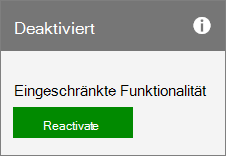

# Reaktivieren Ihres AbonnementsReactivate your subscription

::: moniker range="o365-21vianet"

> [!NOTE]
> Das Admin Center wird geändert.The admin center is changing. Wenn Ihre Erfahrung nicht den hier aufgeführten Details entspricht, lesen Sie [über das neue Microsoft 365 Admin Center](https://docs.microsoft.com/microsoft-365/admin/microsoft-365-admin-center-preview?view=o365-21vianet).If your experience doesn't match the details presented here, see [About the new Microsoft 365 admin center](https://docs.microsoft.com/microsoft-365/admin/microsoft-365-admin-center-preview?view=o365-21vianet).

::: moniker-end

Sie können Ihr Abonnement im Admin Center reaktivieren, wenn: das Abonnement ist abgelaufen, wurde von Microsoft deaktiviert, oder wenn Sie es in der Mitte eines Abonnementzeitraums storniert haben.You can reactivate your subscription in the admin center if: the subscription expired, was disabled by Microsoft, or if you canceled it in the middle of a subscription term.
  
## VorbereitungBefore you begin

Sie müssen ein globaler oder abrechnungsadministrator sein, um ein Abonnement reaktivieren zu können.You must be a Global or Billing admin to reactivate a subscription. Weitere Informationen finden Sie unter [Informationen zu Administratorrollen](../../admin/add-users/about-admin-roles.md).For more information, see [About admin roles](../../admin/add-users/about-admin-roles.md).

**Sie sind kein Administrator?****Not an admin?** Wenden Sie sich an ihre Verwaltung, um Ihr Abonnement zu reaktivieren.Contact your administration to reactivate your subscription.

## Reaktivieren eines AbonnementsReactivate a subscription

::: moniker range="o365-worldwide"

1. Navigieren Sie im Admin Center zur Seite **Abrechnung** \> <a href="https://go.microsoft.com/fwlink/p/?linkid=842054" target="_blank">Ihre Produkte</a>.In the admin center, go to the **Billing** \> <a href="https://go.microsoft.com/fwlink/p/?linkid=842054" target="_blank">Your products</a> page.
2. Suchen Sie auf der Registerkarte **Produkte** das Abonnement aus, das Sie reaktivieren möchten.On the **Products** tab, find the subscription that you want to reactivate. Wählen Sie **Weitere Aktionen** (drei Punkte) aus, und wählen Sie dann **reaktivieren dieses Abonnements** aus. Select **More actions** (three dots), then select **Reactivate this subscription**.\
    Wenn **dieses Abonnement nicht erneut aktiviert** werden kann, [wenden Sie sich an den Support](../../admin/contact-support-for-business-products.md).If you don't see **Reactivate this subscription** , [contact support](../../admin/contact-support-for-business-products.md).
3. Wählen Sie im Bereich **Dieses Abonnement reaktivieren** in der Dropdownliste eine Zahlungsmethode aus, oder wählen Sie **Zahlungsmethode hinzufügen** aus.In the **Reactivate this subscription** pane, select a payment method from the drop-down list, or select **Add payment method**.
4. Wählen Sie **Speichern** aus.Select **Save**.

::: moniker-end

::: moniker range="o365-germany"
  
1. Navigieren Sie im Admin Center zur Seite **Abrechnung** \> <a href="https://go.microsoft.com/fwlink/p/?linkid=847745" target="_blank">Abonnements</a>.In the admin center, go to the **Billing** \> <a href="https://go.microsoft.com/fwlink/p/?linkid=847745" target="_blank">Subscriptions</a> page.

2. Suchen Sie das Abonnement, das Sie reaktivieren möchten, und wählen Sie dann **reactivate** aus.Find the subscription that you want to reactivate, then select **Reactivate**.

    
  
    Wenn **reaktivieren** nicht als verfügbare Aktion angezeigt wird, [rufen](../../admin/contact-support-for-business-products.md) Sie den Support an, um Ihr Abonnement zu reaktivieren.If you don't see **Reactivate** as an available action, [call Support](../../admin/contact-support-for-business-products.md) to reactivate your subscription.

3. Geben Sie Ihre Zahlungsdetails ein.Enter your payment details. Hier können Sie Ihre vorhandenen Zahlungsinformationen aktualisieren.You can update your existing payment information here.

   Wenn Ihr Abonnement abgelaufen ist, wird Ihr Abonnement, nachdem Sie Ihre Zahlungsdetails übermittelt haben, in einen aktiven Zustand versetzt, und das **nächste Abrechnungs** Datum wird je nach ihrer aktuellen Abonnement Verpflichtung um einen Monat oder ein Jahr verlängert.If your subscription was expired, then after you submit your payment details, your subscription returns to an active state, and the **Next billing** date extends by either one month or one year, depending on your current subscription commitment. Wenn Sie mit Kreditkarte oder per Bankeinzug bezahlen, wird Ihre Karte/Ihr Konto für die Verlängerung belastet.If you pay by credit card or bank account, your credit card or bank account will be charged for the extension. Wenn Sie per Rechnung bezahlen, wird die Verlängerung in Ihrer nächsten Rechnung angezeigt.If you pay by invoice, you'll see the extension reflected on your next invoice. Um sicherzustellen, dass Ihr Abonnement nicht mehr abläuft, aktivieren Sie die [wiederkehrende Abrechnung](renew-your-subscription.md#turn-recurring-billing-off-or-on).To make sure that your subscription doesn't expire again, [turn on Recurring billing](renew-your-subscription.md#turn-recurring-billing-off-or-on).

   > [!NOTE]
   > Die Möglichkeit, per Bankkonto zu bezahlen, ist in einigen Ländern oder Regionen nicht verfügbar.The ability to pay by bank account isn't available in some countries or regions.
  
   Wenn Ihr Abonnement storniert wurde oder aufgrund einer nicht eingegangenen Zahlung deaktiviert wurde, wird der Status "aktiv" zurückgegeben, und das **nächste Abrechnungs** Datum bleibt unverändert.If your subscription was canceled, or was disabled because a payment wasn't received, it returns to an active state, and your **Next billing** date stays the same.

::: moniker-end

::: moniker range="o365-21vianet"
  
1. Navigieren Sie im Admin Center zur Seite **Abrechnung** \> <a href="https://go.microsoft.com/fwlink/p/?linkid=850626" target="_blank">Abonnements</a>.In the admin center, go to the **Billing** \> <a href="https://go.microsoft.com/fwlink/p/?linkid=850626" target="_blank">Subscriptions</a> page.

2. Suchen Sie das Abonnement, das Sie reaktivieren möchten, und wählen Sie dann **reactivate** aus.Find the subscription that you want to reactivate, then select **Reactivate**.

    
  
    Wenn **reaktivieren** nicht als verfügbare Aktion angezeigt wird, [rufen](../../admin/contact-support-for-business-products.md) Sie den Support an, um Ihr Abonnement zu reaktivieren.If you don't see **Reactivate** as an available action, [call Support](../../admin/contact-support-for-business-products.md) to reactivate your subscription.

3. Geben Sie Ihre Zahlungsdetails ein.Enter your payment details. Hier können Sie Ihre vorhandenen Zahlungsinformationen aktualisieren.You can update your existing payment information here.

   Wenn Ihr Abonnement abgelaufen ist, wird Ihr Abonnement, nachdem Sie Ihre Zahlungsdetails übermittelt haben, in einen aktiven Zustand versetzt, und das **nächste Abrechnungs** Datum wird je nach ihrer aktuellen Abonnement Verpflichtung um einen Monat oder ein Jahr verlängert.If your subscription was expired, then after you submit your payment details, your subscription returns to an active state, and the **Next billing** date extends by either one month or one year, depending on your current subscription commitment. Wenn Sie mit Kreditkarte oder per Bankeinzug bezahlen, wird Ihre Karte/Ihr Konto für die Verlängerung belastet.If you pay by credit card or bank account, your credit card or bank account will be charged for the extension. Wenn Sie per Rechnung bezahlen, wird die Verlängerung in Ihrer nächsten Rechnung angezeigt.If you pay by invoice, you'll see the extension reflected on your next invoice. Um sicherzustellen, dass Ihr Abonnement nicht mehr abläuft, aktivieren Sie die [wiederkehrende Abrechnung](renew-your-subscription.md#turn-recurring-billing-off-or-on).To make sure that your subscription doesn't expire again, [turn on Recurring billing](renew-your-subscription.md#turn-recurring-billing-off-or-on).

   > [!NOTE]
   > Die Möglichkeit, per Bankkonto zu bezahlen, ist in einigen Ländern oder Regionen nicht verfügbar.The ability to pay by bank account isn't available in some countries or regions.
  
   Wenn Ihr Abonnement storniert wurde oder aufgrund einer nicht eingegangenen Zahlung deaktiviert wurde, wird der Status "aktiv" zurückgegeben, und das **nächste Abrechnungs** Datum bleibt unverändert.If your subscription was canceled, or was disabled because a payment wasn't received, it returns to an active state, and your **Next billing** date stays the same.

::: moniker-end

## Verwandte InhalteRelated content

[Testen oder kaufen eines Microsoft 365 for Business-Abonnements](../try-or-buy-microsoft-365.md) (Artikel) [Try or buy a Microsoft 365 for business subscription](../try-or-buy-microsoft-365.md) (article)\
[Microsoft 365 for Business erneuern](renew-your-subscription.md) (Artikel) [Renew Microsoft 365 for business](renew-your-subscription.md) (article)\
[Kündigen Ihres Abonnements](cancel-your-subscription.md) (Artikel)[Cancel your subscription](cancel-your-subscription.md) (article)
