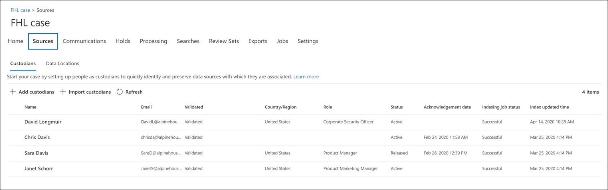

# Hinzufügen von Verwaltern zu einem erweiterten eDiscovery-FallAdd custodians to an Advanced eDiscovery case

Verwenden Sie das integrierte Depot Verwaltungstool in Advanced eDiscovery, um Ihre Workflows rund um das Verwalten von Depotbanken zu koordinieren und relevante, Freiheits geschützte Datenquellen zu identifizieren, die einem Fall zugeordnet sind.Use the built-in custodian management tool in Advanced eDiscovery to coordinate your workflows around managing custodians and identifying relevant, custodial data sources associated with a case. Wenn Sie eine Depotbank hinzufügen, kann das System das Exchange-Postfach und das OneDrive für Unternehmen Konto automatisch identifizieren und aufbewahren.When you add a custodian, the system can automatically identify and place a hold on their Exchange mailbox and OneDrive for Business account. Während des Ermittlungsprozesses ihrer Untersuchung können Sie auch andere Datenquellen (wie Postfächer, Websites oder Teams) identifizieren, auf die eine Depotbank zugegriffen oder dazu beigetragen hat.During the discovery process of your investigation, you might also identify other data sources (such as mailboxes, sites, or Teams) that a custodian accessed or contributed to. In diesem Fall können Sie das Depot Verwaltungstool verwenden, um diese Datenquellen einer bestimmten Depotbank zuzuordnen.In this situation, you can use the custodian management tool to associate those data sources will a specific custodian. Nachdem Sie einem Fall Verwalter hinzugefügt und ihm eine andere Datenquelle zugeordnet haben, können Sie schnell Daten aufbewahren und die Freiheits Schutz-Daten durchsuchen.After you add custodians to a case and associate other data source with them, you can quickly preserve data and search the custodial data.

Sie können Verwalter in erweiterten eDiscovery-Fällen in vier Schritten hinzufügen und verwalten:You can add and manage custodians in Advanced eDiscovery cases in four steps:

1. Identifizieren Sie die depotverwalter.Identify the custodians.

2. Wählen Sie Depotdaten Speicherorte aus.Choose custodian data locations.

3. Konfigurieren von halte Einstellungen.Configure hold settings.

4. Überprüfen Sie die depotverwalter, und führen Sie den Vorgang aus.Review the custodians and complete the process.

   

## Stellen Sie sicher, dass Sie über die erforderlichen Berechtigungen verfügenMake sure you have the necessary permissions

Um einem Fall Verwalter hinzuzufügen, müssen Sie Mitglied der Rollengruppe "eDiscovery-Manager" sein.To add custodians to a case, you must be a member of the eDiscovery Manager role group. Auf diese Weise erhalten Sie die erforderlichen Berechtigungen, um einem Fall Verwalter hinzuzufügen und die Datenquellen für den Freiheitsentzug aufzubewahren.This provides you with the necessary permissions to add custodians to a case and place a hold on the custodial data sources. Weitere Informationen finden Sie unter [Zuweisen von eDiscovery-Berechtigungen](get-started-with-advanced-ediscovery.md#step-2-assign-ediscovery-permissions).For more information, see [Assign eDiscovery permissions](get-started-with-advanced-ediscovery.md#step-2-assign-ediscovery-permissions).

## Schritt 1: Identifizieren der depotverwalterStep 1: Identify custodians

1. Wechseln Sie zu, [https://compliance.microsoft.com](https://compliance.microsoft.com) und melden Sie sich mit einem Benutzerkonto an, dem die entsprechenden eDiscovery-Berechtigungen zugewiesen wurden.Go to [https://compliance.microsoft.com](https://compliance.microsoft.com) and sign in with a user account that has been assigned the appropriate eDiscovery permissions.

2. Klicken Sie im linken Navigationsbereich des Microsoft 365 Compliance Centers auf **Ale anzeigen**, und klicken Sie dann auf **eDiscovery > Advanced**.In the left navigation pane of the Microsoft 365 compliance center, click **Show all**, and then click **eDiscovery > Advanced**.

3. Klicken Sie auf der Seite **Erweiterte eDiscovery** auf die Registerkarte **Fälle** , und wählen Sie dann den Fall aus, dem Sie Verwalter hinzufügen möchten.On the **Advanced eDiscovery** page, click the **Cases** tab, and then select the case that you want to add custodians to.

4. Klicken Sie auf die Registerkarte **Datenquellen** , und klicken Sie dann auf **Datenquelle hinzu** fügen  >  **neuer depotverwalter**.Click the **Data sources** tab and then click **Add data source** > **Add new custodians**.

5. Fügen Sie einen oder mehrere Benutzer in Ihrer Organisation als Verwalter für den Fall hinzu, indem Sie den ersten Teil des Namens oder Alias einer Person eingeben.Add one or more users in your organization as custodians to the case by typing the first part of a person's name or alias. Nachdem Sie die richtige Person gefunden haben, wählen Sie Ihren Namen aus, um Sie der Liste hinzuzufügen.After you find the correct person, select their name to add them to the list.

## Schritt 2: Auswählen von Depotdaten SpeicherortenStep 2: Choose custodian data locations

Nachdem Sie Verwalter ausgewählt haben, versucht das System automatisch, diese Benutzer und Ihre Datenquellen zu identifizieren und zu überprüfen.After you select custodians, the system automatically attempts to identify and verify these users and their data sources. Nachdem Sie der Liste Verwalter hinzugefügt haben, enthält das Tool automatisch das primäre Postfach und das OneDrive-Konto für jede Depotbank.After adding custodians to the list, the tool automatically includes the primary mailbox and OneDrive account for each custodian. Sie können festlegen, dass diese Datenquellen beim Hinzufügen von Bewahrern in den Fall nicht eingeschlossen werden sollen.You can choose not to include these data sources when adding custodians to the case.

Neben dem Postfach und OneDrive-Konto eines Depotinhabers können Sie auch andere Datenspeicherorte einer Depotbank zuordnen, beispielsweise SharePoint-Website oder ein Microsoft-Team, bei dem die Depotbank Mitglied ist.In addition to a custodian's mailbox and OneDrive account, you can also associate other data locations to a custodian, such as SharePoint site or a Microsoft Team the custodian is a member of. Auf diese Weise können Sie Inhalte in anderen Datenquellen beibehalten, sammeln, analysieren und überprüfen, die mit den Verwalter der Anfrage verknüpft sind.This allows you to preserve, collect, analyze, and review content in other data sources associated with the custodians of the case.

So deaktivieren Sie das primäre Postfach und das OneDrive-Konto für eine Depotstelle:To deselect the primary mailbox and OneDrive account for a custodian:

1. Erweitern Sie die Depotbank, um die primären Datenspeicherorte anzuzeigen, die den einzelnen depotern automatisch zugeordnet wurden.Expand the custodian to view the primary data locations that have been automatically associated to each custodian.

2. Wählen Sie neben **Postfach** oder **OneDrive** **Löschen** aus, um das Postfach oder das OneDrive-Konto eines Depot Besitzers als Datenspeicherort für diese Depotstelle zu verknüpfen.Select **Clear** next to **Mailbox** or **OneDrive** to remove a custodian's mailbox or OneDrive account from being associated as a data location for this custodian.

   

So ordnen Sie einer bestimmten Depotbank andere Postfächer, Websites, Teams oder Jammer Gruppen zu:To associate other mailboxes, sites, Teams, or Yammer groups to a specific custodian:

1. Erweitern Sie eine Depotbank, um die folgenden Dienste anzuzeigen, um Datenspeicherorte der Depotbank zuzuordnen.Expand a custodian to display the following services to associate data locations with the custodian. Klicken Sie neben einem Dienst auf **Bearbeiten** , um einen Datenspeicherort hinzuzufügen.Click **Edit** next to a service to add a data location.

   - **Exchange**: Verwenden Sie, um andere Postfächer der Depotbank zuzuordnen.**Exchange**: Use to associate other mailboxes to the custodian. Geben Sie den Namen oder den Alias (mindestens drei Zeichen) von Benutzerpostfächern oder Verteilergruppen in das Suchfeld ein.Type into the search box the name or alias (a minimum of three characters) of user mailboxes or distribution groups. Wählen Sie die Postfächer aus, die Sie der Depotbank zuweisen möchten, und klicken Sie dann auf **Hinzufügen**.Select the mailboxes to assign to the custodian and then click **Add**.

   - **SharePoint**: Verwenden Sie, um SharePoint-Websites der Depotbank zuzuordnen.**SharePoint**: Use to associate SharePoint sites to the custodian. Wählen Sie eine Website in der Liste aus, oder suchen Sie nach einer Website, indem Sie eine URL in das Suchfeld eingeben.Select a site in the list or search for a site by typing a URL in the search box. Wählen Sie die Websites aus, die Sie der Depotbank zuweisen möchten, und klicken Sie dann auf **Hinzufügen**.Select the sites to assign to the custodian and then click **Add**.

   - **Teams**: Verwenden Sie, um Microsoft Teams zuzuweisen, zu denen die Depotbank derzeit gehört.**Teams**: Use to assign the Microsoft Teams the custodian is currently a member of. Wählen Sie die Teams aus, die Sie der Depotbank zuweisen möchten, und klicken Sie dann auf **Hinzufügen**.Select the teams to assign to the custodian and then click **Add**. Nachdem Sie ein Team hinzugefügt haben, identifiziert und sucht das System automatisch die SharePoint-Website und das Gruppenpostfach, die diesem Team zugeordnet sind, und ordnet Sie der Depotbank zu.After you add a team, the system automatically identifies and locates the SharePoint site and group mailbox associated to that team and assigns them to the custodian.

   - **Jammern**: Verwenden Sie, um die Jammer Gruppen zuzuweisen, denen die Depotbank derzeit angehört.**Yammer**:  Use to assign the Yammer groups the custodian is currently a member of. Wählen Sie die Gruppen aus, die Sie der Depotbank zuweisen möchten, und klicken Sie dann auf **Hinzufügen**.Select the groups to assign to the custodian and then click **Add**. Nachdem Sie ein Team hinzugefügt haben, identifiziert und sucht das System automatisch die SharePoint-Website und das Gruppenpostfach, die dieser Gruppe zugeordnet sind, und weist Sie der Depotbank zu.After you add a team, the system automatically identifies and locates the SharePoint site and group mailbox associated to that group and assigns them to the custodian.

   > [!NOTE]
   > Sie können die **Exchange** -und **SharePoint** -Standortauswahl verwenden, um andere Teams oder Jammer Gruppen (die ein Depot Mitglied nicht ist) einer Depotbank zuzuordnen.You can use the **Exchange** and **SharePoint** location pickers to associate other teams or Yammer groups (that a custodian is not a member of) to a custodian. Dazu müssen Sie sowohl das Postfach als auch die Website hinzufügen, die den einzelnen Teams oder der Gruppe "jammern" zugeordnet ist.To do this, you have to add both the mailbox and site associated with each team or Yammer group.

2. Sie können die Gesamtanzahl der Postfächer, Websites, Teams und Jammer Gruppen anzeigen, die jeder Depotbank zugewiesen sind, indem Sie jede Depotbank in der Tabelle erweitern.You can view the total number of mailboxes, sites, Teams, and Yammer groups assigned to each custodian by expanding each custodian in the table. Wenn Sie die zugewiesenen Datenspeicherorte für jede Depotbank abgeschlossen haben, werden diese Zuordnungen während der Sammlungs-, Verarbeitungs-und Überprüfungsphase im erweiterten eDiscovery-Workflow beibehalten und verwendet.When you've finalized the assigned data locations for each custodian, these associations will be maintained and used during the collection, processing, and review stages in the Advanced eDiscovery workflow.

3. Nachdem Sie Verwalter hinzugefügt und ihre Datenspeicherorte konfiguriert haben, klicken Sie auf **weiter** , um zur Seite **Aufbewahrungseinstellungen** zu wechseln.After adding custodians and configuring their data locations, click **Next** to go to the **Hold settings** page.  

## Schritt 3: Konfigurieren der AufbewahrungseinstellungenStep 3: Configure hold settings

 Nachdem Sie die Verwalter und ihre Datenspeicherorte abgeschlossen haben, können Sie einige oder alle depotverwalter in der Warteschleife platzieren.After you've finalized the custodians and their data locations, you can place some or all of the custodians on hold. Wenn Sie eine Depotstelle aufbewahren, werden alle Inhalte in allen Inhaltsspeicherorten, die dem depotverwalter zugeordnet sind, beibehalten, bis Sie den Haltebereich entfernen oder die Depotbank aus dem Archiv freigeben.When you place a custodian on hold, all content in all content locations that are associated with the custodian is preserved until you remove the hold or release the custodian from the hold. In einigen Fällen möchten Sie möglicherweise Verwalter einem Fall hinzufügen, ohne diese in den Wartebereich zu versetzen.In some cases, you may want to add custodians to a case without placing them on hold.

So platzieren Sie die Depotstellen und Datenquellen in der Warteschleife:To place the custodians and data sources on hold:

1. Auf der Seite **Aufbewahrungseinstellungen** können Sie einzelnen Depotbanken einen Haltestatus zuweisen, indem Sie das Kontrollkästchen unter der Spalte **halten** aktivieren.On the **Hold settings** page, you can apply a hold to individual custodians by selecting the checkbox under the **Hold** column.

   Alternativ können Sie alle Verwalter in der Warteschleife platzieren, indem Sie das Kontrollkästchen **halten** am oberen Rand der Spalte aktivieren.Alternatively, you can place all custodians on hold by selecting the **Hold** checkbox at the top of the column.

2. Überprüfen Sie die Aufbewahrungsoptionen, und klicken Sie dann auf **weiter**.Verify the custodian hold selections and then click **Next**.

   > [!NOTE]
   > Wenn Sie keine Aufbewahrungspflicht für einen depotverwalter festlegen, werden die Depotbank und die ihr zugeordneten Datenquellen dem Fall hinzugefügt, der Inhalt dieser Datenquellen wird jedoch nicht durch den mit der Anfrage verknüpften Aufbewahrungsplatz beibehalten.If you don't place a hold on a custodian, the custodian and their associated data sources will be added to the case but the content in those data sources won't preserved by the hold that associated with the case.

## Schritt 4: Überprüfen der depotverwalter und Abschließen des ProzessesStep 4: Review the custodians and complete the process

Bevor Sie die Verwalter dem Fall hinzufügen, können Sie die Liste der depotverwalter, die Ihnen zugewiesenen Datenspeicherorte und die Aufbewahrungseinstellungen überprüfen.Before you actually add the custodians to the case, you can review the list of custodians, the data locations assigned to them, and the hold settings.

1. Überprüfen und überprüfen Sie alle Datenquellen Zählung und die Aufbewahrungseinstellung, die mit den einzelnen Depotbanken in der Tabelle verknüpft ist.Verify and review all the data sources count and the hold setting associated with each custodian in the table. Wenn erforderlich, kehren Sie zur Seite " **Verwalter identifizieren** " oder " **Einstellungen speichern** " zurück, um Änderungen vorzunehmen.If necessary, go back to the **Identify custodian** or **Hold settings** pages to make any changes.

2. Klicken Sie auf **Submit** , um dem Fall depotverwalter und deren Datenspeicherorte hinzuzufügen und alle Einstellungen für den Freiheitsentzug anzuwenden.Click **Submit** to add custodians and their data locations to the case and apply all custodial hold settings.

   Die neuen depotverwalter werden dem Fall hinzugefügt und auf der Registerkarte **Datenquellen** angezeigt.The new custodians are added to the case and displayed on the **Data sources** tab.

   [ aufgelistete depotverwalter](../media/DataSourcesTab.png#lightbox)
