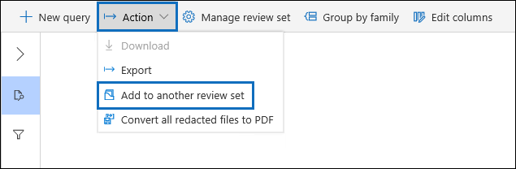

# Hinzufügen von Daten aus einem Prüfdateisatz zu einem anderen PrüfdateisatzAdd data to a review set from another review set

In einigen Fällen kann es erforderlich sein, Dokumente aus einem Überprüfungssatz auszuwählen und einzeln in einem anderen Überprüfungssatz zu arbeiten.In some cases, it may be necessary to select documents from one review set and work with them individually in another review set. Dies ist besonders hilfreich, wenn Sie Inhalte in einem Prüfdateisatz gefiltert haben und Analysen für die Teilmenge der Daten ausführen möchten.This is especially useful if you've culled content in a review set and want to run analytics on the subset of data.

Folgen Sie dem Workflow in diesem Artikel, um Inhalte aus einem Überprüfungssatz zu einem anderen hinzuzufügen.Follow the workflow in this article to add content from one review set to another.

## Erstellen eines ÜberprüfungssatzCreate a review set

Bevor Sie beginnen, müssen Sie einen Überprüfungssatz erstellen, um die Daten hinzuzufügen.Before you start, you'll need to create a review set to add the data to.  Ein neuer Überprüfungssatz kann auf der Registerkarte **Überprüfungssätze** des Falls hinzugefügt werden.A new review set can be added on the **Review sets** tab of the case. Weitere Informationen finden Sie unter [Create a review set](managing-review-sets.md#create-a-review-set).For more information, see [Create a review set](managing-review-sets.md#create-a-review-set).

## Schritt 1: Identifizieren von Inhalten, die einem anderen Überprüfungssatz hinzugefügt werden sollenStep 1: Identify content to add to another review set

Sie können Inhalte aus einem Prüfdateisatz zu einem anderen Prüfdateisatz hinzufügen, indem Sie bestimmte Dokumente im ursprünglichen Prüfdateisatz oder alle von der Prüfdateisatzabfrage zurückgegeben Elemente auswählen.You can add content from one review set to another one by selecting specific documents in the source review set or by selecting all items returned by review set query. Wenn Sie ausgewählte Elemente hinzufügen, wählen Sie die Elemente aus, wählen Sie **Aktion** aus, und wählen Sie dann Hinzufügen zu einem anderen **Überprüfungssatz aus.**If you're adding selected items, select the items, select **Action**, and then select **Add to another review set**.

## Schritt 2: Angeben von Optionen zum Hinzufügen zu einem anderen ÜberprüfungssatzStep 2: Specify options for adding to another review set

Wählen Sie auf der Flyoutseite Add **to another review set options** den Überprüfungssatz aus, dem Sie die Elemente hinzufügen möchten.In the **Add to another review set options** flyout page, choose the review set you want to add the items to. Wählen Sie aus, ob **Alle Suchergebnisse oder ausgewählte** Elemente hinzugefügt werden **sollen.**Choose whether to add **All search results** or **Selected items**.  **Zusätzliche Informationen** bieten Optionen zum Hinzufügen aller Metadaten aus den Elementen  und zum Hinzufügen der Tags (durch Aktivieren des Kontrollkästchens Bezeichnungen) aus dem Quellüberprüfungssatz, wenn die Dokumente dem neuen Prüfsatz hinzugefügt werden.**Additional information** provides options to include all metadata from the items and whether to include the tags (by selecting the **Labels** check box) from the source review set when the documents are added to the new review set.  

Nachdem Sie auf **Ok** geklickt haben, wird ein neuer Auftrag mit dem Namen **Hinzufügen** von Daten zu einem anderen Überprüfungssatz erstellt, um den Inhalt einem anderen Überprüfungssatz hinzuzufügen.After you click **Ok**, a new job (named **Adding data to another review set**) is created to add the content to another review set. Sie können zur Registerkarte **Aufträge wechseln** und den Fortschritt dieses Auftrags überwachen.You can go to the **Jobs** tab and monitor the progress of this job. Weitere Informationen finden Sie unter [Manage jobs](managing-jobs-ediscovery20.md).For more information, see [Manage jobs](managing-jobs-ediscovery20.md).
