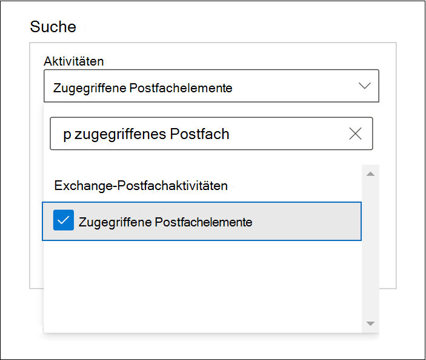
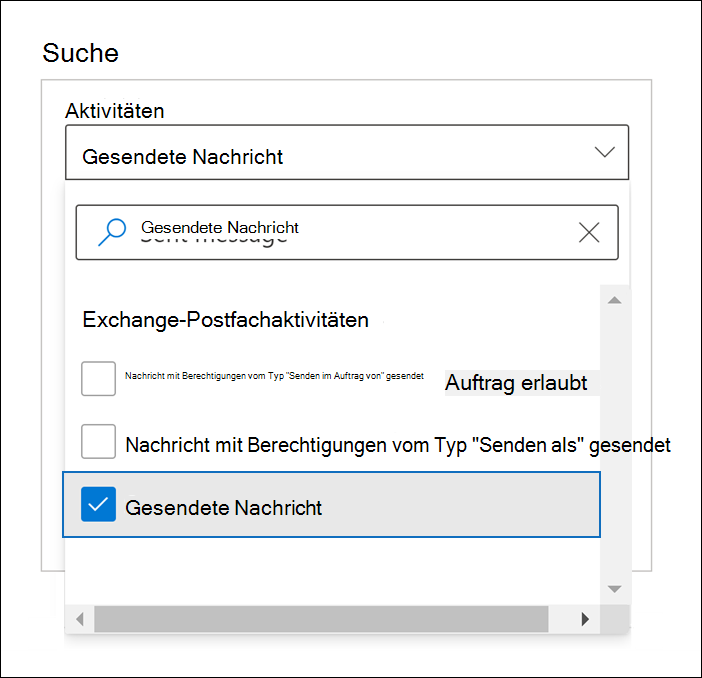
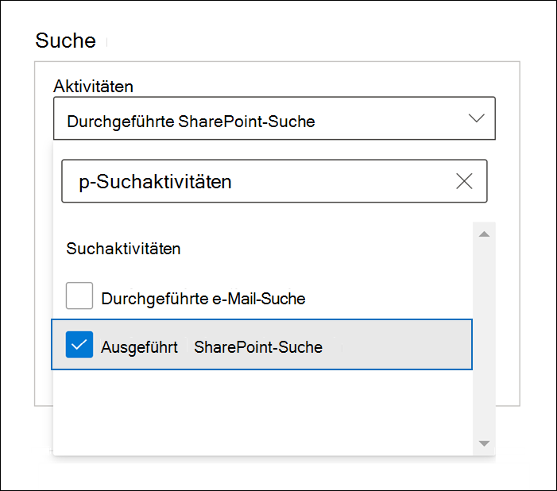

# Erweiterte Überwachung in Microsoft 365

Die [einheitliche Überwachungsfunktionen](search-the-audit-log-in-security-and-compliance.md) in Microsoft 365 bieten Organisationen Einblick in viele Arten von überwachten Aktivitäten über viele verschiedene Dienste in Microsoft 365 hinweg. Die erweiterte Überwachung hilft Organisationen dabei, forensische und Compliance-Untersuchungen durchzuführen, da hierfür die Aufbewahrungsdauer des Überwachungsprotokolls verlängert wird. Dadurch wird der Zugang zu wichtigen Ereignissen ermöglicht, die für die Ermittlung des Umfangs der Kompromittierung hilfreich sind, sowie schneller Zugriff auf die Office 365-Verwaltungsaktivitäts-API.

> [!NOTE]
> Erweiterte Überwachung ist für Organisationen mit einem Office 365 E5/G5- oder Microsoft 365 Enterprise E5/G5-Abonnement verfügbar. Darüber hinaus kann Benutzern eine Microsoft 365 E5 Compliance- oder E5 eDiscovery und Überwachungs-Add-On-Lizenz zugewiesen werden, wenn für Features für die erweiterte Überwachung eine Lizenzierung pro Benutzer erforderlich ist, wie dies bei der langfristigen Aufbewahrung von Überwachungsprotokollen und für den Zugang zu wichtigen Ereignissen für Untersuchungen der Fall ist. Weitere Informationen zur Lizenzierung finden Sie unter [Microsoft 365-Lizenzierungsleitfaden für Sicherheit und Compliance](https://docs.microsoft.com/office365/servicedescriptions/microsoft-365-service-descriptions/microsoft-365-tenantlevel-services-licensing-guidance/microsoft-365-security-compliance-licensing-guidance#advanced-audit).

In diesem Artikel finden Sie eine Übersicht der Funktionen der Erweiterten Überwachung und eine Anweisung, wie Sie Benutzer für die Erweiterte Überwachung einrichten können.

## Langfristige Aufbewahrung von Überwachungsprotokollen

Die erweiterte Überwachung bewahrt alle Exchange-, SharePoint- und Azure Active Directory-Überwachungsdatensätze für ein Jahr auf. Dies geschieht durch eine standardmäßige Aufbewahrungsrichtlinie für Überwachungsprotokolle, die jeden Überwachungsdatensatz ein Jahr lang aufbewahrt, der den Wert von **Exchange**, **SharePoint** oder **AzureActiveDirectory** für die Eigenschaft **Workload** aufweist (die den Dienst anzeigt, in dem die Aktivität aufgetreten ist). Das Aufbewahren von Überwachungsaufzeichnungen über einen längeren Zeitraum kann bei laufenden forensischen oder Compliance-Untersuchungen hilfreich sein. Weitere Informationen hierzu finden Sie im Abschnitt "Standardmäßige Aufbewahrungsrichtlinie für Überwachungsprotokolle" in [Verwalten von Aufbewahrungsrichtlinien für Überwachungsprotokolle](audit-log-retention-policies.md#default-audit-log-retention-policy).

Außerdem wird es zukünftig möglich sein, Überwachungsprotokolle 10 Jahre lang aufzubewahren. Die zehnjährige Aufbewahrung von Überwachungsprotokollen ist bei langfristigen Untersuchungen und zur Einhaltung behördlicher, rechtlicher und interner Vorgaben hilfreich.

> [!NOTE]
> Für die zehnjährige Aufbewahrung von Überwachungsprotokollen wird eine zusätzliche Lizenz erforderlich sein. Diese neue Lizenz wird Anfang 2021 verfügbar sein. Weitere Informationen hierzu finden Sie im Abschnitt [Häufig gestellte Fragen zur erweiterten Überwachung](#faqs-for-advanced-audit) in diesem Artikel.

### Aufbewahrungsrichtlinien für Überwachungsprotokolle

Alle Überwachungsdatensätze, die in anderen Diensten generiert wurden, die nicht unter die Standardaufbewahrungsrichtlinie für Überwachungsprotokolle fallen (im vorherigen Abschnitt beschrieben), werden für 90 Tage aufbewahrt. Sie können jedoch benutzerdefinierte Aufbewahrungsrichtlinien für Überwachungsprotokolle erstellen, um andere Überwachungsaufzeichnungen bis zu 10 Jahre lang aufzubewahren. Sie können eine Richtlinie erstellen, um Überwachungsaufzeichnungen auf der Grundlage eines oder mehrerer der folgenden Kriterien aufzubewahren:

- Der Microsoft 365-Dienst, in dem die überwachten Aktivitäten ausgeführt werden

- Bestimmte überwachte Aktivitäten

- Der Benutzer, der eine überwachte Aktivität ausführt

Sie können auch festlegen, wie lange Überwachungsdatensätze, die der Richtlinie entsprechen, aufbewahrt werden, und eine Prioritätsstufe angeben, damit bestimmte Richtlinien Vorrang vor anderen Richtlinien haben. Beachten Sie außerdem, dass jede benutzerdefinierte Aufbewahrungsrichtlinie für Überwachungsprotokolle Vorrang vor der Standardaufbewahrungsrichtlinie für Überwachungsprotokolle hat, wenn Sie für einige oder alle Benutzer in Ihrer Organisation Exchange-, SharePoint- oder Azure Active Directory-Überwachungsaufzeichnungen weniger als ein Jahr lang (oder für 10 Jahre) aufbewahren möchten. Weitere Informationen finden Sie unter [Verwalten der Aufbewahrungsrichtlinien für Überwachungsprotokolle](audit-log-retention-policies.md).

## Zugriff auf wichtige Ereignisse für Untersuchungen

Die erweiterte Überwachung hilft Organisationen dabei, forensische und Compliance-Untersuchungen durchzuführen durch die Möglichkeit, auf wichtige Ereignisse zuzugreifen wie beispielsweise: wann auf E-Mail-Elemente zugegriffen wurde, wann auf E-Mail-Elemente geantwortet wurde bzw. diese weitergeleitet wurden sowie wann und wonach ein Benutzer in Exchange Online und SharePoint Online gesucht hat. Diese wichtigen Ereignisse können Ihnen dabei helfen, mögliche Verstöße zu untersuchen und das Ausmaß der Kompromittierung zu ermitteln.  Bei der erweiterten Überwachung werden die folgenden wichtigen Ereignisse protokolliert:

- [MailItemsAccessed](#mailitemsaccessed)

- [Send](#send)

- [SearchQueryInitiatedExchange](#searchqueryinitiatedexchange)

- [SearchQueryInitiatedSharePoint](#searchqueryinitiatedsharepoint)

### MailItemsAccessed

Beim MailItemsAccessed-Ereignis handelt es sich um eine Postfachüberwachungsaktion, die ausgelöst wird, wenn E-Mail-Protokolle und E-Mail-Clients auf E-Mail-Daten zugreifen. Die MailItemsAccessed-Aktion kann Ermittlern dabei helfen, Datenverstöße zu erkennen und den Umfang der Nachrichten zu ermitteln, die möglicherweise kompromittiert wurden. Wenn ein Angreifer Zugriff auf E-Mail-Nachrichten erlangt hat, wird die MailItemsAccessed-Aktion ausgelöst, selbst wenn kein explizites Zeichen dafür vorliegt, dass Nachrichten tatsächlich gelesen wurden (mit anderen Worten: Die Art des Zugriffs, z. B. Bindung oder Synchronisierung, wird im Überwachungsdatensatz erfasst).

Die MailItemsAccessed-Postfachaktion ersetzt "MessageBind" in der Postfachüberwachungsprotokollierung in Exchange Online und bietet folgende Verbesserungen:

- "MessageBind" war nur für den AuditAdmin-Benutzer-Anmeldetyp konfigurierbar und galt nicht für Aktionen von Stellvertretungen oder Besitzern. "MailItemsAccessed" gilt für alle Anmeldetypen.

- "MessageBind" betraf nur den Zugriff durch einen E-Mail-Client. Es galt nicht für Synchronisierungsaktivitäten. MailItemsAccessed-Ereignisse werden sowohl durch Bindungs als auch Synchronisierungszugriffstypen ausgelöst.

- MessageBind-Aktionen löste beim mehrfachen Zugriff auf dieselbe E-Mail-Nachricht die Erstellung mehrerer Überwachungsdatensätze aus und führte dadurch zu überfüllten Überwachungsprotokollen. Im Gegensatz dazu werden MailItemsAccessed-Ereignisse in weniger Überwachungsdatensätzen aggregiert.

Informationen zu Überwachungsdatensätzen für MailItemsAccessed-Aktivitäten finden Sie unter [Verwenden der erweiterten Überwachung zur Untersuchung kompromittierter Konten](mailitemsaccessed-forensics-investigations.md).

Um nach MailItemsAccessed-Überwachungsaufzeichnungen zu suchen, können Sie im Microsoft 365 Compliance Center im [Überwachungsprotokoll-Suchtool](search-the-audit-log-in-security-and-compliance.md) in der Dropdownliste der **Exchange-Postfachaktivitäten** nach der Aktivität **MailItemsAccessed** (Postfachelemente, auf die zugegriffen wurde) suchen.

Sie können auch die Befehle [Search-UnifiedAuditLog -Operations MailItemsAccessed](https://docs.microsoft.com/powershell/module/exchange/search-unifiedauditlog) oder [Search-MailboxAuditLog -Operations MailItemsAccessed](https://docs.microsoft.com/powershell/module/exchange/search-mailboxauditlog) in Exchange Online PowerShell ausführen.

### Send

Beim Send-Ereignis handelt es sich ebenfalls um eine Postfachüberwachungsaktion. Sie wird ausgelöst, wenn ein Benutzer eine der folgenden Aktionen ausführt:

- Eine E-Mail sendet

- Auf eine E-Mail-Nachricht antwortet

- Eine E-Mail-Nachricht weiterleitet

Die mit der Untersuchung beauftragten Personen können das Send-Ereignis verwenden, um E-Mails zu identifizieren, die von einem kompromittierten Konto aus gesendet wurden. Die Überwachungsaufzeichnung für ein Send-Ereignis enthält Informationen zu der Nachricht, z. B. wann sie gesendet wurde, die InternetMessage-ID, die Betreffzeile und ob die Nachricht Anlagen enthielt. Anhand dieser Informationen können die mit der Untersuchung beauftragten Personen Informationen zu E-Mails ermitteln, die von einem kompromittierten Konto aus oder von einem Angreifer gesendet wurden. Darüber hinaus können sie ein Microsoft 365-eDiscovery-Tool verwenden, um nach der Nachricht (anhand der Betreffzeile oder der Nachrichten-ID) zu suchen, um deren Empfänger und ihren eigentlichen Inhalt zu ermitteln.

Um nach Send-Überwachungsaufzeichnungen zu suchen, können Sie im Microsoft 365 Compliance Center im [Überwachungsprotokoll-Suchtool](search-the-audit-log-in-security-and-compliance.md) in der Dropdownliste der **Exchange-Postfachaktivitäten** nach der Aktivität **Nachricht gesendet** suchen.

Sie können auch die Befehle [Search-UnifiedAuditLog -Operations Send](https://docs.microsoft.com/powershell/module/exchange/search-unifiedauditlog) oder [Search-MailboxAuditLog -Operations Send](https://docs.microsoft.com/powershell/module/exchange/search-mailboxauditlog) in Exchange Online PowerShell ausführen.

### SearchQueryInitiatedExchange

Das SearchQueryInitiatedExchange-Ereignis wird ausgelöst, wenn jemand Outlook verwendet, um in einem Postfach nach Elementen zu suchen. Ereignisse werden ausgelöst, wenn Suchvorgänge in den Outlook-Umgebungen durchgeführt werden:

- Outlook (Desktopclient)

- Outlook im Web (OWA)

- Outlook für iOS

- Outlook für Android

- Mail-App für Windows 10

Die mit der Untersuchung beauftragten Personen können das SearchQueryInitiatedExchange-Ereignis verwenden, um festzustellen, ob ein Angreifer, der möglicherweise ein Konto manipuliert hat, nach vertraulichen Informationen im Postfach gesucht oder versucht hat, darauf zuzugreifen. Die Überwachungsaufzeichnung für ein SearchQueryInitiatedExchange-Ereignis enthält Informationen wie z. B. den tatsächlichen Suchabfragetext und ob die Suche im Outlook-Desktop-Client oder in Outlook im Web durchgeführt wurde. Der Überwachungsdatensatz gibt auch die Outlook-Umgebung an, in der die Suche ausgeführt wurde. Durch die Überprüfung der Suchabfragen, die ein Angreifer durchgeführt hat, kann die ermittelnde Person besser verstehen, warum nach den E-Mail-Daten gesucht wurde.

Um nach SearchQueryInitiatedExchange-Überwachungsaufzeichnungen zu suchen, können Sie im Compliance Center im [Überwachungsprotokoll-Suchtool](search-the-audit-log-in-security-and-compliance.md) in der Dropdownliste der **Suchaktivitäten** nach der Aktivität **E-Mail-Suche durchgeführt** suchen.

Sie können auch den Befehl [Search-UnifiedAuditLog -Operations SearchQueryInitiatedExchange](https://docs.microsoft.com/powershell/module/exchange/search-unifiedauditlog) in Exchange Online PowerShell ausführen.

> [!NOTE]
> Damit (vom angegebenen E5-Benutzer ausgeführte) SearchQueryInitiatedExchange-Ereignisse in die Suchergebnisse für das Überwachungsprotokoll einbezogen werden, müssen Sie in Exchange Online PowerShell folgenden Befehl ausführen: `Set-Mailbox <user identity> -AuditOwner @{Add="SearchQueryInitiated"}`.  
In einer Multi-Geo-Umgebung müssen Sie den Befehl **Set-Mailbox** in der Gesamtstruktur ausführen, in der sich das Postfach des Benutzers befindet. Um den Speicherort des Postfachs eines Benutzers zu identifizieren, verwenden Sie folgenden Befehl: `Get-Mailbox <user identity> | FL MailboxLocations`.
Wenn der Befehl „`Set-Mailbox -AuditOwner @{Add="SearchQueryInitiated"}`“ zuvor in einer Gesamtstruktur ausgeführt wurde, die sich von der unterscheidet, in der sich das Postfach des Benutzers befindet, müssen Sie den Wert „SearchQueryInitiated“ aus dem Postfach des Benutzers entfernen (durch Ausführen von `Set-Mailbox -AuditOwner @{Remove="SearchQueryInitiated"}`) und ihn dann dem Postfach des Benutzers in der Gesamtstruktur hinzufügen, in der sich das Benutzerpostfach befindet.

### SearchQueryInitiatedSharePoint

Ähnlich wie bei der Suche nach Postfachelementen wird das SearchQueryInitiatedSharePoint-Ereignis ausgelöst, wenn jemand nach Elementen in SharePoint sucht. Ereignisse werden ausgelöst, wenn Suchvorgänge in den folgenden Typen von SharePoint-Websites durchgeführt werden:

- Startsites

- Kommunikationswebsites

- Hubwebsites

- Mit Microsoft Teams verknüpfte Websites

Die ermittelnden Personen können das SearchQueryInitiatedSharePoint-Ereignis verwenden, um festzustellen, ob ein Angreifer versucht hat, vertrauliche Informationen in SharePoint zu finden (und möglicherweise darauf zugegriffen). Die Überwachungsaufzeichnung für ein SearchQueryInitiatedSharePoint-Ereignis enthält außerdem den eigentlichen Text der Suchabfrage. Der Überwachungsdatensatz gibt auch den Typ der SharePoint-Website an, die durchsucht wurde. Durch die Überprüfung der Suchabfragen, die ein Angreifer durchgeführt hat, kann die ermittelnde Person besser den Zweck und den Umfang der Dateidaten nachvollziehen, nach denen gesucht wurde.

Um nach SearchQueryInitiatedSharePoint-Überwachungsaufzeichnungen zu suchen, können Sie im Compliance Center im [Überwachungsprotokoll-Suchtool](search-the-audit-log-in-security-and-compliance.md) in der Dropdownliste der **Suchaktivitäten** nach der Aktivität **SharePoint-Suche durchgeführt** suchen.

Sie können auch den Befehl [Search-UnifiedAuditLog -Operations SearchQueryInitiatedSharePoint](https://docs.microsoft.com/powershell/module/exchange/search-unifiedauditlog) in Exchange Online PowerShell ausführen.

> [!NOTE]
> Damit (vom angegebenen E5-Benutzer ausgeführte) SearchQueryInitiatedExchange-Ereignisse in die Suchergebnisse für das Überwachungsprotokoll einbezogen werden, müssen Sie in Exchange Online PowerShell folgenden Befehl ausführen: `Set-Mailbox <user identity> -AuditOwner @{Add="SearchQueryInitiated"}`.  
In einer Multi-Geo-Umgebung müssen Sie den Befehl **Set-Mailbox** in der Gesamtstruktur ausführen, in der sich das Postfach des Benutzers befindet. Um den Speicherort des Postfachs eines Benutzers zu identifizieren, verwenden Sie folgenden Befehl: `Get-Mailbox <user identity> | FL MailboxLocations`.
Wenn der Befehl „`Set-Mailbox -AuditOwner @{Add="SearchQueryInitiated"}`“ zuvor in einer Gesamtstruktur ausgeführt wurde, die sich von der unterscheidet, in der sich das Postfach des Benutzers befindet, müssen Sie den Wert „SearchQueryInitiated“ aus dem Postfach des Benutzers entfernen (durch Ausführen von `Set-Mailbox -AuditOwner @{Remove="SearchQueryInitiated"}`) und ihn dann dem Postfach des Benutzers in der Gesamtstruktur hinzufügen, in der sich das Benutzerpostfach befindet.

## Zugriff mit hoher Bandbreite auf die Office 365-Verwaltungsaktivitäts-API

Organisationen, die über die Office 365-Verwaltungsaktivitäts-API auf Überwachungsprotokolle zugreifen, waren durch Drosselungsgrenzwerte auf Herausgeberebene eingeschränkt. Dies bedeutete, dass der Grenzwert für einen Herausgeber, der Daten im Namen mehrerer Kunden per Pull abruft, für all diese Kunden zusammen galt.

Mit der Veröffentlichung der erweiterten Überwachung wechseln wir von einem Grenzwert auf Herausgeberebene zu einem Grenzwert auf Mandantenebene. Dadurch erhält jede Organisation ein eigenes, vollständig zugewiesenes Bandbreitenkontingent erhält für den Zugriff auf ihre Überwachungsdaten. Die Bandbreite ist kein statischer, vordefinierter Grenzwert, sondern wird auf der Grundlage einer Kombination von Faktoren angepasst, beispielweise basierend auf der Anzahl der Arbeitsplätze in der Organisation oder der Tatsache, dass E5-Organisationen mehr Bandbreite als Nicht-E5-Organisationen erhalten.

Allen Organisationen ist anfänglich eine Baseline von 2.000-Anforderungen pro Minute zugeordnet. Dieser Wert wird abhängig von der Anzahl der Arbeitsplätze und Lizenzabonnements in einer Organisation dynamisch erhöht. E5-Organisationen erhalten ungefähr doppelt so viel Bandbreite wie Nicht-E5-Organisationen. Zum Schutz des Diensts gibt es auch eine Obergrenze für die maximale Bandbreite.

Weitere Informationen finden Sie im Abschnitt "API-Drosselung" in der [Referenz der Office 365-Verwaltungsaktivitäts-API](https://docs.microsoft.com/office/office-365-management-api/office-365-management-activity-api-reference#api-throttling).

## Erweiterte Überwachung für Benutzer einrichten

Die Funktionen der Erweiterten Überwachung, wie z.B. die Möglichkeit wichtige Ereignisse, wie z.B. MailItemsAccessed und das Send-Ereignis, zu protokollieren, erfordern eine geeignete E5-Lizenz, die den Benutzern zugewiesen ist. Darüber hinaus muss die Erweiterte Überwachungs-App/ der Serviceplan für diese Benutzer aktiviert sein. Um zu bestätigen, dass die Erweiterte Überwachungs-App an Benutzer zugewiesen ist, führen Sie für jeden Benutzer die folgenden Schritte durch:

1. Navigieren Sie im [Microsoft 365 Admin Center](https://admin.microsoft.com/Adminportal) zu **Benutzer** > **Aktive Benutzer**, und wählen Sie einen Benutzer aus.

2. Klicken Sie auf der Benutzereigenschaften-Flyoutseite auf **Lizenzen und Apps**.

3. Bestätigen Sie im Abschnitt **Lizenzen**, dass dem Benutzer eine E5-Lizenz zugewiesen ist.

4. Erweitern Sie den Abschnitt **Apps** und bestätigen Sie das Kontrollkästchen **Microsoft 365 – Erweiterte Überwachung** aktiviert ist.

5. Wenn das Kontrollkästchen nicht aktiviert ist, aktivieren Sie es, und klicken Sie dann auf **Änderungen speichern**.

   Die Protokollierung von Überwachungsdatensätzen für MailItemsAccessed, Senden und andere wichtige Ereignisse für den Benutzer wird innerhalb von 24 Stunden anfangen.

Für Organisationen, die Gruppen von Benutzern mithilfe einer gruppenbasierten Lizenzierung Lizenzen zuweisen, müssen Sie die Lizenzzuweisung für Microsoft 365 Advanced Auditing für die Gruppe deaktivieren. Nachdem Sie die Änderungen gespeichert haben, stellen Sie sicher, dass Microsoft 365 Erweiterte Überwachung für die Gruppe deaktiviert ist. Aktivieren Sie dann die Lizenzierungszuordnung für die Gruppe wieder. Lesen Sie [Zuweisen von Lizenzen zu Benutzern mithilfe der Gruppenmitgliedschaft in Azure Active Directory](https://docs.microsoft.com/azure/active-directory/users-groups-roles/licensing-groups-assign) für Anweisungen zur gruppenbasierten Lizenzierung.

Wenn Sie außerdem die Postfachaktionen, die für Benutzerpostfächer oder freigegebene Postfächer protokolliert sind, angepasst haben, werden neue standardmäßige Postfachaktionen, wie z.B. MailItemsAccessed, auf diesen Postfächern nicht automatisch überwacht. Weitere Informationen über das Ändern von Postfachaktionen, die für jeden Anmeldetyp überwacht werden, finden Sie unter „Standardmäßig überwachte Postfachaktionen ändern oder wiederherstellen“ in [Verwalten der Postfächern](enable-mailbox-auditing.md#change-or-restore-mailbox-actions-logged-by-default).

## Häufig gestellte Fragen (FAQs) zur erweiterten Überwachung

**Benötigt jeder Benutzer eine E5-Lizenz, um von der erweiterten Überwachung profitieren zu können?**

Dem Benutzer muss eine E5-Lizenz zugewiesen werden, um von der erweiterten Überwachung auf Benutzerebene profitieren zu können. Es gibt einige Funktionen, die überprüfen, ob die entsprechende Lizenz vorliegt, bevor dem Benutzer das Feature bereitgestellt wird. Wenn Sie beispielsweise die Überwachungseinträge für einen Benutzer beibehalten möchten, dem keine E5-Lizenz zugeordnet ist, die noch mindestens 90 Tage gültig ist, wird eine Fehlermeldung angezeigt.

**Meine Organisation verfügt über ein E5-Abonnement. Muss ich irgendetwas tun, um Zugriff auf die Überwachungsaufzeichnungen zu wichtigen Ereignissen zu erhalten?**

Für berechtigte Kunden und Benutzer, denen eine entsprechende Lizenz zugewiesen ist, gibt es keine Aktion, mit der sie Zugriff auf wichtige Überwachungsereignisse erlangen können.

**Wann wird die neue Add-On-Lizenz für die zehnjährige Aufbewahrung von Überwachungsprotokollen verfügbar sein?**

Das neue 10-Jahres-Add-On zur Aufbewahrung von Überwachungsprotokollen kann jetzt von Kunden mit E5-Abonnements erworben werden.

**Was passiert mit den Überwachungsprotokolldaten meiner Organisation, wenn ich eine 10-Jahres-Richtlinie zur Aufbewahrung von Überwachungsprotokollen erstellt habe, als die Funktion für die allgemeine Verfügbarkeit freigegeben wurde, bevor die erforderliche Zusatzlizenz im Februar 2021 verfügbar gemacht wurde?**

Alle Überwachungsprotokolldaten, die durch eine 10-Jahres-Richtlinie zur Aufbewahrung von Überwachungsprotokollen abgedeckt sind, die Sie nach der allgemeinen Verfügbarkeit erstellt haben, werden 10 Jahre lang aufbewahrt. Wenn die Add-On-Lizenz für die zehnjährige Aufbewahrung von Überwachungsprotokollen Anfang 2021 verfügbar ist, müssen Sie Add-On-Lizenzen für Benutzer erwerben, deren Überwachungsdaten durch eine bestehende 10-Jahres- Aufbewahrungsrichtlinie für Überwachungsprotokolle aufbewahrt werden.

**Sind die neuen Ereignisse in der erweiterten Überwachung in der Office 365-Verwaltungsaktivitäts-API verfügbar?**

Ja. Solange Überwachungsdatensätze für Benutzer mit der entsprechenden Lizenz generiert werden, können Sie auf diese Datensätze über die Office 365-Verwaltungsaktivitäts-API zugreifen.

**Bedeutet eine höhere Bandbreite eine bessere Latenz oder eine höhere SLA?**

Gegenwärtig bietet eine hohe Bandbreite eine bessere Pipeline, insbesondere für Organisationen mit einem hohen Volumen an Überwachungssignalen und signifikanten Verbrauchsmustern. Mehr Bandbreite kann zu geringerer Latenz führen. Es gibt jedoch keinen mit hoher Bandbreite verbundenen SLA. Die Standardlatenzen sind dokumentiert, und diese ändern sich mit der Veröffentlichung der erweiterten Überwachung nicht.
